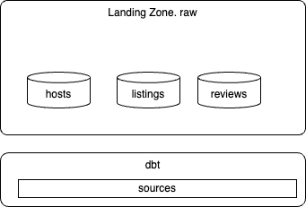

# dbt Studies - Samples

The approach is to use [duckdb](#using-duckdb-as-data-warehouse) as target of the dbt processing for data warehouse demo and Confluent Cloud for Flink for [dbt-confluent](#with-dbt-confluent---flink_workshop-project) demonstration.

## Using duckdb as data warehouse

### Raw landing zone

It is first used as a landing zone for raw data, then dbt models process data for creating dimensions and facts.

1. From the repo root, install deps and sync: `cd code/dbt && uv sync`.
2. Place raw CSVs in `code/dbt/airbnb/data/`: `listings.csv`, `hosts.csv`, `reviews.csv` (e.g. from the [bootcamp resources](https://github.com/nordquant/complete-dbt-bootcamp-zero-to-hero/blob/main/_course_resources/course-resources.md) or S3: `s3://dbt-datasets/listings.csv`, etc.).
3. From `code/dbt/airbnb/`, bootstrap the DuckDB raw tables (one-time):
    ```bash
    export DBT_DUCKDB_PATH=./data/airbnb.duckdb
    duckdb "${DBT_DUCKDB_PATH:-./data/airbnb.duckdb}" < scripts/bootstrap_duckdb_raw.sql
    ```

    

4. Review the raw tables

[See my summary on duckdb](https://jbcodeforce.github.io/db-play/duckdb/)

```sql
.open ./data/airbnb.duckdb
D show databases;
┌───────────────┐
│ database_name │
│    varchar    │
├───────────────┤
│ airbnb        │
└───────────────┘
D show tables;
D select * from  raw.raw_reviews;
D describe raw.raw_reviews;
```

### Understand the project

* Seeds are to define reference tables, like the full moon dates from 2009 to 2030
* Models: includes the star model: sources, dimensions and facts.

### Create seeds

The following command let dbt to look inside the seeds/ folder of your project, find any .csv files, and upload them as physical tables into your database.
```sh
dbt seed --target dev
```

The target dev matches the connection profile in `profiles.yaml`

### Create Sources

* Define the yaml file under models
* Add SQL for deduplicating the raw.raw_hosts data. Create a `models/sources` folder and add:

```sql
WITH ranked_hosts AS (
    SELECT
        *,
        ROW_NUMBER() OVER (
            PARTITION BY id
            ORDER BY updated_at DESC, created_at DESC
        ) AS row_num
    FROM
        {{ source('airbnb', 'hosts') }}
    WHERE id IS NOT NULL
)
SELECT
    id AS host_id,
    name AS host_name,
    is_superhost,
    created_at,
    updated_at
FROM
    ranked_hosts
WHERE
    row_num = 1
```

So running the following command:

```sh
dbt run --target dev
# returns
Found 1 seed, 3 sources, 474 macros
Concurrency: 1 threads (target='dev')

 1 of 1 START sql view model main.src_hosts ..................................... [RUN]
 1 of 1 OK created sql view model main.src_hosts ................................ [OK in 0.03s]
```

which can be validated by opening the duckdb database:

```sql
duckdb data/airbnb.duckdb
# in the shell
select * from main.src_hosts;
```

Same can be done for listings and reviews. Those sources SQL can do schema mapping, and filtering.


## With dbt-confluent - airbnb_streaming project

The [airbnb_streaming](airbnb_streaming/) project targets Confluent Cloud for Flink via the `cc_flink` profile. Unlike DuckDB, `dbt run` deploys streaming SQL statements rather than batch-transforming warehouse tables.

### Prerequisites

1. From `code/dbt/`, install deps: `uv sync`.
2. Configure `~/.dbt/profiles.yml` with a `cc_flink` profile (see [docs/coding/dbt.md](../../docs/coding/dbt.md)).
3. Export Flink API credentials:
   ```bash
   export CONFLUENT_FLINK_API_KEY=...
   export CONFLUENT_FLINK_API_SECRET=...
   ```

### Seed reference data from CSV

Place CSV files in `airbnb_streaming/seeds/`. Column types are inferred from the CSV; override them in `seeds/seeds.yml` when needed (e.g. `DATE` instead of `STRING`).

```bash
cd code/dbt/airbnb_streaming
export CONFLUENT_FLINK_API_KEY=...
export CONFLUENT_FLINK_API_SECRET=...
make debug
make seed
```

Or without Make:

```bash
cd code/dbt
uv run dbt seed --project-dir airbnb_streaming --profiles-dir ~/.dbt --target dev
```

Validate in the Flink SQL workspace:

```sql
SELECT * FROM raw_full_moon_dates LIMIT 5;
```

Reference seeded tables in downstream models via `models/sources.yaml` and `{{ source('reference', 'full_moon_dates') }}`.

## With dbt-confluent - flink_workshop project

The [flink_workshop](flink_workshop/) project deploys the [Confluent Flink SQL workshop](https://github.com/confluentinc/flink-workshop) as the `crm` data product: Faker sources, customer dimension, joins, aggregations/windowing, and optional MongoDB lookup.

```bash
cd code/dbt/flink_workshop
export CONFLUENT_FLINK_API_KEY=...
export CONFLUENT_FLINK_API_SECRET=...
make debug
make run-full
```

See [flink_workshop/README.md](flink_workshop/README.md) for model catalog, dbt patterns (`statement_name`, state TTL, MongoDB vars), and verification queries.

### Migrate existing Flink DML to dbt models

Use [`code/flink-sql/tools/migrate_dml_to_dbt.py`](../flink-sql/tools/migrate_dml_to_dbt.py) to convert demo `dml.*.sql` files into dbt models with matching `schema.yml` column types from the paired `ddl.*.sql`. See [flink-sql tools README](../flink-sql/tools/README.md#migrate-flink-dml-to-dbt).


## Gap analysis with shift_left utils CLI

* Kimball structure under `models/` can be bootstrapped with `migrate_dml_to_dbt.py` (see above).
* No metada data for statement children relationship, but could be kept as-is with shift_left. (medium term this)
* no undeploy statements command
* no drop a list of table
* how to support data product cross dimensions
* no concept of statefulness
* no children relationship understanding