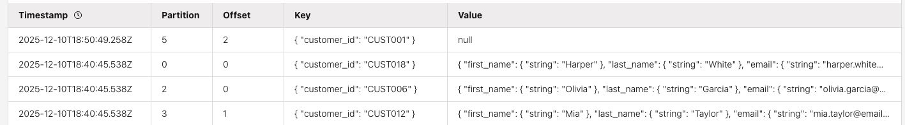

# Flink SQL Basic Examples

#### Versions
    Created from Flink Study 2021
    Updated 1/2025 from Confluent Flink studies
    Updated 12/2025 Getting started by using SQL client

This folder includes some basic SQL examples to be used with local Flink OSS or Confluent Platform for Flink running locally.

* [Process employee data from csv](#employees-demo) to count the  number of employees per department,

## SQL Client
### Apache Flink OSS Binary

* [See this readme to get last Apache Flink OSS image](../../../deployment/product-tar/README.md)
* Start Flink SQL Client:
    ```sh
    # under deployment/product-tar
    export FLINK_HOME=$(pwd)/flink-2.1.1
    export PATH=$PATH:$FLINK_HOME/bin
    $FLINK_HOME/bin/sql-client.sh --library $FLINK_HOME/sql-lib
    ```

### Docker image
1. Use docker images and docker-compose. See the docker compose in deployment/docker folder of this project. The docker engine mounts a project folder in `/home`, so content of the data will be in `/home/flink-sql/data`. 
1. Start SQL client
  ```sh
  docker exec -it sql-client bash
  ```

### Kubernetes

1. Kubernetes with  [Orbstack](../../../deployment/k8s)
    ```sh
    make start_orbstack
    ```
1. Start SQL client
  ```sh
  kubectl exec -ti <flink-pod> -- bash
  # then in the container shell
  sql-client.sh
  ```

## Employees demo 

This demonstration is based on the SQL getting started [Flink 2.1 documentation](https://nightlies.apache.org/flink/flink-docs-release-2.1/docs/dev/table/sql/gettingstarted/).

The [data/employee.csv](https://github.com/jbcodeforce/flink-studies/blob/master/code/flink-sql/00-basic-sql/data/employes.csv) has 15 records.

* Once connected set default catalog and db.

```sh
show catalogs;
use catalog default_catalog;
show databases;
use <yourdatabase>
use default_database;
show tables;
show functions;
```

Should get an empty set.

### Read from CSV mounted in current container

* The following job is a batch processing and uses a DDL to create a table matching the column of a employee csv file.

```sql
CREATE TABLE employees (
    emp_id INT,
    name VARCHAR,
    dept_id INT
) WITH (
    'connector' = 'filesystem',
    'path' = '/Users/jerome/Documents/Code/flink-studies/code/flink-sql/00-basic-sql/data/employees.csv',
    'format' = 'csv'
);
```

* Using the SQL client, we can select some data from this table: 

```sql
SELECT * from employees WHERE dept_id = 101;
```

**Potential Error**:
* "The jobGraphFileName field must not be omitted or be null." This could be done because of running diffent version between client and cluster.

### Aggregation

Count the  number of employees per department, with this query:

```sql
select dept_id, count(*) as employees_dept from employees group by dept_id;
```

### Streaming consumption, grouping records and aggregation by group

When moving to data streaming, aggregations need to store aggregated results continuously during the execution of the query. Therefore the query needs to maintain the most up-to-date count for each department to output results as new rows are processed. Flink’s advanced fault-tolerance mechanism maintains internal state and consistency, so queries always return the correct result, even in the face of hardware failure.

As we work from file content, which is bounded, we need to specify the runtime mode to be batch:

```sql
SET 'execution.runtime-mode' = 'batch';
```

To get the analytic results to external applications, we need to define sinks by adding a sink table like below:

```sql
CREATE TABLE department_counts (
    dept_id INT,
    emp_count BIGINT NOT NULL
) WITH ( 
    'connector' = 'filesystem',
    'path' = '/Users/jerome/Documents/Code/flink-studies/code/flink-sql/00-basic-sql/data/dept_count',
    'format' = 'csv'
);
```

Once created the following query will create the file under the folder: `flink-sql/00-basic-sql/data/dept_count`

```sql
INSERT INTO department_counts
SELECT 
   dept_id,
   COUNT(*) as emp_count 
FROM employees
GROUP BY dept_id;
```

* Terminate the SQL client session

```sql
exit();
```

## Using Datagen faker

--- ! this does not work with Flink 2.1.1

This example  is based on [Batch and Stream Processing with Flink SQL (Confluent Exercise)](https://developer.confluent.io/courses/apache-flink/stream-processing-exercise/)

See [The flink-faker github.](https://github.com/knaufk/flink-faker?tab=readme-ov-file) and install the jar in the lib of the Apache Flink installation.

Create a fixed-length (bounded) table with 500 rows of data generated by the faker table source. [Flink-faker](https://github.com/knaufk/flink-faker) tool is a convenient and powerful mock data generator designed to be used with Flink SQL.

```sql
CREATE TABLE `bounded_pageviews` (
  `url` STRING,
  `user_id` STRING,
  `browser` STRING,
  `ts` TIMESTAMP(3)
)
WITH (
  'connector' = 'faker',
  'number-of-rows' = '500',
  'rows-per-second' = '100',
  'fields.url.expression' = '/#{GreekPhilosopher.name}.html',
  'fields.user_id.expression' = '#{numerify ''user_##''}',
  'fields.browser.expression' = '#{Options.option ''chrome'', ''firefox'', ''safari'')}',
  'fields.ts.expression' =  '#{date.past ''5'',''1'',''SECONDS''}'
);
```

*Remarks: Creating this table does not triggers the execution of the connector.* 

```sql
set 'sql-client.execution.result-mode' = 'changelog';


select count(*) AS `count` from bounded_pageviews;
```

## Examples for Confluent Cloud Flink

The `cc-flink/ddl.customers.sql` create a simple customers table. Running this query inside the Confluent Cloud Console -> Flink -> Workspace. This will create the `customers` topic, the -key and -value schemas.

### Deduplication example

The insert to customers includes two records for CUST_01, with different timestamp and street address to help validating the last records is kept. The r`egistration_date` is the timestamp to sort on. It may be a best practice to keep the key as part of the column values by using the following configuration: `'value.fields-include' = 'all'`

The `cc-flink/ddl.customers.sql` is an `append` table so doing a `select * from customers` in the CC Workspace will returns the both records of CUST_01. Changing back the changelog mode to `upsert`, with: 

```sql
alter table `customers` SET ('changelog.mode' = 'upsert')
```
Will remove duplicate records in the table.

For append mode source table, the `dml.dedup_customers.sql` illustrates the deduplication approach using ROW_NUMBER() function.
As for eack key, there may be update and delete changes done, the changelog has to be `upsert`

```sql
create table customers_dedup (
  primary key(customer_id) not enforced
)
DISTRIBUTED BY HASH(customer_id) INTO 1 BUCKETS
WITH (
  'changelog.mode' = 'upsert',
  'kafka.cleanup-policy' = 'delete',
  'scan.bounded.mode' = 'unbounded',
  'scan.startup.mode' = 'earliest-offset',
  'value.fields-include' = 'all'
) as select 
  --- omitted
from (
  select *,
  ROW_NUMBER() OVER ( PARTITION BY customer_id ORDER BY registration_date DESC) as row_num
  from customers
) where row_num = 1;
```

A select * on this dedup table, gives the expected results. In the kafka topic at offset 0 the first CUST_01 record will be the old one, while around offset 8 the new CUST_01 is present: this is normal.

### Tombstone creation

From the dedupled topic, we can add another processing to get Premium customers

```sh
create table `customers_filtered` (
  primary key(customer_id) not enforced 
) 
as select * from `customers_dedup` where customer_segment = 'Premium'
```

Last we want to modify CUST001 again by changing the customer_segment to Standard, but to make it working and pass the dedup, we also need to change the registration_date to be later than the creation of the first CUST001.
```sql
nsert into `customers` values ('CUST001', 'John', 'Smith', 'john.smith@email.com', '555-0101', DATE '1985-03-15', 'M', TIMESTAMP '2024-01-25 10:23:45.123', 'Standard', 'Email', '123 3nd Oak Street', 'New York', 'NY', '10001', 'USA')
```

If the `select * from customers_filtered` is still running we can see the CUST001 is no more in the Premium list, and in the `customers_filtered` topic a tombstone record is present:



* See also the [json transformation demo](../../../e2e-demos/json-transformation/README.md) as a basic ARRAY, ROW to JSON Object transformation, runnable in CC Flink or CP Flink.

### Snapshot Query

See [the example from Confluent tutorials](https://docs.confluent.io/cloud/current/flink/how-to-guides/run-snapshot-query.html). 
The most important thing is to set the mode and read from append model only table.

```sql
SET 'sql.snapshot.mode' = 'now';
select * from `customers`
-- select * from dedup_customers   WILL NOT work
```

[Next will be Kafka integration running locally or on Confluent Cloud](../01-confluent-kafka-local-flink/README.md)
