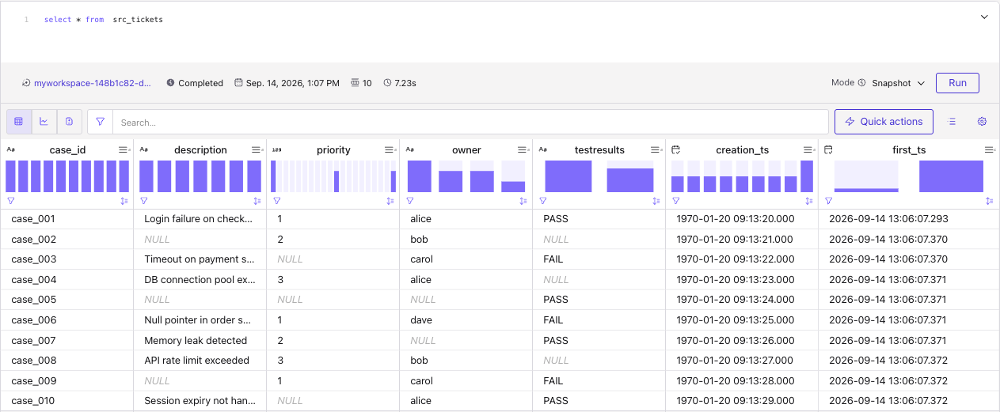
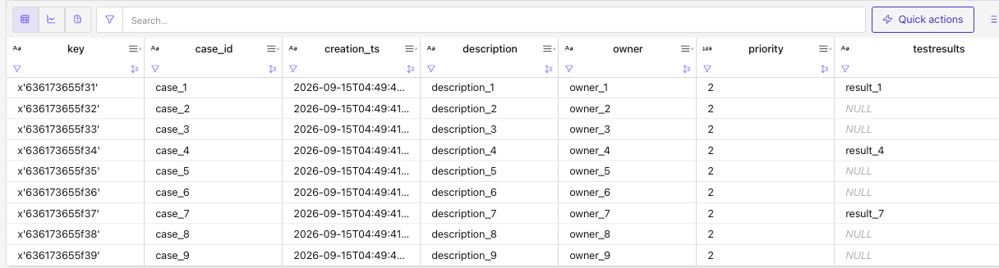

# Propagating null column

By default when the schema defines nullable columns flink propagates those columns to the sink. This folder includes Confluent Cloud demonstrations to validate:

1. Create records with SQL insert into, with a column (testresults) set to NULL. Validate a transformation passes the null to the sink table.
2. Use a custom kafka producer to send records with a column present or not, assess Flink propagate a column with NULL.

## 1- Using Flink

1. Create a raw_tickets json schema, topic, table using Flink, add NULL value and see propagation into a sink.

* Run under cc-flink:
    ```sh
    make deploy
    ```

* The results look like


* Clean with:
    ```sh
    # under cc-flink
    make undeploy
    ```

This demonstrates NULL values are propagated, but what about missing column.

## 2- Kafka Producer

Use a Kafka Producer, for JSON payload and schema registry to register JSON schema and send controlled records. The code is [python/produce_raw_events.py](./python/produce_raw_events.py). 

It builds a RawTicket (Pydantic) to json payload,

```python
class RawTicket(BaseModel):
    case_id: str
    description: str | None = None
    priority: int = 2
    owner: str | None = None
    testresults: str | None = None
    creation_ts: AwareDatetime
```

cycling through three testresults states:

* Cycle (1-based index mod 3):
    1. testresults populated
    2. testresults explicitly None  (null in JSON)
    3. testresults omitted entirely (field not present in JSON)

Which in JSON in the schema registry looks like:

```json
{
  "additionalProperties": false,
  "properties": {
    "case_id": {
      "title": "Case Id",
      "type": "string"
    },
    "creation_ts": {
      "format": "date-time",
      "title": "Creation Ts",
      "type": "string"
    },
    "description": {
      "anyOf": [
        {
          "type": "string"
        },
        {
          "type": "null"
        }
      ],
      "default": null,
      "title": "Description"
    },
    "owner": {
      "anyOf": [
        {
          "type": "string"
        },
        {
          "type": "null"
        }
      ],
      "default": null,
      "title": "Owner"
    },
    "priority": {
      "default": 2,
      "title": "Priority",
      "type": "integer"
    },
    "testresults": {
      "anyOf": [
        {
          "type": "string"
        },
        {
          "type": "null"
        }
      ],
      "default": null,
      "title": "Testresults"
    }
  },
  "required": [
    "case_id",
    "creation_ts"
  ],
  "title": "RawTicket",
  "type": "object"
}
```

* Run the producer with: (be sure to be in the venv of flink-sql folder)

```sh
uv run produce_raw_events.py
```

* Verify messages in the topic may have some `testresults` populated, not present or with Null values

    ```json
    {
    "case_id": "case_9",
    "description": "description_9",
    "priority": 2,
    "owner": "owner_9",
    "creation_ts": "2026-09-15T04:49:42.073956Z"
    }
    ```

    ```json
    {
    "case_id": "case_8",
    "description": "description_8",
    "priority": 2,
    "owner": "owner_8",
    "testresults": null,
    "creation_ts": "2026-09-15T04:49:41.994816Z"
    }
    ```

    ```json
    {
    "case_id": "case_7",
    "description": "description_7",
    "priority": 2,
    "owner": "owner_7",
    "testresults": "result_7",
    "creation_ts": "2026-09-15T04:49:41.927574Z"
    }
    ```

* Run a query like: `select * from raw_tickets`
    

* Create the `src_tickets` and the dml to transform the `raw_tickets`:
    ```sql
    insert into src_tickets select
        case_id,
        description,
        priority,
        owner,
        testresults,
        TO_TIMESTAMP_LTZ(creation_ts ,'yyyy-MM-dd HH:mm:ss') as `creation_ts`,
        `$rowtime` as first_ts 
    from raw_tickets
    ```

    The command is:
    ```sh
    # under cc-flink
    make deploy --group ddl
    make deploy --group pipeline
    ```

* Finally run `select * from `src_tickets`` to verify the testresults is populated with NULL even when not in the record.
* Clean with:
    ```sh
    # under cc-flink
    make undeploy
    ```