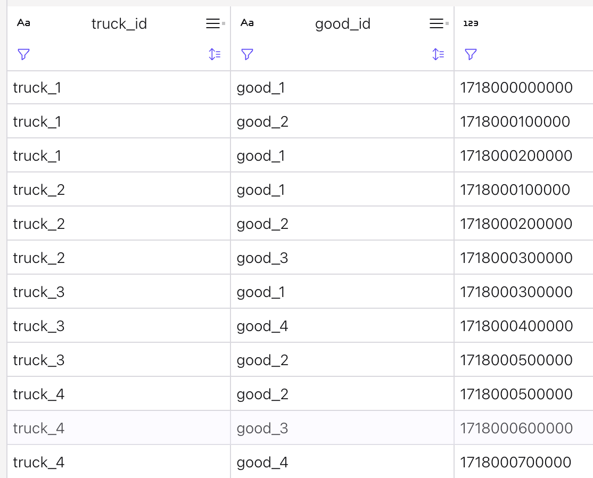
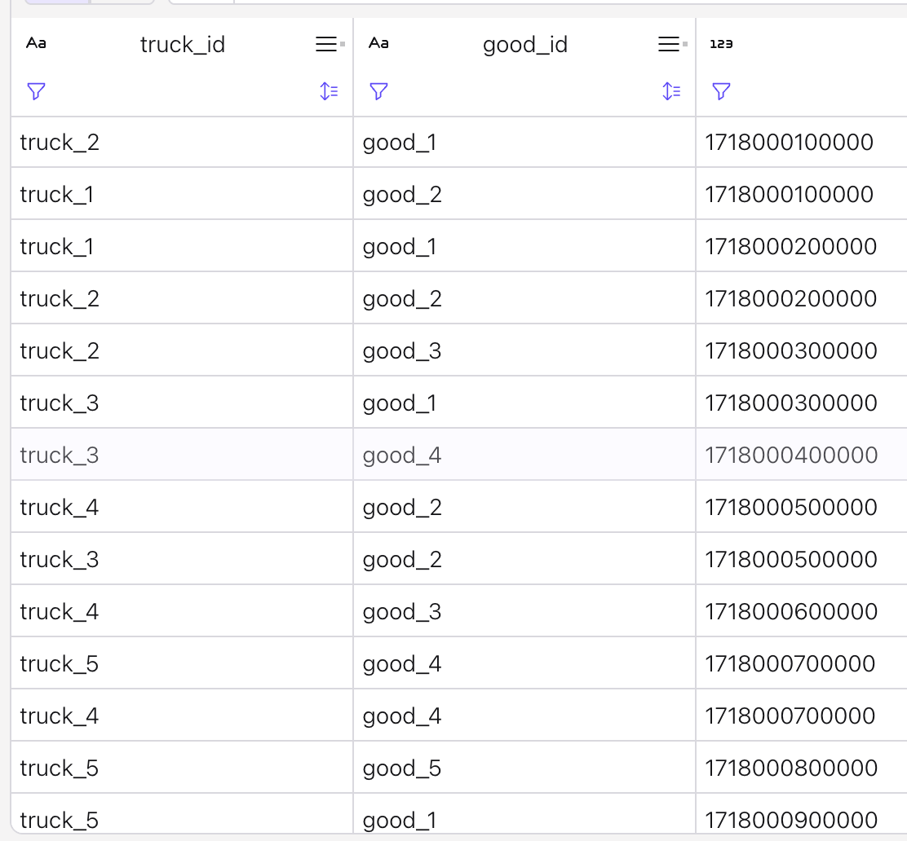

# Nested objects and arrays

This folder includes three examples, one for mock of health care json to json transformation with nested array and objects, and the other one illustrating Row and `cross join unnest`. 

## Pre-requisites

* Create a Confluent Cloud environment using quickstart

```sh
confluent flink quickstart --name jb-demo --max-cfu 10 --region us-west-2 --cloud aws
```

* Start the SQL client

```sh
confluent flink shell --compute-pool $CPOOL --environment $CENV
```

* Use the Confluent Console - flink Workspace

## 1- Access user information from nested schemas

Recall that: `examples`.`marketplace`.`clicks`  structure is:
```sql
CREATE TABLE `examples`.`marketplace`.`clicks` (
  `click_id` VARCHAR(2147483647) NOT NULL,
  `user_id` INT NOT NULL,
  `url` VARCHAR(2147483647) NOT NULL,
  `user_agent` VARCHAR(2147483647) NOT NULL,
  `view_time` INT NOT NULL
)
```

1. Create a mockup of nested schema with the `vw.nested_user.sql` file. 

    ```sql
    create view nested_user_clicks as
    select
        click_id,
        view_time,
        url,
        CAST(user_id, user_agent) AS ROW<user_id BIGINT, user_agent STRING>) AS user_data,
        `$rowtime`
    FROM `examples`.`marketplace`.`clicks`;
    ```

    The user data is now a row or tuple of 2 values.

    Recall that to create those statements using Confluent CLI, the commands look like:
    
    ```sh
    confluent flink statement create $statement_name --sql "$sql_statement_file_as_string" --database $DB_NAME --compute-pool $CPOOL_ID --wait 
    ```
    
    Recall [views](https://docs.confluent.io/cloud/current/flink/reference/statements/create-view.html), are read-only, and have no insert operation and are used to encapsulate complex queries and reference them like regular tables. It acts as a virtual table that refers to the result of the specified statement expression.

1. Access the nested schema in the SELECT (see `dml.nested_user.sql`)
    ```sql
    SELECT 
        t.user_data.user_id, 
        t.user_data.user_agent,
    FROM nested_user_clicks as t;
    ```

1. For array iteration and aggregation use ARRAY_AGG, see the `vw.array_of_rows.sql`. The query below, denormalize and aggregate click events into one minute collection of page views, grouped by URL. Each record represents a specific URL's activity during a specific one-minute period. The full details of all the individual clicks (who viewed it and when) during that minute are stored  in a single, page_views array column.

    ```sql
    CREATE VIEW page_views_1m AS
    SELECT 
        window_time, 
        url,
        ARRAY_AGG(CAST((user_id, view_time, $rowtime) AS ROW<user_id INT, view_time INT, viewed_at TIMESTAMP_LTZ(3)>)) AS page_views
    FROM TABLE(TUMBLE(TABLE `examples`.`marketplace`.`clicks`, DESCRIPTOR(`$rowtime`), INTERVAL '1' MINUTE))
    GROUP BY window_start, window_end, window_time, url;
    ```

    *ARRAY_AGG aggregates values from a specified expression across a group of rows and returns them as an array.*

    and a unnesting of the array with

    ```sql
    SELECT window_time, url, T.*
    FROM page_views_1m
    CROSS JOIN UNNEST(page_views_1m.page_views) AS T(user_id, view_time, viewed_at)
    ```

1. Without windowing: for each user group the url and user agent
    ```sql
    SELECT 
        user_id,
        ARRAY_AGG(CAST((url, user_agent) AS ROW<url STRING, user_agent STRING>)) AS page_views
    FROM `examples`.`marketplace`.`clicks`
    GROUP BY user_id
    ```

    during the time processing it will keep the last event per user_id.

## 2- Flight record with array - unnested

How to get REST API service ingested into topic and processed by Flink using nested json object and array:

* [Confluent- HTTP source as stream demo](https://github.com/confluentinc/demo-scene/tree/master/http-streaming) with [video run throw](https://www.youtube.com/watch?v=HB_TbqCKny4). The source is opensky-network.org which delivers every 10s flight information for a specified geography. A Kafka HTTP Connector is configured to get the data from the REST API. The [API response is described here.](https://openskynetwork.github.io/opensky-api/rest.html#response) The approach is to define a table with a new schema using Flink CTAS statements and add data cleaning and filterning DMLs.

Example of output:

```json
{
    "time": 1735065278,
    "states": [
        [
            "4b1800",
            "SWR112E ",
            "Switzerland",
            1735065278,
            1735065278,
            9.0268,
            47.4177,
            5478.78,
            false,
            163.93,
            82.61,
            11.38,
            null,
            5615.94,
            "1000",
            false,
            0
        ],
        # more records in states
}
```

The SQL expands the states array in each row of the all_flights table into new rows, one per array element, by performing a cross join against the UNNEST'ing of the states array.

```sql
INSERT INTO all_flights_cleaned
    SELECT TO_TIMESTAMP_LTZ(`time`, 0) AS poll_timestamp,
      RTRIM(StatesTable.states[1]) AS icao24,
      RTRIM(StatesTable.states[2]) AS callsign,
      RTRIM(StatesTable.states[3]) AS origin_country,
      TO_TIMESTAMP_LTZ(CAST(StatesTable.states[4] AS NUMERIC), 0) AS event_timestamp,
      CAST(StatesTable.states[6] AS DECIMAL(10, 4)) AS longitude,
      CAST(StatesTable.states[7] AS DECIMAL(10, 4)) AS latitude,
      CAST(StatesTable.states[8] AS DECIMAL(10, 2)) AS barometric_altitude,
      CAST(StatesTable.states[9] AS BOOLEAN) AS on_ground,
      CAST(StatesTable.states[10] AS DECIMAL(10, 2)) AS velocity_m_per_s
    FROM all_flights CROSS JOIN UNNEST(all_flights.states) as StatesTable (states);
```

News from 10/14/2025, there is a [UDF to compute goe_distance](https://github.com/jbcodeforce/flink-udfs-catalog/tree/main/geo_distance) that can also be used on top of this example.

## 3- Array aggregation

Problem: how to keep the last records of an exploded array. The source event includes truck container content as array of goods. 
```sh
truck_1, good_1, ts_ms
truck_2, good_1, ts_ms
truck_1, good_2, ts_ms
truck_3, good_1, ts_ms
truck_2, good_3, ts_ms
```

The expected outcome will be:
```sh
truck_1, good_2, ts_ms
truck_3, good_1, ts_ms
truck_2, good_3, ts_ms
```

* Table definition includes a column which is an array of rows:
    ```sql
    create table truck_loads (
        truck_id STRING,
        loads ARRAY<ROW<c_id INT ,good_id STRING, ts_ms BIGINT>>
    )
    ```

    By default,   'changelog.mode' = 'append', and 'kafka.cleanup-policy' = 'delete'. 
* See the truck_loads/insert_truck_loads.sql for some test data
    ```sql
    INSERT INTO truck_loads VALUES
        ('truck_1', ARRAY [ROW(1, 'good_1', 1718000000000), ROW(2, 'good_2', 1718000100000), ROW(3, 'good_1', 1718000200000)]),
    ```
* Exploding the array:
    ```sql
    select truck_id, good_id, ts_ms from truck_loads
    CROSS JOIN UNNEST(truck_loads.loads) as T(c_id, good_id, ts_ms)
    ```

    The results looks like:
    

    Adding group_by does not change the outcome.

* Adding a upsert table with composite key truck_id, good_id
    ```sql
    create table truck_last_load(
        truck_id STRING,
        good_id STRING,
        ts_ms BIGINT,
        PRIMARY KEY(truck_id) NOT ENFORCED
    )  DISTRIBUTED INTO 6 BUCKETS 
    WITH (
    'changelog.mode' = 'upsert',
    'connector' = 'confluent',
    'kafka.cleanup-policy' = 'delete'
    )
    ```

    The results are as expected: 
    

