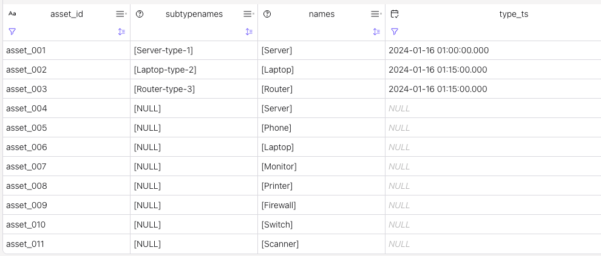

# A classical entity -> entityType management.

This example runs on Confluent Cloud for Flink. 

There are two main classes to define Asset and AssetType. The goal is to remove any duplicates and be sure to have the Asset -> AssertType joined.

## Demonstration

1. Run `ddl.raw_AssetType.sql`: This declares the Type of asset is a unique id and a name of the asset. There is a watermark specified on the timestamp so we can take the record time stamp to do operation on time, like order by.
    ```sql
    create table raw_AssetTypeAsset (
        AssetId string,
        TypeId string,
        Version int,
        ts_ltz timestamp_ltz(3),
        WATERMARK FOR ts_ltz AS ts_ltz - INTERVAL '5' SECOND,
        PRIMARY KEY (AssetId) NOT ENFORCED 
    ) DISTRIBUTED BY HASH(AssetId) into 1 buckets WITH (
        'changelog.mode' = 'append',
        'key.format' = 'avro-registry',
        'value.format' = 'avro-registry',
        'value.fields-include' = 'all',
        'scan.startup.mode' = 'earliest-offset',
        'scan.bounded.mode' = 'unbounded'
    );
    ```
1. Do the same for `raw_AssetTypeAsset.sql`
1. Insert data in both topic with duplicates records: `dml.insert_raw_assets.sql`

### Build the deduplication logic

The [classical pattern as described in the product doc](https://docs.confluent.io/cloud/current/flink/reference/queries/deduplication.html) can be ported as:

```sql
select AssetId, TypeId, Version, ts_ltz
from (
  select AssetId, TypeId, Version, ts_ltz,
         ROW_NUMBER() OVER (PARTITION BY AssetId, TypeId ORDER BY ts_ltz DESC) as rn
  from `raw_AssetTypeAsset`
) where rn = 1
```

It takes the last record. This code can become a CTE. 
which we can combine within another CTE that deduplicate the AssetType.

```sql
with deduped_AssetTypeAsset as (
    select AssetId, TypeId, Version, ts_ltz
    from (
        select AssetId, TypeId, Version, ts_ltz,
        ROW_NUMBER() OVER (PARTITION BY AssetId, TypeId ORDER BY ts_ltz DESC) as rn
        from `raw_AssetTypeAsset`)
    where rn = 1
),
deduped_AssetType as (
    select id, name, description, ts_ltz
    from (
        select id, name, description, ts_ltz,
        ROW_NUMBER() OVER (PARTITION BY id ORDER BY ts_ltz DESC) as rn
        from `raw_AssetType`)
    where rn = 1
)
```

### Combining with inner join

Then we can do an inner join to enrich the AssetTypeAsset with referenced data:

```sql
select 
  deduped_AssetTypeAsset.AssetId,
  deduped_AssetTypeAsset.TypeId,
  deduped_AssetTypeAsset.Version,
  deduped_AssetType.name,
  deduped_AssetType.description
from deduped_AssetTypeAsset
inner join deduped_AssetType on deduped_AssetTypeAsset.TypeId = deduped_AssetType.id
```

### Aggregating

The same pattern can be applied to SubType and types, combined to group subtype and type name into arrays.

```sql
latest_subtypes as (
  select asta.AssetId as asset_id, ast.name as subtype_name, asta.ts_ltz 
  from `raw_AssetSubTypeAsset` asta inner join `raw_AssetSubType` ast on asta.SubTypeId = ast.id
)
select 
    lt.AssetId as asset_id,  
    ARRAY_AGG(DISTINCT lst.subtype_name) as subtypenames, 
    ARRAY_AGG(DISTINCT lt.name) as names,
    max(lst.ts_ltz) as type_ts  
from latest_types lt left join latest_subtypes lst on lt.AssetId = lst.asset_id
group by lt.AssetId
```

to make the sql simpler, the dedup logic for the subtype was removed.

The results may look like:



The left join creates rows with null values because there is no match on the right side of the joins.