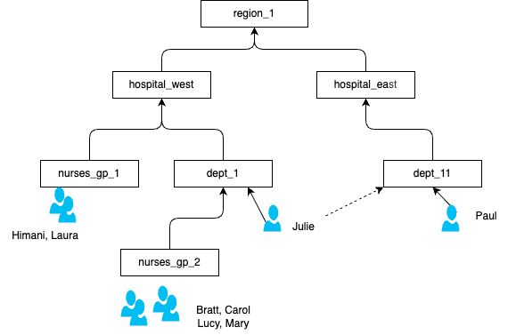

# Group-Users — Hierarchical Self-Joins

Model a hierarchical group/user structure in Flink SQL using **self-joins** and `ARRAY_AGG`. Also handles soft-deletion of users via tombstone events.

> Flink SQL does not support recursive CTEs (`WITH RECURSIVE`). For a fixed-depth hierarchy this demo shows how to achieve the same result with self-joins and union patterns.

## Business Problem

A hospital system has groups (Region → Hospital → Department → Team) and persons. Each person can belong to multiple groups. Requirements:

1. Given any group, list all persons in that group and all its sub-groups (flatten the hierarchy).
2. Handle deletion: when a tombstone event marks all members of a group as deleted, reflect that in the materialised view — unless a newer event re-instates a member.

## Domain



## Key Concepts

| Concept | Description |
|---------|-------------|
| Self-join | Join `group_hierarchy` to itself to traverse one level of the hierarchy |
| `ARRAY_AGG(DISTINCT ...)` | Collect persons per group into an array |
| `UNION ALL` | Combine direct members with sub-group members before aggregation |
| Tombstone event | An event with empty `group_member` and `is_deleted=TRUE` that signals all members of a group should be marked deleted |
| `LEFT JOIN` with `MAX(tombstone_ts)` | Detect the latest tombstone per group and apply conditional deletion logic |

## Layout

```
cc-flink/   Confluent Cloud Flink SQL (DDL, DML, deploy manifest)
docs/       group_hierarchy.drawio.png, src_group_info.png, person_dep_flat.png, 2nd_lvl_groups.png
```

## Prerequisites

1. Confluent Cloud environment with a Flink compute pool
2. Deployment credentials in `../../../tools/`

## Run (Confluent Cloud)

```sh
cd cc-flink

make sync
make deploy-ddl       # create group_hierarchy, groups_users_rec, dim_latest_group_users_rec
make deploy-data      # seed hierarchy and user events
make deploy-pipeline  # run hierarchy flattening and tombstone logic

make undeploy
make drop-tables
```

## Key SQL

### Flatten one level: persons directly in sub-groups

```sql
SELECT
  parent.group_name AS group_name,
  child.item_name   AS person_name
FROM group_hierarchy parent
LEFT JOIN group_hierarchy child
  ON parent.item_name = child.group_name
WHERE parent.item_type = 'GROUP'
  AND child.item_type  = 'PERSON'
```

### Two-level flattening with UNION ALL

```sql
WITH direct_persons AS (
  SELECT group_name, item_name AS person_name
  FROM group_hierarchy WHERE item_type = 'PERSON'
),
subgroup_members AS (
  SELECT parent.group_name, child.item_name AS person_name
  FROM group_hierarchy parent
  LEFT JOIN group_hierarchy child ON parent.item_name = child.group_name
  WHERE parent.item_type = 'GROUP' AND child.item_type = 'PERSON'
),
all_persons AS (
  SELECT group_name, person_name FROM direct_persons
  UNION ALL
  SELECT group_name, person_name FROM subgroup_members
)
SELECT group_name, ARRAY_AGG(person_name) AS persons
FROM all_persons
GROUP BY group_name
```

See `docs/person_dep_flat.png` for expected output.

### Tombstone-aware deletion

```sql
INSERT INTO dim_latest_group_users_rec
SELECT
  group_uid, group_member, event_timestamp,
  CASE
    WHEN tombstone_ts IS NOT NULL AND event_timestamp < tombstone_ts THEN TRUE
    ELSE is_deleted
  END AS is_deleted
FROM (
  SELECT r.group_uid, r.group_member, r.event_timestamp, r.is_deleted,
         t.tombstone_timestamp AS tombstone_ts
  FROM groups_users_rec r
  LEFT JOIN (
    SELECT group_uid, MAX(event_timestamp) AS tombstone_timestamp
    FROM groups_users_rec
    WHERE group_member = '' AND is_deleted = TRUE
    GROUP BY group_uid
  ) t ON r.group_uid = t.group_uid
  WHERE r.group_member <> ''
);
```
