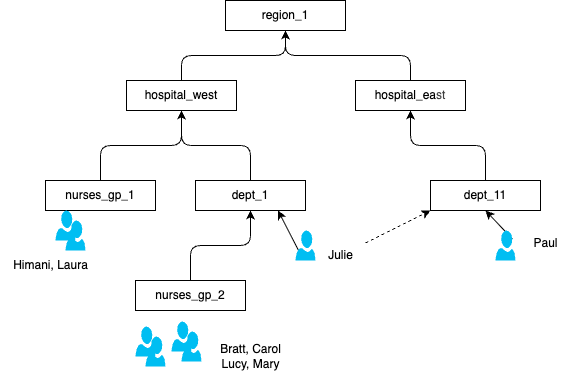
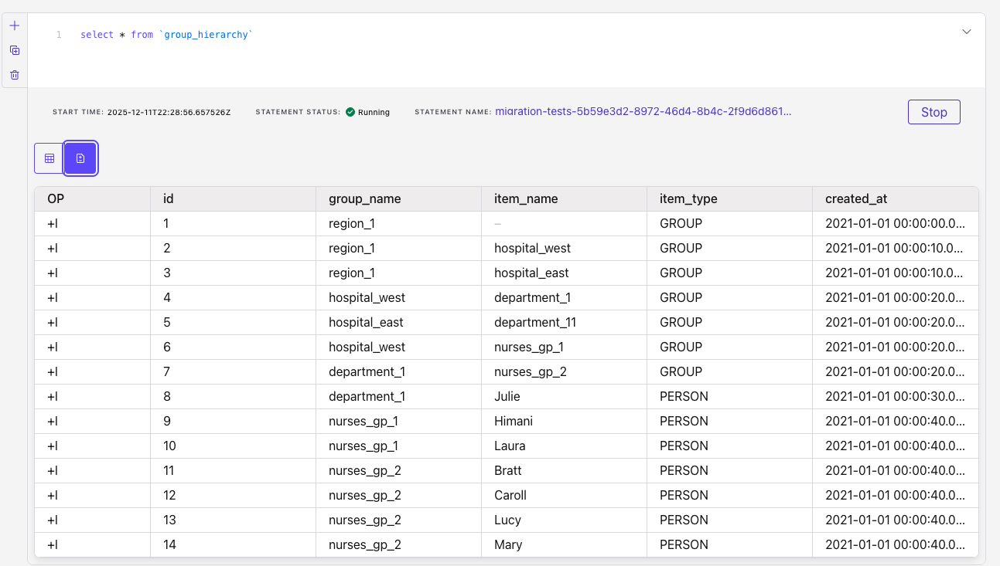
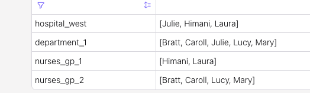
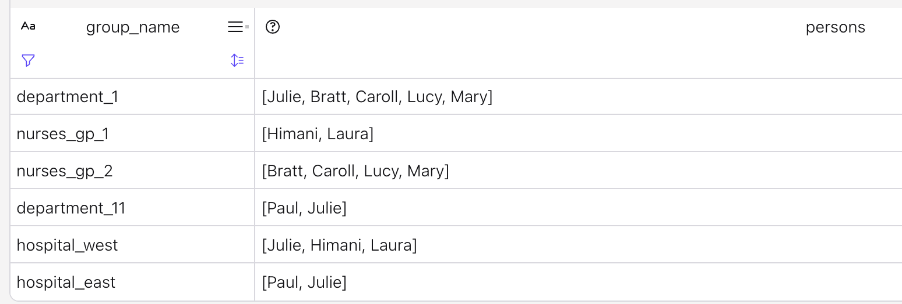

# User to group patterns


## Problems


1. Support Hierarchy within the same table, and try to get the users in a group by flattening the hierarchy. As an example there is a group of hospital, with department, and group of people, then persons.
    * Person can be part of multiple groups
    * Group can be part of other group.
    * There is one root group



## Hierarchical Group of Users

*Flink SQL does not support recursive CTEs (WITH RECURSIVE) like traditional databases. For hierarchical queries with unknown depth, you'd need iterative processing or user-defined functions.*

However, for a fixed depth hierarchy (which is common in practice), you can achieve this with self-joins and ARRAY_AGG. 

* A unique table keeps group  and user assignment information. Here is the simplest definition:
    ```sql
    CREATE TABLE group_hierarchy (
    id              INT PRIMARY KEY NOT ENFORCED,
    group_name STRING,
    item_name       STRING,
    item_type       STRING NOT NULL,   -- 'GROUP' or 'PERSON'
    ```

    See the [ddl.group_hierarchy.sql](./ddl.group_hierarchy.sql)

* With some insert statements to reflect the figure above (see [insert_group_hierarchy.sql](./insert_group_hierarchy.sql))

    

* The expected results look like:

| Group | Persons |
| --- | --- |
| nurses_gp_1 | [Himani, Laure] |
| nurses_gp_2 | [Bratt, Carol, Lucy, Mary] |
| Dept_1 | [Bratt, Carol, Julie, Lucy, Mary] |
| Dept_11 | [Paul, Julie] |
| Hospital West | [Bratt, Carol,  Himani, Julie, Laure, Lucy, Mary] |
| Hopital East | [Paul, Julie] |
| Region 1 | [Bratt, Carol,  Himani, Julie, Laure, Lucy, Mary, Paul] |


* The logic should leverage joins on the same table, and ARRAY_AGG to build the list of persons per groups. 
* First basic query is to the person to group assignment
    ```sql
    select group_name, item_name as person_name from `group_hierarchy` where item_type = 'PERSON'
    ```

    which could be transformed by the list of groups a user belong too
    ```sql
    select 
        item_name as person_name, 
        ARRAY_AGG(distinct group_name) as group_names
    from `group_hierarchy`
        where item_type = 'PERSON'
    group by item_name
    ```

* Looking more at the group level, we can get all persons per group:
    1. See grouping person at one level higher in their current group
        ```sql
        select
            parent.group_name as group_name,
            child.item_name as person_name
        from `group_hierarchy` parent left join `group_hierarchy` child on parent.item_name = child.group_name
        where parent.item_type = 'GROUP' and child.item_type = 'PERSON' 
        ```

    1. Then aggregate by wrapping the previous with 
        ```sql
        with depts as 
            (
            SELECT 
                l.group_name AS group_name,
                r.item_name AS person_name
            FROM group_hierarchy l
            JOIN group_hierarchy r
                ON r.item_name IS NOT NULL and (r.item_name = l.group_name OR r.group_name = l.group_name)
            WHERE r.item_type = 'PERSON'
        )
        select 
            group_name,
            ARRAY_AGG(distinct person_name) as persons
        from depts
        group by group_name
        ```

        

* Two level hierarchy will be:
    ```sql
    with direct_persons as (
    select group_name, item_name as person_name from `group_hierarchy` where item_type = 'PERSON'
    ),

    subgroup_members as (select
        parent.group_name as group_name,
        child.item_name as person_name
        from `group_hierarchy` parent left join `group_hierarchy` child on parent.item_name = child.group_name
        where parent.item_type = 'GROUP' and child.item_type = 'PERSON'
    ),

    all_persons as ( 
        select group_name, person_name from direct_persons
        union all
        select group_name, person_name from subgroup_members
    )
    select
        group_name,
        ARRAY_AGG(person_name) as persons
    from all_persons group by group_name
    ```

* Inserting new users update the table:
    

* For dynamic we need to implement a User Defined Function. [See this code]()

## Context

* In the  groups_users_rec there is only events for group/users creation or update
* The event that specifies a user is deleted from a group will not come in this source. Only an event saying the group has a delete in the form
    ```sql
    ('grp-002', '', TIMESTAMP '2025-11-26 09:15:00.000', TRUE)
    ```

    Let call it a tombstone at the group level.

* If the delete events are sent for a given user within a group like:
    ```
    ('grp-002', 'user_201', TIMESTAMP '2025-11-26 09:15:00.000', TRUE)
    ```

    Then to address the requirement, the following statement will work:
    ```sql
    select group_uid, group_member,  is_deleted from `groups_users_rec` group by group_uid, group_member, is_deleted
    ```

*  Fetching data from datasource should be ordered. But it could be out of order in some rare case.
* When a group has been modified and the event is a tombstone, normally all users should be deleted so the `is_deteled` flag, should be set to True

* We need to handle a "tombstone" event where an empty group_member with is_deleted=TRUE marks all existing members of that group as deleted, unless they have newer events after the tombstone.
* On this example:
    ```sql
    INSERT INTO groups_users_rec (group_uid, group_member, event_timestamp, is_deleted) VALUES
    ('grp-001', 'user-100', TIMESTAMP '2025-11-01 09:00:00.000', FALSE),
    ('grp-001', 'user-101', TIMESTAMP '2025-11-01 09:05:00.500', FALSE),
    ('grp-002', 'user-200', TIMESTAMP '2025-11-02 10:10:10.123', FALSE),
    ('grp-002', 'user-201', TIMESTAMP '2025-11-02 10:12:00.000', FALSE),
    ('grp-003', 'user-300', TIMESTAMP '2025-11-15 14:30:22.999', FALSE),
    -- deletion in grp-002
    ('grp-002', '', TIMESTAMP '2025-11-26 09:15:00.000', TRUE),
    ('grp-003', 'user-301', TIMESTAMP '2025-11-28 20:45:15.250', FALSE),
    ('grp-001', 'user-102', TIMESTAMP '2025-11-30 23:59:59.999', FALSE),
    ('grp-002', 'user-200', TIMESTAMP '2025-11-26 10:11:10.123', FALSE),
    ('grp-002', 'user-202', TIMESTAMP '2025-11-26 10:12:00.000', FALSE);
    ```

    The expected results is:
    ```
    'grp-001', 'user-100', FALSE
    'grp-001', 'user-101', FALSE
    'grp-001', 'user-102', FALSE
    'grp-002', 'user-200', FALSE
    'grp-002', 'user-201', TRUE
    'grp-002', 'user-202', FALSE
    'grp-003', 'user-300', FALSE
    'grp-003', 'user-301', FALSE
    ```

The final query is:
```sql
INSERT INTO dim_latest_group_users_rec
SELECT
    group_uid,
    group_member,
    event_timestamp,
    CASE
        WHEN tombstone_ts IS NOT NULL
             AND event_timestamp < tombstone_ts
        THEN TRUE
        ELSE is_deleted
    END as is_deleted
FROM (SELECT
        r.group_uid,
        r.group_member,
        r.event_timestamp,
        r.is_deleted,
        -- Get the maximum tombstone timestamp for each group
        t.tombstone_timestamp as tombstone_ts
    FROM groups_users_rec r
    LEFT JOIN (
        SELECT
            group_uid,
            MAX(event_timestamp) as tombstone_timestamp
        FROM groups_users_rec
        WHERE group_member = '' AND is_deleted = TRUE
        GROUP BY group_uid
    ) t ON r.group_uid = t.group_uid
    WHERE r.group_member <> '' );
```