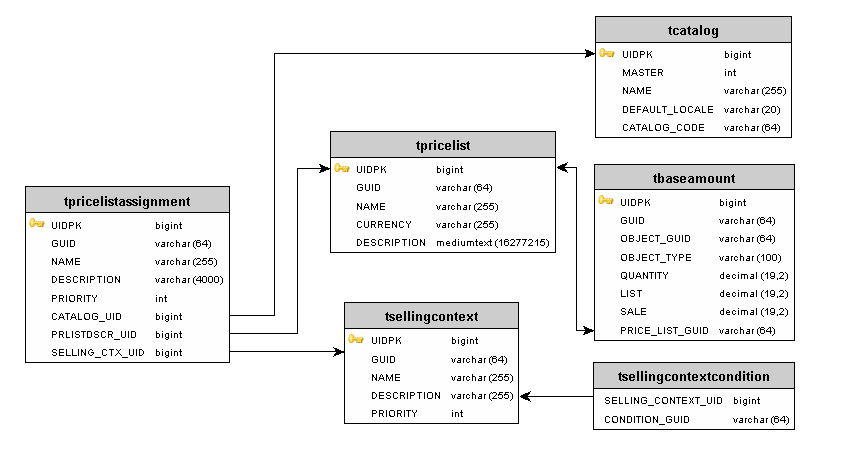
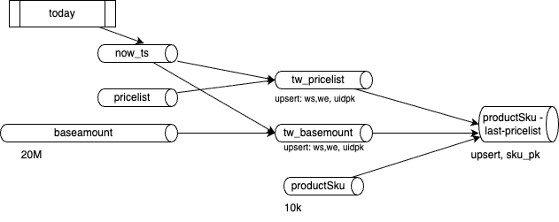

# Price at the time of the deal

Data model is from Elasticpath pricing model. Which has explanation of the requirements covered by the model [here](https://documentation.elasticpath.com/commerce/docs/core/platform/commerce-manager/pricing.html) and with a class diagram looks like:



* product and SKU prices are stored in price lists
* There is at least one price list for each supported currency and catalog.
* **tpricelistassignment**: Price list assignment — central fact/bridge table.  Each row binds a price list (PRLISTDSCR_UID → tpricelist) to a catalog (CATALOG_UID → tcatalog) and a selling context (SELLING_CTX_UID → tsellingcontext).  When all three reference records are present AND the current event time falls within both `tpricelist.start_date/end_date` AND `tbaseamount.start_date/end_date`, the associated prices are "active" and must be projected to the output topic.
* We need to add the productSku table.

Those tables are implemented as DDL in cc-flink folder.

* `kafka.retention.time = 0` (infinite) on all tables — these are dimension/reference tables; historical rows must never expire.

## Requirements

* The source tables are injected in Kafka Topics via CDC. This demonstration does not process the after, before and op envelops and metadata. Therefore the source topic schemas reflect the tables of ElasticPath with the effective dates.
* The purpose is to have a sink table, with the last value for price list per productSku. A given productSku will have a list of baseamount with currency for each currency the product is sold to. Basemanount has also a sale price or discount that may apply to a given customer. An upsert table with productsku -> List<baseamount, currency> where the list is build, considering the start and end active dates, need to be re-evaluated every day as:
  a. Some end date may be passed today
  b. Some start date may be valid today, if the pricelist / amount were set in advance.

### Analysis

* ProductSku table do not change a lot, neither the pricelist for currency.
* The baseamount has a lot of records, millions, to keep historical values. It is not good to do cross join on those. Few records may be added every day.
* Normal pattern in streaming processing is to have an event that trigger the computation of what was the price at the time of the event. Apache Flink support batch processing and it is possible to use a now() function in this mode. Currently Confluent Cloud for Flink enforce strongly this pattern by not letting statement is now or current_date being deploy on joins. The approach is to use temporal join.
* Due to the amount of records in baseamount, we need to only keep the amount valid per time window validity to reduce cross-join needed downstream by using a hearbeat. 



*  Once the current time has passed either end date, Flink will do a -U +U to the outgoing kafka topic for downstream system that support upsert semantic.
* For the core of the business logic implementation the tables: `tsellingcontext, tsellingcontextcondition, tpricelistassignment` are not needed.

## Process Price List Assignement

process tpricelistassignment to assess what price was valid for the price assignment.  

* BaseAmount - information about a price list item for a quantity (tier), including list price and sale price. Added start and end_date. start_date is the time at which a part is available for sale.
* tpricelist represent the currencies the product is sold to. It has start_date and end date too. is the time at which the pricing is active for that given class of user.  
* the current time needs to be between the start and end for both of these for that price to be active for that user class. 


## Computing the effective SKU price (`effective_sku_price`)

`dml.insert_effective_sku_price.sql` sidesteps this by doing the 3-way join
(`tproductsku ⋈ tbaseamount ⋈ tpricelist`, restricted to `OBJECT_TYPE = 'ProductSku'`) with no wall-clock function at all. It computes and continuously upserts the deterministic effective window per SKU:

* `EFFECTIVE_START = GREATEST(tbaseamount.start_date, tpricelist.start_date)`
* `EFFECTIVE_END   = LEAST(tbaseamount.end_date, tpricelist.end_date)`

into the sink table `ddl.effective_sku_price.sql` (upsert-keyed by `PRODUCT_SKU_GUID`). The "is this active
right now" decision is deferred to whoever reads that table, applying the original batch-style filter at
read time instead of inside the streaming job:

```sql
SELECT *
FROM effective_sku_price
WHERE EFFECTIVE_START <= CURRENT_TIMESTAMP
  AND CURRENT_TIMESTAMP < EFFECTIVE_END;
```

Known limitation: the sink is keyed by `PRODUCT_SKU_GUID` only, so if a SKU is ever active in more than one
price list at the same time (e.g. two currencies), only the most-recently-updated one survives — use
`(PRODUCT_SKU_GUID, PRICE_LIST_GUID)` as the key if that must be supported.

## The heartbeat

`heartbeat` (`ddl.heartbeat.sql`) is a single-row upsert table holding one "current time" tick.
`dml.insert_heartbeat_tick.sql` is a one-shot statement:

```sql
INSERT INTO heartbeat VALUES (1, CURRENT_TIMESTAMP);
```

— run repeatedly by an external scheduler (cron, `watch`, a CI job — anything that can invoke
`make deploy-heartbeat` on an interval, e.g. once a minute). `CURRENT_TIMESTAMP` is safe here specifically
*because* this is a bounded statement submitted fresh each time, not a predicate re-evaluated inside a
running streaming query. It's its own manifest group (`heartbeat`), deliberately left out of `deploy_all`
since it's meant to be re-run on a schedule, not deployed once.

> `dml.effective_sku_price.sql` currently CROSS JOINs `heartbeat` against `effective_sku_price` and writes
> the result back into `effective_sku_price` itself — that's a self-referential read/write on the same table
> that will corrupt its `EFFECTIVE_START`/`EFFECTIVE_END` columns with status text and tick timestamps. Needs
> fixing (or splitting back into its own `_live` sink) before this one is deployed.

## Reducing the cross-join and reattaching the price list: `base_amount_by_window` → `price_list_by_window` → `product_sku_price`

`tbaseamount` has millions of rows (full price history); range-joining the heartbeat directly against it on
every tick is expensive. `dml.base_amount_by_window.sql` restricts to currently-active rows and groups them
by `(OBJECT_GUID, start_date, end_date)` — one group per SKU per window — carrying every base amount that
shares that window (e.g. one per currency/price list) as an array, into `base_amount_by_window`
(`ddl.base_amount_by_window.sql`):

```sql
INSERT INTO base_amount_by_window
SELECT ta.OBJECT_GUID, ta.start_date, ta.end_date,
       ARRAY_AGG(ROW(ta.GUID, ta.OBJECT_TYPE, ta.PRICE_LIST_GUID, ta.QUANTITY, ta.LIST, ta.SALE)) AS amounts
FROM heartbeat hb
INNER JOIN tbaseamount ta
    ON hb.tick_ts >= ta.start_date AND hb.tick_ts < ta.end_date
GROUP BY ta.OBJECT_GUID, ta.start_date, ta.end_date;
```

Because `heartbeat` is an *updating* (upsert) input, this is a genuine Flink join over changelog streams —
on every tick Flink retracts (`-U`) groups that stopped matching and emits (`+U`) groups that newly match,
which is the `-U +U` upsert semantics called out above, automatically. Caveat: since the join happens
*before* the grouping, and against the full `tbaseamount` (not a pre-reduced set of distinct windows), the
range join itself still has to consider every `tbaseamount` row on every tick — grouping by `OBJECT_GUID`
(rather than `(start_date, end_date)` alone) also means the group-by barely reduces cardinality, since most
SKU+window combinations are already close to 1:1 in the source data. Both were true of an earlier version of
this table keyed only by `(start_date, end_date)`, which is worth reconsidering if `tbaseamount`'s scale ends
up making this join expensive in practice.

`price_list_by_window` (`ddl.tpricelist_by_window.sql` / `dml.price_list_by_window.sql`) mirrors the same
pattern for `tpricelist`, keyed by `(GUID, start_date, end_date, CURRENCY)`:

```sql
INSERT INTO price_list_by_window
SELECT pl.GUID, pl.start_date, pl.end_date, pl.CURRENCY
FROM heartbeat hb
INNER JOIN tpricelist pl
    ON hb.tick_ts >= pl.start_date AND hb.tick_ts < pl.end_date
GROUP BY pl.GUID, pl.start_date, pl.end_date, pl.CURRENCY;
```

`product_sku_price` (`ddl.product_sku_price.sql` / `dml.product_sku_price.sql`) is the
`tproductsku ⋈ base_amount_by_window ⋈ price_list_by_window` join: `UNNEST(amounts)` fans the array back out
to one row per price list, then that row's `PRICE_LIST_GUID` is joined against `price_list_by_window.GUID`
to attach currency and the price list's own window:

```sql
INSERT INTO product_sku_price
SELECT sku.GUID, sku.CATALOG_CODE, amt.PRICE_LIST_GUID, plw.CURRENCY, amt.QUANTITY,
       amt.`LIST`, amt.SALE, baw.start_date, baw.end_date, plw.start_date, plw.end_date
FROM tproductsku sku
INNER JOIN base_amount_by_window baw ON baw.OBJECT_GUID = sku.GUID
CROSS JOIN UNNEST(baw.amounts) AS amt(GUID, OBJECT_TYPE, PRICE_LIST_GUID, QUANTITY, `LIST`, SALE)
INNER JOIN price_list_by_window plw ON plw.GUID = amt.PRICE_LIST_GUID;
```

Both sides are already heartbeat-filtered to their own currently-active window before this join runs, so no
wall-clock check is needed here — plain deterministic join. Keyed by
`(PRODUCT_SKU_GUID, PRICE_LIST_GUID, QUANTITY)`, since a SKU can be active in more than one currency/price
list at once and can have more than one quantity tier.

Natural next step (not built yet): re-`ARRAY_AGG` `product_sku_price` back up to one row per SKU to match the
Requirements section's `productsku -> List<baseamount, currency>` shape exactly.
