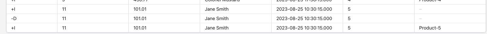
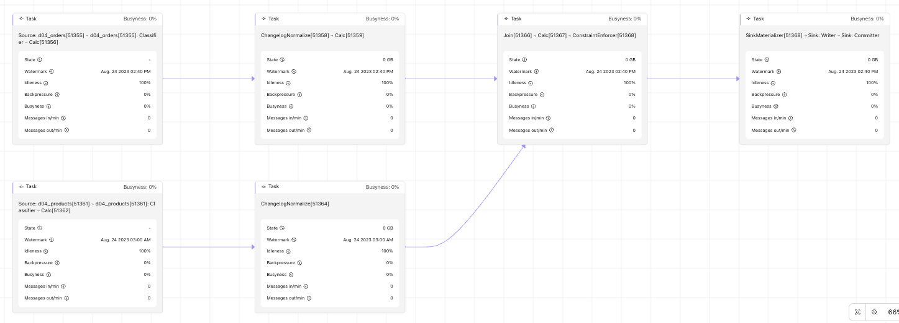
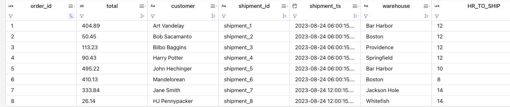

# Joins playground

## Understanding Basic Joins

[Based on the Confluent's blog: 'How to join a stream and a stream'](https://developer.confluent.io/tutorials/join-a-stream-to-a-stream/flinksql.html) but adapted for Confluent Cloud.

The `orders` is the high velocity table. `Products` is the reference data, with new added product every week. As a first step we will use joins and no watermark, this will look like a cartesian join.

*This project uses the python tools ([deploy_flink_statements](../tools/cc_deploy/deploy_flink_statements.py)) to deploy statements*

* First we will create the order and product tables without watermarks (`op_ddl` group in [cc/deploy_manifest.json](./cc/deploy_manifest.json)):
  ```sh
  make sync
  make deploy-ddls
  make deploy-data
  ```

* We propose to copy/paste the join statement in a Confluent Cloud workspace cell: it runs a single join pipeline, deploy one statement manually in the Confluent Console, using `streaming` mode.
  ```sql
   select
      o.id as order_id,
      o.total_amount,
      o.customer_name,
      o.order_ts_raw,
      o.product_id,
      p.product_name
  from d04_orders o
  join d04_products p on o.product_id = p.id;
  ```

  As an alternate the command: `make deploy-op_join_1`

  The results shows that orders 9 is present but with a null value for product name, as it references a product not yet in the products table. 

  | order_id | product_id | product_name |
  | --- | --- | --- |
  | 1   | 1  |  Product-1 |
  | 5   | 1  |  Product-1 |
  | 6   | 1  |  Product-1 |
  | 7   | 1  |  Product-1 |
  | 2   | 2  |  Product-2 |
  | 3   | 3  |  Product-3 |
  | 4   | 3  |  Product-3 |
  | 8   | 2  |  Product-2 |
  | 9   | 4  | Null |
  | 10 | 3  |  Product-3 |

* Using the Workspace cell: add the 4th product with:
  ```sql
  INSERT INTO d04_products VALUES    ( 4, 'Product-4', TIMESTAMP '2023-08-22 10:00:15.000' );
  ```
  
  Now the row 9 is updated with the `product-4`. 
  | order_id | product_id | product_name |
  | --- | --- | --- |
  | ... | | |
  | 8   | 2  |  Product-2 |
  | 10 | 3  |  Product-3 |
  | 9 | 4 | Product-4 |
  
  This is expected as the join is cartesian.

* Undeploy if you want to do next step:
  ```sh
  make undeploy
  make drop-tables
  ```

## Left Joins

* If we change the previous join with a left join where the left table is the orders:
  ```sql
  from d04_orders o
  left join d04_products p on o.product_id = p.id;
  ```

  deploy with `make `

  And we insert an 11 order with a non-yet referenced product:
  ```sql
  INSERT INTO d04_orders
  VALUES ( 11, 101.01, 'Jane Smith',    TIMESTAMP '2023-08-25 10:30:15.000', 5);
  ```

  | order_id | product_id | product_name |
  | --- | --- | --- |
  | ... | | |
  | 8   | 2  |  Product-2 |
  | 10  | 3  |  Product-3 |
  | 9   | 4 | Product-4 |
  | 11  | 5 | NULL |

  Inserting later the 5th product will change the allocation and the view move to

  | order_id | product_id | product_name |
  | --- | --- | --- |
  | ... | | |
  | 8   | 2 |  Product-2 |
  | 10  | 3 |  Product-3 |
  | 9   | 4 | Product-4 |
  | 11  | 5 | Product-5 |

  Looking at the `changelog view` we can see a Delete and insert of the records:

  
  

* This table was not materialized to a kafka topic. We can retry by doing a CTAS of the join:
  ```sh
  make deploy-op_left_join
  ```

  It is important to declare the primary key to be sure all records with same keys are going to the same partition. Here we also specify one partition but for production, it may be better to use the default of 6 or even more. 

  Doing the same exercise by adding a new order and then a new product, we can see the same behavior:
  ```sql
  INSERT INTO d04_orders
      VALUES ( 12, 202.01, 'Jane Smith',    TIMESTAMP '2023-08-26 10:30:15.000', 6);
  ```
  
  The created table is an upsert changelog, which is mandatory as soon as there is left outer join in the statement. Flink must handle the scenario where left-side events do not have corresponding right-side events at the time of processing. The Upsert table allows Flink to store unmatched left records and update them when matching right records arrive later, ensuring all left records are included in the result, thus supporting the LEFT JOIN semantics effectively in a streaming context.

   The created event in the d04_order_product_join topic is:
   
  ```json
    {
      "order_id": 12,
      "total_amount": {
        "double": 202.01
      },
      "customer_name": {
        "string": "Jane Smith"
      },
      "order_ts_raw": {
        "long": 1693045815000
      },
      "product_id": {
        "int": 6
      },
      "product_name": null
    }
  ```

   Adding the missing product: 
    ```sql
   INSERT INTO d04_products VALUES    ( 6, 'Product-6', TIMESTAMP '2023-08-24 10:00:15.000' )
  ```
  
  it will generate TWO records in the kafka topic: one delete and one new:

  ```sh
  Key       Value
  {"id":12} ""
  {"id":12} {"id":12,"product_id":{"long":"6"},"product_name": { "string": "Product-6"}}
  ```

* This demonstrates also that Flink task managers are keeping state of both side of the joins, which means that when one of the right side record change, like changing the name with:
  ```sql
  INSERT INTO d04_products VALUES    ( 6, 'Product-6.1', TIMESTAMP '2023-08-24 10:00:15.000' )
  ```

  A new pair of -U +U records to update order_id 12 are present. Each side of the joins has all the records per primary key. The join changes as events arrive and process both tables without strictly enforcing time-bound limits. These states are growing forever.

  The simple solution is to set state TTL at the statment level

  ```sql
  set 'sql.state-ttl' = '2d';
  ```

  or at the join side so each side may have different TTL
  ```sql
  select /*+ STATE_TTL(o='2h', p='30d') */ 
    o.id as order_id,
    o.total_amount,
    o.customer_name,
    o.order_ts_raw,
    o.product_id,
    p.product_name
  from d04_orders o
  left join d04_products p on o.product_id = p.id;
  ```

* To drop tables do:
  ```sh
  make undeploy
  make drop-tables
  ```

## Adding constraints on the time: watermark strategy

Watermarks set on both tables do not impact join results. Watermarks matter only for time-based joins, not regular equi-joins. Simple JOIN / LEFT JOIN without event-time conditions do not use watermarks to decide when to emit results.

For interval joins and temporal (time-versioned) joins, watermarks directly affect output timing and completeness. Flink uses watermarks to know when enough event-time has passed to safely produce results; without watermarks, these operators do not produce output.

For temporal joins, the join may wait until the watermark on the versioned/enrichment side reaches the probe record’s timestamp before emitting, which introduces latency. 
If one side is idle or lagging, the join can appear stalled because two-input operators generally wait on the relevant watermarks from both sides

For interval joins, watermarks are also propagated with an additional delay equal to the maximum join interval bound, so larger time ranges increase buffering and downstream latency.

To acknowledge watermarks have no impact on regular joins

* Create tables with watermarks and insert basic records
  ```sh
  make deploy-ddl_wm
  #
  make deploy-data
  ```

  The orders dates are between: '2023-08-23 17:36:15.000' and '2023-08-23 21:40:15.000' while the products are from one day before:
  '2023-08-22 17:36:15.000' and '2023-08-22 17:36:17.000'

* Redeploying the join will give results for the first records and no record for order_id: 9. Adding the product-4 with a time stamp after the order 9:
  ```sql
   INSERT INTO d04_products VALUES    ( 4, 'Product-4', TIMESTAMP '2023-08-24 10:00:15.000' )
  ```

  The order 9 is now emitted.

* Now if we add a order record with a time stamp that is ealier than the product 5:
  ```sql
  INSERT INTO d04_orders
  VALUES ( 11, 202.01, 'Jane Smith',    TIMESTAMP '2023-08-24 21:40:15.000', 5);
  ```

  then adding the product 5:
  ```sql
  INSERT INTO d04_products VALUES    ( 5, 'Product-5', TIMESTAMP '2023-08-24 10:00:15.000' )
  ```

  The new product name is added to the order

  

---

## Temporal and Inner joins

In this example we want to emit records when there’s a match on the criteria of both sides of the join: orders and shipments within a time interval of 2 days:
```sql
SELECT
  o.order_id as order_id,
  o.total_amount as total,
  o.customer_name as customer,
  s.id as shipment_id,
  s.ship_ts_raw as shipment_ts,
  s.warehouse,
  TIMESTAMPDIFF(HOUR,
             o.order_ts_raw,                     -- convert numeric type (an epoch based timestamp in this case) to a formatted string in the default format of yyyy-MM-dd HH:mm:ss
             s.ship_ts_raw) as HR_TO_SHIP
  FROM d04_order_product_join o
  INNER JOIN d04_shipments s
  ON o.order_id = s.order_id
      AND s.ship_ts_raw
      BETWEEN o.order_ts_raw
      AND o.order_ts_raw  + INTERVAL '2' DAY;
```

* Run:
  ```sh
  make ddls_wm
  make deploy-data
  make deploy-op_left_join
  # then for shipment
  make deploy-data_ship
  ```
  
  The results will include only 8 records as record 9 and 10 has more than 7 hours difference. 

  

---

## Confluent Flink more advanced problems

### 1- Compute the number of orders per customer per minute (non-overlapping window)

* Confluent Cloud has a set of data in the `marketplace.orders` source table as:
  ```sql
  TABLE `examples`.`marketplace`.`orders` (
    `order_id` VARCHAR(2147483647) NOT NULL,
    `customer_id` INT,
    `product_ids` ARRAY<BIGINT>,
    `price` DECIMAL(10, 2),
    `order_details` VARCHAR(2147483647),
    CONSTRAINT `PK_order_id` PRIMARY KEY (`order_id`) NOT ENFORCED
  )
  ```

  As we generate an aggregate per minute, there is no need to update record by customer_id. But to get a window aggregation we need window_start and window_end columns.

* Create a table in append log so there is not need to have primary keys:
  ```sql
  create table order_count 
  as select 
    window_start,
    window_end,
    count(order_id) as cnt 
  from table(tumble( table `examples`.`marketplace`.`orders`, descriptor(`$rowtime`), interval '1' minutes)) 
  group by window_start, window_end, `customer_id`;
  ```

* Use EXPLAIN to understand the physical plan:
  ```sql
  explain select window_start,
    window_end,
    count(order_id) as cnt 
  from table(tumble( table `examples`.`marketplace`.`orders`, descriptor(`$rowtime`), interval '1' minutes)) 
  group by window_start, window_end, `customer_id`;
  ```

  With a result as:

  ```sh
  StreamPhysicalSink [7]
    +- StreamPhysicalCalc [6]
      +- StreamPhysicalGlobalWindowAggregate [5]
        +- StreamPhysicalExchange [4]
          +- StreamPhysicalLocalWindowAggregate [3]
            +- StreamPhysicalCalc [2]
              +- StreamPhysicalTableSourceScan [1]
  ```

* If we need to have an upsert or retract table, we need a primary key, but as the source column may be nullable, we need to colasce the column to get default value:
  ```sql
  create table order_count (
    primary key(customer_id) not enforced
  ) 
  as select 
    window_start, 
    window_end,
    coalesce(customer_id, 1) as customer_id, 
    count(order_id) as cnt 
  from table(tumble( table `examples`.`marketplace`.`orders`, descriptor(`$rowtime`), interval '1' minutes)) 
  group by window_start, window_end, customer_id;
  ```

### 2- Create table to hold the number of orders per product per minute (non-overlapping window).

This example is using an order that has produt_ids column as an array of product_id, part of the order. To test this use case we can create the table with the Faker connector:

```sql
```

Need to join with the orders with the product (upsert) table on the product_ids. The product table is defined as:

```sql
CREATE TABLE `examples`.`marketplace`.`products` (
  `product_id` VARCHAR(2147483647) NOT NULL,
  `name` VARCHAR(2147483647) NOT NULL,
  `brand` VARCHAR(2147483647) NOT NULL,
  `vendor` VARCHAR(2147483647) NOT NULL,
  `department` VARCHAR(2147483647) NOT NULL,
  CONSTRAINT `PK_product_id` PRIMARY KEY (`product_id`) NOT ENFORCED
```

In the orders the column product_ids is an array of ids, so we need to use [unnest](https://docs.confluent.io/cloud/current/flink/reference/queries/joins.html#array-expansion) in the join. The `cross join unnest()` returns a new row for each element in the given array.

The grouping needs to use the product_id.

Also it is a recommended practice to add the window_time as the rowtime of the new kafka record in the output topic. So the solution looks like:

```sql
create table order_counts as 
select 
  window_start,
  window_end,
  count(order_id) as cnt,
  window_time TIMESTAMP as $rowtime
from table(tumble( table `examples`.`marketplace`.`orders`, descriptor(`$rowtime`), interval '1' minutes)) 
cross join unnest(`product_ids`) as product (product_id)
group by window_start, window_end, window_time, product_id;
```

### 3- Create a materialized view/table that holds the average (physical) volume of products ordered per customer per minute (non overlapping window).

Product_details is 1 to 1 linked to the products table. The Dimension column is 3 values from a Row type. So to compute the volume we need to multiple each of the 3 dimensions.

The solution needs first to do the join to get the product detail for each product within the order. To get the product ids within the order, it uses the `cross join unnest`, then to get the product details, it uses a `left join`

See [cc-3-avg-prod-volume-per-mn.sql](./cc/cc-3-avg-prod-volume-per-mn.sql).

```sql
CREATE TABLE order_volumes AS
WITH orders_with_details as (
  select o.order_id, 
  s.dimensions.length,
  s.dimensions.height,
  s.dimensions.width,
  o.`$rowtime`
  from orders o
  CROSS JOIN UNNEST(o.product_ids) AS p(id)
left join `product_details` FOR SYSTEM_TIME AS OF o.`$rowtime` s on s.`product_id` = p.`id`
)
SELECT
  AVG(
  CAST(SPLIT_INDEX(length, 'c', 0) AS DOUBLE)
  *
  CAST(SPLIT_INDEX(width, 'c', 0) AS DOUBLE)
  *
  CAST(SPLIT_INDEX(height, 'c', 0) AS DOUBLE)
  ) as avg_volume,
  window_time,
  o.order_id
FROM TABLE(
  TUMBLE(TABLE `orders_with_details`, DESCRIPTOR($rowtime), INTERVAL '1' MINUTE)
) o
GROUP BY window_start, window_end, window_time, o.order_id;
```

### 4- Create a materialized view/table that holds rolling average of the order value (last 10 orders) per customer.

### 5- Create a materialized view/table that holds total order value per order status at any given point in time.


```sql
select s.order_status, sum(o.price) as total from orders o
inner join order_status s on o.order_id = s.order_id
group by s.order_status;
```

The state is unbounded.

### 6- Create a materialized view/table that holds every order with the product and customer information as of the time when the order happened.

### 7- Create a materialized view/table that holds all up-to-date information related to an order. Whenever any of these tables is updated, I want the result table to be updated: 

* orders
* order_status
* products
* product_details
* customers
* categories
* brands

### 8- Find out if there is any correlation between between product category and the payment method used for the orders of these products? For this, you need to join orders to payments. 

### 9- Create a materialized view/table that holds for each customer_inquiries, the product information and order_status as of the time when the inquiry was created.

### 10- Create an “ACTIVE” alert and send it to a table called alerts as soon as the number of customer_inquiries in the last 30 minutes exceeded X. Also mark the alert as INACTIVE again as soon as the condition is not met anymore. 

### 11- Find customers who have ordered the same product twice without ordering another product in between. We want to send these customers a notification to see if that was a mistake before shipping the order.

### 12- Same as (XI), but this time we also want to alert if there are any other orders in between the two orders of the same product as long as they two orders of the same product happened within 30 days. 

### 13- Identify sessions via the clicks table. For each session, we are interested in the start, end and length of the session (in seconds) as well as the the list of URLs visited. 

### 14- Based on the output (XIV), send an alert if the average session length (rolling 5mins) drops significantly below the average session length (rolling 60mins). 

### 15- Implement a user-defined function GENERATE_SERIES(BIGINT from, BIGINT to) returning an ARRAY<BIGINT>. 

[See the product doc](https://docs.confluent.io/cloud/current/flink/how-to-guides/create-udf.html).

### 16- Improve the ValidateProductName 

Improve the ValidateProductName UDF to not only return whether product name is valid, but also a (n ideally structured) error with information why it is invalid, if it is invalid. The error shall be NULL if the product name is valid.

## Data Skew

[See problem and solution statements](https://jbcodeforce.github.io/flink-studies/concepts/#data-skew) and the demo code in the [./data_skew/](./data_skew/) folder.