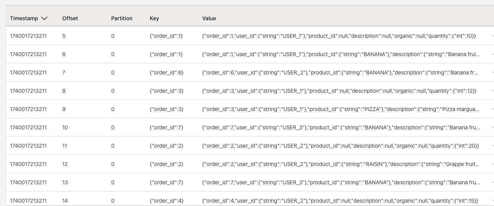

# Deeper understanding of the changelog mode

This folder includes a set of sqls to demonstrate the impact of using different changelog mode to different operations like joins and aggregations. As a source of information there are a set of product documentations, enablements and blogs that can be studied:

* [Confluent product document - changelog ](https://docs.confluent.io/cloud/current/flink/reference/statements/create-table.html#changelog-mode)
* [Flink SQL Secrets: Mastering the Art of Changelog Event Out-of-Orderness](https://www.ververica.com/blog/flink-sql-secrets-mastering-the-art-of-changelog-event-out-of-orderness)
* [Summary of those articles in this repo](https://jbcodeforce.github.io/flink-studies/coding/flink-sql-2/#changelog-mode)

Those examples are for Confluent Cloud Flink SQL, and can be deployed using Confluent CLI.

The demonstration architecture is the following:


The source table for orders is in append mode.

## Aggregation from an append table

The orders is an append (see the `ddl.orders-append-mode.sql` file), but any aggregation done on the records coming from this input table, written to a new table, enforces the table to be upsert or retract.

As the user_id became the primary key, and in the source table, it may be nullable, the following code protect from issue:

```sql
create table user_order_quantity (
    user_id STRING NOT NULL,
    order_quantity INT
) distributed by(user_id) into 1 buckets
with (
    'changelog.mode' = 'upsert',
    'value.fields-include' = 'all'
) as
select coalesce(user_id,'NULL') as user_id, sum(quantity) as order_quantity from orders group by user_id;
```

The aggregation gives the results (`select * from user_order_quantity`):

| User | Quantity |
| --- | --- |
| user_1 | 27 |
| user_2 | 55 |
| user_3 | 31 |

In the kafka topic, the records in the output topic may reflect the matching records (3 records in the topic). This is due to the transaction elapse time to commit the offset. We if wait more time before sending a new order: the output kafka topic will have new record for the same key:


*the user_1 has 47 as two records at +10 were executed*

### Retract mode

The output table can be set to retract and the records in the the topic look like:

To demonstrate this do:

1. Stop the ctas statement on the user_order_quantity
1. `drop table user_order_quantity`
1. `drop table orders`, and recreate it from the  `ddl.orders-append-mode.sql` file
1. Insert the 10 records: ` make insert_orders`, the topic has 10 messages
1. Create the ctas with retract using the `ddl.user-order-quantity-retract.sql`
1. Verify the results in Flink: `select * from `user_order_quantity`, they are matching the table above.
1. The records in the topic are different:
  

The number of records is higher as there is retract messages which can be seen by looking at the header content.

Flink uses these operation flags in the header to track different types of changes:

```properties
\u0001 = INSERT
\u0002 = UPDATE_BEFORE
\u0003 = UPDATE_AFTER
\u0004 = DELETE
```


## Playing with the input order table

### Append mode test

The changelog.mode set to `append` is the simplest mode where records are only added to the result stream, never updated or retracted. Like a write-once data. Every insertion can be treated as an independent immutable fact. The `$rowtime` column and system watermark are added implicitly. Append mode is used for regular SELECT queries without aggregations per key.

* The `ddl.orders-append-mode.sql` creates such table. 
  ```sh
  make deploy_orders_append_mode
  ```

* We need to add 10 order records for 3 users, with one duplicate (same order_id 7)
  ```sh
  make insert_orders
  ```

The Kafka topic has all the records in the order of insertion, so source topic has duplicate records:
  

* In Flink, `select * from orders` returns all the records. 

  

  To remove duplicates we need to apply the following logic:
  ```sql
  select * from (
    select *, row_number() over( 
        partition by order_id order by $rowtime DESC
        ) as row_num 
    from orders) where row_num = 1;
  ```

which leads to keep only one record for orderId = 7, the one with quantity 11.

* The query: `select product_id, sum(quantity) as total from orders group by product_id;` returns wrong results:

    ```sql
    product_id, total
    RAISIN, 20
    PIZZA, 22
    BANANA, 46
    APPLE, 20
    POPCORN, 5
    ```

  as BANANA is counting the duplicates, the right result should be `BANANA, 36`. 

  If we use the dedup logic (`select product_id, sum(quantity) as total  from (select *, row_number() over( partition by order_id order by $rowtime DESC) as row_num from orders) where row_num = 1 group by product_id;`), the results are good.

  

* As another example, to validate changelog impact, we can use a JOIN operator by adding a product table. The Products table may be considered as a reference table, quite static per nature: 
  ```sh
  make deploy_products
  make insert_products
  ```

* A join between the two append tables, generates all the records, including the duplicates, as the left side of the join has duplicates:
  ```sql
  select 
      o.user_id,
      o.product_id,
      p.description,
      p.organic,
      o.quantity
  from orders as o
  left join products as p ON o.product_id = p.product_id
  ```

  


  We can observe the same behavior as in the previous section: if we insert the results into an output Kafka topic (enriched_orders): the topic has duplicates, which is expected.

  ```sql
  create table enriched_orders (
    order_id int primary key not enforced
  )
  distributed by(order_id) into 1 buckets
  with (
    'changelog.mode'='append',
    'value.fields-include' = 'all'  -- keep order_id in value schema
  ) as
  select 
      o.order_id,
      o.user_id,
      o.product_id,
      p.description,
      p.organic,
      o.quantity
  from orders as o
  left join products as p ON o.product_id = p.product_id
  ```

## Retract mode

For retract mode, Flink emits pairs of retraction and addition records. When updating a value, it first sends a retraction of the old record (negative record) followed by the addition of the new record (positive record). It means, a fact can be undone, and the combination of +X and -X are related and must be partitioned together. Records are related by all the columns so the entire row is the key.

Use the following commands to create the tables, after cleaning the orders table:

```sh
make drop_orders
make deploy_orders_retract_mode
make insert_orders
```

The topic has duplicates records as expected.

* `select * from orders;` returns no duplicate and gives good results: the record with `order_id = 7` has the quantity 11 instead of 10.
* Adding to a dedup table with a CTAS like below, gives us no duplicate when using `select * from order_deduped`, even if in the topic, duplicate records exist. The primary key is the `order_id` as in the source table `orders`.
  ```sql
  create table orders_deduped 
  distributed by (order_id) into 1 buckets
  with (
      'changelog.mode' = 'retract',
      'value.fields-include' = 'all'
  )
  as select * from orders;
  ```

* The aggregation: `select product_id, sum(quantity) as total from orders group by product_id;` returns the same wrong result:

    ```sql
    product_id, total
    RAISIN, 20
    PIZZA, 22
    BANANA, 46
    APPLE, 20
    POPCORN, 5
    ```

* Doing the join with products with an output topic in retract mode, we got the good results for a `select * from enriched_orders`. See previous CTAS but with a retract changelog mode:

```sql
create table enriched_orders (
  order_id int primary key not enforced
)
distributed by(order_id) into 1 buckets
with (
  'changelog.mode'='retract',
  ...
```

For the records in the topics, there are 9 records in the input orders topic, and the output topic has 19 messages.



Some records have this content with no header

```json
{
  "order_id": 2,
  "user_id": {
    "string": "USER_2"
  },
  "product_id": "RAISIN",
  "description": null,
  "organic": null,
  "quantity": {
    "int": 20
  }
}
```

Then in a higher offset a record with the same key and empty valuem and with a header representing a DELETE:

```json
[
  { "key": "op",
    "value": "\u0003"
  }
]
```

The next record with the same key has finally the join result and an empty header. 

When performing joins, Flink needs to handle scenarios where joined records become invalid due to updates or deletions in the source tables.


For the duplicate message, the header has UPDATE_BEFORE for the record with quantity 11.

Finally the last message in the order has no marching product.

With retract mode a consumer outside of Flink need to interpret the header.

## Upsert table

Finally, this changelog mode is similar to the retract mode but more efficient for key-based operations. Instead of sending separate retraction and addition records, it sends a single upsert record that replaces the old value for a given key and a tombstone record with value = "". Client applications of the kafka topic need to be able to process those tombstone records. It is important to note that if the Kafka topic is set to `compact` mode as a `cleanup.policy` then the tombestone record will be deleted.

* Create an upsert table, the topic has still the 11 records with the duplicate, but `select * from orders` is giving good results (the record with order_id =7 has the quantity 11 instead of 10).
  ```sh
  make drop_orders
  make drop_enriched_orders
  make deploy_orders_upsert_mode
  make insert_orders
  ```

* Also aggregation like `select product_id, sum(quantity) as total from orders group by product_id;` returns now the good results!
    ```sql
       product_id, total
    RAISIN, 20
    PIZZA, 22
    BANANA, 36
    APPLE, 20
    POPCORN, 5
    ```

* The joins is returning the good results as in the figure below:


Adding results to a table via CTAS, gives 12 records as one tombstone record is added for the duplicate message of order_id 7, to remove the record with quantity 10 for a new record with quantity 11.

The tombstone needs to be managed by the consumer of the topic.

## Combining append -> deduped upsert --> enriched upsert

This is a classical pattern to get data from a CDC layer and apply deduplication with an upsert table. To simulate this pattern, first create the orders in append log and then a CTAS to create a dedup table with upsert on the order_id primary key:

* Create the append table without primary key:

```sql
create table if not exists orders (
    order_id INT,
    user_id STRING,
    product_id STRING,
    quantity INT
) DISTRIBUTED into 1 BUCKETS 
with (
    'changelog.mode' = 'append',
    'value.fields-include' = 'all'
);
```

* Add the 9 orders. Then create a CTAS as:

```sql
create table if not exists orders_deduped(
  order_id INT NOT NULL,
  user_id STRING,
  product_id STRING,
  quantity int,
  primary key(order_id) not enforced
) distributed by hash(order_id) into 1 buckets
with (
  'changelog.mode' = 'upsert',
  'scan.bounded.mode' = 'unbounded',
  'scan.startup.mode' = 'earliest-offset',
  'value.fields-include' = 'all'
)
as 
    select coalesce(order_id,0) as order_id, user_id, product_id, quantity from orders;

```

If the CTAS stop then the results will be wrong. It is better to use a ddl and then a dml with insert into.

The content in the topic looks like:


While the result of `select * from order_deduped;` return only the last record of the pair order_id = 7

* Adding aggregation from the order_deduped gives the good result of 36 bananas.
* The last operation is to join with products, using for example a CTAS. If we create a table with append mode for the `enriched_orders` we get the following error:

```sh
enriched_orders doesn't support consuming update and delete changes which is produced by node Join(joinType=[LeftOuterJoin], where=[(product_id = product_id0)], select=[order_id, user_id, product_id, quantity, product_id0, description, organic], leftInputSpec=[HasUniqueKey], rightInputSpec=[JoinKeyContainsUniqueKey])
```

The topic is created and tables are created but no records are published by the  CTAS.

So the `enriched_orders` needs to be upsert or retract. With this we got the same results as the previous two sections.

## Append with primary key to enriched append is not possible

For the same reason as above an append mode for a changelog does not support consuming update and delete changes which is produced by a Join.

## Other interesting articles

* [Robin Moffatt's Exploring Joins and Changelogs in Flink SQL](https://rmoff.net/2025/05/20/exploring-joins-and-changelogs-in-flink-sql/)