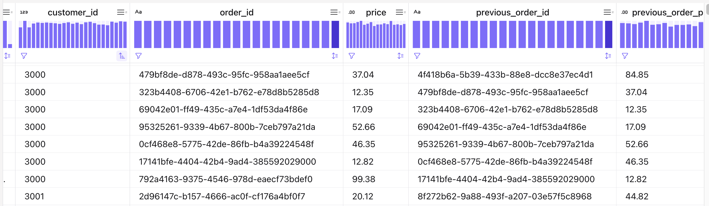

# Over, LAG and Group-By demonstrations

## OVER — rolling count per customer

[OVER aggregations](https://nightlies.apache.org/flink/flink-docs-release-1.20/docs/dev/table/sql/queries/over-agg/) compute an aggregate for **every input row** over a sliding range. Unlike `GROUP BY`, row count is preserved: each order emits one enriched row. [See dedicated chapter](https://jbcodeforce.github.io/flink-studies/coding/flink-sql-2/)

This demo counts orders per customer in a **60-second time window** ending at the current row:

```sql
COUNT(*) OVER w AS order_count_60s
...
WINDOW w AS (
    PARTITION BY customer_id
    ORDER BY `$rowtime`
    RANGE BETWEEN INTERVAL '60' SECONDS PRECEDING AND CURRENT ROW
)
```

The window definition is externalized and can be used for multiple aggregates:

```sql
SUM(total_amount) OVER w AS total_amount_60s,
COUNT(*) OVER w AS order_count_60s
```

The source table must be **append-only** — OVER does not support retract/update changelog semantics.

See also the [OVER section in flink-sql-2.md]((https://jbcodeforce.github.io/flink-studies/coding/flink-sql-2/).

### Deploy on Confluent Cloud

From this folder:

```sh
make sync
make deploy-ddl
make deploy-data
make deploy-pipeline
```

Seed data for customer `101` produces rolling counts `1 → 2 → 4 → 1 → 2`; customer `102` has a single order (`1`).

Inspect results in a workspace cell:

```sql
SELECT * FROM d06_order_count_over_60s ORDER BY order_ts;
```

Teardown:

```sh
make undeploy
make drop-tables
```

### Another example: the LOCF

The last observation carried forward (LOCF / forward-fill) is a statistical method used to handle missing data in longitudinal studies or time-series datasets.  When a measurement or data point is missing at a specific time, LOCF replaces that missing value with the most recent, previously observed value for that subject or entity.

* LAST_VALUE() is a built-in aggregate and window function that returns the last non-null value in a data stream or window frame. It is typically used with an OVER clause to track the most recent valid status for a specific key.

As an example, we are taking telemetries data per devices. Some records may not have the metrics reported.

| device id |            ts           | X   | Y   | val |
| --------- | ----------------------- | --- | --- | --- |
|     1     | 2024-06-01 10:00:00.000 | 10 | 10 | 100 |
|     2     | 2024-06-01 10:00:01.000 | 10 | 10 | 100 |
|     1     | 2024-06-01 10:00:02.000 | 12 | 20 | 110 |
|     1     | 2024-06-01 10:00:03.000 | NULL | NULL | NULL |


To find the maximum of the most recent values over time, using Apache Flink SQL, we need a two-stage aggregation. As we cannot combine MAX() and LAST_VALUE() into a single OVER window expression.  So we first need to determine the last value for each coordinate or state, and then calculate the maximum across those finalized states.

```sql
WITH LatestSensorData AS (
    SELECT
        device_id,
        LAST_VALUE(X) OVER w AS last_X,
        LAST_VALUE(Y) OVER w AS last_Y,
        LAST_VALUE(angle) OVER w AS last_angle,
        val,
        -- Extracts the latest val chronologically per partition group
        LAST_VALUE(val) OVER w AS last_val
    FROM d06_sensor_data
    WINDOW w AS (
    PARTITION BY device_id
    ORDER BY ts
    -- since the beginning of ts
    ROWS BETWEEN UNBOUNDED PRECEDING AND CURRENT ROW
    )
)
-- Step 2: Compute the maximum of those latest values
SELECT
    device_id,
    MAX(last_X) AS max_last_X,
    MAX(last_Y) AS max_last_Y,
    MAX(last_angle) AS max_last_angle,
    MAX(last_val) AS max_of_last_values
FROM LatestSensorData
GROUP BY device_id;
```

[See ./cc/ddl.locf_last_val.sql](./cc/ddl.locf_last_val.sql)

Results look like:
| device id | max last X | max last Y | max last angle | last max val |
| --------- | ---------- | ---------- | -------------- | ------------ |
|     1     |    12      |   20       |    180         | 110 |
|     2     |    10      |   10       |    170         | 100 |


## Lag

Get previous values from the same aggregation key using [LAG](https://docs.confluent.io/cloud/current/flink/reference/functions/aggregate-functions.html#flink-sql-lag-function).

The [query defined in this doc](https://docs.confluent.io/cloud/current/flink/how-to-guides/compare-current-and-previous-values.html#step-2-view-aggregated-results) is also defined in [dml.previous_order_price.sql](./cc/dml.previous_order_price.sql)

and the results illustrate that each row keep previous price and order id per customer_id:



