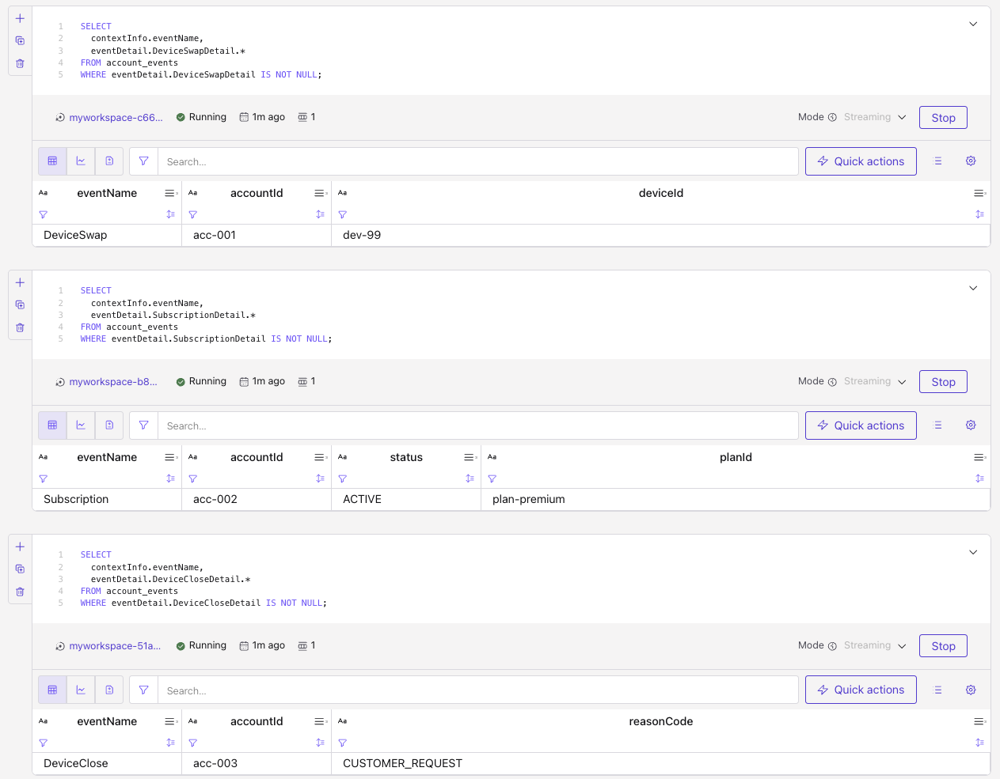

# Demonstrate Multiple Event Types in Confluent Cloud for Apache Flink

Illustrates the [Handle Multiple Event Types](https://docs.confluent.io/cloud/current/flink/how-to-guides/multiple-event-types.html?category=avro) how-to using an **Avro union** on a single envelope field. There are 

Domain: a generic **account lifecycle** stream. One topic carries three event subtypes behind a shared context.

## Schema shape

Topic: `account_events` (append, Avro / TopicNameStrategy).

| Record | Fields |
| --- | --- |
| `AccountLifecycleEvent` | `contextInfo`, `eventDetail` |
| `EventContext` | `eventName`, `correlationId`, `sourceSystem` |
| `DeviceSwapDetail` | `accountId`, `deviceId` |
| `SubscriptionDetail` | `accountId`, `status`, `planId` |
| `DeviceCloseDetail` | `accountId`, `reasonCode` |

`eventDetail` is an Avro **union** of three detail records, each defined in its own `.avsc` and registered in Schema Registry as a **schema reference**:

| File | Subject / type name |
| --- | --- |
| [DeviceSwapDetail.avsc](python/schemas/DeviceSwapDetail.avsc) | `io.confluent.flink.multievent.DeviceSwapDetail` |
| [SubscriptionDetail.avsc](python/schemas/SubscriptionDetail.avsc) | `io.confluent.flink.multievent.SubscriptionDetail` |
| [DeviceCloseDetail.avsc](python/schemas/DeviceCloseDetail.avsc) | `io.confluent.flink.multievent.DeviceCloseDetail` |
| [account_events-value.avsc](python/schemas/account_events-value.avsc) | `account_events-value` (envelope; references the three above) |

Here is the envelop schema definition:

```json
{
  "type": "record",
  "name": "AccountLifecycleEvent",
  "namespace": "io.confluent.flink.multievent",
  "fields": [
    {
      "name": "contextInfo",
      "type": {
        "type": "record",
        "name": "EventContext",
        "fields": [
          { "name": "eventName", "type": "string" },
          { "name": "correlationId", "type": "string" },
          { "name": "sourceSystem", "type": "string" }
        ]
      }
    },
    {
      "name": "eventDetail",
      "type": [
        "io.confluent.flink.multievent.DeviceSwapDetail",
        "io.confluent.flink.multievent.SubscriptionDetail",
        "io.confluent.flink.multievent.DeviceCloseDetail"
      ]
    }
  ]
}

```

Flink maps that union to a `ROW` with one non-null branch per message.

All Avro schemas: [python/schemas/](python/schemas/).

## Layout

| Path | Purpose |
| --- | --- |
| [cc-flink/](cc-flink/) | Confluent Cloud Flink SQL (DDL, seed DML, deploy manifest) |
| [python/](python/) | Kafka Avro producer for `account_events` |

## Quick start (Confluent Cloud)

```sh
cd cc-flink
make sync
make deploy-ddl
make deploy-data
```

## Produce more events

```sh
cd python
uv sync
source ../../set_env.sh
uv run producers/produce_account_events.py
```

The execution trace looks like:

```sh
Created Kafka topic 'account_events'.
Registered Avro schema id 100389 for subject 'account_events-key'
Registered Avro schema id 100390 for subject 'io.confluent.flink.multievent.DeviceSwapDetail'
Schema reference ready: name=io.confluent.flink.multievent.DeviceSwapDetail subject=io.confluent.flink.multievent.DeviceSwapDetail version=1
Registered Avro schema id 100391 for subject 'io.confluent.flink.multievent.SubscriptionDetail'
Schema reference ready: name=io.confluent.flink.multievent.SubscriptionDetail subject=io.confluent.flink.multievent.SubscriptionDetail version=1
Registered Avro schema id 100392 for subject 'io.confluent.flink.multievent.DeviceCloseDetail'
Schema reference ready: name=io.confluent.flink.multievent.DeviceCloseDetail subject=io.confluent.flink.multievent.DeviceCloseDetail version=1
Registered Avro schema id 100393 for subject 'account_events-value'
%6|1783994590.151|GETSUBSCRIPTIONS|avro-producer-af699730#producer-2| [thrd:main]: Telemetry client instance id changed from AAAAAAAAAAAAAAAAAAAAAA to m5QTvQL/QGC5PY4T7LoeAQ
Queued 1/3: corr-baae1bb2849b type=DeviceSwap
Queued 2/3: corr-d558e51308fb type=Subscription
Queued 3/3: corr-aa2ce144cb6d type=DeviceClose
Flushing pending messages...
Message delivered to account_events [0] offset 0
Message delivered to account_events [0] offset 1
Message delivered to account_events [0] offset 2
Producer closed successfully
```

## Inspect the inferred table

```sql
SHOW CREATE TABLE account_events;
```

Result looks like:
```sql


Copy
CREATE TABLE `j9r-env`.`j9r-kafka`.`account_events` (
  `correlationId` VARCHAR(2147483647) NOT NULL,
  `contextInfo` ROW<`eventName` VARCHAR(2147483647) NOT NULL, `correlationId` VARCHAR(2147483647) NOT NULL, `sourceSystem` VARCHAR(2147483647) NOT NULL> NOT NULL,
  `eventDetail` ROW<`DeviceSwapDetail` ROW<`accountId` VARCHAR(2147483647) NOT NULL, `deviceId` VARCHAR(2147483647) NOT NULL>, `SubscriptionDetail` ROW<`accountId` VARCHAR(2147483647) NOT NULL, `status` VARCHAR(2147483647) NOT NULL, `planId` VARCHAR(2147483647) NOT NULL>, `DeviceCloseDetail` ROW<`accountId` VARCHAR(2147483647) NOT NULL, `reasonCode` VARCHAR(2147483647) NOT NULL>> NOT NULL
)
DISTRIBUTED BY HASH(`correlationId`) INTO 1 BUCKETS
WITH (
  'changelog.mode' = 'append',
  'connector' = 'confluent',
  'kafka.cleanup-policy' = 'delete',
  'kafka.compaction.time' = '0 ms',
  'kafka.max-message-size' = '2097164 bytes',
  'kafka.message-timestamp-type' = 'create-time',
  'kafka.retention.size' = '0 bytes',
  'kafka.retention.time' = '7 d',
  'key.format' = 'avro-registry',
  'scan.bounded.mode' = 'unbounded',
  'scan.startup.mode' = 'earliest-offset',
  'value.format' = 'avro-registry'
)
```


Expect `eventDetail` as a `ROW` of three named branches, for example:

```sql
-- DeviceSwap events
SELECT
  contextInfo.eventName,
  eventDetail.DeviceSwapDetail.*
FROM account_events
WHERE eventDetail.DeviceSwapDetail IS NOT NULL;

-- Subscription events
SELECT
  contextInfo.eventName,
  eventDetail.SubscriptionDetail.*
FROM account_events
WHERE eventDetail.SubscriptionDetail IS NOT NULL;

-- DeviceClose events
SELECT
  contextInfo.eventName,
  eventDetail.DeviceCloseDetail.*
FROM account_events
WHERE eventDetail.DeviceCloseDetail IS NOT NULL;
```

See the expected results



## Undeploy

```sh
cd cc-flink
make undeploy-data
make drop-tables
```
