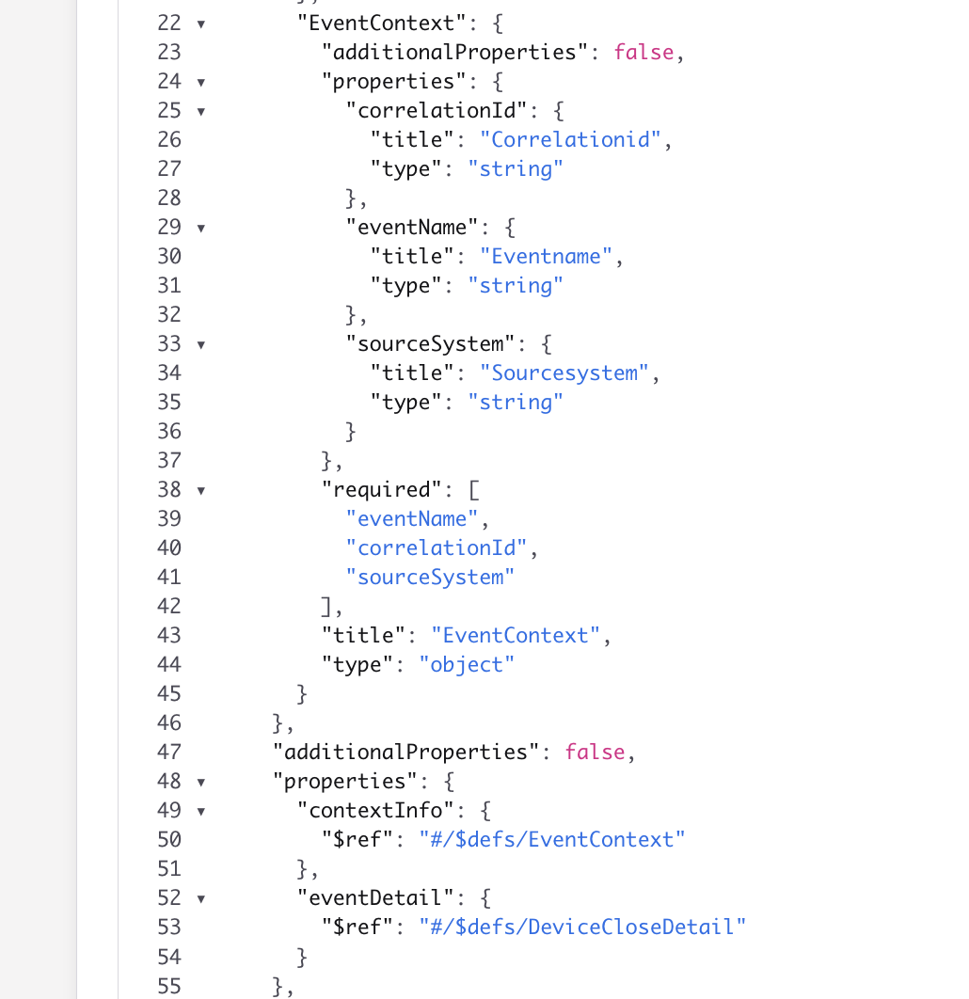

# Process multi-schema JSON into a multiple-event-types Avro sink

Based on [07-1-multiple-event-types](../07-1-multiple-event-types/README.md), but for the case where **several producers** each register their own JSON schema and write to the **same** topic (Confluent wire format). Downstream code that ignores Schema Registry only sees opaque bytes. This demo:

1. Produces three event types with three Schema Registry subjects
2. Optionally consumes those bytes while **ignoring** Schema Registry
3. Uses Flink [`raw-value` metadata](https://docs.confluent.io/cloud/current/flink/reference/statements/create-table.html#raw-value), strips the 5-byte wire prefix, parses JSON with `JSON_VALUE`, and writes the typed Avro-union sink

Domain: the same **account lifecycle** events as 07-1 (DeviceSwap, Subscription, DeviceClose).

## Approach


Three JSON schemas on one topic (wire format) → Flink normalizes to a sink topic with union of 3 schemas

Do not run 07-1 and 07-2 at the same time: both use the sink topic `account_events`.

## Schema Registry subjects (source)

| Model | Subject (RecordNameStrategy / schema `title`) |
| --- | --- |
| `DeviceSwapEvent` | `io.confluent.flink.multievent.DeviceSwapEvent` |
| `SubscriptionEvent` | `io.confluent.flink.multievent.SubscriptionEvent` |
| `DeviceCloseEvent` | `io.confluent.flink.multievent.DeviceCloseEvent` |

Each message is still the same logical envelope JSON (so Flink paths stay stable). After the wire prefix, the body looks like:

```json
{
  "contextInfo": {
    "eventName": "DeviceSwap",
    "correlationId": "corr-…",
    "sourceSystem": "billing-system"
  },
  "eventDetail": { "accountId": "acc-001", "deviceId": "dev-99" }
}
```

`eventDetail` fields vary by `eventName`:

| eventName | eventDetail fields |
| --- | --- |
| `DeviceSwap` | `accountId`, `deviceId` |
| `Subscription` | `accountId`, `status`, `planId` |
| `DeviceClose` | `accountId`, `reasonCode` |

## Sink schema

Topic: `account_events` — same Avro union envelope as 07-1 (`contextInfo` + `eventDetail` as a ROW of three named branches).

It can be see in [the DDL](./cc-flink/ddl.account_events.sql):

```sql
CREATE TABLE IF NOT EXISTS account_events (
    correlationId STRING,
    contextInfo ROW<
        eventName STRING,
        correlationId STRING,
        sourceSystem STRING
    >,
    eventDetail ROW<
        DeviceSwapDetail ROW<accountId STRING, deviceId STRING>,
        SubscriptionDetail ROW<accountId STRING, status STRING, planId STRING>,
        DeviceCloseDetail ROW<accountId STRING, reasonCode STRING>
    >,
    PRIMARY KEY (correlationId) NOT ENFORCED
) DISTRIBUTED BY (correlationId) INTO 1 BUCKETS
WITH (
    'changelog.mode' = 'append',
    'key.format' = 'avro-registry',
    'value.format' = 'avro-registry'
);
```

## Logic to transform

The approach is to get the byte array for the value and skip the magic bytes referencing the schema id, then getting the field to write in the avro schema. The SQL is [dml.raw_to_account_events.sq](./cc-flink/dml.raw_to_account_events.sql) with the following extract:

```sql
WITH parsed AS (
    SELECT SUBSTRING(CAST(`val` AS STRING), 6) AS payload
    FROM raw_account_events
)
SELECT
    JSON_VALUE(payload, 'lax $.contextInfo.correlationId') as correlationId,
    ROW(
        JSON_VALUE(payload, 'lax $.contextInfo.eventName'),
        JSON_VALUE(payload, 'lax $.contextInfo.correlationId'),
        JSON_VALUE(payload, 'lax $.contextInfo.sourceSystem')
    ) as contextInfo,
    CASE JSON_VALUE(payload, 'lax $.contextInfo.eventName')
        WHEN 'DeviceSwap' THEN ROW(
            ROW(
                JSON_VALUE(payload, 'lax $.eventDetail.accountId'),
                JSON_VALUE(payload, 'lax $.eventDetail.deviceId')
            ),
            CAST(NULL AS ROW<accountId STRING, status STRING, planId STRING>),
            CAST(NULL AS ROW<accountId STRING, reasonCode STRING>)
        )
        WHEN 'Subscription' THEN ROW(
            CAST(NULL AS ROW<accountId STRING, deviceId STRING>),
            ROW(
                JSON_VALUE(payload, 'lax $.eventDetail.accountId'),
                JSON_VALUE(payload, 'lax $.eventDetail.status'),
                JSON_VALUE(payload, 'lax $.eventDetail.planId')
            ),
            CAST(NULL AS ROW<accountId STRING, reasonCode STRING>)
        )
        WHEN 'DeviceClose' THEN ROW(
            CAST(NULL AS ROW<accountId STRING, deviceId STRING>),
            CAST(NULL AS ROW<accountId STRING, status STRING, planId STRING>),
            ROW(
                JSON_VALUE(payload, 'lax $.eventDetail.accountId'),
                JSON_VALUE(payload, 'lax $.eventDetail.reasonCode')
            )
        )
    END as eventDetail
FROM parsed;
```


## Quick start (Confluent Cloud)

```sh
cd cc-flink
make sync
make deploy-ddl
make deploy-pipeline
```

If you already deployed an older pipeline that did not strip the wire prefix:

```sh
make undeploy-pipeline
make deploy-pipeline
```

## Produce multi-schema events

```sh
cd python
uv sync
source ../../set_env.sh
uv run producers/produce_raw_account_events.py
```

Registers the three subjects above and produces Confluent wire-format values (`magic` + `schema_id` + UTF-8 JSON).
Her is the beginning of the execution trace:

```sh
Created Kafka topic 'raw_account_events'.
=== Schema Registry Configuration ===
URL: https://psrc-13go8y7.us-west-2.aws.confluent.cloud
Auth enabled: True
====================================
Subject 'io.confluent.flink.multievent.DeviceSwapEvent' not found; registering
Registered schema id 100397 for subject 'io.confluent.flink.multievent.DeviceSwapEvent'
Ready: subject=io.confluent.flink.multievent.DeviceSwapEvent model=DeviceSwapEvent
Subject 'io.confluent.flink.multievent.SubscriptionEvent' not found; registering
Registered schema id 100398 for subject 'io.confluent.flink.multievent.SubscriptionEvent'
Ready: subject=io.confluent.flink.multievent.SubscriptionEvent model=SubscriptionEvent
Subject 'io.confluent.flink.multievent.DeviceCloseEvent' not found; registering
Registered schema id 100399 for subject 'io.confluent.flink.multievent.DeviceCloseEvent'
Ready: subject=io.confluent.flink.multievent.DeviceCloseEvent model=DeviceCloseEvent
Schema Registry subjects:
  DeviceSwapEvent -> io.confluent.flink.multievent.DeviceSwapEvent
  SubscriptionEvent -> io.confluent.flink.multievent.SubscriptionEvent
  DeviceCloseEvent -> io.confluent.flink.multievent.DeviceCloseEvent
Queued 1/10: corr-5f0b43e24bf1 type=DeviceSwap
Queued 2/10: corr-2eb68505e8a8 type=Subscription
...
```

We can see that 3 schema are registered in the schema registry:


With one schema defining context and event details:



## Consume while ignoring Schema Registry

```sh
uv run consumers/consume_raw_account_events.py --from-beginning --max-messages 3
```

Prints key, embedded schema id (bytes 1–4), and `json.loads(value[5:])` — no Schema Registry client. Here is an example of records read with the python consumer:

```sh
#1 partition=0 offset=0
key=corr-5f0b43e24bf1
schema_id=100397 value_len=173
payload={
  "contextInfo": {
    "eventName": "DeviceSwap",
    "correlationId": "corr-5f0b43e24bf1",
    "sourceSystem": "billing-system"
  },
  "eventDetail": {
    "accountId": "acc-001",
    "deviceId": "dev-99"
  }
}
---
#2 partition=0 offset=1
key=corr-2eb68505e8a8
schema_id=100398 value_len=197
payload={
  "contextInfo": {
    "eventName": "Subscription",
    "correlationId": "corr-2eb68505e8a8",
    "sourceSystem": "billing-system"
  },
  "eventDetail": {
    "accountId": "acc-002",
    "status": "ACTIVE",
    "planId": "plan-premium"
  }
}
---
#3 partition=0 offset=2
key=corr-13044e5c5d33
schema_id=100399 value_len=186
payload={
  "contextInfo": {
    "eventName": "DeviceClose",
    "correlationId": "corr-13044e5c5d33",
    "sourceSystem": "device-service"
  },
  "eventDetail": {
    "accountId": "acc-003",
    "reasonCode": "CUSTOMER_REQUEST"
  }
}
Closed after 3 message(s)
```

## Inspect (Flink)

* Validate format for the input topic
```sql
SHOW CREATE TABLE raw_account_events;
```

Results:
```sql
CREATE TABLE `raw_account_events` (
  `key` VARBINARY(2147483647),
  `val` VARBINARY(2147483647)
)
DISTRIBUTED BY HASH(`key`) INTO 1 BUCKETS
WITH (
  'changelog.mode' = 'append',
  'connector' = 'confluent',
  'kafka.cleanup-policy' = 'delete',
  'kafka.compaction.time' = '0 ms',
  'kafka.max-message-size' = '2097164 bytes',
  'kafka.message-timestamp-type' = 'create-time',
  'kafka.retention.size' = '0 bytes',
  'kafka.retention.time' = '7 d',
  'key.format' = 'raw',
  'scan.bounded.mode' = 'unbounded',
  'scan.startup.mode' = 'earliest-offset',
  'value.format' = 'raw'
)
```

* Structured sink table:
```sql
SHOW CREATE TABLE account_events;
```

Results:

```sql
CREATE TABLE  `account_events` (
  `correlationId` VARCHAR(2147483647) NOT NULL,
  `contextInfo` ROW<`eventName` VARCHAR(2147483647), `correlationId` VARCHAR(2147483647), `sourceSystem` VARCHAR(2147483647)>,
  `eventDetail` ROW<`DeviceSwapDetail` ROW<`accountId` VARCHAR(2147483647), `deviceId` VARCHAR(2147483647)>, `SubscriptionDetail` ROW<`accountId` VARCHAR(2147483647), `status` VARCHAR(2147483647), `planId` VARCHAR(2147483647)>, `DeviceCloseDetail` ROW<`accountId` VARCHAR(2147483647), `reasonCode` VARCHAR(2147483647)>>,
  CONSTRAINT `PK_correlationId` PRIMARY KEY (`correlationId`) NOT ENFORCED
)
DISTRIBUTED BY HASH(`correlationId`) INTO 1 BUCKETS
WITH (
  'changelog.mode' = 'append',
  'connector' = 'confluent',
  'kafka.cleanup-policy' = 'delete',
  'kafka.compaction.time' = '0 ms',
  'kafka.max-message-size' = '2097164 bytes',
  'kafka.message-timestamp-type' = 'create-time',
  'kafka.retention.size' = '0 bytes',
  'kafka.retention.time' = '0 ms',
  'key.format' = 'avro-registry',
  'scan.bounded.mode' = 'unbounded',
  'scan.startup.mode' = 'earliest-offset',
  
```

* Some interesting queries
```sql
-- JSON body after Confluent wire prefix
SELECT SUBSTRING(CAST(`val` AS STRING),6) AS payload
FROM raw_account_events
LIMIT 10;

-- Typed sink branches (same filters as 07-1)
SELECT
  contextInfo.eventName,
  eventDetail.DeviceSwapDetail.*
FROM account_events
WHERE eventDetail.DeviceSwapDetail IS NOT NULL;

SELECT
  contextInfo.eventName,
  eventDetail.SubscriptionDetail.*
FROM account_events
WHERE eventDetail.SubscriptionDetail IS NOT NULL;

SELECT
  contextInfo.eventName,
  eventDetail.DeviceCloseDetail.*
FROM account_events
WHERE eventDetail.DeviceCloseDetail IS NOT NULL;
```

The outcomes if 10 records inside the sink table:


## Undeploy

```sh
cd cc-flink
make undeploy-pipeline
make drop-tables
```
