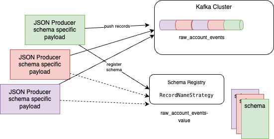
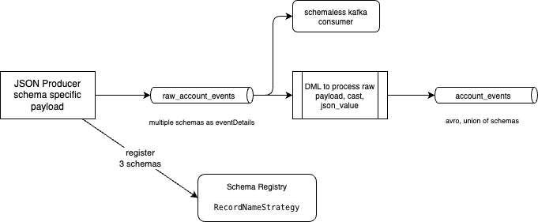
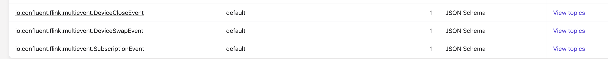
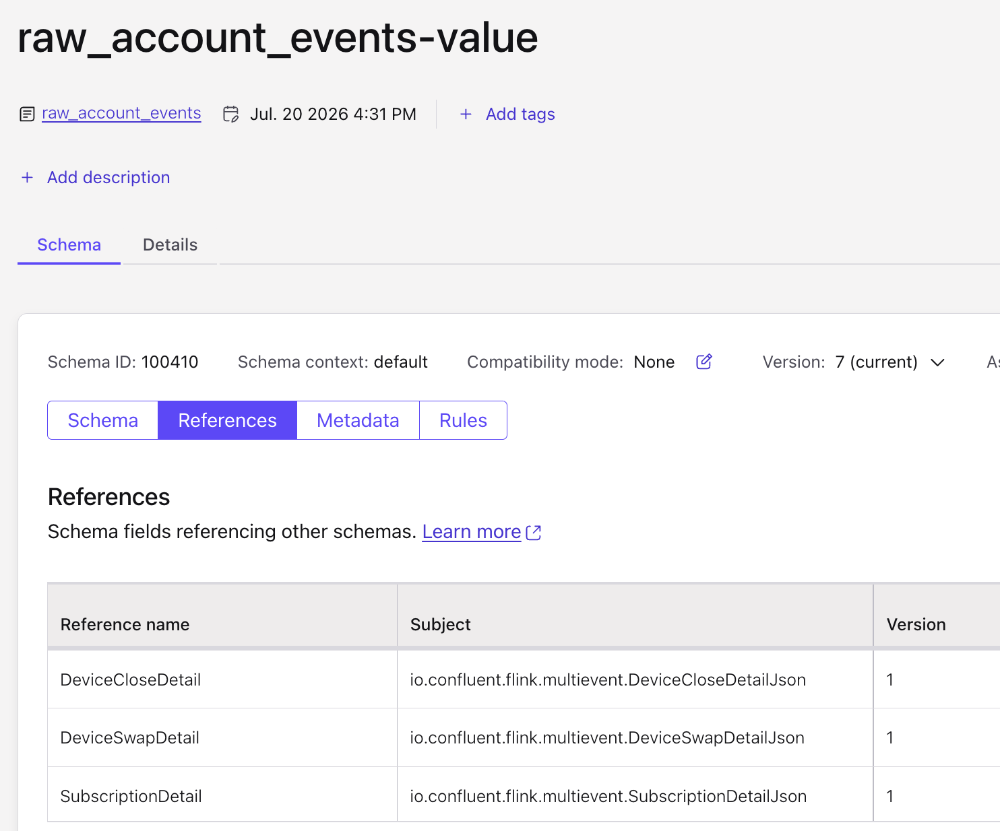
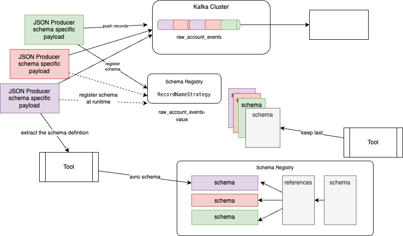
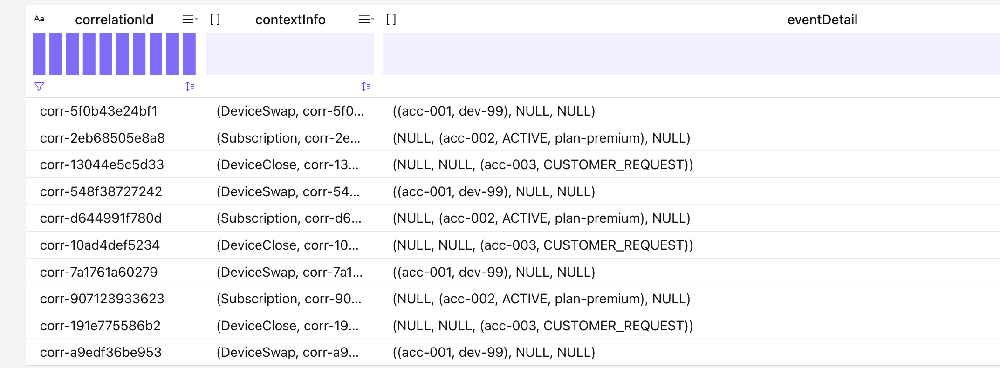

# Process multi-schema JSON into a multiple-event-types Avro sink

This demonstration is related to [07-1-multiple-event-types](../07-1-multiple-event-types/README.md) to support multiple schemas in the topic, but for the case where **several producers** register **incompatible JSON schemas** under the same TopicNameStrategy subject (`raw_account_events-value`) with compatibility set to **`NONE`**, and write Confluent wire-format payloads to one topic. Downstream code that ignores Schema Registry only sees opaque bytes.



The challenge is related to Confluent Cloud Flink, which loads the last version of the topic schema to build is table view. With current way of managing the schemas, a `select * from raw_account_events` in Flink SQL will fail when deserializing a record with the wrong schema.

The demonstration tries to rebuild this context and presents a way to be able to use Flink SQL to do a schema transformation from this raw topic.

1. Registers three event-type schemas as versions of one `{topic}-value` subject (compatibility NONE), by using producer code. This is the illustration of figure above.
2. Produces each type with a schema id (`use.schema.id`) so the wire prefix identifies the shape.
3. Optionally consumes those bytes while ignoring Schema Registry. Or load dynamically the schema using the magic bytes.
4. Define a last version schema that supports the union of each possible payload definitions. This is applying the same concepts as in [07-1-multiple-event-types/](../07-1-multiple-event-types/)
4. Uses Flink to get the records, transform it and writes the typed Avro-union sink

Domain: the same **account lifecycle** events as 07-1 (DeviceSwap, Subscription, DeviceClose).

## Approach



Three incompatible JSON schema **versions** on one TopicNameStrategy subject (wire format, pinned schema ids) → Flink normalizes to a sink topic with an Avro union of 3 branches.

| Demo | Source | Sink |
| --- | --- | --- |
| 07-1 | One Avro envelope + union at produce time | `account_events` Avro union |
| 07-2 | One subject, three incompatible JSON versions (`NONE`) + pin schema ids → Flink normalizes | Same `account_events` Avro union |

Without pinning schema ids, a TopicNameStrategy serializer would always use the **latest** version.

Do not run 07-1 and 07-2 at the same time: both use the sink topic `account_events`.

## Schema Registry (source)

Current constraints:

| Setting | Value |
| --- | --- |
| Subject (TopicNameStrategy) | `raw_account_events-value` |
| Compatibility | `NONE` (left at NONE for the demo) |
| Versions | Three incompatible envelopes (DeviceSwap / Subscription / DeviceClose) |
| Produce | `JSONSerializer` with `auto.register.schemas=false` and `use.schema.id=<id>` per type |

Schema `title` on each model (e.g. `io.confluent.flink.multievent.DeviceSwapEvent`) is for SR UI readability only — it is **not** the subject name.

Each message is still the same logical envelope JSON. The body looks like:

```json
{
  "contextInfo": {
    "eventName": "DeviceSwap",
    "correlationId": "corr-…",
    "sourceSystem": "billing-system"
  },
  "eventDetail": { "accountId": "acc-001", "deviceId": "dev-99" }
}
```

`eventDetail` fields vary by `eventName`:

| eventName | eventDetail fields |
| --- | --- |
| `DeviceSwap` | `accountId`, `deviceId` |
| `Subscription` | `accountId`, `status`, `planId` |
| `DeviceClose` | `accountId`, `reasonCode` |

## Sink schema

Topic: `account_events` — same Avro union envelope as 07-1 (`contextInfo` + `eventDetail` as a ROW of three named branches).

See [the DDL](./cc-flink/ddl.account_events.sql):

```sql
CREATE TABLE IF NOT EXISTS account_events (
    correlationId STRING,
    contextInfo ROW<
        eventName STRING,
        correlationId STRING,
        sourceSystem STRING
    >,
    eventDetail ROW<
        DeviceSwapDetail ROW<accountId STRING, deviceId STRING>,
        SubscriptionDetail ROW<accountId STRING, status STRING, planId STRING>,
        DeviceCloseDetail ROW<accountId STRING, reasonCode STRING>
    >,
    PRIMARY KEY (correlationId) NOT ENFORCED
) DISTRIBUTED BY (correlationId) INTO 1 BUCKETS
WITH (
    'changelog.mode' = 'append',
    'key.format' = 'avro-registry',
    'value.format' = 'avro-registry'
);
```

## Adding the same last version for the `raw_account_events-value` schema to include references to other schemas.

The principle is to define an envelop schema where the variable fields are any of existing schemas. The following demonstrates this structure:

```json
    "EventDetail": {
      "anyOf": [
        {
          "$ref": "DeviceSwapDetail"
        },
        {
          "$ref": "SubscriptionDetail"
        },
        {
          "$ref": "DeviceCloseDetail"
        }
      ],
      "title": "EventDetail"
    }
```

The 3 referenced schemas are uploaded separatly into the schema registry



And the references are built as references definitions:



### Managing the schemas

The current approach is to get the producers, at runtime, to upload new schema to the schema registry. This practices need to chanage, but as the impact is deep into the current code based, it is possible to adapt the development process with the following steps:

* Extract the producer schema definition as avro schema
* For each producer app publish the avro schema as independant element into the schema registry. This could be part of a git PR with a first simple tool. In this demonstration it will be a new version for: DeviceSwapDetail, SubscriptionDetail, EventDetail
* Update the references to reference the new version of the updated schema `raw_account_events-value`



* When the new producer will start, it may create a new version for the topic subject:  
* As running Flink statement uses the version of the `raw_account_events-value` schema they had when started, if all new producer's schema are FULL_TRANSITIVE and define default values to newly added fields, then those Flink statements can continue to run.
* In the case the changes are disruptive, then be sure to republish the envelop as last schema of `raw_account_events-value` by using a second simple tool to do so. New Flink deployment will use the last referenced schemas.

## Logic to transform

Now one of the flink transformation may be the [dml.raw_to_account_events.sql](./cc-flink/dml.raw_to_account_events.sql), which takes into account those union fields and do some transformation.

```sql
with parsed as(
  SELECT contextInfo,
        eventDetail.connect_union_field_0 as deviseSwap,
        eventDetail.connect_union_field_1 as subscription,
        eventDetail.connect_union_field_2 as deviceClose,
  FROM `raw_account_events`
)
SELECT
   contextInfo.correlationId as correlationId,
  eventDetail,
  ROW(
        contextInfo.eventName,
        contextInfo.correlationId,
        contextInfo.sourceSystem
    ) as contextInfo,
    CASE contextInfo.eventName
        WHEN 'DeviceSwap' THEN ROW(
            ROW(
                deviseSwap.accountId,
                deviseSwap.deviceId
            ),
            CAST(NULL AS ROW<accountId STRING, status STRING, planId STRING>),
            CAST(NULL AS ROW<accountId STRING, reasonCode STRING>)
        )
        WHEN 'Subscription' THEN ROW(
            CAST(NULL AS ROW<accountId STRING, deviceId STRING>),
            ROW(
                subscription.accountId,
                subscription.status,
                subscription.planId
            ),
            CAST(NULL AS ROW<accountId STRING, reasonCode STRING>)
        )
        WHEN 'DeviceClose' THEN ROW(
            CAST(NULL AS ROW<accountId STRING, deviceId STRING>),
            CAST(NULL AS ROW<accountId STRING, status STRING, planId STRING>),
            ROW(
                deviceClose.accountId,
                deviceClose.reasonCode
            )
        )
    END as ed
FROM parsed;
```

## Quick start (Confluent Cloud)

```sh
cd cc-flink
make sync
make deploy-ddl
make deploy-pipeline
```

If you already deployed an older pipeline that did not strip the wire prefix:

```sh
make undeploy-pipeline
make deploy-pipeline
```

## Produce multi-schema events

```sh
cd python
uv sync
source ../../set_env.sh
uv run producers/produce_raw_account_events.py
```

Sets compatibility `NONE` on `raw_account_events-value`, registers three schema versions, and produces wire-format values with a pinned schema id per type (`magic` + `schema_id` + UTF-8 JSON).

Expect a log like:

```text
Schema Registry subject: raw_account_events-value
Pinned schema ids (TopicNameStrategy + NONE):
  DeviceSwapEvent -> schema_id=...
  SubscriptionEvent -> schema_id=...
  DeviceCloseEvent -> schema_id=...
```

## Consume while ignoring Schema Registry

```sh
uv run consumers/consume_raw_account_events.py --from-beginning --max-messages 3
```

Prints key, embedded schema id (bytes 1–4), and `json.loads(value[5:])` — no Schema Registry client. Across the three event types you should see **different** `schema_id` values (one per registered version).

## Inspect (Flink)

```sql
SHOW CREATE TABLE raw_account_events;
SHOW CREATE TABLE account_events;

-- JSON body after Confluent wire prefix
SELECT SUBSTRING(CAST(`val` AS STRING), 6) AS payload
FROM raw_account_events
LIMIT 10;

-- Typed sink branches (same filters as 07-1)
SELECT
  contextInfo.eventName,
  eventDetail.DeviceSwapDetail.*
FROM account_events
WHERE eventDetail.DeviceSwapDetail IS NOT NULL;

SELECT
  contextInfo.eventName,
  eventDetail.SubscriptionDetail.*
FROM account_events
WHERE eventDetail.SubscriptionDetail IS NOT NULL;

SELECT
  contextInfo.eventName,
  eventDetail.DeviceCloseDetail.*
FROM account_events
WHERE eventDetail.DeviceCloseDetail IS NOT NULL;
```

Example sink contents:



## Undeploy

```sh
cd cc-flink
make undeploy-pipeline
make drop-tables
```

Clean Schema Registry subjects **and** the source Kafka topic (soft + permanent
subject delete so names can be reused):

```sh
cd ../python
source ../../set_env.sh
uv run cleanup_schema_registry.py
# also remove Flink sink topic + subjects:
uv run cleanup_schema_registry.py --include-sink
```

Default cleanup removes Kafka topic `raw_account_events`, subjects
`raw_account_events-value` / `raw_account_events-key`, and leftover RecordNameStrategy
subjects from earlier demo variants. Use `--dry-run` to preview, `--keep-topic` for
subjects only.
