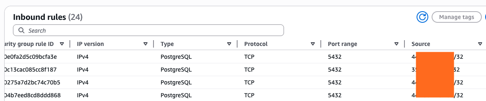

# Snapshot Query 

This is a simple demo of [snapshot query](https://docs.confluent.io/cloud/current/flink/how-to-guides/run-snapshot-query.html#flink-sql-run-snapshot-query)

## Create a Datagen connector

* In Connector UI add a connector, and in the Connector Plugins page, click Sample Data, select Users or Orders. It will create a topic name something like `sample_data_users`

    

* Use the Flink Query editor from the topic, and then select the Snapshot mode:
    

## Set the snapshot and the query

As an alternate the following query can be used:

```sql
SET 'sql.snapshot.mode' = 'now';
SELECT COUNT(*) as nb_records from sample_data_users;
```

# Search External Tables

There are few mecanisms [to search external tables](https://docs.confluent.io/cloud/current/ai/external-tables/key-search.htm):

* Key search for data enrichment: [KEY_SEARCH_AGG](https://docs.confluent.io/cloud/current/flink/reference/functions/model-inference-functions.html#key-search-agg). JDBC, couchbase, mongodb or REST api can be used for key search. The external table is defined as a table with specific provider. It is best used for Point lookups and simple predicates, for straightforward enrichment where equality semantics are fine.
* Text search 
* Vector search

Future UDF+Async I/O will be available and used for non-trivial matching logic (fuzzy, scoring, rule-based), or for complex request/response shaping. UDF may also be used for interactions with services that don’t map cleanly to a row lookup (e.g. LLMs, custom scoring APIs).

For any external call, it is very important to aggressively filter before lookup (reduce QPS before you fan out). 

## Lookup RDS table

* Create a RDS Postgresql Database on free tier, get the endpoint, username and password.
* Use the python code to create the users table
    ```sh
    source ../.venv/bin/activate
    uv add sycopg2-binary
    uv run python connect_rds.py
    ```
* In Confluent Cloud Console, go to your Environment → Kafka cluster (the one hosting the connector / Flink job / workload that will reach AWS). Open Cluster settings → Networking. Under “Egress IPs” / “Public egress IP addresses”, you’ll see a list of IP addresses; these are the source IPs your Confluent Cloud services use for outbound connections in that region. 
* In the security group, add the Confluent IP addresses as inbound source. One rule per ip address.



* Use SQL to create the connection
    ```sql
    create connection jdbc_postgres_connection WITH (
        'type' = 'confluent_jdbc',
        'endpoint' = 'jdbc:postgresql://j9r-pgdb.cnds....us-west-2.rds.amazonaws.com:5432/postgres',
        'username' = 'postgres',
        'password' = '....'
    )
    ```

* Create a Table with confluent-jdbc connector:
    ```sql
    CREATE TABLE users_pg (
        id BIGINT,
        name VARCHAR(100) NOT NULL,
        email VARCHAR(255),
        created_at TIMESTAMP,
        PRIMARY KEY(id) NOT ENFORCED
    ) WITH (
    'connector' = 'confluent-jdbc',
    'confluent-jdbc.connection' = 'jdbc_postgres_connection',
    'confluent-jdbc.table-name' = 'users'
    )
    ```

* Create a table to get user events to enrich with lookup table:
    ```sql
    create table user_events (
        user_id int,
        evt_type STRING
    )
    ```

    Add some records:

    ```sql
    insert into user_events (user_id, evt_type) 
    VALUES (1, 'create'), (2, 'create');
    ```

* Implement the lookup, as the user_events has no primary key and id may be null, better to coalesce it.
    ```sql
    select * from user_events,
         lateral table (KEY_SEARCH_AGG(`users_pg`, descriptor(id), coalesce(user_id,1)));
    ```

    The descriptor column and the search column type must match the user_events column to avoid deserialization error. It is possible to search on another attributes. 

    Things to keep in mind: the search result is an array that can be unnested, as it is possible to get multiple rows from remote table for the matching search column content. There for the approach is to unnest and use a CTE:
    
    ```sql
    with user_info as (
        select * from user_events, lateral table (KEY_SEARCH_AGG(`users_pg`, descriptor(id), coalesce(user_id,1)))
    )
    select user_id, evt_type, name, email 
    from user_info CROSS JOIN UNNEST(search_results) AS T(id, name, email, creation)
    ```


* The results will look like:

| user_id | evt_type | name | email |
| ------- | -------- | ---- | ----- |
|  1      | create   | Alice Johnson | alice@example.com |
|  2     | create   |   Bob Smith | bob@example.com | 
 
