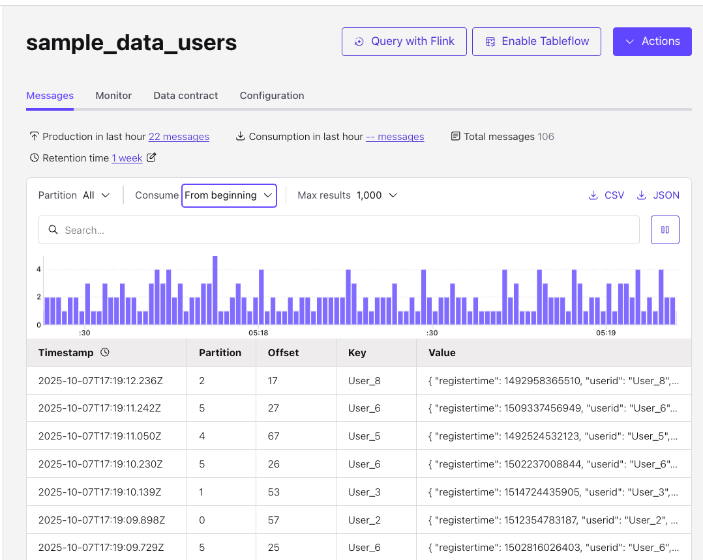
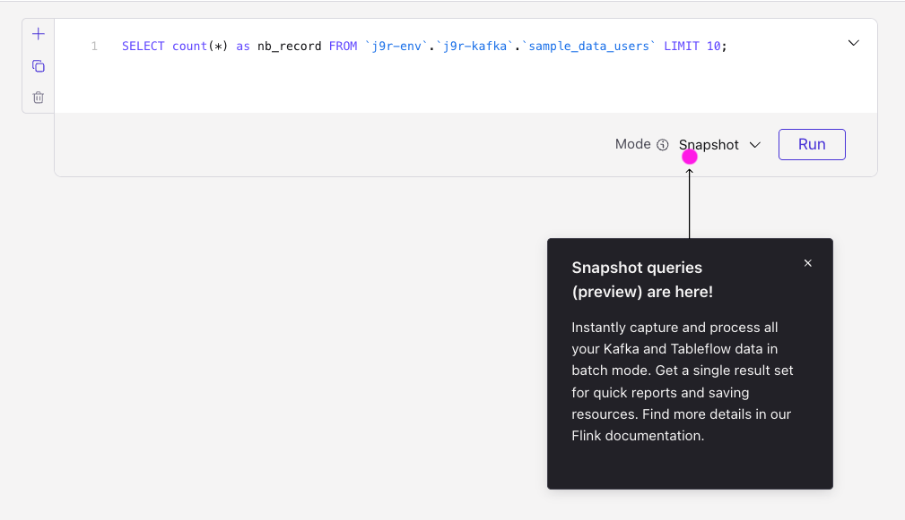

# This is a simple demo of [snapshot query](https://docs.confluent.io/cloud/current/flink/how-to-guides/run-snapshot-query.html#flink-sql-run-snapshot-query)

## Create a Datagen connector

* In Connector UI add a connector, and in the Connector Plugins page, click Sample Data, select Users or Orders. It will create a topic name something like `sample_data_users`

    

* Use the Flink Query editor from the topic, and then select the Snapshot mode:
    

## Set the snapshot and the query

As an alternate the following query can be used:

```sql
SET 'sql.snapshot.mode' = 'now';
SELECT COUNT(*) as nb_records from sample_data_users;
```