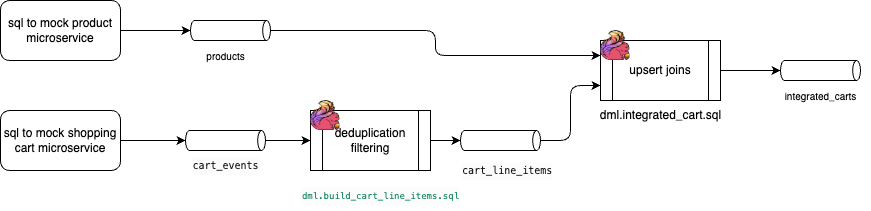
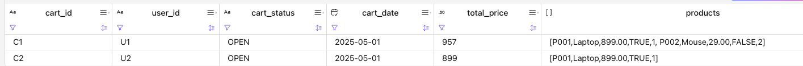
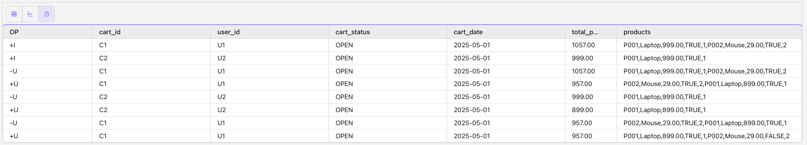

# Shopping cart updates from product update events

Confluent Cloud for Flink SQL demo: keep open shopping carts in state and re-emit enriched cart snapshots when the product catalog changes (price or availability). Implemented with pure SQL (upsert join + aggregation), no PTF required.

## Scenario

- A product service publishes catalog events (name, description, price, availability) to `products` (upsert).
- A cart service publishes add/remove events to `cart_events` (append).
- Flink dedupes events into `cart_line_items` (upsert, PK `cart_id` + `product_id`).
- A regular non-temporal join to `products` re-emits line items when the catalog changes.
- Open carts are rolled up into `integrated_cart` (upsert, PK `cart_id`) with a nested product array and `total_price`.
- Downstream consumers diff consecutive upserts to email users on price drops or show alerts on next visit.

## Architecture




Use a regular upsert join, not `FOR SYSTEM_TIME AS OF`. Temporal joins pin dimension values at cart event time and do not retroactively update when products change.

## Files

| File | Purpose |
|------|---------|
| `ddl.products.sql` | Product catalog (upsert). Mock product microservice|
| `ddl.cart_events.sql` | Raw cart add/remove events (append) - mock cart-events microservice|
| `ddl.cart_line_items.sql` | Normalized line items (upsert) |
| `ddl.integrated_cart.sql` | Enriched cart sink (upsert) |
| `dml.build_cart_line_items.sql` | Streaming dedup: `cart_events` → `cart_line_items` |
| `dml.integrated_cart.sql` | Streaming join + `ARRAY_AGG` + `SUM` → `integrated_cart` |
| `dml.insert_products.sql` | Seed catalog. Mock product microservice |
| `dml.insert_cart_events.sql` | Seed two open carts -  mock cart-events microservic |
| `dml.update_product_price.sql` | Price drop on P001 (fans out to C1 and C2) |
| `dml.update_product_availability.sql` | Availability change on P002 (fans out to C1) |

The two last SQLs are for demonstration.

## Prerequisites

- Confluent Cloud environment with Flink compute pool and Kafka cluster
- Flink API credentials and target env in `~/.confluent/.env` (or export variables below)

| Variable | Purpose |
|----------|---------|
| `FLINK_API_KEY`, `FLINK_API_SECRET` | Flink REST auth (or `CONFLUENT_CLOUD_API_KEY` / `SECRET`) |
| `ORGANIZATION_ID` | Confluent org |
| `ENVIRONMENT_ID` | Environment / `sql.current-catalog` (alias: `ENV_ID`) |
| `COMPUTE_POOL_ID` | Flink compute pool (alias: `CPOOLID`) |
| `DB_NAME` | Kafka cluster name / `sql.current-database` |
| `CLOUD`, `REGION` | e.g. `aws`, `us-west-2` (or set `FLINK_BASE_URL`) |

See also [05-changelog](../../05-changelog/README.md) for upsert join behavior and [03-nested-row/cc-array-agg](../../03-nested-row/cc-array-agg/) for `ARRAY_AGG(ROW(...))` patterns.

## Deploy (confluent-sql REST API)

Shared deploy tooling lives in [`../../tools/`](../../tools/). This folder supplies `deploy_manifest.json` and SQL files.

```sh
# Once: install tools deps
make sync

# Step-by-step (recommended)
make deploy-ddl
make deploy-pipeline
make deploy-data

# Or all groups in deploy_all (ddl + pipeline + data)
make deploy

# Product change scenario (after pipelines + seed data)
make deploy-scenario
```

## Undeploy

Full teardown stops running DML statements (pipeline, data, scenario), then drops tables in `drop_tables` order (sink first):

```sh
make undeploy

# Or step-by-step
make undeploy-pipeline
make drop-tables
```

Direct CLI (from `code/flink-sql/tools`):

```sh
uv run python -m cc_deploy.deploy_flink_statements --sql-dir ../11-puzzles/cart_update deploy --group ddl
uv run python -m cc_deploy.deploy_flink_statements --sql-dir ../11-puzzles/cart_update deploy --group pipeline
uv run python -m cc_deploy.deploy_flink_statements --sql-dir ../11-puzzles/cart_update deploy --group data
# or doing the 3 steps above in one shot
uv run python -m cc_deploy.deploy_flink_statements --sql-dir ../11-puzzles/cart_update undeploy --group all
```

## Verify

In the Flink workspace:

```sql
-- Line items after cart events
SELECT * FROM cart_line_items;

-- Enriched carts (C1: Laptop + 2x Mouse, total 1057.00; C2: Laptop, total 999.00)
SELECT cart_id, user_id, total_price, products FROM integrated_cart;
```


Trigger product fan-out:

```sh
make deploy-scenario
```

Or run `dml.update_product_price.sql` manually. Then:

```sql
SELECT cart_id, total_price, products FROM integrated_cart;
```

Expected after P001 price drop to 899.00:

| cart_id | total_price |
|---------|-------------|
| C1 | 957.00 (899 + 2×29) |
| C2 | 899.00 |



Or looking at the changelog level:



Run `dml.update_product_availability.sql` to set P002 unavailable; only C1 updates (contains P002).


## When PTF would be needed

This demo uses normalized line items and upsert join. Consider a [Process Table Function](../../../docs/coding/ptf.md) if:

- Cart events arrive as full snapshot arrays with custom merge rules
- You must emit only when price/availability delta (in-stream diff)
- Carts need idle/expiry timers

## Local Flink

These SQL files target Confluent Cloud table syntax (`DISTRIBUTED BY`, `changelog.mode`). For local Flink OSS, adapt connectors and remove CC-specific table properties.
