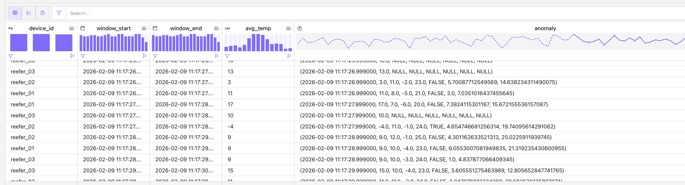

# A set of simple quick demonstrations of AI and Flink integration

## Anomaly detection

The use case is on Reefers temperature monitoring to assess potential cold chain issues. The goal is to provide real-time quality capabilities, primarily focusing on detecting and potentially correcting quality issues within the data being received.

* Start a data generation source for the Reefers, with 20 temperature telemetry per second, on 3 reefers, and temperature between -4 and 7 C. Use Confluent Cloud Workspace.

    ```sql
    create table reefer_telemetries (
        device_id STRING,
        temperature BIGINT,
        ts TIMESTAMP_LTZ(3),
        WATERMARK FOR ts AS ts - INTERVAL '2' SECONDS

    ) WITH (
        'connector' = 'faker',
        'rows-per-second' = '20',
        'fields.device_id.expression' = '#{Options.option ''reefer_01'', ''reefer_02'', ''reefer_03''}',
        'fields.temperature.expression' = '#{Number.numberBetween ''-4'', ''7''}'

    )
    ```

    [Recall Faker is based on DataFaker expression language](https://github.com/datafaker-net/datafaker).

* Add a view to create some burst at specific time interval, this is used to mock issue on the device. For every 30 seconds the temperature can burst + 20 C.
    ```sql
    create view reefer_telemetry_burst AS
    SELECT
     device_id,
     ts,
     CASE
        WHEN EXTRACT(SECOND FROM ts) % 30 BETWEEN 0 AND 5 THEN temperature + 20
        ELSE temperature
     END AS temp
    FROM reefer_telemetries
    ```

* Calculate analytics: Confluent Flink utilizes a built-in statistical model called the Autoregressive Integrated Moving Average - ARMA model to detect anomalies in data. The model can analyze a single variable over a period of time. Here we average temperature per 10 seconds It can also compute averages over multiple data points per second. 

    ```sql
    create table reefer_anomalies as
    with windowed_average as (
        select
            device_id,
            window_start,
            window_end,
            window_time,
            AVG(temp) as avg_temp
        from table(
            tumble( 
                table reefer_telemetry_burst,
                DESCRIPTOR(ts),
                INTERVAL '1' SECONDS
            )
        ) group by  device_id, window_start, window_end, window_time
    )
     select
        device_id,
        window_start,
        window_end,
        avg_temp,
        ML_DETECT_ANOMALIES(
            avg_temp,
            window_time,
            JSON_OBJECT(
                'confidencePercentage' VALUE 96.0,
                'minTrainingSize' VALUE 50,
                'enableStl' VALUE false
            )
            ) OVER (
                PARTITION BY device_id
                ORDER BY window_time
                RANGE BETWEEN UNBOUNDED PRECEDING AND CURRENT ROW
        ) AS anomaly
    from windowed_average
    ```

    The above query computes anomaly per device on the average temperature variable, so each device/variable is like having its own model, with a threashold of 4% of standard deviation. In classical ML implementation, we export all the data per device and do ML training on the telemetries of each device. Current ML_DETECT_ANOMALIES uses one variable.

    [See ML_DETECT_ANOMALIES() documentation](https://docs.confluent.io/cloud/current/ai/builtin-functions/detect-anomalies.html#ml-detect-anomalies). 

* See some result per device

    ```sql
     select * from reefer_anomalies where device_id = 'reefer_01'
    ```
    Seasonality can be built into the model's training to account for expected deviations, such as machines shutting down on weekends, so they are not flagged as anomalies.

    The result includes:

    * timestamp: local date time to this forecast
    * actual_value
    * forecast_value
    * lower_bound: for the confidence interval
    * upper_bound
    * is_anomaly: boolean reporting
    * rmse: Root Mean Square Error at the time the forecast. A lower RMSE indicates better model performance.
    * AIC (Akaike Information Criterion), is a statistical measure used to evaluate and compare the quality of different models

    

* Types of Quality Issues Detectable: The Confluent platform offers capabilities to detect:
    * **Stale Data:** A value remaining constant for an extended period because no new data is arriving.
    * **Outlier Detection:** Spikes in data, which can be done through fixed thresholds or the virtual model detecting unfamiliar patterns.
    * **Data Gap Filling/Interpolation:** Filling in missing data, which can be done with a static value (like zero) or by learning from past hours and extrapolating. This capability is expected in about two months.
    * **Data Drift:** Detecting small, gradual changes (e.g., a 5% increase over a day) that might not immediately trigger a fixed threshold alert.


* Clean tables:
    ```sql
    drop view `reefer_telemetry_burst`;
    drop table `reefer_telemetries`;
    drop table `reefer_anomalies`;
    ```