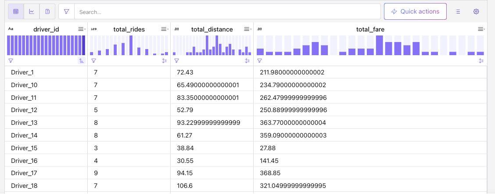
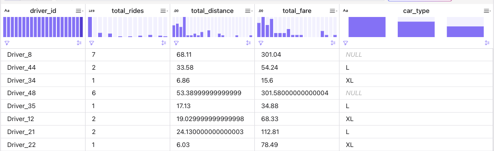

# Materialized Table Demonstration

Two presentations:


1. [Apache flink](#apache-flink)
1. [Confluent Cloud](#confluent-cloud-for-flink)

## Apache Flink

This is the implementation [of the Flink quickstart](https://nightlies.apache.org/flink/flink-docs-release-2.2/docs/dev/table/materialized-table/quickstart/) with local OSS Flink and some explanations not in the source documentations.

### Prepare the cluster:

* If not done before, run: `setup.sh`
* Start cluster and gateway
    ```sh
    export FLINK_HOME=$(pwd)/../../deployment/product-tar/flink-2.2.0
    export FLINK_CONF_DIR=$(pwd)
    $FLINK_HOME/bin/start-cluster.sh
    $FLINK_HOME/bin/sql-gateway.sh start
    ```
* See the config.yaml file for catalog store file reference, and workflow scheduler.

### Work with the SQL Client

* Start SQL client- Materialized Tables must be created through SQL Gateway
    ```sh
    $FLINK_HOME/bin/sql-client.sh gateway --endpoint http://127.0.0.1:8083
    ```

* Create the test-filesystem catalog:
    ```sql
    CREATE CATALOG mt_cat WITH (
        'type' = 'test-filesystem',
        'path' = '/Users/jerome/Documents/Code/flink-studies/code/flink-sql/13-materialized-table/flink-catalog',
        'default-database' = 'mydb'
    );
    ```
* Use the new catalog: `USE CATALOG mt_cat;`
* Create the Source table:
    ```sql
    CREATE TABLE json_source (
        order_id BIGINT,
        user_id BIGINT,
        user_name STRING,
        order_created_at STRING,
        payment_amount_cents BIGINT
    ) WITH (
        'format' = 'json',
        'source.monitor-interval' = '10s'
    );
    ```

    and insert

    ```sql
    INSERT INTO json_source VALUES 
        (1001, 1, 'user1', '2024-06-19', 10),
        (1002, 2, 'user2', '2024-06-19', 20),
        (1003, 3, 'user3', '2024-06-19', 30),
        (1004, 4, 'user4', '2024-06-19', 40),
        (1005, 1, 'user1', '2024-06-20', 10),
        (1006, 2, 'user2', '2024-06-20', 20),
        (1007, 3, 'user3', '2024-06-20', 30),
        (1008, 4, 'user4', '2024-06-20', 40);
    ```

    you should see in the [http://localhost:8081/#/job/completed](http://localhost:8081/#/job/completed) a new job for the insert. 

* Create a materialized table in CONTINUOUS mode with a data freshness of 30 seconds.
    ```sql
    CREATE MATERIALIZED TABLE continuous_users_shops
        PARTITIONED BY (ds)
    WITH (
        'format' = 'debezium-json',
        'sink.rolling-policy.rollover-interval' = '10s',
        'sink.rolling-policy.check-interval' = '10s'
    )
        FRESHNESS = INTERVAL '30' SECOND
    AS SELECT
        user_id,
        ds,
        SUM (payment_amount_cents) AS payed_buy_fee_sum,
        SUM (1) AS PV
    FROM (
        SELECT user_id, order_created_at AS ds, payment_amount_cents
            FROM json_source
        ) AS tmp
    GROUP BY user_id, ds;
    ```

    you should see a running job [http://localhost:8081/#/job/running](http://localhost:8081/#/job/running)

* Verify the table creation:
    ```sql
    show create materialized table continuous_users_shops;
    ```
* Query: `SELECT * FROM continuous_users_shops;`

* Demonstrate how to suspend a materialized table
    ```sql
    SET 'execution.checkpointing.savepoint-dir' = 'file:///Users/jerome/Documents/Code/flink-studies/code/flink-sql/13-materialized-table/savepoints';

    ALTER MATERIALIZED TABLE continuous_users_shops SUSPEND;
    ```

    The running job is no more visible in the user interface.

    ```sql
    ALTER MATERIALIZED TABLE continuous_users_shops RESUME;
    ```

    You will find that a new Flink streaming job for continuous refresh the materialized table is started and restored state from the specified savepoint path

### Change the table schema
* Alter the table:
    ```
    ALTER MATERIALIZED TABLE continuous_users_shops AS
    SELECT
       user_id,
        ds,
        SUM (payment_amount_cents) AS payed_buy_fee_sum,
        SUM (1) AS PV,
        AVG(payment_amount_cents) AS avg_payment -- add a new nullable column
     FROM (
        SELECT user_id, order_created_at AS ds, payment_amount_cents
            FROM json_source
        ) AS tmp
    GROUP BY user_id, ds;

    ```

    The existing refresh statment is finished, and a new one is running. In continuous mode, this may create duplicates.


### Reconnecting

* Reset the catalog: `USE CATALOG mt_cat;`
* Can verify database and tables:
    ```sql
    show tables;
    ```

### FULL mode

* Create table with full mode
    ```sql
    ```
* Refresh historical partition
    ```sql
    -- Manually refresh historical partition
    ALTER MATERIALIZED TABLE full_users_shops REFRESH PARTITION(ds='2024-06-20');
    ```

### Stoping all

```sh
$FLINK_HOME/bin/stop-cluster.sh 
$FLINK_HOME/bin/sql-gateway.sh stop
```


# Confluent Cloud for Flink

Be sure to have the following env variables set:
```sh
export KAFKA_BOOTSTRAP_SERVERS="pkc-......confluent.cloud:9092"
export KAFKA_SECURITY_PROTOCOL=SASL_SSL
export KAFKA_API_KEY=....
export KAFKA_API_SECRET=
export KAFKA_SASL_MECHANISM=PLAIN
export SCHEMA_REGISTRY_ENDPOINT=https://psrc-...confluent.cloud
export SCHEMA_REGISTRY_API_KEY=....
export SCHEMA_REGISTRY_API_SECRET=
```

* Create a `raw_rides` table to stream 200 records, to simulate CDC topics for getting records about a car shared services. 
    ```sh
    source set_env.sh  # set environment variables
    uv run python 13-materialized-table/rides_producer.py --count 50 --schema ride --interval 0.5
    ```

* Create materialized tables as `dim-rides` using the [cc/dml.dim-rides.sql](./cc/dml.dim-rides.sql)

* Query the resulting table:
    ```sql
    select * from `dim_rides`
    ```


    
* Add attribute to `rides` for car type, with default value to 'S': 
    ```sql
    uv run python 13-materialized-table/rides_producer.py --count 500 --schema ride2 --interval 0.5
    ```

    Records has new attribute, and the dim_rides is not more degraded, it is producing its aggregates again. The schema has a new version in the schema registry with the new car_type
    ```json
      "properties": {
            "car_type": {
            "default": "S",
            "enum": [
                "S",
                "L",
                "XL"
            ],
            "title": "Car Type",
            "type": "string"
            },
    ```

    The schema is backward compatible, and was created with additionalProperties set to false to register the schema as closed.

* Mofify the MT to add this attribute
    ```sql
    CREATE OR ALTER MATERIALIZED TABLE dim_rides (
        driver_id STRING NOT NULL,
        total_rides BIGINT,
        total_distance DOUBLE,
        total_fare DOUBLE,
        car_type STRING,
        PRIMARY KEY(driver_id) NOT ENFORCED
    )
        START_MODE = RESUME_OR_FROM_BEGINNING
        AS   SELECT
            coalesce(driver_id, 'Dummy') as driver_id,
            count(*) as total_rides,
            sum(distance) as total_distance,
            sum(fare) as total_fare,
            coalesce(car_type, 'S') as car_type
        FROM `raw_rides` group by driver_id, car_type;
    ```

    See the [cc/dml.alter_dim-rides.sql](./cc/dml.alter_dim-rides.sql) final sql.

    The following should display the new schema
    ```sh
    show create materialized table `dim_rides`
    ```

* Observe the aggregation results, they are computed from the last snapshot, so continued from when the MT was stopped. 

