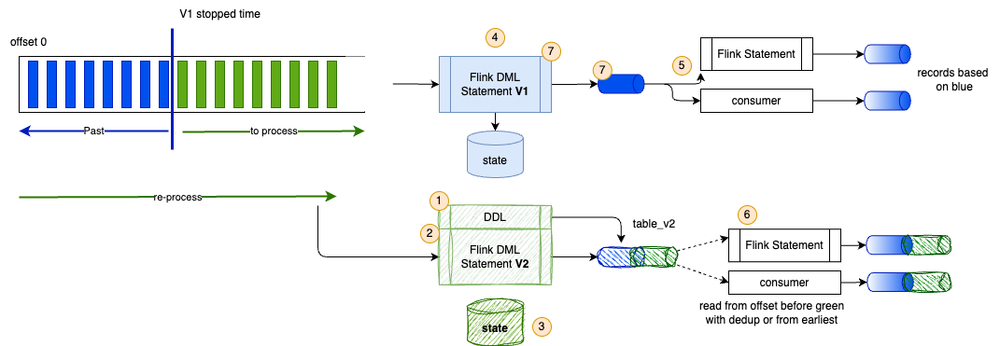

# Stateful Statement Evolution

In Flink SQL building stateful processing, updating business logic means creating a version 2 and getting duplicates from the consumers point of view.



To update business logic in Flink SQL without emitting duplicate historical records to downstream consumers, you can use three primary architectural patterns.

## Pattern 1: Post-Aggregation Emission Filter

This pattern allows Flink V2 to process raw input events from earliest-offset (rebuilding internal managed state like rocksdb/heap), while suppressing downstream sink emissions for all historical records processed prior to your cutover timestamp.

* V2 consumes from scan.startup.mode = 'earliest-offset' on the original input Kafka topic.
* Flink’s stateful operators process every historical event and accumulate internal state.
* A wrapper query filters out emissions where the record timestamp is earlier than $T_{\text{cutover}}$. Flink updates state internally, but the Sink receives zero records for events prior to $T_{\text{cutover}}$.

```sql
-- Step 1: Define V2 Source starting from earliest offset
CREATE TABLE source_v2 (
    user_id STRING,
    amount DECIMAL(10, 2),
    event_time TIMESTAMP(3),
    WATERMARK FOR event_time AS event_time - INTERVAL '5' SECOND
) WITH (
    'scan.startup.mode' = 'earliest-offset',
    'format' = 'json-registry'
);

-- Step 2: Stateful query with downstream emission gate
INSERT INTO sink_v2_kafka
SELECT user_id, total_amount, last_event_time
FROM (
    SELECT 
        user_id,
        SUM(amount) AS total_amount,
        MAX(event_time) AS last_event_time
    FROM source_v2
    GROUP BY user_id
)
-- Gates emission: State updates continuously, but records prior to cutover are suppressed
WHERE last_event_time >= TIMESTAMP '2026-09-25 12:00:00';
```

*When to use:* Raw input history fits within reasonable replay times; pure SQL solution.

## Pattern 2: State Bootstrapping via Compacted V1 Topic + Timestamp Alignmen

If your raw topic is massive and replaying full history is too slow or costly, treat V1's output topic as a state snapshot table and combine it with a point-in-time stream start for V2.

* V1 writes its final output to an upsert-kafka topic (which retains the latest state per primary key).
* V2 creates a table mapped to the V1 topic (upsert-kafka) to act as the baseline state.
* V2 configures the raw input topic with 'scan.startup.mode' = 'timestamp' set to $T_{\text{cutover}}$.V2 performs a LEFT JOIN or COALESCE between the baseline snapshot and live incoming records starting from $T_{\text{cutover}}$.

```sql
-- Baseline state snapshot from V1 output topic
CREATE TABLE v1_state_snapshot (
    user_id STRING,
    v1_accumulated_score BIGINT,
    PRIMARY KEY (user_id) NOT ENFORCED
) WITH (
    'connector' = 'upsert-kafka',
    'topic' = 'v1-output-compacted',
    'properties.bootstrap.servers' = 'kafka:9092',
    'key.format' = 'json',
    'value.format' = 'json'
);

-- V2 Source pinned to start precisely at cutover timestamp
CREATE TABLE source_v2_live (
    user_id STRING,
    score_delta INT,
    event_time TIMESTAMP(3),
    WATERMARK FOR event_time AS event_time - INTERVAL '5' SECOND
) WITH (
    'scan.startup.mode' = 'timestamp',
    'scan.startup.timestamp-millis' = '1758801600000', -- Exact Cutover Epoch MS
    'format' = 'json.registry'
);

-- Calculate new state starting from V1 baseline
INSERT INTO sink_v2_kafka
SELECT 
    l.user_id,
    COALESCE(s.v1_accumulated_score, 0) + SUM(l.score_delta) AS updated_score
FROM source_v2_live l
LEFT JOIN v1_state_snapshot FOR SYSTEM-TIME AS OF l.event_time AS s
    ON l.user_id = s.user_id
GROUP BY l.user_id, s.v1_accumulated_score;
```


*When to use:* High-throughput inputs where replaying full history is impossible/too slow.

## Pattern 3: Upsert Semantics with Primary Keys (upsert-kafka)

If downstream consumers support key-based updates (e.g., PostgreSQL, Redis, Elasticsearch, or Kafka consumers reading changelogs via upsert-kafka), you can enforce idempotent overwrites rather than append-only events.

When downstream consumers see old records during V2 backfilling, standard append sinks emit duplicate INSERT events. By switching the V2 sink definition to upsert-kafka with an explicitly defined PRIMARY KEY, Flink emits UPDATE_AFTER or key-level upserts. Downstream consumers overwrite existing keys in place rather than creating duplicate records.

*When to use:*  Downstream consumers are key-value stores or changelog-aware consumers