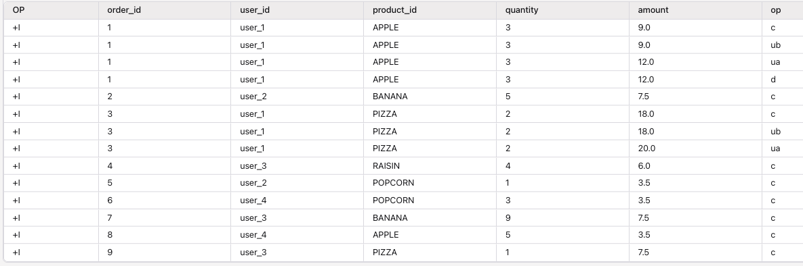
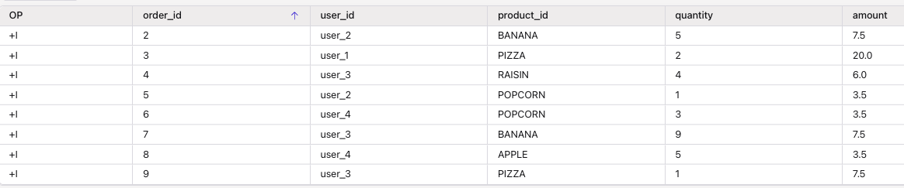
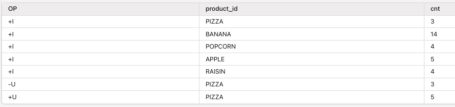
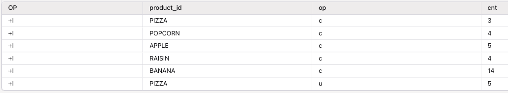

# 16 — Changelog Conversion: FROM_CHANGELOG and TO_CHANGELOG

> Demonstrate how to bridge custom CDC op-code streams into Flink and back out again using the built-in `FROM_CHANGELOG` and `TO_CHANGELOG` Process Table Functions (PTFs).

## Background

A *changelog* is a stream of row-level changes where each record states whether a row was
created, updated, or deleted. Tools like Debezium produce changelogs that Confluent Cloud
Flink understands natively. Many other systems — DynamoDB Streams, homegrown event envelopes,
microservice lifecycle topics — encode the change operation in their own field (e.g. `op = c`
for create, `op = d` for delete). Flink doesn't recognise those fields on its own.

`FROM_CHANGELOG` and `TO_CHANGELOG` bridge that gap:

| PTF | Direction | What it does |
|---|---|---|
| `FROM_CHANGELOG` | **Inbound** | Reads an append-only stream carrying a user-defined op field and converts it into a Flink updating table by mapping each op code to a Flink row kind (`+I`, `-U`, `+U`, `-D`). |
| `TO_CHANGELOG` | **Outbound** | Converts a Flink updating table back into a plain append stream where every row (including deletes) carries an explicit op code a non-Flink consumer can act on. |

> These are **not** the `changelog.mode` table property.  `changelog.mode` controls how Flink
> serialises a table to Kafka.  `FROM_CHANGELOG` / `TO_CHANGELOG` translate between a
> *user-owned* op field and *Flink's internal* row kinds at query time.

Reference documentation:

- [Changelog Conversion functions](https://docs.confluent.io/cloud/current/flink/reference/functions/changelog-conversion.html)
- [Read and Write Custom Changelog Formats](https://docs.confluent.io/cloud/current/flink/how-to-guides/read-write-custom-changelog.html)

Contrast with [`05-changelog/`](../05-changelog/README.md) which demonstrates `changelog.mode`
table properties (append / retract / upsert) without custom op fields.

---

## Demo architecture

* Raw orders has the following records (OP column is the row kind in Flink, while `op` column is the CDC custom values to support):
    

    with the following characteristics
    ```
    d16_raw_orders
      append-only, op STRING field
      op codes: 'c' 'ub' 'ua' 'd'
    ```

* Transform to upsert - compacted d16_orders table using: 
    ```sql
      FROM_CHANGELOG
        PARTITION BY order_id
        op_mapping: c→INSERT, ub→UPDATE_BEFORE, ua→UPDATE_AFTER, d→DELETE
    ```

    

* Perform aggregation to a fact tables with product_id as key
  ```sql
  insert into d16_order_count
  SELECT product_id, SUM(*) AS cnt
  FROM d16_orders
  GROUP BY product_id;
  ```

  See [cc-flink/dml.order_count.sql](./cc-flink/dml.order_count.sql)

  

* Finalize to an append using TO_CHANGELOG
    ```sql
        TO_CHANGELOG
          PARTITION BY order_id
          op_mapping: INSERT→'c', UPDATE_AFTER→'u', DELETE→'d'
    ```

* Here is an example of outcome with the row kind
    

The result is appended to d16_fct_product_usage (append-only topic).  Every row there — including a delete — is a fully serialised Kafka record with a non-null value and an explicit 'op' field.  This is different from a Kafka tombstone (null value); use it when the consumer cannot handle tombstones.

---

## Tables

| Table | File | Mode | Purpose |
|---|---|---|---|
| `d16_raw_orders` | `ddl.raw_orders.sql` | append | Inbound custom CDC stream. Carries `op STRING` with user-defined codes. |
| `d16_orders` | `ddl.orders.sql` | upsert | Materialised Flink updating table. PK `order_id`. Written by `FROM_CHANGELOG`. |
| `d16_order_count` | `ddl.order_count.sql` | append | Outbound custom changelog. Carries `op STRING` stamped by `TO_CHANGELOG`. |
| `d16_fct_product_usage` | `ddl.order_count.sql` | append | Outbound custom changelog. Carries `op STRING` stamped by `TO_CHANGELOG`. |

---

## Op code convention

The seed data and pipelines use the same op codes as the Confluent how-to guide:

| Code | Meaning | Maps to Flink row kind |
|---|---|---|
| `c` | create | `INSERT` (`+I`) |
| `ub` | update-before | `UPDATE_BEFORE` (`-U`) |
| `ua` | update-after | `UPDATE_AFTER` (`+U`) |
| `d` | delete | `DELETE` (`-D`) |

`TO_CHANGELOG` uses a simpler outbound mapping (no before-image):

| Flink row kind | Outbound op code |
|---|---|
| `INSERT` | `c` |
| `UPDATE_AFTER` | `u` |
| `DELETE` | `d` |

---

## Prerequisites

- Confluent Cloud account with a Flink compute pool
- Schema Registry enabled on the environment
- The following environment variables set (e.g. in `~/.confluent/.env`):

| Variable | Purpose |
|---|---|
| `FLINK_API_KEY`, `FLINK_API_SECRET` | Flink REST API credentials (or `CONFLUENT_CLOUD_API_KEY` / `SECRET`) |
| `ORGANIZATION_ID` | Confluent organisation ID |
| `ENVIRONMENT_ID` | Confluent environment ID (alias: `ENV_ID`) |
| `COMPUTE_POOL_ID` | Flink compute pool ID (alias: `CPOOLID`) |
| `DB_NAME` | Kafka cluster name used as the Flink database |
| `CLOUD` | Cloud provider, e.g. `aws` |
| `REGION` | Region, e.g. `us-west-2` |

---

## How to run

### 1. Install tool dependencies (once)

```sh
make sync
```

### 2. Create the Kafka topics and Flink tables

```sh
make deploy-ddl
```

Creates three tables in order: `d16_raw_orders` → `d16_orders` → `d16_orders_out`.

### 3. Seed the source topic

```sh
make deploy-data
```

Inserts 10 rows into `d16_raw_orders` covering a full order lifecycle:
- `order_id = 1`: create (`c`) → update-before (`ub`) → update-after (`ua`) → delete (`d`)
- `order_id = 3`: create → price correction pair (`ub`/`ua`)
- `order_id = 2, 4, 5`: plain creates (`c`)

**What to observe in `d16_raw_orders` topic:** 10 append records, each with a non-null `op`
field. Flink sees them all as plain inserts — the `op` field is just a data column at this point.

### 4. Start the pipelines

```sh
make deploy-pipeline
```

This starts two background Flink statements in order:

**`d16-pipeline-from-changelog`** — reads `d16_raw_orders` through `FROM_CHANGELOG`:
```sql
INSERT INTO d16_orders
SELECT order_id, user_id, product_id, quantity, amount
FROM FROM_CHANGELOG(
    input      => TABLE d16_raw_orders PARTITION BY order_id,
    op         => DESCRIPTOR(op),
    op_mapping => MAP['c','INSERT', 'ub','UPDATE_BEFORE', 'ua','UPDATE_AFTER', 'd','DELETE']
);
```

**`d16-pipeline-to-changelog`** — converts `d16_orders` back through `TO_CHANGELOG`:
```sql
INSERT INTO d16_orders_out
SELECT * FROM TO_CHANGELOG(
    input      => TABLE d16_orders PARTITION BY order_id,
    op         => DESCRIPTOR(op),
    op_mapping => MAP['INSERT','c', 'UPDATE_AFTER','u', 'DELETE','d']
);
```

---

## What to observe

### `d16_orders` topic (upsert / compacted)

- `order_id = 1` first arrives as a regular record (create), is then updated (the compacted
  topic shows the final value), and finally appears as a **tombstone** (null value record) —
  because `d16_orders` is an upsert table and Flink writes a real Kafka tombstone on `DELETE`.
- `order_id = 3` shows the price-corrected amount (`20.00`); the intermediate `18.00` value
  may have been coalesced within a checkpoint.
- `order_id = 2, 4, 5` each appear as a single record with their create values.

In Flink SQL:
```sql
SELECT * FROM d16_orders;
-- order_id = 1 is gone (deleted), remaining orders show final values.
```

### `d16_orders_out` topic (append)

- Every change is a **fully serialised Kafka record with a non-null value** — including
  deletes. A delete for `order_id = 1` arrives as `+I[1, user_1, APPLE, 'd']`, not a
  tombstone. This is the key difference from upsert tables: `TO_CHANGELOG` is for consumers
  that can't handle Kafka tombstones.
- The `op` column carries `'c'`, `'u'`, or `'d'` — ready for any microservice or
  Connect sink to process without understanding Flink internals.

---

## Teardown

```sh
make undeploy      # stops the two pipeline Flink statements
make drop-tables   # drops d16_orders_out, d16_orders, d16_raw_orders (in that order)
```

---

## Known limitations

1. **1:1 record mapping** — `FROM_CHANGELOG` maps each input record to exactly one row kind.
   A single message cannot be split into a `UPDATE_BEFORE` / `UPDATE_AFTER` pair. This is why
   systems like DynamoDB (which carry both old and new images in a single `MODIFY` event) must
   map `MODIFY` → `UPDATE_AFTER` only, producing an upsert stream instead of a retract stream.

2. **Upsert output foreground SELECT limitation** — If `FROM_CHANGELOG`'s `op_mapping`
   contains no `UPDATE_BEFORE` (upsert mode), the result **cannot** be read by a foreground
   `SELECT` directly. Always materialise via `INSERT INTO` first, then query the sink table.
   This demo avoids the issue by mapping all four row kinds (retract mode).

3. **`FROM_CHANGELOG` is an advanced feature** — Flink does not validate that the incoming
   stream is a correct changelog. An incorrect mapping can produce silently wrong downstream
   results. Ensure: every update/delete refers to a key you've already inserted; all op codes
   are mapped; events for the same key are in order; the key is unique per row.

---

## Advanced: DynamoDB Streams

The Confluent how-to guide includes a worked example for ingesting Amazon DynamoDB Streams
(a non-Debezium CDC format with nested `NewImage` / `OldImage` typed attributes). The pattern
is identical — define a `dynamodb_cdc` append table with a `ROW<...>` column and computed
column projections, then call `FROM_CHANGELOG` with `MODIFY → UPDATE_AFTER`. See:
[Example: convert Amazon DynamoDB Streams change data](https://docs.confluent.io/cloud/current/flink/how-to-guides/read-write-custom-changelog.html#flink-read-write-changelog-dynamodb-example)
