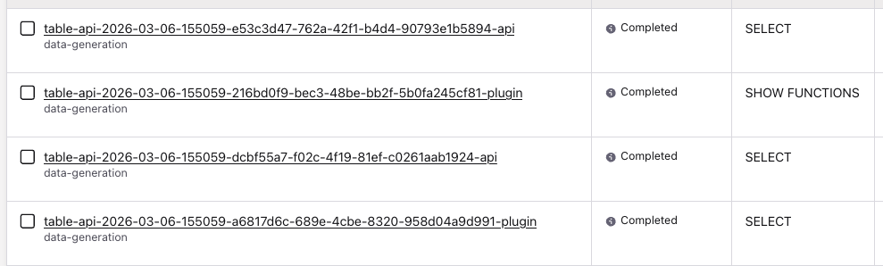
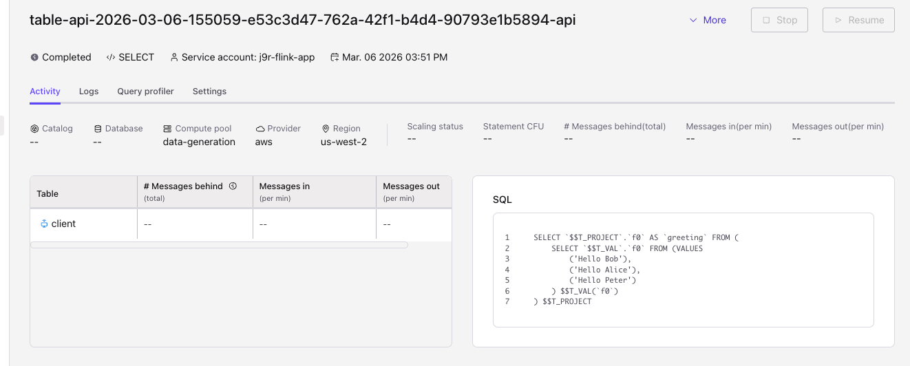

# Set of Examples to run Flink Table API

## For Confluent Cloud

1. Set environment variables to the confluent environment, compute pool...
    My current approach is to have a unique .env file under $HOME/.confluent/.env, which can be used by python code, and library like dotenv. 
    
    The local shell transforms those to shell environment variables that can be used by Confluent Cloud Table Api connector.

    ```sh
    source set_confluent_env
    ```
1. See a set of examples in [ccf-table-api](./ccf-table-api/). 

    * For example to execute the Example_00_HelloWorld.java do:

    ```sh
    mvn clean package
    # Then run
    java -jar target/flink-table-api-java-examples-1.0.jar 
    ```

    You should get a local trace like:

    ```sh
    Running with printing...
    +----+--------------------------------+
    | op |                             f0 |
    +----+--------------------------------+
    | +I |                   Hello world! |
    +----+--------------------------------+
    1 row in set
    Running with collecting...
    Greeting: Hello Bob
    Greeting: Hello Alice
    Greeting: Hello Peter
    ```

    * Within Confluent Cloud Flink statment list, some statements were executed:
    

    * and the translated SQL:
    

    * To run any other example, you need to change the pom.xml:
    ```xml
    <mainClass>io.confluent.flink.examples.table.Example_01_CatalogsAndDatabases</mainClass>
    <mainClass>io.confluent.flink.examples.table.Example_02_UnboundedTables</mainClass>
    <mainClass>io.confluent.flink.examples.table.Example_03_TransformingTables</mainClass>
    <mainClass>io.confluent.flink.examples.table.Example_04_CreatingTables</mainClass>
    <mainClass>io.confluent.flink.examples.table.Example_05_TablePipelines</mainClass>
    <mainClass>io.confluent.flink.examples.table.Example_06_ValuesAndDataTypes</mainClass>
    <mainClass>io.confluent.flink.examples.table.Example_07_Changelogs</mainClass>
    <mainClass>io.confluent.flink.examples.table.Example_08_IntegrationAndDeployment</mainClass>
    ```

    OR specify the class to run:
    ```sh
     java -cp target/flink-table-api-java-examples-1.0.jar  fio.confluent.flink.examples.table.Example_04_CreatingTables
    ```


See also [code template](./ccf-table-api/src/main/java/io/confluent/flink/examples/table/TableProgramTemplate.java)

## For Apache Flink

### First Program

The first example is documented in the [simplest-table-api-for-flink-oss](./simplest-table-api-for-flink-oss/README.md)


### Using Jshell

Using the [Java Shell](https://dev.java/learn/jshell-tool/), we can write Table API Java code to interact with Flink directly:

```sh
jshell --class-path ./target/table-api-1.0.0.jar  --startup ./jshell-init.jsh
```

The TableEnvironment is pre-initialized from environment variables and accessible by using `env`:

```java
env.useCatalog("examples");
env.executeSql("SHOW DATABASES").print();
```

Recall the commands of `/help` and `/exit` for JShell.

### Processing CSV Files