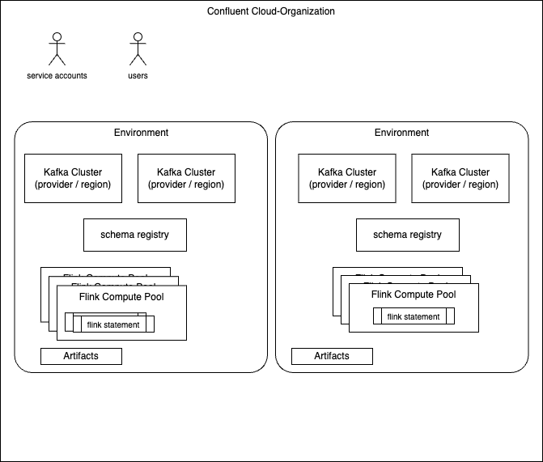

# Flink RBAC study — FlinkDeveloper service account

This is a simple demonstration of the role binding for CC Flink resources accesses. The following diagram illustrates what may be built:



The Terraform module is for a **GCP** Confluent Cloud. It defines environment, **Standard** Kafka cluster, Flink compute pool, and a **FlinkDeveloper** service account with least-privilege Kafka bindings (`DeveloperRead` / `DeveloperWrite` on topics and Flink transactional IDs). 

The demonstration includes a shell example that deploys a Flink SQL statement via the REST API.

## FAQs

The following frequently asked questions this demonstration addresses are:

* How environments are related to organisation, kafka cluster and flink comptue pool?
  * Organization is the billing entity and container for users, service accounts, API keys and secrets and cloud environments. When registering to CC, one org is created with the user who creatd it. Other users are invited to the organization.
  * Environments defines governance architecture, may have multiple kafka clusters, schema registry, flink compute pools, network configurations. 
  * Environments may be isolated for different deployment scope like dev, staging or production.
  * Compute pools groups resources for running Flink statements, which may scale down to zero. Flink is a regional service, compute pools are defined per cloud provider/region
  * 
* how to have compute pools setup?  per team or a single compute pool?
  * Compute pool is just a container to enable running flink statements with fault tolerance and auto scaling, within a region of a cloud provider. It defines a set of maximun physical resources to run Flink jobs. [See ](./infrastructure.tf)
    ```json
    resource "confluent_flink_compute_pool" "pool" {
      count        = var.create_flink_compute_pool ? 1 : 0
      display_name = local.flink_compute_pool_display_name
      cloud        = upper(data.confluent_flink_region.flink_region.cloud)
      region       = data.confluent_flink_region.flink_region.region
      max_cfu      = var.flink_max_cfu

      environment {
        id = local.env_id
      }
    }
    ```
  * Compute pool must be in the same cloud provider and region as the Kafka clusters with the data you want to process.
  * The resources provided by a compute pool are shared among all statements that use them. This is one way to support multi tenancy for line of business.
  * When default compute pools are enabled, all users can use Flink.
  * Compute pool can be created by FlinkAdmin
  * FlinkDeveloper role can be granted at the organization level or at the environment level. You can also grant it at the compute-pool level to restrict a user’s access to specific pools only.
    ```json
    resource "confluent_role_binding" "flink-developer-compute-pool-example-rb" {
          principal   = "User:${confluent_service_account.flink_developer.id}"
          role_name   = "FlinkDeveloper"
          crn_pattern =  "crn://confluent.cloud/organization=${local.org_id}/environment=${local.env_id}/flink-region=${confluent_flink_compute_pool.cloud}.${confluent_flink_compute_pool.region}/compute-pool=${confluent_flink_compute_pool.j9r_pool.id}"
    }
    ```
  * Line of business may use multiple compute pools so it is not just one compute pool for a team. 
  * If a statement needs more resources it will scale up in the constrained resources as defined by a compute pool. In some case a compute pool may be dedicated to one statement to let it use all available resources. 
  * Flink statements may query data in a different environment, as long as it’s in the same region.  It then supports, cross-cluster, cross-environment queries while providing low latency.

* how to give access to workspaces per team?
  * Workspace is one place to edit and test Flink SQL statements. It is linked to a compute pool. Access control is per compute pool
  * Workspaces are not mandatory, as Developers may also deploy Flink statements via CLI or REST API.

* How to control Flink statement deployment and execution?
  * Service account can be used for deployment of resources or flink statements. It will be used as principal id for Flink statement deployment. Roles need to be granted to this service account, as well as api keys

## What it creates

| Resource | Default | Purpose |
| -------- | ------- | ------- |
| `confluent_environment.env` | `create_environment = false` | Confluent Cloud environment can be reused from another terraform|
| `confluent_kafka_cluster.kafka` | `create_kafka_cluster = true` | **Standard** Kafka cluster (required for topic-level RBAC) |
| `confluent_flink_compute_pool.pool` | `create_flink_compute_pool = true` | Flink compute pool |
| `confluent_service_account.flink_developer` | always | Principal that runs Flink statements |
| `confluent_role_binding.flink_developer` | always | `FlinkDeveloper` on the environment |
| `confluent_role_binding.flink_developer_topic_*` | Standard Kafka | `DeveloperRead` / `DeveloperWrite` / `DeveloperManage` on `topic=*` |
| `confluent_role_binding.flink_developer_txn_*` | Standard Kafka | `DeveloperRead` / `DeveloperWrite` on `transactional-id=_confluent-flink_*` |
| `confluent_role_binding.flink_developer_sr_*` | Standard Kafka + SR | `DeveloperRead` / `DeveloperWrite` on `subject=*` (Avro CREATE TABLE) |
| `confluent_api_key.flink_developer` | always | Flink-scoped API key (statements + RBAC negative tests) |

* No `CloudClusterAdmin`, `EnvironmentAdmin`, or `OrganizationAdmin` roles are granted to the FlinkDeveloper service account.
* For `CREATE TABLE` with `avro-registry`, the module grants `DeveloperManage` on Kafka topics plus Schema Registry `DeveloperRead` / `DeveloperWrite` on subjects (defaults: wildcard `*`).
* `terraform apply` still requires an org-admin **Cloud API key** in the environment (`CONFLUENT_CLOUD_API_KEY` / `CONFLUENT_CLOUD_API_SECRET`) to provision resources. That is operator credentials, not a role on the Flink SA.
* Tighten `kafka_topic_pattern` and `schema_registry_subject_pattern` in `terraform.tfvars` for production least privilege.

## Prerequisites

- Confluent Cloud API credentials with **OrganizationAdmin**, via environment variables:
  ```bash
  export CONFLUENT_CLOUD_API_KEY="<org-admin-key>"
  export CONFLUENT_CLOUD_API_SECRET="<org-admin-secret>"
  ```
- Terraform >= 1.3

If `terraform plan` fails on Schema Registry provider attributes, you likely have partial `SCHEMA_REGISTRY_*` variables in your shell. This module sets all four SR provider fields to empty by default to avoid that.

## Apply

```bash
export CONFLUENT_CLOUD_API_KEY="<org-admin-key>"
export CONFLUENT_CLOUD_API_SECRET="<org-admin-secret>"

cd deployment/cc-flink-rbac
cp terraform.tfvars.example terraform.tfvars
# modify the tfvars file
terraform init
terraform plan
terraform apply
```

**Existing environment** (Standard Kafka + pool only):

```sh
create_environment        = false
environment_id            = "env-xxxxx"
environment_display_name  = "j9r-env"   # sql.current-catalog; use the UI name, not {prefix}-env
create_kafka_cluster      = true
create_flink_compute_pool = true
kafka_cluster_tier        = "standard"
```

* `prefix` only names **new** resources created by this module (e.g. `j9rgcp-kafka`). It does not rename an existing environment. Set `environment_display_name` to the catalog name shown in Confluent Cloud (often different from `prefix`).
* If you previously applied a **Basic** cluster, switching to Standard forces cluster replacement. Remove the old Basic cluster from state or run `terraform apply` and accept the replace.

## Deploy a Flink statement via REST API

After `terraform apply` is succesful:

```bash
chmod +x examples/deploy_statement.sh
./examples/deploy_statement.sh
```

Default statement: `CREATE TABLE gcp_demo` from `examples/ddl.gcp_demo.sql`.

Custom SQL file or inline SQL:

```bash
SQL_FILE=examples/ddl.gcp_demo.sql STATEMENT_NAME=rbac-gcp-demo ./examples/deploy_statement.sh
STATEMENT_NAME=select-1 SQL='SELECT 1;' ./examples/deploy_statement.sh
```

## RBAC negative test (compute pool)

`FlinkDeveloper` can deploy statements but cannot create compute pools (`FlinkAdmin` required). After `terraform apply`:

```bash
chmod +x examples/create_compute_pool_denied.sh
./examples/create_compute_pool_denied.sh
```

Uses the same **Flink-scoped API key** as `deploy_statement.sh` against `POST https://api.confluent.cloud/fcpm/v2/compute-pools`. Confluent documents that endpoint with a Cloud API key; with the FlinkDeveloper's Flink key you should still get a failure (typically **401** or **403**). Exit code **0** means denial worked. Exit code **1** means a pool was created unexpectedly.

## Related

- AWS base infrastructure: [deployment/cc-terraform](../cc-terraform/)
- Python Confluent Cloud REST API client: `code/flink-sql/tools/cc_deploy/cc_flink_rest_client.py`
