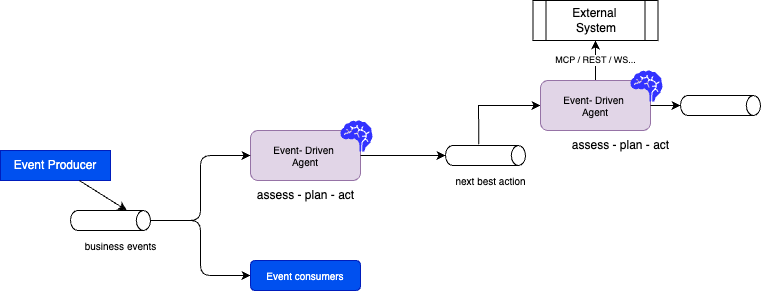

# Agentic Applications Cross Systems

???- "Version"
    Create 07/2025
    Update - 02/09/26

AI agentic applications, at scale will not only be triggered by users, but by **systems** using asynchronous events. It is assumed that AI Agents are becoming experts to certain tasks within a business workflow using domain-specific knowledge, and acts on direct user's queries or from events coming from other systems.

As humans collaborate in a business function and process, AI Agents will collaborate with AI Agents, other systems and humans.

The vision is to have a fleet of streaming agents—background "teammates" that constantly monitor data to:

* Optimize costs and drive revenue.
* Prevent outages and failures.
* Operate with varying levels of autonomy (including human-in-the-loop).

As part of the Agentic architecture, there is the planning phase of an agent, which has to use up-to-date data to define the best future actions. With autonomous agents, once they assess the business events, and plan, then cab act on external systems, and emit othe business events for others to consume.

<figure markdown='span'>
{: style="width: 1000px;" }
</figure>

AI Agents may predict maintenance needs, adjust operational parameters to prevent downtime, and ensure that energy production meets demand without excess waste. In healthcare, AI Agents may analyze genetic data, medical histories, and real-time responses to various treatments.

The Flink's event capabilities for real-time distributed event processing, state management and exact-once consistency, make it well-suited as a framework for building such event-triggered agents. This is where developers build **real-time context**.

Currently, agent frameworks contain some major inhibitors: data preparation and pipeline to build embedding and process semi-structured an unstructured data. Agents shouldn't just query a single database; they should participate in an ecosystem where they consume events, perform logic, and republish results for other agents to use. We are entering the aget of **Event-driven agents**.

## Needs

* One of the most practical insights is the cost-efficiency model. Pushing every business event through an LLM is prohibitively expensive. It is better fit to use **traditional machine learning** (for anomaly detection, fraud, or forecasting) as **a first-pass filter**.
* Deliver fresh data from the transactional systems to the AI Agents: stale data leads to irrelevant recommendations and decisions. This is only used during inference and in the LLM conversation context enrichment.
* Standard models are trained on historical, public data; they don't understand a company’s specific business or what is **happening right now**.
* Model fine tuning needs clean data that is prepared by Data engineers using traditional SQL query, and python code to build relevant AI features. The data are at rest.
* Search (full text search, vector search and graph search) is used to enrich the LLM context. But point-in-time lookups need to be supported with temporal windows and temporal joins...
* RAG systems must adapt to information/source changes in real-time.
* Real-time data processing may need scoring computed by AI model, remotely accessed.
* Adopt an event-driven architecture for AI Agents integration and data exchanges using messaging: the orchestration is not hard coded into a work flow (Apache airflow) but more event oriented and AI agent consumers act on those events.
* Event processing can trigger AI agents to act to address customer's inqueries. The MCP protocol can also be used to call external tools.
* Embeded AI in drones to adapt to environment conditions and task requirements.

???- info "Decision Intelligent Platforms"
    Gartner defines decision intelligence platforms (DIPs) as software to create decision-centric solutions that support, augment and automate decision making of humans or machines, powered by the composition of **data, analytics, knowledge and AI**.

## Challenges

* Not all data is needed in real time, and “real-time” is relative
* **Data** generated isn't delivered to AI systems **fast** enough
* Current Agentic SDK or framework are not event-driven, lack replayability and production readiness
* Missing fresh representation of live operational events
* Currently there is a clear separation between data processing and AI inference

## Understanding real-time data needs

One of the key aspects of adopting real-time middleware, like Kafka and real-time processing with Flink, is to assess what real-time means for each ML features needed for an agent.

Try to assess the following requirements:

* Analytics data needed by end-user process for feature engineering and inference use cases
* Event-driven architectures to automate operational tasks as a response to events, like anomaly detection
* Next best action to take in real-time
* Exactly-once semantic or at least once
* Assess which business processes need real-time data? What processes could become more proactive?
* What batch processing will perform better with real-time data?
* Does AI Agents need real-time stream to take decision?

## Event-driven AI Agent

Extending the [Agentic reference architecture](https://jbcodeforce.github.io/ML-studies/genAI/agentic/#introduction), introduced by Lilian Weng, which defines how agents should be designed, it is important to leverage the experience acquired during microservice implementations to start adopting an event-driven AI agent architecture, which may be represented by the following high-level figure:

<figure markdown='span'>
{: style="width: 1000px;" }
</figure>

Because it’s built on Kafka, developers can "replay" production data streams to test why a probabilistic AI model gave a certain answer—making, debugging much easier than in traditional batch systems.

## Technologies

### Apache Flink-Agents

[Apache Flink Agent](https://nightlies.apache.org/flink/flink-agents-docs-latest/docs/get-started/overview/) is an open-source framework for building event-driven streaming agents.

There will be multiple patterns supported by Flink. 

1. **Workflow streaming agents:** a directed workflow of modular steps, called actions, connected by events. To orchestrate complex, multi-stage tasks in a transparent, extensible. This is an implementation of the [SAGA choreography pattern](https://jbcodeforce.github.io/eda-studies/patterns/saga/#services-choreography). [See the appache Flink Agent git repo](https://github.com/apache/flink-agents.git) and python [example of workflow](https://github.com/apache/flink-agents/blob/main/python/flink_agents/examples/quickstart/workflow_single_agent_example.py)
1. **ReAct:** to combine reasoning and action, where the user's prompt specify the goal, then agent, with tools and LLM, decides how to achieve the goal. A [steaming ReAct agent example in python](https://github.com/apache/flink-agents/blob/main/python/flink_agents/examples/quickstart/react_agent_example.py) demonstrates how to do this with Flink Agents. [See my own implementation with Kafka and OSS Flink](https://github.com/jbcodeforce/flink-studies/tree/master/e2e-demos/agentic-demo)

### Confluent

Confluent builds its AI strategy on three functional layers:

* **Real-Time Processing** (Flink Streaming Agents): Using Kafka and Flink to process data from disparate systems in real-time, built on open-source standards to avoid vendor lock-in.
* **Interoperability (MCP Protocol)**: Leveraging the Model Context Protocol (MCP) as a universal language, allowing Confluent to serve real-time context to any AI agent or tool regardless of the provider.
* **Governance and Replayability:** Ensuring data is secure and auditable. A key advantage is Kafka’s "replayability," which allows developers to re-run data streams for debugging, auditing, and refining AI responses.

* Flink paired with Kafka is purpose-built for real-time data processing and event-driven microservices. [Confluent AI with Flink SQL](https://docs.confluent.io/cloud/current/ai/overview.html) helps decouple AI agents.
* Agent communication protocols are available to define agent interations: [Agent to Agent from Google](https://developers.googleblog.com/en/a2a-a-new-era-of-agent-interoperability/) and [ACP from IBM/ Linux foundations](https://agentcommunicationprotocol.dev/introduction/welcome)
* Agent integrate with IT applications and services via [Model Context Protocol from Anthropic](https://www.anthropic.com/news/model-context-protocol)

#### Quick demonstration

TO BE CONTINUED


* CREATE MODEL: Register a remote AI model (e.g., OpenAI, AWS Bedrock) using Confluent Console or CLI.
* CREATE TOOL: Encapsulate local Flink UDFs or external MCP server connections into reusable tool resources

```sql
CREATE AGENT my_agent 
USING MODEL my_model 
USING TOOLS my_tool 
USING PROMPT 'You are a helpful assistant ...' WITH ( 'max_iterations' = '10' , 'request_timeout' = '60', 'handle_exception' = 'continue' , 'max_consecutive_failures' = '3' , 'max_iterations' = '15' , 'max_tokens_threshold' = '100000' 'request_timeout' = '300' , 'summarization_prompt' = 'concise' , 'tokens_management_strategy' = 'summarize' );
```

### Confluent Cloud - MCP Server

The Confluent git repository: [mcp-confluent](https://github.com/confluentinc/mcp-confluent) enables AI assistants to interact with Confluent Cloud REST APIs. The following figure illustrates the flow, where a human can interact with the Confluent Cloud platform in natural language, create Flink SQL statements that are persisted in Git Repositiory, and deployed using CI/CD pipelines.

<figure markdown='span'>
{: style="width: 1000px;" }
</figure>

The server provides 40+ tools organized by Confluent service category.

| Service Category	| Tools	| 
| ---- | ---- |
| Kafka Operations	| list-topics, create-topics, delete-topics, produce-message, consume-messages, alter-topic-config, get-topic-config |
| Flink SQL	| list-flink-statements, create-flink-statement, read-flink-statement, delete-flink-statements|
| Schema Registry	| list-schemas, search-topics-by-tag	|
| Kafka Connect	| list-connectors, create-connector, read-connector, delete-connector	|
| Tableflow	 | create-tableflow-topic, list-tableflow-topics, read-tableflow-topic, update-tableflow-topic, delete-tableflow-topic, catalog integration tools	|
| Platform Management	|list-environments, read-environment, list-clusters |

### Example of natural language queries

* Resource based queries
    ```sh
    what are the topics in my kafka cluster?
    ```

* Develop a Flink Statement:
    ```sh
    looking at the tx_items topic and schema definitions, I want to implement a flink sql to do deduplication of records from this CDC raw topic 
    ```


## Project Discovery Questions

* What are the current GenAI goals and projects?
* How data are delivered as context to agents?
* How actions are performed once agent helps defining the next best action?
* What guardrails are in place to avoid dangerous side effect?

## Sources 

* [Anomaly detection sample in this folder](https://github.com/jbcodeforce/flink-studies/tree/master/code/flink-sql/12-ai-agents)
* [Confluent Cloud Flink SQL constructs](https://docs.confluent.io/cloud/current/flink/reference/functions/model-inference-functions.html#ai-tool-invoke): A set of functions to call an AI or ML model remotely from SQL queries.
* [Confluent AI Workshop git repo](https://github.com/confluentinc/quickstart-streaming-agents/blob/master/LAB3-Walkthrough.md): This demo showcases an intelligent, real-time fleet management system that autonomously detects demand surges, identifies their causes using AI-powered reasoning, and automatically dispatches vessels to meet increased demand.
* []()

