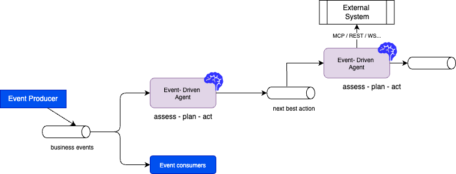
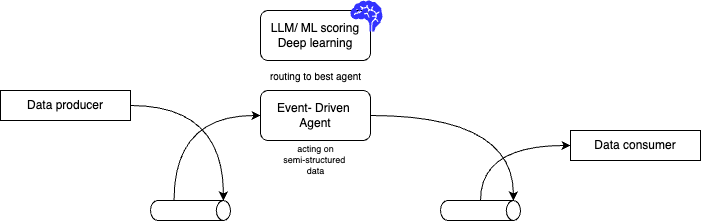
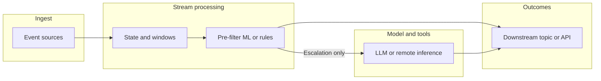
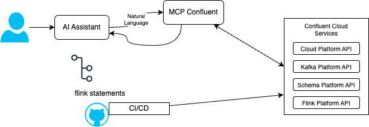

# Agentic Applications Cross Systems

???- "Version"
    Create 07/2025
    Update - 04/26/26

Industry analysts (for example Gartner) project strong adoption of agentic AI in enterprise applications by 2028, with significant potential impact on automation and cost. Treat such figures as directional, not precise forecasts. One of the problems is that organizations do not have the right data for AI. Classical ML models are trained from historical data using batch processing; they are tailored for a specific use case with a specific feature set. Generative models are built on public human-generated unstructured information, and they generalize across many tasks. They do not know your organization’s data. Therefore a key challenge is to **deliver the right data at the right time with the right context.**

Traditional AI agents are reactive: you ask a question, they call an API, they give an answer. This works for chatbots, but it fails for autonomous systems. If you want an agent to monitor a factory floor or a global supply chain, it cannot wait for a human to type a prompt. It needs to "live" inside the data stream. Flink provides the stateful memory and time semantics that raw LLM calls alone do not give you.

* Request/Response: The agent is "asleep" until called.
* Flink/Event-Driven: The agent is "awake," maintaining a continuous state of the world as events fly by.

## Who this chapter is for

* **Solution and enterprise architects** positioning GenAI on top of data platforms and event streams.
* **Streaming and platform engineers** integrating Kafka, Flink, and operational data.
* **ML and GenAI practitioners** who need to adopt autonomous agents.

## Current Industry Challenges

* **Real-time context:** Answering "How do systems access relevant context in real time?" is still hard in practice.
* **Integration patterns:** Exposing data through every possible protocol has a cost. [Model Context Protocol (MCP)](https://www.anthropic.com/news/model-context-protocol) can centralize governed, discoverable tools and context for assistants, but it adds moving parts: tokens, routing, and security reviews. Many teams also wrap HTTP APIs, CLIs, or internal SDKs directly for lower latency and simpler hardening. The two approaches coexist: use MCP where a shared context plane and tool contracts help product teams; prefer direct APIs when you need tight SLAs, air-gapped runs, or minimal indirection.
* While the medallion architecture and ELT batch jobs prepare data well, high end-to-end latency blocks agents that must act on fresh facts. You cannot have agents depend on data that is a day or a few hours old for many operational cases. Stale data served in production is a real issue. Data has a shelf life. The exact cutoff depends on the domain: sub-second to low-second processing matters for payment and safety-style signals; tens of seconds to minutes may be enough for other workflows. The point is order-of-magnitude fit, not a single universal latency number. A delayed batch-based alert can be far less useful than a stream-based one for the same business event.
* Many agentic frameworks are strong for demos and less opinionated about production: governance, guardrails, hardening, and observability still need your platform choices.
* Not all data must be real time; "real-time" is relative to the decision. The goal is still to feed domain-specific context from internal systems into generation and planning.
* Data often reaches AI systems too slowly. Businesses store data in many systems and silos, which makes a unified fresh view expensive.
* Several agent SDKs are not event-native: they may lack first-class replay, idempotent effects, and operations patterns teams expect from stream platforms.
* Live operational signals are not always represented in a single place for agents to consume.
* There is still a gap between data processing (Flink, Spark, ETL) and inference (APIs, vector DB, tools) that architecture must close.
* Frameworks that are disconnected from your data path struggle with governance, auditability, and replay at enterprise bar.

### MCP and direct tools (when to use which)

| Concern | MCP-oriented approach | Direct API / CLI / SDK |
| --- | --- | --- |
| Discovery and contracts | One protocol for tools and context; easier for many assistants | Per-service integration, more code |
| Security model | Mediated servers; org policies on what tools exist | You control per call; fewer hops |
| Latency | Extra hop; varies by deployment | Often lower, simpler paths |
| Fit | Shared context for many agents and IDEs | Tight-coupling to one app or pipeline |

Products such as [Confluent Intelligence](https://www.confluent.io/product/confluent-intelligence/) may expose governed, materialized context over MCP to AI apps while the stream platform (Kafka, Flink) stays the source of truth. That is MCP as an access pattern, not a claim that all agents must use MCP for everything.

## Context

AI agentic applications at scale will be triggered not only by users, but by systems using asynchronous events. Agents are expected to act as experts on tasks inside a business workflow, using domain knowledge, and to respond to user queries or to events from other systems.

As humans collaborate in a business function, AI agents will collaborate with other agents, other systems, and humans.

The vision is a fleet of streaming agents, background "teammates" that monitor data to:

* Optimize costs and drive revenue.
* Prevent outages and failures.
* Operate with varying levels of autonomy (including human-in-the-loop).
* Process right data at the right time with the right context.

Autonomous agents need a planning phase that uses up-to-date facts. Stale batch features pushed into an LLM invite hallucination and wrong actions. After assessment and planning, agents may act on external systems and emit events for downstream consumers.

<figure markdown='span'>
{: style="width: 1000px;" }
<figcaption>Event-driven context: business systems emit signals; stream processing materializes state and timing; agents consume compact, fresh context instead of ad hoc pulls.</figcaption>
</figure>

Agents may predict maintenance, tune parameters to reduce downtime, or balance supply in energy use cases. In healthcare (subject to policy and compliance), similar patterns apply to signals that combine history and live measurements, always with appropriate governance.

Flink’s event processing, state, and exactly-once semantics (where you configure it) support event-triggered agents. That is the layer where developers build much of real-time context.

Agents should not be limited to one database; they should participate in an ecosystem that consumes events, applies logic, and republishes results. That is the shift toward event-driven agents.

### Business use cases

Examples from early adopters:

* Detecting changes in trading volume and alerting a person; learning trends on individual names.
* Detecting changes in campaign engagement.
* Spikes or dips in new patient registrations by location.
* Product reviews: classify sentiment, then use anomaly detection on negative share to catch incidents early.

## Requirements (grouped)

### Cost, throughput, and models

* **Cost model:** Pushing every business event through an LLM is often prohibitively expensive. Use traditional ML (anomaly, fraud, forecasting) or rules as a first-pass filter, and reserve LLM steps for high-value windows.
* **Inference and enrichment:** Fresh data from transactions into context for agents; stale data drives weak recommendations. Private data is often integrated at inference and through RAG rather than by training on all of it in the public model.

### Data preparation and search

* **Offline training and features:** Many models still need batch prepared, clean data (SQL, Python) and feature pipelines. That data is often at rest before it trains predictive models.
* **Search and graph:** Full text, vector, and graph retrieval enrich LLM context. Point-in-time and temporal joins matter so retrieval matches event time, not "whatever was latest in the index."
* **RAG in motion:** RAG should update as sources change; static snapshots fall behind.
* **Remote scoring:** Streams may call remote model endpoints; protect with backpressure, timeouts, and budgets.

### Platform and operations

* Prefer event-driven integration: messaging and stream contracts instead of only static orchestrators (for example Apache Airflow) for all operational reactions, use batch orchestration where it fits, streams where time is of the essence.
* Event processing can trigger agents (for example for customer inquiries). External tools can be reached via MCP or direct APIs, depending on the pattern above.
* Embedded and edge cases (for example drones) add safety and bandwidth constraints beyond the data center.

???- info "Decision Intelligent Platforms"
    Gartner defines decision intelligence platforms (DIPs) as software to create decision-centric solutions that support, augment and automate decision making of humans or machines, powered by the composition of data, analytics, knowledge and AI.


## Understanding real-time data needs

You can assess needs from a business and an architecture angle.

### Project discovery questions

* What are the current GenAI goals and projects?
* What is the size and practice of the ML/AI team?
* How is data delivered as context to agents today?
* What is the measured latency from transactional data to the agent as context?
* How do you ensure trust in AI output?
* How do you operate agents in production (SLOs, on-call, cost)?
* How are actions taken once the agent proposes a "next best action?"
* What guardrails prevent dangerous side effects?

### Architecture questions

Kafka and Flink help only after you state what "real time" means for each feature: detection, ranking, or human escalation.

* What analytics and features do user journeys need for engineering and inference?
* Which tasks should be event-driven and closed-loop (for example anomaly response)?
* What "next best action" must happen within which latency budget?
* Do you need exactly-once, at-least-once, or idempotent sinks?
* Which processes need sub-minute or sub-second data, and which can stay batch?
* What batch jobs would improve if they consumed curated stream outputs?
* For each agent, does the decision require a continuous stream, windows, or only occasional API calls?


## Event-driven AI agent

Lilian Weng’s agent survey [via this summary](https://jbcodeforce.github.io/ML-studies/genAI/agentic/#introduction) is a common reference for planner, memory, and tools, it helps you reason about your agent design. Microservices teams already use event-driven integration; the same choreography idea extends to agents that emit and consume stream events. The high-level view below is Kafka-centric: logs give you ordering, replay, and decoupling.

<figure markdown='span'>
{: style="width: 1000px;" }
<figcaption>EDA for agents: services publish facts; stream processors derive features and triggers; agent runtimes and tools sit behind clear contracts, often with multiple consumer groups and replays for test.</figcaption>
</figure>

With Kafka, you can replay a time range to reproduce why a probabilistic model behaved a certain way, usually easier than re-building a one-off batch extract for the same question.

LLMs are not the only implementation: classic ML scoring, calibrated rules, and NN models all have a place, depending on cost and risk.

### Reference data-flow pattern

The following pattern appears throughout this book: ingest events, derive time-bounded state, optionally score with cheap models, then optionally call expensive tools or LLMs, and emit downstream facts (also durable on Kafka) for other agents and systems.


```mermaid
flowchart LR
  subgraph ingest [Ingest]
    A[Event sources]
  end
  subgraph flink [Stream processing]
    B[State and windows]
    C[Pre-filter ML or rules]
  end
  subgraph ai [Model and tools]
    D[LLM or remote inference]
  end
  subgraph out [Outcomes]
    E[Downstream topic or API]
  end
  A --> B
  B --> C
  C -->|Escalation only| D
  C --> E
  D --> E
```

Checkpointing and Kafka groups are where you get progress and reprocessing semantics: design idempotent sinks and dedupe where at-least-once delivery is possible.

## Technologies

### Apache Flink Agents

[Apache Flink Agents](https://nightlies.apache.org/flink/flink-agents-docs-latest/docs/get-started/overview/) is an open-source framework for event-driven streaming agents. Multiple patterns are in scope:

1. **Workflow streaming agents:** a directed workflow of actions connected by events, a form of [SAGA  choreography](https://jbcodeforce.github.io/eda-studies/patterns/saga/#services-choreography). See the [Apache Flink Agents repository](https://github.com/apache/flink-agents) and the Python [workflow example](https://github.com/apache/flink-agents/blob/main/python/flink_agents/examples/quickstart/workflow_single_agent_example.py).

2. **ReAct pattern:** the user states a goal; the agent interleaves reasoning and tool use with an LLM. The Python [ReAct example](https://github.com/apache/flink-agents/blob/main/python/flink_agents/examples/quickstart/react_agent_example.py) shows the idea. A runnable layout with OSS Flink and Kafka lives under [e2e-demos/agentic-demo](https://github.com/jbcodeforce/flink-studies/tree/master/e2e-demos/agentic-demo) in this repository.

### Confluent Intelligence

Confluent’s stream processing and governance offerings help you build event-driven pipelines for continuous AI context: capture data as it is generated, curate it in Flink SQL, and serve it to AI systems. The product direction is a unified, real-time, trust-oriented view of the business. See [Confluent Intelligence](https://www.confluent.io/product/confluent-intelligence/).

[Confluent Cloud for Apache Flink](https://docs.confluent.io/cloud/current/ai/overview.html) combines, at a high level:

1. **Built-in ML in SQL:** [model-oriented functions](https://docs.confluent.io/cloud/current/flink/reference/functions/model-inference-functions.html) for anomaly, forecasting, and similar use cases, with downstream routing to topics or agents.
2. **Streaming agents:** [Streaming Agents](https://docs.confluent.io/cloud/current/ai/overview.html) run as Flink-backed, stateful units with timers and replay-friendly testing story (see Confluent docs for current limits and regions).
3. **Real-time Context Engine:** can expose governed, materialized data to other apps, in some flows via MCP, so not every team must hand-wire Kafka details.

Layers Confluent often highlights:

* **Real-time processing:** Kafka paired with Flink, with [ML](https://docs.confluent.io/cloud/current/flink/reference/functions/model-inference-functions.html) and [preprocessing](https://docs.confluent.io/cloud/current/flink/reference/functions/ml-preprocessing-functions.html) helpers in SQL, including [anomaly](https://docs.confluent.io/cloud/current/ai/builtin-functions/detect-anomalies.html) examples (for example ARIMA-style and MAD, per documentation).
* **Interoperability:** MCP for context to diverse clients; your stream platform remains the system of record for *what happened*.
* **Governance and replayability:** Security, lineage, and using the log to re-run and debug model behavior.
* [Confluent AI with Flink SQL](https://docs.confluent.io/cloud/current/ai/overview.html) to decouple producers, processors, and consumers, including agents.

Other agent protocols (for product integration) include [Google A2A](https://developers.googleblog.com/en/a2a-a-new-era-of-agent-interoperability/) and the [Agent Communication Protocol](https://agentcommunicationprotocol.dev/introduction/welcome) from the Linux Foundation ecosystem, alongside [Anthropic’s MCP](https://www.anthropic.com/news/model-context-protocol) for tools and context to models. Native inference on Confluent Cloud (where available) and multivariate anomaly detection are product-specific; check current documentation for your environment.

[quickstart-streaming-agents](https://github.com/confluentinc/quickstart-streaming-agents/) includes examples such as price monitoring, RAG over vector-backed text, and taxi demand with anomaly handling.

#### Quick demonstration (Confluent Cloud)

`CREATE MODEL`, `CREATE TOOL`, and `CREATE AGENT` are Confluent Cloud Flink SQL features. They are not part of plain open-source Apache Flink. You need a Confluent Cloud environment, and the right accesses.

Typical order of operations in the Console or SQL workspace:

2. **CREATE MODEL** – register a remote or platform model reference (for example OpenAI or a governed endpoint). Follow the [model](https://docs.confluent.io/cloud/current/ai/streaming-agents/) documentation for your provider.
3. **CREATE TOOL** – map Flink UDFs, procedures, or MCP-connected tool definitions the agent may call.
4. **CREATE AGENT** – bind model, tools, and a system prompt, with limits in the `WITH` clause.

Example shape (placeholders; align names with your catalog):

```sql
CREATE AGENT support_triage_agent
  USING MODEL my_registered_model
  USING TOOLS my_tickets_query_tool
  USING PROMPT 'You help route support events. Be concise. Escalate only on clear policy breaches.'
  WITH (
    'max_iterations' = '5',
    'max_consecutive_failures' = '3',
    'request_timeout' = '60'
  );
```

This repository’s SQL tutorials that run on Confluent are under [code/flink-sql/12-ai-agents](https://github.com/jbcodeforce/flink-studies/tree/master/code/flink-sql/12-ai-agents) (for example anomaly gating). The local Apache Flink Agents path is under [e2e-demos/agentic-demo](https://github.com/jbcodeforce/flink-studies/tree/master/e2e-demos/agentic-demo).

### Confluent Cloud - MCP Server

The [mcp-confluent](https://github.com/confluentinc/mcp-confluent) project exposes Confluent Cloud APIs to assistants (topics, Flink statements, Connectors, Schema Registry, and more). The diagram below is a human in the loop story: natural language in an IDE suggests Flink SQL or config, review in Git, deploy through CI/CD—not unaudited production changes from chat alone.

<figure markdown='span'>
{: style="width: 1000px;" }
<figcaption>MCP to Confluent: assistants propose changes; version control and pipelines keep governance and rollbacks; Kafka and Flink stay managed by the platform team.</figcaption>
</figure>

The server exposes many tools; categories include Kafka, Flink SQL, Schema Registry, Kafka Connect, Tableflow, and platform management (environments, clusters). See the repository for the current list.

| Service Category | Examples |
| ---- | ---- |
| Kafka Operations | list-topics, create-topics, produce-message, consume-messages, alter-topic-config, … |
| Flink SQL | list-flink-statements, create-flink-statement, read-flink-statement, … |
| Schema Registry | list-schemas, search-topics-by-tag, … |
| Kafka Connect | list-connectors, create-connector, … |
| Tableflow | create-tableflow-topic, list-tableflow-topics, … |
| Platform | list-environments, read-environment, list-clusters |

### Example of natural language queries

* Inventory

    ```sh
    what are the topics in my kafka cluster?
    ```

* Flink SQL assistance

    ```sh
    looking at the tx_items topic and schema definitions, I want a flink sql statement to deduplicate records from this CDC raw topic
    ```


## Sources

* [code/flink-sql/12-ai-agents](https://github.com/jbcodeforce/flink-studies/tree/master/code/flink-sql/12-ai-agents): Anomaly detection and gating to a downstream view; links to replay notes.
* [Confluent model inference and AI functions](https://docs.confluent.io/cloud/current/flink/reference/functions/model-inference-functions.html) (including `AI_TOOL_INVOKE` patterns where applicable).
* [Confluent quickstart streaming agents](https://github.com/confluentinc/quickstart-streaming-agents/): [LAB3 walkthrough](https://github.com/confluentinc/quickstart-streaming-agents/blob/master/LAB3-Walkthrough.md) (fleet-style scenario).
* [Apache Flink Agents documentation](https://nightlies.apache.org/flink/flink-agents-docs-latest/docs/get-started/overview/).
* [SQL CREATE AGENT (Confluent Cloud)](https://docs.confluent.io/cloud/current/flink/reference/statements/create-agent.html).
