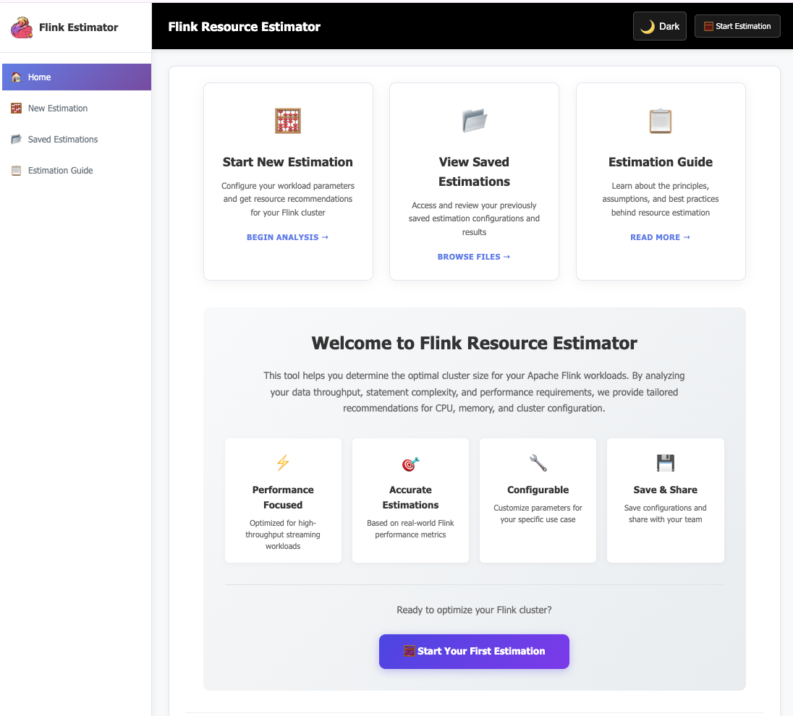
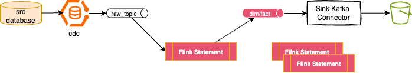
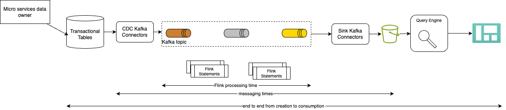

# Flink Cookbook

???- info "Chapter updates"
    * Created 12/2024 
    * Updated 1/28/2025: env, testing and statement life cycle.

There is a [Confluent cookbook for best practices](https://github.com/confluentinc/flink-cookbook) to run Flink into production. The content of this page is to get a summary of those practices, enhanced from other customers' engagements. It also references hands-on exercises within this repository. 

Examples may be run inside from Terminal or using Kubernetes cluster locally, they are on Flink 1.20.1 or Flink 2.1. Use Java 11 or 17, see [sdkman](https://sdkman.io/) to manage different java version. 

## Understand the Flink UI

The Flink Web UI helps to debug misbehaving jobs. 

The Flink Web UI is  well described [in Confluent David Anderson's article](https://developer.confluent.io/courses/apache-flink/web-ui-exercise/), The [Apache Flink doc for Web UI](), and link to the important [execution plan understanding with EXPLAIN](https://nightlies.apache.org/flink/flink-docs-stable/docs/dev/table/sql/explain/).

With OSS the Web UI is accessible when the `start_cluster.sh` is started. Local URL is [http://localhost:8081](http://localhost:8081). The Web UI offers the following important features:

* Navigating to get the running Jobs, the view is updated periodically. The job graph, which matches the EXPLAIN output, presents the tasks running one or more opators of the DAG.
* Task metrics are **backpressure, busyness, and data skew**.
    * **backpressure:** percentage of time that the subtask was unable to send output downstream because the downstream subtask had fallen behind, and (temporarily) couldn't receive any more records.
    * 
* Examining the history of checkpoints
* monitoring for any potential backpressure
* analyzing watermarks

* retrieving the job logs

In Concluent Cloud the Query Profiler has the same capability then the Flink UI and accessible at the Statement View level:
{ }

## Classical deployment pattern

For Confluent Cloud for Flink we want to map environments to physical environments, like dev, Staging and Production. Any stream processing has a set of source producer that will be part of an ingestion layer. In the Kafka architecture, it will be a set of Kafka Connector cluster, with for example Change Data Capture connector like [Debezium](https://debezium.io/). Most of the time the dev environment may not have the streams coming from this ingestion layer. 

For the discussion each business application can have one to many pipelines. A Pipeline is a set of Flink jobs running SQL statements or Table API programs. A generic pattern of a pipeline involves at least, the following steps:

<figure markdown="span">

<figcaption>Figure 1: Generic pipeline structure</figcaption>
</figure>

1. A CDC source connector injects data in Kafka topic. Avro schemas are defined for the Key and the Value.
1. A first set of statements are doing deduplication logic, or filtering to ensure only relevant messages are processed by the pipeline
1. There will be zero to many intermediate tables, depending of the business logic needed for the application. Those intermediate tables/topics may get enrichement, aggregation or joins.
1. The final step is to prepare the data for sink processing. The statements may includes joins and filtering out, even may be some deduplication logic too.
1. The data need to land to sink external system, so Kafka Sink connectors are deployed to write to those systems. Here the example illustrate a datawarehouse system based on Postgreql, on which a business intelligent component will implement adhoc queries and dashboards. 

The artifacts for development are the DDL and DML statements and test data.

Finally to support the deployment and quality control of those pipelines deployment, the following figures illustrates a classical deployment pattern:

<figure markdown="span">
{ width=600 }
<figcaption>Figure 2: Environment mapping</figcaption>
</figure>

1. Each environment has its own schema registry
1. Once Kafka Cluster per env, with different ACL rules to control who can create topic, read and write.
1. For each application it may be relevant to isolate them in their own Flink Compute pool
1. CI/CD can define infrastructure as code for the Flink Compute pool, the Kafka Cluster, the Kafka Connector cluster and connectors configuration, the input topics, the ACLs, the schema registry.

This architecture helps to clearly separate schema management per environment, and help to promote real-time processing pipelines from dev to staging to production in a control manner using a GitOps approach.

???+ info "Gitops"
    The core concept of [GitOps](https://opengitops.dev/) is to maintain a single Git repository that consistently holds declarative descriptions of the desired infrastructure in the production environment. An automated process ensures that the production environment aligns with the state described in the repository. The methodology and tools support changing infrastructure using feature branches, PR, PR review, 

## Sizing

Sizing a Flink cluster is a complex process influenced by many factors, including workload demands, application logic, data characteristics, expected state size, required throughput and latency, concurrency, and hardware. 

Because of those variables, every Flink deployment needs a unique sizing approach. The most effective method is to run a real job, on real hardware and tune Flink to that specific workload.

For architects seeking sizing guidance, it's helpful to consider:
* the workload semantic complexity, with the usage of aggregations, joins, windows, processing type, 
* the input throughput (MB/s or records/second), 
* the expected state size (GB), 
* the expected latency.

While Kafka sizing estimates are based on throughput and latency, this is a very crude method for Flink, as it overlooks many critical details. 

For new Flink deployments, a preliminary estimate can be provided, but it's important to stress its inexact nature. 
A simple Flink job can process approximately **10,000 records per second per CPU**. However, a more substantial job, based on benchmarks, might process closer to 5,000 records per second per CPU. Sizing may use record size, throughput, and Flink statement complexity to estimate CPU load.

???+ info "Tool help manage Flink Cluster estimations"
    The [flink-estimator git repository](https://github.com/jbcodeforce/flink-estimator) includes a web app with backend estimator for Flink Cluster sizing and locally manage your own configuration. To access this web app there is a docker image at [dockerhub - flink-estimator](https://hub.docker.com/repository/docker/jbcodeforce/flink-estimator/general). It can be started with `docker-compose start -d` or deployed to local kubernetes: `kubectl apply -k k8s`. Access via web browser [http://localhost:8002/](http://localhost:8002/)

    

## Exactly-once-delivery

Flink's internal exactly-once guarantee is robust, but for the results to be accurate in the external system, that system (the sink) must cooperate.

This is a complex subject to address and context is important on how to assess exactly-once-delivery: within Flink processing, versus with an end-to-end solution context. 

### Flink context

For Flink, "Each incoming event affects the final Flink statement results exactly once." as said [Piotr Nowojski during his presentation at the Flink Forward 2017 conference](https://www.youtube.com/watch?v=rh7wdvZXTOo). No data duplication and no data loss. Flink achieves it through a combination of checkpointing, state management, and transactional sinks. Checkpoints save the state of the stream processing application at regular intervals. State management maintains the consistency of data between the checkpoints. Transactional sinks ensure that data gets written out exactly once, even during failures 

Flink uses transactions when writing messages into Kafka. Kafka messages are only visible when the transaction is actually committed as part of a Flink checkpoint. `read_committed` consumers will only get the committed messages. `read_uncommitted` consumers see all messages.

As the default checkpoint interval is set to 60 seconds, `read_committed` consumers will see up to one minute latency: a Kafka message sent just before the commit will have few second latency, while older messages will be above 60 seconds.

When multiple Flink statements are chained in a pipeline, the latency may be even bigger, as Flink Kafka source connector uses `read_committed` isolation.

The checkpoints frequency can be updated but could not go below 10s. Shorter interval improves fault tolerance, but adds persistence and performance overhead.

### End-to-end solution

On the sink side, Flink has a [2 phase commit sink function](https://nightlies.apache.org/flink/flink-docs-release-1.4/api/java/org/apache/flink/streaming/api/functions/sink/TwoPhaseCommitSinkFunction.html) on specific data sources, which includes Kafka, message queue and JDBC. 

For stream processing requiring an **upsert** capability (insert new records or update existing ones based on a key), the approach is to assess:

* if the sink kafka connector support upsert operations: it emits only the latest state for each key, and a tombstone message for delete (which is crucial for Kafka's log compaction to work correctly).
* For Datsabase, be sure to use a JDBC connector, with upsert support. Achieving exactly-once to a traditional database is done by leveraging the sink's implementation of Flink's Two-Phase Commit protocol. The database's transactions must be compatible with this to make sure writes are only committed when a Flink checkpoint successfully completes.
* For Lakehouse Sink

The external system must provide support for transactions that integrates with a two-phase commit protocol. 

When using transactions on sink side, there is a pre-commit phase which starts from the checkpointing: the Job Manager injects a checkpoint barrier to seperate streamed in records before or after the barrier. As the barrier flows to the operators, each one of them, takes a snapshot or their state. The sink operators that support transactions, need to start the transaction in the precommit phase while saving its state to the state backend. After a successful pre-commit phase, the commit must guarantee the success for all operators. In case of any failure, the tx is aborted and rolled back.


* [Article: An Overview of End-to-End Exactly-Once Processing in Apache Flink (with Apache Kafka, too!)](https://flink.apache.org/2018/02/28/an-overview-of-end-to-end-exactly-once-processing-in-apache-flink-with-apache-kafka-too/).
* [Confluent documentation](https://docs.confluent.io/cloud/current/flink/concepts/delivery-guarantees.html).
* [Confluent Platform - Kafka consumer isolation level property.](https://docs.confluent.io/platform/current/installation/configuration/consumer-configs.html#isolation-level)

## Troubleshooting

### A SQL statement not returning any result

This could be linked to multiple reasons so verify the following:

* Verify there is no exception in the statement itself
* Query logic being too restrictive or the joins may not match any records. 
* For aggregation, assess if the field used get null values.
* Source table may be empty, or it consumes the table from a different starting offset (specified via `scan.bounded.mode`) then expected.
* Use `show create table <table_name>` to assess the starting offset strategy or specific values
* Count all records in a table using `SELECT COUNT(*) FROM table_name;`, it should be greater then 0.
* When the statement uses event-time based operation like `windowing, top N, OVER, MATCH_RECOGNIZE` and temporal joins then verify the watermarks. The following example is from Confluent Cloud for Flink query using the event time from the record, and it should return result. Check if you have produced a minimum of records per Kafka partition, or if the producer has stopped producing data all together.

```sql
SELECT ROW_NUMBER() OVER (ORDER BY $rowtime ASC) AS number, *   FROM <table_name>
```

* When Data are in topic but not seen by flink `select * from <table_name>` statement, it may be due to idle partitions and the way watermarks advance and are propagated. Flink automatically marks a Kafka partition as idle if no events come within `sql.tables.scan.idle-timeout` duration. When a partition is marked as idle, it does not contribute to the watermark calculation until a new event arrives. Try to set the idle timeout for table scans to ensure that Flink considers partitions idle after a certain period of inactivity. Try to create a table with a watermark definition to handle idle partitions and ensure that watermarks advance correctly.

## High Availability and Disaster Recovery

In Flink high availability goal is to keep the application running and being able to process data. The focus is more on streaming applications then batch. JobManager is a single point of failure but can be configured with standby JobManagers. The coordination can be done with Zookeeper for self managed deployment or via Kubernetes operator.

* For [Confluent Cloud for Flink see the DR section](http://localhost:8000/flink-studies/techno/ccloud-flink/#disaster-recovery).

## Security

TO BE DONE

## Deduplication

Deduplication is documented [here](../coding/flink-sql.md/#table-creation-how-tos) and [here](https://docs.confluent.io/cloud/current/flink/reference/queries/deduplication.html#flink-sql-deduplication) and at its core principal, it uses a CTE to add a row number, as a unique sequential number to each row. The columns used to de-duplicate are defined in the partitioning. Ordering is using a timestamp to keep the last record or first record. Flink support only ordering on time.

```sql
SELECT [column_list]
FROM (
   SELECT [column_list],
     ROW_NUMBER() OVER ([PARTITION BY column1[, column2...]]
       ORDER BY time_attr [asc|desc]) AS rownum
   FROM table_name
) WHERE rownum = 1
```

When using Kafka Topic to persist Flink table, it is possible to use the `upsert` or `retract` change log mode, and define the primary key(s) to remove duplicate records as only the last records will be used:

```sql
CREATE TABLE orders_deduped (
  PRIMARY KEY( order_id, member_id) NOT ENFORCED) DISTRIBUTED BY (order_id, member_id) INTO 1 BUCKETS 
WITH (
  'changelog.mode' = 'upsert',
  'value.fields-include' = 'all'
) AS
SELECT
  *
FROM (
  SELECT
      *,
      ROW_NUMBER() OVER (
        PARTITION BY `order_id`, `member_id`
        ORDER
          BY $rowtime DESC
      ) AS row_num
    FROM orders_raw
) WHERE row_num = 1;
```

To validate there is no duplicate records in the output table, use a query with tumble window like:

```sql
  SELECT
      `order_id`, 
      `user_id`,
    COUNT(*) AS cnt
    FROM
    TABLE(
        tumble(
        TABLE orders_raw,
        DESCRIPTOR($rowtime),
        INTERVAL '1' MINUTE
        )
    )
    GROUP
    BY  `order_id`, `user_id` HAVING COUNT(*) > 1;
```

Duplicates may still occur on the Sink side of the pipeline, as it is linked to the type of connector used and its configuration, for example reading un-committed offset. Few connector support the retract semantic.

## Change Data Capture

TO BE DONE

## Late Data

TO BE DONE

## Exactly once


## Query Evolution

In this section, I address streaming architecture only, integrated with Kafka, most likely CDC tables and sink connectors, a classical architecture, simplified in this figure:

<figure markdown=span style="width=900">

</figure>

Once a Flink query is deployed and run 'foreever', how to change it? to fix issue or adapt to schema changes. 

By principles any Flink DAG code is immutable, so statement needs to be stopped and a new version started! This is not as simple as this as there will be impact to any consumers of the created data, specially in Kafka topic or in non-idempotent consumers. 

The Flink SQL statements has limited parts that are mutables. See the [Confluent Cloud product documentation for details](https://docs.confluent.io/cloud/current/flink/concepts/schema-statement-evolution.html).  In Confluent Cloud the principal name and compute pool metadata are mutable when stopping and resuming the statement. Developers may stop and resume a statement using Console, CLI, API or even Terraform scripts.

Here are example using confluent cli:

```sh
# $1 is the statement name
confluent flink statement stop $1 --cloud $(CLOUD) --region $(REGION) 

confluent flink statement resume $1 --cloud $(CLOUD) --region $(REGION) 
```

When a SQL statement is started, it reads the source tables from the beginning (or any specified offset) and the operators, defined in the statement, build their internal state. Source operators use the latest schema version for key and value at the time of deployment. There is a snapshot of the different dependency configuration saved for the statement: the reference to the dependants tables, user-defined functions... Any modifications to these objects are not propagated to running statement.

First let review the schema definition evolution best practices for Flink processing.

### Schema compatibility

The CDC component may create schema automatically reflecting the source table. [See Debezium documentation about schema evolution](https://debezium.io/documentation/reference/stable/connectors/mysql.html)

CC Flink works best when consuming topics with FULL_TRANSITIVE compatibility mode. The following table lists the schema compatibility types, with the Flink impacts:

| Compatibility type | Change allowed | Flink impact |
| --- | --- | --- |
| BACKWARD | Delete fields, add optional field | Does not allow to replay from earliest |
| BACKWARD_TRANSITIVE | Delete fields, add optional fields with default value.| Require all Statements reading from impacted topic to be updated prior to the schema change. |
| FORWARD | Add fields, delete optional fields | Does not allow to replay from earliest |
| FORWARD_TRANSITIVE | Add fields, delete optional fields | Does not allow to replay from earliest |
| FULL | Add optional fields, delete optional fields | Does not allow to replay from earliest |
| FULL_TRANSITIVE | Add optional fields, delete optional fields  | Reprocessing and bootstrapping is always possible: Statements do not need to be updated prior to compatible schema changes. Compatibility rules & migration rules can be used for incompatible changes. |
| NONE | All changes accepted | Very risky. Does not allow to replay from earliest |

With FULL_TRANSITIVE, old data can be read with the new schema, and new data can also be read between the schemas X, X-1, and X-2. Which means in a pipeline, downstream Flink statements can read newly created schema, and will be able to replay messages from a previous schemas. Therefore, you can upgrade the producers and consumers independently.

Optional means, we can define fields with default values. Added fields are ignored by running statements.

Confluent Schema Registry supports Avro, Json or Protobuf, but Avro was designed to support schema evolution, so this is the preferred approach.

Assuming the goal is to cover FULL_TRANSITIVE, it means added column will have default value. Developers may only delete optional columns. During the migration, all current source tables coming as outcome of the Debezium process are not deletable. If a NOT NULL constraint is added to a column, older records with no value will violate the constraint. To handle such situation, there is a way to configure CDC connector (Debezium) to use the `envelop structure` which uses `key, before, after, _ts_ms, op` structure. This will result in a standard schema for Flink tables, which allows the source table to evolve by adding / dropping both NULL & NON NULL COLUMNS. 
The Debezium Envelope pattern offers the most flexibility for upstream Schema Evolution without impacting downstream Flink Statements.

* Adding Columns do not break the connectors or the RUNNING DML Statements
* Dropping Column needs co-ordination between teams to ensure the columns that are part of Running DML statements are not Dropped.

???- danger "Key schema evolution"
    It is discouraged from any changes to the key schema in order to do not adversely affect partitioning for the new topic/ table.

???- info "Updating schema in schema registry"
    Adding a field directly in the avro-schema with default value, will be visible in the next command like: `show create table <table_name>`, as tables in flink are virtuals, and the Confluent Cloud schema definition comes from the Schema Registry. The RUNNING Flink DML is not aware of the new added column. Even STOP & RESUME of the Flink DML is not going to pick the new column neither. Only new statement will see the new schema consuming from the beginning or from specific offsets. For column drop, Debezium connector will drop the new column and register a schema version for the topic (if the alteration resulted in a schema that doesnt match with previous versions). Same as above runnning statements will go degraded mode.
    
### Statement evolution

The general strategy for query evolution is to replace the existing statement and the corresponding tables it maintains with a new statement and new tables. The process is described in [this product chapter](https://docs.confluent.io/cloud/current/flink/concepts/schema-statement-evolution.html#query-evolution) and should be viewed within two folds depending of stateless or statefule statements. The initial state of the process involves a pipeline of Flink SQL statements and consumers processing Kafka records from various topics. We assume that the blue records are processed end-to-end, and the upgrade process begins at a specific point, from where all green records to be processed. The migration should start with the Flink statement that needs modification and proceed step by step to the statement creating the sink.

For ^^stateless statement evolution^^ the figure below illustrates the process:


**Figure: Stateless schema evolution process**

1. The blue statement, version 1, is stopped, and from the output, developer gets the last offset
1. The green statement includes a DDL to create the new table with schema v2.
1. The green DML statement, version 2, is started from the last offset or timestamp and produces records to the new table/topic
1. Consumers are stopped. They have produced so far records to their own output topic with source from blue records.
1. Consumers restarted with the new table name. Which means changing their own SQL statements, but now producing output with green records as source.

At a high level, stateless statements can be updated by stopping the old statement, creating a new one, and transferring the offsets from the old statement. As mentioned, we need to support FULL TRANSITIVE updates to add or delete optional columns/fields.

For ^^stateful statements^^, it is necessary to bootstrap from history, which the below process accomplishes:


**Figure: Stateful schema evolution process**

The migration process consists of the following steps:

1. Create a DDL statement to define the new schema for `table_v2` which means topic v2.
1. Deploy the new statement with the v2 name, starting from the earliest records to ensure semantic consistency for the blue records, when they are stateful, or from the last offset when stateless.
1. Once the new statement is running, it will build its own state and continue processing new records. Wait for it to retrieve the latest messages from the source tables before migrating existing consumers to the new table v2. The old blue records will be re-emitted. While the new statement 
1. Stop processing first statement.
1. Halt any downstream consumers, retaining their offsets if those are stateless or idempotent, if they are stateful they will process from the earliest.
1. Reconnect the consumers to the new table. For Flink statements acting as consumers, they will need to manage their own upgrades. To avoid duplicates or not missing records, the offset for the consumers to the new topic needs ot be carrefuly selected.
1. Once all consumers have migrated to the new output topic, the original statement and output topic can be deprovisioned.

This process requires to centrally control the deployment of those pipeline.

Using Open Source Flink, creating a snapshot is one potential solution for restarting. However, if the DML logic has changed, it may not be possible to rebuild the DAG and the state for a significantly altered flow. Thus, in a managed service, the approach is to avoid using snapshots to restart the statements.

Also when the state size is too large, consider separating the new statement into a different compute pool than the older one.

#### Restart a statement from a specific time or offset

Using time window, it may be relevant to restart from the beginning of the time window when the job was terminated. Which means using a `WHERE event_time > window_start_time_stamp` to get the records from the source table for an aligned time.

Use the `/*+ options ` at the table level or a `set statement` for all the table to read from.

```sql
FROM orders /*+ OPTIONS('scan.startup.mode' = 'timestamp', 'scan.startup.timestamp-millis' = '1717763226336') */
```

For offset, the `status.latest_offsets` includes the lastest offset read for each partition. Note that reading from an offset is applicable only for stateless statements to ensure exactly-once delivery.
or

```sql
SET `sql.tables.scan.startup.mode`= "earliest"
```

---

TO CONTINUE

#### Change stateful statement

We have seen the [stateful processing](../concepts/index.md/#state-management) leverages checkpoints and savepoints. With the open source Flink, developers need to enable checkpointing and manually triggering a savepoint when they need to restart from a specific point in time.

Deploy the new statement to compute the stateful operation, and use a template like the following. Then stop the first statement.

```sql
create table table_v2
as 
select * from table_v1
where window_time <= a_time_stamp_when_stopped
union 
select * from (tumble table)
where the $rowtime > a_time_stamp_when_stopped
order by window_time
```

It is possible to do an in-place upgrade if the table uses primary key.

Restarting a job is not a retry mechanism but a fault tolerance one. Normally only cluster level issues should ever cause a job to restart. When doing Java or Python application, developers need to do not throw exceptions within the main function but handle them and perform retries, backoff, and loop forever. as part of the exception management it is important to provide diagnostic data to administrators.

When integrated with Kafka, networking latency may trigger losing connection, or some user errors like deleting the cluster, a topic, or a connector, may lead the Flink job getting in retry loop. 

Savepoints are manually triggered snapshots of the job state, which can be used to upgrade a job or to perform manual recovery.

Full checkpoints and savepoints take a long time, but incremental checkpoints are faster.

#### Demonstrate in-place upgrade of stateless statement

#### Demonstrate stateful statement upgrade

### Flink on Kubernetes

* To trigger a savepoints
* 

## Testing SQL statement during pipeline development

We should differentiate two types of testing: Flink statement developer testing, like unit / component tests, and integration tests with other tables and with real data streams.


The objective of a test harness for developer and system integration is to validate the quality of a new Flink SQL statement deployed on Confluent Cloud (or Flink managed service) to address at least the following needs:

1. be able to deploy a flink statement (the ones we want to focus on are DMLs, or CTAS)
1. be able to generate test data from schema registry - and with developer being able to tune test data for each test cases.
1. produce test data to n source topics, consumes from output topic and validates expected results. All this flow being one test case. This may be automated for non-regression testing to ensure continuous quality.
1. support multiple testcase definitions
1. tear done topics and data.

The following diagram illustrates the global infrastructure deployment context:


The following diagram illustrates the target unit testing environment:


* The Kafka Cluster is a shared cluster with topics getting real-time streams from production

## Measuring Latency 

The goal is to measure the end-to-end data latency, which is the time from when data is created at its source to when it becomes available for end-user consumption. In any Apache Flink solution, especially those with chained Flink jobs, measuring this latency is a critical and planned activity within the deployment process.

For example, consider a typical real-time data processing architecture. We'll use this architecture to illustrate how to measure and represent latency throughout the data flow:

<figure markdown="span">

</figure>

The following timestamps may be considered:

1. UpdatedDate column in the transactional database may be used to know when a record was created / updated, this will serve to measure end-to-end latency. 
1. Source CDC connector like Debezium, may add a timestamp in their message envelop that could be used, if injected in the messages to measure messaging latency.
1. Within the Flink processing, event time, may be mapped to the Kafka Topic record time. Ths could be used to measure Flink pipeline latency.

It is important to note that Flink latency results may seem inconsistent. This is normal, and due to the semantic of the Flink processing. To ensure exactly-once delivery, Flink uses transactions when writing messages into Kafka. It is part of a consume-process-produce pattern, and adds the offset of the messages it has consumed to the transaction. 

Flink persists its state, including the offsets of the Kafka source, via checkpoints, which are done once per minute. The frequency may be configured. Queries submitted through Confluent Cloud Flink SQL Workbench or inspecting the content of a topic in the console generate output based on `read_uncommitted` isolation. The latency may seem reasonalbe during iterative development in the console, it may increase during more rigorous tests that use a read_committed consumer.

Consumer reading committed messages will observe latency (consumer's property of `isolation.level= read-committed`). Recall that, when a consumer starts up, or when a partition is newly assigned to it, the consumer will check the `__consumer_offsets` topic to find the latest committed offset for its consumer group and partition. It will then begin reading messages from the next offset. Consumer will wait and not advance its position until the transaction is either committed or aborted. This ensures it never sees messages from aborted transactions and only sees a complete, consistent set of records. 

When producer iniates a transaction, and writes messages to topic/partition, those messages are not yet visible to consumers configured to read committed data, when there is no error, the producer commits the transaction. 

When consumer applications may tolerate at-least once semantics, they may simply configure all consumers with `read_uncommitted` isolation, at the risk that during failure recovery and scaling activities, the Flink statement will reingest messages from the last checkpoint, causing duplicates and time-travel for end consumers.

???- Info "Flink transaction process"
    Flink's core mechanism for fault tolerance is checkpointing. It periodically takes a consistent snapshot of the entire application state, including the offsets of the Kafka source and the state of all operators.

    * Flink's Kafka sink connector uses a two-phase commit protocol.
    * When a checkpoint is triggered, the Flink Kafka producer (the sink) writes any pending data to Kafka within a transaction. It then prepares to commit this transaction but waits for a signal from the Flink JobManager.
    * Once the JobManager confirms that all operators have successfully snapshotted their state, it tells the Kafka producer to commit the transaction. This makes the new data visible to read_committed consumers.
    * If any part of the checkpoint fails (e.g., a Flink task manager crashes), the transaction is aborted. The uncommitted messages become "ghost" records on the Kafka topic, invisible to read_committed consumers. When the Flink job restarts, it will restore its state from the last successful checkpoint and reprocess the data from that point, avoiding data loss or duplicate.

The [shift_left utility has an integration tests harness feature to do end-to-end testing with timestamp](https://jbcodeforce.github.io/shift_left_utils/coding/test_harness/#integration-tests).

## Other sources

The current content is sourced from the following cookbooks and lesson learnt while engaging with customers.

* [Confluent Flink Cookbook](https://github.com/confluentinc/flink-cookbook)
* [Ververica Flink cookbook](https://github.com/ververica/flink-sql-cookbook/blob/main/README.md)