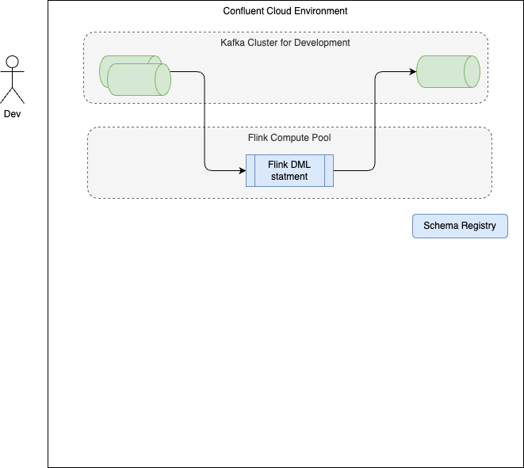
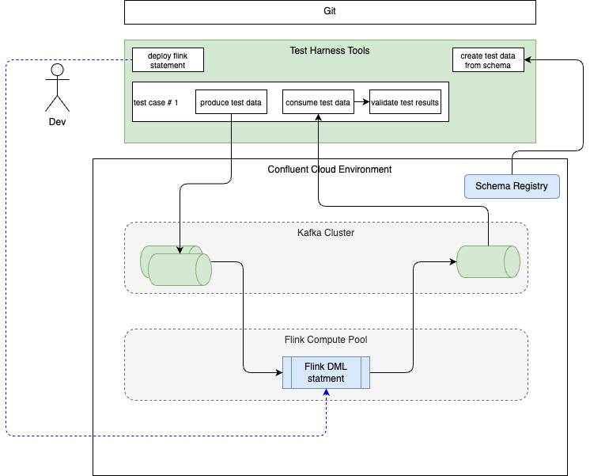
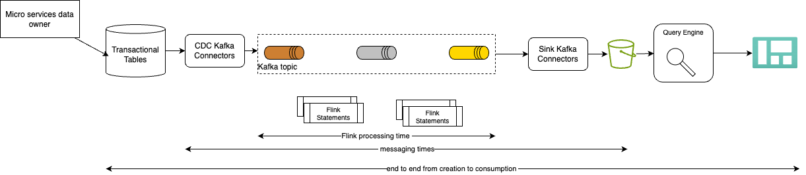

-> Migration to cookbook

## Exactly-once-delivery

Flink's internal exactly-once guarantee is robust, but for the results to be accurate in the external system, that system (the sink) must cooperate.

This is a complex subject to address and context is important on how to assess exactly-once-delivery: within Flink processing, versus with an end-to-end solution context. 

### Flink context

For Flink, "Each incoming event affects the final Flink statement results exactly once." as said [Piotr Nowojski during his presentation at the Flink Forward 2017 conference](https://www.youtube.com/watch?v=rh7wdvZXTOo). No data duplication and no data loss. Flink achieves it through a combination of checkpointing, state management, and transactional sinks. Checkpoints save the state of the stream processing application at regular intervals. State management maintains the consistency of data between the checkpoints. Transactional sinks ensure that data gets written out exactly once, even during failures 

Flink uses transactions when writing messages into Kafka. Kafka messages are only visible when the transaction is actually committed as part of a Flink checkpoint. `read_committed` consumers will only get the committed messages. `read_uncommitted` consumers see all messages.

Below is an example of creating Flink Table in Confluent Cloud with reading committed only message (opposite property will be: 'kafka.consumer.isolation-level'='read-uncommitted'):

```sql
CREATE TABLE exactly_once
  WITH('kafka.consumer.isolation-level'='read-committed')
  AS SELECT * FROM `transactions`..
```

As the default checkpoint interval is set to 60 seconds, `read_committed` consumers will see up to one minute latency: a Kafka message sent just before the commit will have few second latency, while older messages will be above 60 seconds.

When multiple Flink statements are chained in a pipeline, the latency may be even bigger, as Flink Kafka source connector uses `read_committed` isolation.

The checkpoints frequency can be updated but could not go below 10s. Shorter interval improves fault tolerance, but adds persistence and performance overhead.

### End-to-end solution

On the sink side, Flink has a [2 phase commit sink function](https://nightlies.apache.org/flink/flink-docs-release-1.4/api/java/org/apache/flink/streaming/api/functions/sink/TwoPhaseCommitSinkFunction.html) on specific data sources, which includes Kafka, message queue and JDBC. 

For stream processing requiring an **upsert** capability (insert new records or update existing ones based on a key), the approach is to assess:

* if the sink kafka connector support upsert operations: it emits only the latest state for each key, and a tombstone message for delete (which is crucial for Kafka's log compaction to work correctly).
* For Datsabase, be sure to use a JDBC connector, with upsert support. Achieving exactly-once to a traditional database is done by leveraging the sink's implementation of Flink's Two-Phase Commit protocol. The database's transactions must be compatible with this to make sure writes are only committed when a Flink checkpoint successfully completes.
* For Lakehouse Sink

The external system must provide support for transactions that integrates with a two-phase commit protocol. 

When using transactions on sink side, there is a pre-commit phase which starts from the checkpointing: the Job Manager injects a checkpoint barrier to seperate streamed in records before or after the barrier. As the barrier flows to the operators, each one of them, takes a snapshot or their state. The sink operators that support transactions, need to start the transaction in the precommit phase while saving its state to the state backend. After a successful pre-commit phase, the commit must guarantee the success for all operators. In case of any failure, the tx is aborted and rolled back.


* [Article: An Overview of End-to-End Exactly-Once Processing in Apache Flink (with Apache Kafka, too!)](https://flink.apache.org/2018/02/28/an-overview-of-end-to-end-exactly-once-processing-in-apache-flink-with-apache-kafka-too/).
* [Confluent documentation](https://docs.confluent.io/cloud/current/flink/concepts/delivery-guarantees.html).
* [Confluent Platform - Kafka consumer isolation level property.](https://docs.confluent.io/platform/current/installation/configuration/consumer-configs.html#isolation-level)

## Troubleshooting

### A SQL statement not returning any result

This could be linked to multiple reasons so verify the following:

* Verify there is no exception in the statement itself
* Query logic being too restrictive or the joins may not match any records. 
* For aggregation, assess if the field used get null values.
* Source table may be empty, or it consumes the table from a different starting offset (specified via `scan.bounded.mode`) then expected.
* Use `show create table <table_name>` to assess the starting offset strategy or specific values
* Count all records in a table using `SELECT COUNT(*) FROM table_name;`, it should be greater then 0.
* When the statement uses event-time based operation like `windowing, top N, OVER, MATCH_RECOGNIZE` and temporal joins then verify the watermarks. The following example is from Confluent Cloud for Flink query using the event time from the record, and it should return result. Check if you have produced a minimum of records per Kafka partition, or if the producer has stopped producing data all together.

```sql
SELECT ROW_NUMBER() OVER (ORDER BY $rowtime ASC) AS number, *   FROM <table_name>
```

* When Data are in topic but not seen by flink `select * from <table_name>` statement, it may be due to idle partitions and the way watermarks advance and are propagated. Flink automatically marks a Kafka partition as idle if no events come within `sql.tables.scan.idle-timeout` duration. When a partition is marked as idle, it does not contribute to the watermark calculation until a new event arrives. Try to set the idle timeout for table scans to ensure that Flink considers partitions idle after a certain period of inactivity. Try to create a table with a watermark definition to handle idle partitions and ensure that watermarks advance correctly.


### Handling Changes with CDC
The CDC component may create schema automatically reflecting the source table. [See Debezium documentation about schema evolution](https://debezium.io/documentation/reference/stable/connectors/mysql.html).

Developers may only delete optional columns. During the migration, all current source tables coming as outcome of the Debezium process are not deletable. If a NOT NULL constraint is added to a column, older records with no value will violate the constraint. To handle such situation, there is a way to configure CDC connector (Debezium) to use the `envelop structure` which uses `key, before, after, _ts_ms, op` fields. This will result in a standard schema for Flink tables, which allows the source table to evolve by adding / dropping both NULL & NON NULL COLUMNS. 

The Debezium Envelope pattern offers the most flexibility for upstream Schema Evolution without impacting downstream Flink Statements.

* Adding Columns do not break the connectors or the RUNNING DML Statements. But if developers need to access new field, the JSON_* built-in functions may be used, so a new Flink statement version is needed. 

???+ danger "Key schema evolution"
    It is discouraged from any changes to the key schema in order to do not adversely affect partitioning for the new topic/ table.

???+ warning "Updating schema in schema registry"
    Adding a field directly in the avro-schema with default value, will be visible in the next command like: `show create table <table_name>`, as tables in flink are virtuals, and the Confluent Cloud schema definition comes from the Schema Registry. The RUNNING Flink DML is not aware of the new added column. Even STOP & RESUME of the Flink DML is not going to pick the new column neither. 
    
    Only new deployed statement will see the new schema. For column drop, Debezium connector will drop the new column and register a schema version for the topic (if the alteration resulted in a schema that doesnt match with previous versions). Same as above runnning statements will go into `degraded` mode.

???+ warning "Migrate a NULL column to NOT NULL with retro update of rows with a default value"
    Most likely such operation will result in a connector failure as you are adding a NOT NULL column without a default value, even if you retro updated all the rows. 

    If you have control of the change do the following
    ```sql
    UPDATE Customers set zipcode=0;
    ALTER TABLE Customers alter column zipcode INT NOT NULL CONSTRAINT add_zip DEFAULT 0;
    ```
    
    If the upstream has already updated without default value, change the compatibility mode to NONE for the connector to recover and then:
    ```sql
    ALTER TABLE Customers ADD CONSTRAINT add_zip DEFAULT 0;
    ```

???+ info "Drop a NULL column"
    ```sql
    ALTER TABLE Customers DROP CONSTRAINT add_zip;
    ALTER TABLE Customers DROP COLUMN zipcode
    ```
    Running Flink DML is not aware of the dropped `zipcode` column. User may STOP & RESUME the Flink DML with no impact. But the statement will go to DEGRADED mode if the dropped column is part of the SELECT statement. For new deployment, user may update the statement to remove the dropped column and start from the beginning or specific offsets.


#### Materialized Table

[FLIP 435](https://cwiki.apache.org/confluence/display/FLINK/FLIP-435%3A+Introduce+a+New+Materialized+Table+for+Simplifying+Data+Pipelines) presents a new table construct to simplify streaming and batch pipelines. Users can define a data transformation with a single declarative

```sql 
CREATE MATERIALIZED TABLE ... AS SELECT ... 
```

statement and specify a desired FRESHNESS interval. Flink then automatically creates and manages the underlying data refresh pipeline, intelligently choosing between a continuous streaming job for low-latency updates or a scheduled batch job for less frequent refreshes. This eliminates the need for separate codebases, manual job orchestration, and complex parameter tuning. The entire lifecycle of the data pipeline, including pausing, resuming, manual backfills, and altering data freshness, can be managed through simple SQL commands, allowing developers to focus on business logic rather than the complexities of stream and batch execution.

See the [Flink 2.x documentation](https://nightlies.apache.org/flink/flink-docs-master/docs/dev/table/materialized-table/overview/).

* It supports the FRESHNESS keyword,  to define the maximum amount of time that the materialized table’s content should lag behind updates to the base tables.
* By default the CONTINUOUS mode is a 3 minutes: so the refresh pipeline is a streaming job with a checkpoint interval of 3 minutes. For FULL mode, the pipeline is a scheduled job executed every 1 hour.
  ```sql
  CREATE MATERIALIZED TABLE my_materialized_table_full
    REFRESH_MODE = FULL
    AS SELECT * FROM source_table;
  ```
* Alter materialized table allows developer to suspend and resume refresh pipeline. When suspending a table in CONTINUOUS mode, the job will be paused using STOP WITH SAVEPOINT by default.
* Altering an existing materialized table, schema evolution currently only supports adding nullable columns to the end of the original materialized table’s schema.
* Materialized Tables must be created through SQL Gateway,

---

TO CONTINUE

#### Change stateful statement

We have seen the [stateful processing](../concepts/index.md/#state-management) leverages checkpoints and savepoints. With the open source Flink, developers need to enable checkpointing and manually triggering a savepoint when they need to restart from a specific point in time.

Deploy the new statement to compute the stateful operation, and use a template like the following. Then stop the first statement.

```sql
create table table_v2
as 
select * from table_v1
where window_time <= a_time_stamp_when_stopped
union 
select * from (tumble table)
where the $rowtime > a_time_stamp_when_stopped
order by window_time
```

It is possible to do an in-place upgrade if the table uses primary key.

Restarting a job is not a retry mechanism but a fault tolerance one. Normally only cluster level issues should ever cause a job to restart. When doing Java or Python application, developers need to do not throw exceptions within the main function but handle them and perform retries, backoff, and loop forever. as part of the exception management it is important to provide diagnostic data to administrators.

When integrated with Kafka, networking latency may trigger losing connection, or some user errors like deleting the cluster, a topic, or a connector, may lead the Flink job getting in retry loop. 

Savepoints are manually triggered snapshots of the job state, which can be used to upgrade a job or to perform manual recovery.

Full checkpoints and savepoints take a long time, but incremental checkpoints are faster.


## Testing SQL statement during pipeline development

We should differentiate two types of testing: Flink statement developer testing, like unit / component tests, and integration tests with other tables and with real data streams.


The objective of a test harness for developer and system integration is to validate the quality of a new Flink SQL statement deployed on Confluent Cloud (or Flink managed service) to address at least the following needs:

1. be able to deploy a flink statement (the ones we want to focus on are DMLs, or CTAS)
1. be able to generate test data from schema registry - and with developer being able to tune test data for each test cases.
1. produce test data to n source topics, consumes from output topic and validates expected results. All this flow being one test case. This may be automated for non-regression testing to ensure continuous quality.
1. support multiple testcase definitions
1. tear done topics and data.

The following diagram illustrates the global infrastructure deployment context:



The following diagram illustrates the target unit testing environment:



* The Kafka Cluster is a shared cluster with topics getting real-time streams from production

## Measuring Latency 

The goal is to measure the end-to-end data latency, which is the time from when data is created at its source to when it becomes available for end-user consumption. In any Apache Flink solution, especially those with chained Flink jobs, measuring this latency is a critical and planned activity within the deployment process.

For example, consider a typical real-time data processing architecture. We'll use this architecture to illustrate how to measure and represent latency throughout the data flow:

<figure markdown="span">

</figure>

The following timestamps may be considered:

1. UpdatedDate column in the transactional database may be used to know when a record was created / updated, this will serve to measure end-to-end latency. Care is needed the time the producer code to write to Kafka topic will be part of this latency, and therefore is not accurate to compute, pure flink jobs end-to-end latency.  
1. Source CDC connector like Debezium, may add a timestamp in their message envelop that could be used, if injected in the messages to measure messaging latency. Those timestamps need to be propagated to the last sink, across multiple Flink jobs.
1. Within the Flink processing, event time, may be mapped to the Kafka Topic record time. Ths could be used to measure Flink pipeline latency, and same as above, propagated to last sink table.

It is important to note that Flink latency results may seem inconsistent. This is normal, and due to the semantic of the Flink processing. To ensure exactly-once delivery, Flink uses transactions when writing messages into Kafka. It is part of a consume-process-produce pattern, and adds the offset of the messages it has consumed to the transaction. The transactions are committed with checkpointing.

Flink persists its state, including the offsets of the Kafka source, via checkpoints, which are done once per minute. The frequency may be configured. Queries submitted through Confluent Cloud Flink SQL Workbench or inspecting the content of a topic in the console generate output based on `read_uncommitted` isolation. The latency may seem reasonalbe during iterative development in the console, it may increase during more rigorous tests that use a read_committed consumer.

Consumer reading committed messages will observe latency (consumer's property of `isolation.level= read-committed`). Recall that, when a consumer starts up, or when a partition is newly assigned to it, the consumer will check the `__consumer_offsets` topic to find the latest committed offset for its consumer group and partition. It will then begin reading messages from the next offset. Consumer will wait and not advance its position until the transaction is either committed or aborted. This ensures it never sees messages from aborted transactions and only sees a complete, consistent set of records. 

When producer iniates a transaction, and writes messages to topic/partition, those messages are not yet visible to consumers configured to read committed data, when there is no error, the producer commits the transaction. 

When consumer applications may tolerate at-least once semantics, they may simply configure all consumers with `read_uncommitted` isolation, at the risk that during failure recovery and scaling activities, the Flink statement will reingest messages from the last checkpoint, causing duplicates and time-travel for end consumers.

???- Info "Flink transaction process"
    Flink's core mechanism for fault tolerance is checkpointing. It periodically takes a consistent snapshot of the entire application state, including the offsets of the Kafka source and the state of all operators.

    * Flink's Kafka sink connector uses a two-phase commit protocol.
    * When a checkpoint is triggered, the Flink Kafka producer (the sink) writes any pending data to Kafka within a transaction. It then prepares to commit this transaction but waits for a signal from the Flink JobManager.
    * Once the JobManager confirms that all operators have successfully snapshotted their state, it tells the Kafka producer to commit the transaction. This makes the new data visible to read_committed consumers.
    * If any part of the checkpoint fails (e.g., a Flink task manager crashes), the transaction is aborted. The uncommitted messages become "ghost" records on the Kafka topic, invisible to read_committed consumers. When the Flink job restarts, it will restore its state from the last successful checkpoint and reprocess the data from that point, avoiding data loss or duplicate.

The [shift_left utility has an integration tests harness feature to do end-to-end testing with timestamp](https://jbcodeforce.github.io/shift_left_utils/coding/test_harness/#integration-tests).

