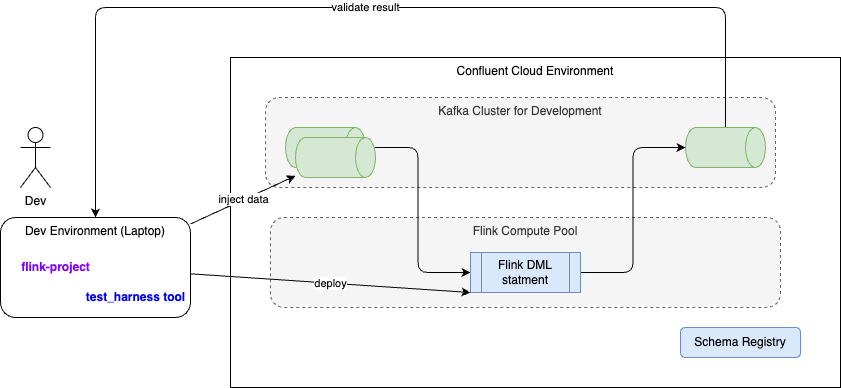

# Flink Cookbook

???- info "Chapter updates"
    * Created 12/2024 
    * Updated 1/28/2025: env, testing and statement life cycle.

There is a [Confluent cookbook for best practices](https://github.com/confluentinc/flink-cookbook) to run Flink into production. The content of this page is to get a summary of those practices, enhanced from other customers' engagements. It also references hands-on exercises within this repository. 

All the examples can be run inside an IDE or in a terminal console, they are on Flink 1.19.1 and Java 11. Use [sdkman](https://sdkman.io/) to manage different java version. 

## Understand the Flink UI

TO BE DONE

## Classical deployment pattern

For Confluent Cloud for Flink we want to map environments to physical environments, like dev, Staging and Production. Any stream processing has a set of source producer that will be part of an ingestion layer. In the Kafka architecture, it will be a set of Kafka Connector cluster, with for example Change Data Capture connector like [Debezium](https://debezium.io/). Most of the time the dev environment may not have the streams coming from this ingestion layer. 

For the discussion each business application can have one to many pipelines. A Pipeline is a set of Flink jobs running SQL statements or Table API programs. A generic pattern of a pipeline involves at least, the following steps:


**Figure : Generic pipeline structure**

1. A CDC source connector injects data in Kafka topic. Avro schemas are defined for the Key and the Value.
1. A first set of statements are doing deduplication logic, or filtering to ensure only relevant messages are processed by the pipeline
1. There will be zero to many intermediate tables, depending of the business logic needed for the application. Those intermediate tables/topics may get enrichement, aggregation or joins.
1. The final step is to prepare the data for sink processing. The statements may includes joins and filtering out, even may be some deduplication logic too.
1. The data need to land to sink external system, so Kafka Sink connectors are deployed to write to those systems. Here the example illustrate a datawarehouse system based on Postgreql, on which a business intelligent component will implement adhoc queries and dashboards. 

The artifacts for development are the DDL and DML statements and test data.

Finally to support the deployment and quality control of those pipelines deployment, the following figures illustrates a classical deployment pattern:


**Figure : Environment mapping**

1. Each environment has its own schema registry
1. Once Kafka Cluster per env, with different ACL rules to control who can create topic, read and write.
1. For each application it may be relevant to isolate them in their own Flink Compute pool
1. CI/CD can define infrastructure as code for the Flink Compute pool, the Kafka Cluster, the Kafka Connector cluster and connectors configuration, the input topics, the ACLs, the schema registry.

This architecture helps to clearly separate schema management per environment, and help to promote real-time processing pipelines from dev to staging to production in a control manner using a GitOps approach.

???+ info "Gitops"
    The core concept of [GitOps](https://opengitops.dev/) is to maintain a single Git repository that consistently holds declarative descriptions of the desired infrastructure in the production environment. An automated process ensures that the production environment aligns with the state described in the repository. The methodology and tools support changing infrastructure using feature branches, PR, PR review, 

## Troubleshooting

### A SQL statement not returning any result

This could be linked to multiple reasons so verify the following:

* Verify there is no exception in the statement itself
* Query logic being too restrictive or the joins may not match any records. 
* For aggregation, assess if the field used get null values.
* Source table may be empty, or it consumes the table from a different starting offset (specified via `scan.bounded.mode`) then expected.
* Use `show create table <table_name>` to assess the starting offset strategy or specific values
* Count all records in a table using `SELECT COUNT(*) FROM table_name;`, it should be greater then 0.
* When the statement uses event-time based operation like `windowing, top N, OVER, MATCH_RECOGNIZE` and temporal joins then verify the watermarks. The following example is from Confluent Cloud for Flink query using the event time from the record, and it should return result. Check if you have produced a minimum of records per Kafka partition, or if the producer has stopped producing data all together.

```sql
SELECT ROW_NUMBER() OVER (ORDER BY $rowtime ASC) AS number, *   FROM <table_name>
```

* When Data are in topic but not seen by flink `select * from <table_name>` statement, it may be due to idle partitions and the way watermarks advance and are propagated. Flink automatically marks a Kafka partition as idle if no events come within `sql.tables.scan.idle-timeout` duration. When a partition is marked as idle, it does not contribute to the watermark calculation until a new event arrives. Try to set the idle timeout for table scans to ensure that Flink considers partitions idle after a certain period of inactivity. Try to create a table with a watermark definition to handle idle partitions and ensure that watermarks advance correctly.


### Identify which watermark is calculated

Add a virtual column to keep the Kafka partition number by doing:

```sql
ALTER TABLE <table_name> ADD _part INT METADATA FROM 'partition' VIRTUAL;
```

Assess there is a value on the "Operator Watermark" column with

```sql
SELECT
  *,
  _part AS `Row Partition`,
  $rowtime AS `Row Timestamp`,
  CURRENT_WATERMARK($rowtime) AS `Operator Watermark`
FROM  <table_name>;
```

If not all partitions are included in the result, it may indicate a watermark issue with those partitions. We need to ensure that events are sent across all partitions. To test a statement, we can configure it to avoid being an unbounded query by consuming until the latest offset. This can be done by setting: `SET 'sql.tables.scan.bounded.mode' = 'latest-offset';`

Flink statement consumes data up to the most recent available offset at the job submission moment. Upon reaching this time, Flink ensures that a final watermark is propagated, indicating that all results are complete and ready for reporting. The statement then transitions into a 'COMPLETED' state."

## Security

TO BE DONE

## Deduplication

Deduplication is documented [here](../coding/flink-sql.md#table-creation) and [here](https://docs.confluent.io/cloud/current/flink/reference/queries/deduplication.html#flink-sql-deduplication) and at its core principal, it uses a CTE to add a row number, as a unique sequential number to each row. The columns used to de-deplicate are defined in the partitioning and ordering is used using a timestamp to keep the last record.

```sql
SELECT [column_list]
FROM (
   SELECT [column_list],
     ROW_NUMBER() OVER ([PARTITION BY column1[, column2...]]
       ORDER BY time_attr [asc|desc]) AS rownum
   FROM table_name
) WHERE rownum = 1
```

When using Kafka Topic to persist Flink table, it is possible to use the `upsert` change log, and define the primary key(s) to remove duplicate using a CTAS statement like:

```sql
CREATE TABLE orders_deduped (
  PRIMARY KEY( order_id, member_id) NOT ENFORCED) DISTRIBUTED BY (order_id, member_id) INTO 1 BUCKETS 
WITH (
  'changelog.mode' = 'upsert',
  'value.fields-include' = 'all'
) AS
SELECT
  *
FROM (
  SELECT
      *,
      ROW_NUMBER() OVER (
        PARTITION BY `order_id`, `member_id`
        ORDER
          BY $rowtime DESC
      ) AS row_num
    FROM orders_raw
) WHERE row_num = 1;
```

To validate there is no duplicate records in the output table, use a query with tumble window like:

```sql
  SELECT
      `order_id`, 
      `user_id`,
    COUNT(*) AS cnt
    FROM
    TABLE(
        tumble(
        TABLE orders_raw,
        DESCRIPTOR($rowtime),
        INTERVAL '1' MINUTE
        )
    )
    GROUP
    BY  `order_id`, `user_id` HAVING COUNT(*) > 1;
```

Duplicates may still occur on the Sink side of the pipeline, as it is linked to the type of connector used and its configuration, for example reading un-committed offset. 

## Change Data Capture

TO BE DONE

## Late Data

TO BE DONE

## Exactly once

TO BE DONE

## Query Evolution

This section summarizes the Flink statement deployment and life cycle management. 

The classical pattern is to consume streams from Kafka Topics and then adds different stateful processing using Flink SQL, Table API or DataStreams jobs. The question is **when we need to stop such processing to change the logic and how to restart them?**. 

Any Flink DAG code is immutable, therefore a quick answer is: to do not modify Flink process flow! Which may not be a realistic in our IT world. So developers and SREs need to take a lot of care for this statement life cycle management. 

The Flink SQL statements has limited parts that are mutables. See [Confluent Cloud product documentation for details](https://docs.confluent.io/cloud/current/flink/concepts/schema-statement-evolution.html).  The principal name and compute pool metadata are mutable when stopping and resuming the statement. Developers may stop and resume a statement using Console, CLI, API or even Terraform scripts.

Here are example using confluent cli:

```sh
confluent flink statement stop $1 --cloud $(CLOUD) --region $(REGION) 

confluent flink statement resume $1 --cloud $(CLOUD) --region $(REGION) 
```

Most other parts are immutables. 

When a SQL statement is started, it reads the source tables from the beginning (or any specified offset) and the operators, defined in the statement, build their state. Source or sink operators use the latest schema version for key and value at the time of deployment. There is a snapshot of the different dependency configuration saved for the statement: the reference to the dependants tables, user-defined functions... 

### Schema compatibility

CC Flink works best when consuming topics with FULL_TRANSITIVE compatibility mode. The following table lists the schema compatibility types with what can be done:

| Compatibility type | Change allowed | Flink impact |
| --- | --- | --- |
| BACKWARD | Delete fields, add optional field | Does not allow to replay from earliest |
| BACKWARD_TRANSITIVE | Delete fields, add optional fields | Require all Statements reading from impacted topic to be updated prior to the schema change. |
| FORWARD | Add fields, delete optional fields | Does not allow to replay from earliest |
| FORWARD_TRANSITIVE | Add fields, delete optional fields | Does not allow to replay from earliest |
| FULL | Add optional fields, delete optional fields | Does not allow to replay from earliest |
| FULL_TRANSITIVE | Add optional fields, delete optional fields  | Reprocessing and bootstrapping is always possible: Statements do not need to be updated prior to compatible schema changes. Compatibility rules & migration rules can be used for incompatible changes. |
| NONE | All changes accepted | Very risky. Does not allow to replay from earliest |

With FULL_TRANSITIVE, old data can be read with the new schema, and new data can also be read between the schemas X, X-1, and X-2, . Which means in a pipeline, downstream Flink statements can read newly created schema, and will be able to replay messages from a previous schemas. Therefore, you can upgrade the producers and consumers independently.

Optional means, we can define fields with default values.

Confluent Schema Registry supports Avro, Json or Protobuf, but Avro was designed to support schema evolution, so this is the preferred approach.

Assuming the goal is to cover FULL_TRANSITIVE, it means added column will have default value. Developers may only delete optional columns. During the migration, all current source tables coming as outcome of the Debezium process are not deletable. Columns can be added to the source with default value to support FULL_TRANSITIVE. 

???- danger "Key schema evolution"
    It is discouraged from any changes to the key schema in order to do not adversely affect partitioning for the new topic/ table.

???- info "Updating schema in schema registry"
    Adding a field directly in the avro-schema with default value, will be visible in the next command like: `show create table <table_name>`, as tables in flink are virtuals, and the Confluent Cloud the schema definition comes from the Schema Registry.
    
### Statement evolution

The general strategy for query evolution is to replace the existing statement and the corresponding tables it maintains with a new statement and new tables. The process is described in [this product chapter](https://docs.confluent.io/cloud/current/flink/concepts/schema-statement-evolution.html#query-evolution) and should be viewed within two folds depending of stateless or statefule statements. The initial state of the process involves a pipeline of Flink SQL statements and consumers processing Kafka records from various topics. We assume that the blue records are processed end-to-end, and the upgrade process begins at a specific point, from where all green records to be processed. The migration should start with the Flink statement that needs modification and proceed step by step to the statement creating the sink.

For ^^stateless statement evolution^^ the figure below illustrates the process:


**Figure: Stateless schema evolution process**

1. The blue statement, version 1, is stopped, and from the output, developer gets the last offset
1. The green statement includes a DDL to create the new table with schema v2.
1. The green DML statement, version 2, is started from the last offset or timestamp and produces records to the new table/topic
1. Consumers are stopped. They have produced so far records to their own output topic with source from blue records.
1. Consumers restarted with the new table name. Which means changing their own SQL statements, but now producing output with green records as source.

At a high level, stateless statements can be updated by stopping the old statement, creating a new one, and transferring the offsets from the old statement. As mentioned, we need to support FULL TRANSITIVE updates to add or delete optional columns/fields.

For ^^stateful statements^^, it is necessary to bootstrap from history, which the below process accomplishes:


**Figure: Stateful schema evolution process**

The migration process consists of the following steps:

1. Create a DDL statement to define the new schema for `table_v2` which means topic v2.
1. Deploy the new statement with the v2 name, starting from the earliest records to ensure semantic consistency for the blue records, when they are stateful, or from the last offset when stateless.
1. Once the new statement is running, it will build its own state and continue processing new records. Wait for it to retrieve the latest messages from the source tables before migrating existing consumers to the new table v2. The old blue records will be re-emitted. While the new statement 
1. Stop processing first statement.
1. Halt any downstream consumers, retaining their offsets if those are stateless or idempotent, if they are stateful they will process from the earliest.
1. Reconnect the consumers to the new table. For Flink statements acting as consumers, they will need to manage their own upgrades. To avoid duplicates or not missing records, the offset for the consumers to the new topic needs ot be carrefuly selected.
1. Once all consumers have migrated to the new output topic, the original statement and output topic can be deprovisioned.

This process requires to centrally control the deployment of those pipeline.

Using Open Source Flink, creating a snapshot is one potential solution for restarting. However, if the DML logic has changed, it may not be possible to rebuild the DAG and the state for a significantly altered flow. Thus, in a managed service, the approach is to avoid using snapshots to restart the statements.

Also when the state size is too large, consider separating the new statement into a different compute pool than the older one.

#### Restart a statement from a specific time or offset

Using time window, it may be relevant to restart from the beginning of the time window when the job was terminated. Which means using a `WHERE event_time > window_start_time_stamp` to get the records from the source table for an aligned time.

Use the `/*+ options ` at the table level or a `set statement` for all the table to read from.

```sql
FROM orders /*+ OPTIONS('scan.startup.mode' = 'timestamp', 'scan.startup.timestamp-millis' = '1717763226336') */
```

For offset, the `status.latest_offsets` includes the lastest offset read for each partition. Note that reading from an offset is applicable only for stateless statements to ensure exactly-once delivery.
or

```sql
SET `sql.tables.scan.startup.mode`= "earliest"
```

---

TO CONTINUE

#### Change stateful statement

We have seen the [stateful processing](../index.md/#stateful-processing) leverages checkpoints and savepoints. With the open source Flink, developers need to enable checkpointing and manually triggering a savepoint when they need to restart from a specific point in time.

Deploy the new statement to compute the stateful operation, and use a template like the following. Then stop the first statement.

```sql
create table table_v2
as 
select * from table_v1
where window_time <= a_time_stamp_when_stopped
union 
select * from (tumble table)
where the $rowtime > a_time_stamp_when_stopped
order by window_time
```

It is possible to do an in-place upgrade if the table uses primary key.

Restarting a job is not a retry mechanism but a fault tolerance one. Normally only cluster level issues should ever cause a job to restart. When doing Java or Python application, developers need to do not throw exceptions within the main function but handle them and perform retries, backoff, and loop forever. as part of the exception management it is important to provide diagnostic data to administrators.

When integrated with Kafka, networking latency may trigger losing connection, or some user errors like deleting the cluster, a topic, or a connector, may lead the Flink job getting in retry loop. 

Savepoints are manually triggered snapshots of the job state, which can be used to upgrade a job or to perform manual recovery.

Full checkpoints and savepoints take a long time, but incremental checkpoints are faster.

#### Demonstrate in-place upgrade of stateless statement

#### Demonstrate stateful statement upgrade

### Flink on Kubernetes

* To trigger a savepoints
* 

## Testing SQL statement during pipeline development

We should differentiate two types of testing: Flink statement developer testing, like unit / component tests, and integration tests with other tables and with real data streams.


The objective of a test harness for developer and system integration is to validate the quality of a new Flink SQL statement deployed on Confluent Cloud (or Flink managed service) to address at least the following needs:

1. be able to deploy a flink statement (the ones we want to focus on are DMLs, or CTAS)
1. be able to generate test data from schema registry - and with developer being able to tune test data for each test cases.
1. produce test data to n source topics, consumes from output topic and validates expected results. All this flow being one test case. This may be automated for non-regression testing to ensure continuous quality.
1. support multiple testcase definitions
1. tear done topics and data.

The following diagram illustrates the global infrastructure deployment context:



The following diagram illustrates the target unit testing environment:


* The Kafka Cluster is a shared cluster with topics getting real-time streams from production

## Measuring Latency 

## Other sources

The current content is sourced from the following cookbooks and lesson learnt while engaging with customers.

* [Confluent Flink Cookbook](https://github.com/confluentinc/flink-cookbook)
* [Ververica Flink cookbook](https://github.com/ververica/flink-sql-cookbook/blob/main/README.md)