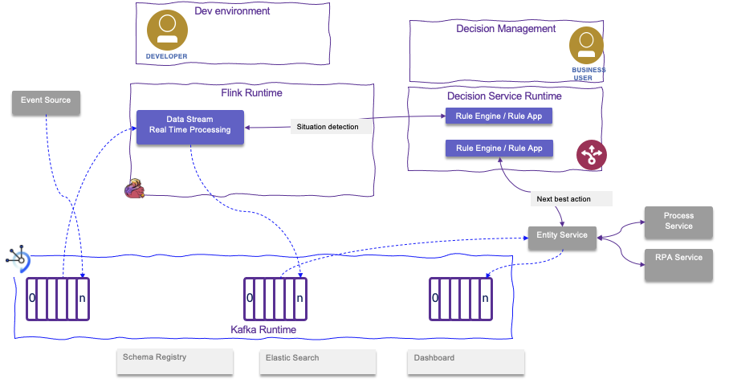
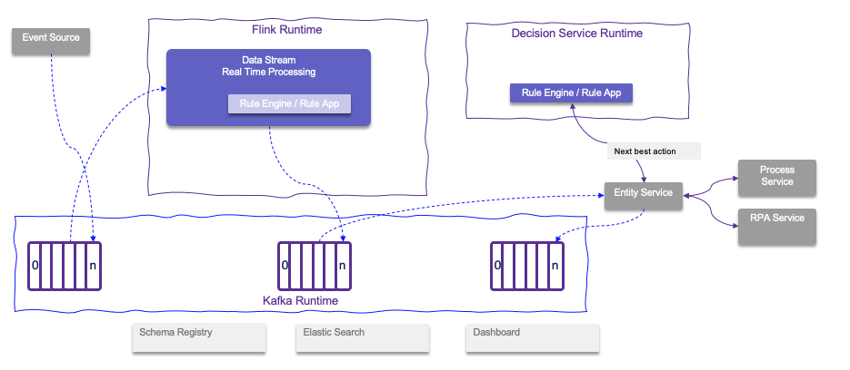

# Fit for purpose

The chapter is about comparing some other technology with Apache Flink and when to use one versus the other.

## Difference between Kafka Streams and Flink

* Flink is a complete streaming computation system that supports HA, Fault-tolerance, self-monitoring, and a variety of deployment models.
* Kafka Streams is a library that any  standard Java application can embed and hence does not attempt to dictate a deployment method
* Kafka Streams within k8s will provide horizontal scaling. But it is bounded by the number of partitions. Resilience is ensured with Kafka topics.
* In term of application Life Cycle:
    * Flink: User’s stream processing code is deployed and **run as a job** in the Flink cluster
    * Kakfa Streams: User’s stream processing code **runs inside Java application**
* Flink supports data at rest or in motion, and **multiple sources and sinks**, no need to be only Kafka as KStream.
* Flink has Complex Event Processing capabilities to search for pattern of event occurences.
* Restorate State after Failure
    * Flink can restore state after failure from most recent incremental snapshot
    * KStreams and KSQL Restore state after failure by replaying all messages 
* Coordination
    * Flink JobManager is part of the streaming application and orchestrate task manager. Job manager orchestration is done via Kubernetes scheduler.
    * KStreams - Leverages the Kafka cluster for coordination, load balancing, and  fault-tolerance.
* Bounded and unbounded data streams & Flink: Stream or Batch processing on Bounded
    * Kstreams: Stream only
* Language Flexibility
    * Flink has a layered API - with most popular languages being Java, Python and SQL
    * KStreams is Java only.

* Flink needs a custom implementation of `KafkaDeserializationSchema<T>` to read both key and value from Kafka topic.
* Kafka streams is easier to define a pipeline for Kafka records and to do the `consume - process - produce` loop. 
* KStreams uses the Kafka Record time stamp, while with Flink we need to implement how to deserialize the KafkaRecord and get the timestamp from it.
* Support of late arrival is easier with KStreams, while Flink uses the concept of watermark.

## KSQL and Flink SQL

KSQL is SQL on Kafka records (all inputs and outputs must be Kafka topics), it is a SQL translation layer built on top of the Kafka Streams Java client library.

* Flink SQL queries compile into distributed Directed Acyclic Graphs (DAGs) executed on a dedicated Apache Flink cluster (JobManager + TaskManagers).
* For scaling, the parallelism is capped by the partition count of your source Kafka topic whre in Flink partitioning is done at the operator level of the DAG and distributed against task slots.
* Flink connects natively to Kafka, Pulsar, S3/GCS, Apache Iceberg/Delta Lake, relational DBs (via CDC), and Elasticsearch.

### Feature & Capability Comparison

| Dimension | ksqlDB | Flink SQL|
| --- ----------------|------------------------|---|
| **Engine Architecture** | Kafka Streams wrapper  | Full distributed dataflow engine|
| **Source / Sink Support**| Kafka topics only (or via Kafka Connect) | Universal connectors (Kafka, Data Lakes, CDC, DBs)|
| **Scaling Parallelism** | Bounded by Kafka topic partition countsIndependent per-operator scaling |
| **Multi-Tenancy**       | Shared cluster execution (queries share memory/compute) | Per-job isolation (queries run independently) |
| **State & Fault Tolerance** | Local RocksDB + Kafka changelog topics | Distributed Chandy-Lamport snapshots to object storage (S3/GCS)| 
| **SQL Expressiveness**    | Standard aggregations, Tumbling / Hopping / Session windows| ANSI SQL, Cumulate windows, Temporal joins, Pattern matching (MATCH_RECOGNIZE)| 
| **Licensing & Ecosystem** | Confluent Community License | Apache 2.0 Open Source |

* Confluent has migrated its data streaming processing toward Flink, Flink SQL has effectively become the open-source standard for large-scale streaming data pipelines

---

## Apache Nifi and Apache Flink

Apache NiFi is about data logistics (movement), while Flink is about data computation (analytics). In a modern data architecture, these tools rarely fight for the same slot.

NiFi is frequently used to gather and clean messy data from various corporate silos and feed it into a clean topics within Apache Kafka, which Flink then reads to perform heavy calculations

At the high level:

- Nifi specializes in moving, routing, transforming, and securing data from Point A to Point B. It features a visual, drag-and-drop interface. If you need to securely ingest data from 100 different retail stores into our cloud data lake," invest in NiFi.
- flink specializes in performing complex, high-speed mathematical and logical computations on live, massive data streams as they happen. While if you need to detect credit card fraud or recalculate dynamic ride pricing within 5 milliseconds of an events, go with Flink.

| Dimension | Apache NiFi | Apache Flink |
| --------- | ----------- | ------------ |
| Primary Focus | Data Ingestion, Routing, & Delivery | Heavy Analytics & Complex Processing |
| Primary Interface | Visual Drag-and-Drop (No-code) | Code-driven (Java, Python, SQL) |
| Processing Speed | Low Latency (Seconds) | Ultra-Low Latency (Millisecond)|
| Historical Lineage | Excellent. Built-in data tracking. | Limited. Focuses on the immediate stream. |
| Talent Needs | Data Administrators / IT Generalists | Data Engineers / Developers |
| Typical Use Cases | Feeding Data Lakes, System Migration | Fraud Detection, Live IoT Alerts, Real-Time Dashboards |

While NiFi might require more hardware infrastructure to handle heavy data mutations, Flink requires skill on streaming programming.

### Nifi Technical Features

Nifi supports a Flow driven implementation:

* Data is encapsulated as a FlowFile. A FlowFile is split into two parts: Attributes (key-value metadata held in JVM memory) and Content (the payload, stored on disk in the Content Repository).
* NiFi operates on a bounded event-by-event queue model. Processors pull FlowFiles from an incoming queue, mutate the attributes or payload, and commit them to an outgoing queue. It acts at the data-transfer layer; it doesn't care about the schemas inside your files unless you explicitly invoke Record-based processors (like QueryRecord).
* The Concurrency is Thread-driven. You configure the number of concurrent tasks directly on individual processors via the GUI.
* For fault tolerance, NiFi relies heavily on its write-ahead log repositories (FlowFile Repository and Provenance Repository). If a node crashes, the data stays safe on that node's local disk.
* State is primarily local to a component or distributed via external caches (e.g., Redis, HBase, DistributedMapCache). While NiFi supports stateless execution modes for short-lived cloud-native jobs, it is fundamentally designed around the guarantee that data is safely buffered on disk between steps. You are not implementing stateful processing with Nifi, only good for deduplication, and basic caching.
* NiFi uses a structured JSON flow definition format. Flow management is based on git.
* Testing business logic in NiFi can feel decoupled. You either test via the UI with dummy data or use NiFi’s Java Mock Framework (TestRunner) to write programmatic unit tests for custom processors.
* NiFi runs natively on Kubernetes using ConfigMaps and native leases for leader election, removing historical external dependencies like ZooKeeper.
* Custom components are written in Java and bundled into .nar (NiFi Archive) files, which provide strict classloader isolation.
* NiFi features native, CPython-based processor extensions. It uses uv tooling to dynamically spin up isolated Python environments. If you want to drop a custom script into your pipeline using pandas, scikit-learn, or an LLM/Vector DB client, you can write it in pure Python without writing a single line of Java.

---

## When to use rule engine versus Flink

By rule engine, we are talking about libraries / products that are implementing the [Rete Algorithm](https://en.wikipedia.org/wiki/Rete_algorithm) and extends from there. 
Some of those engines are also supporting time windowing operators. 
The major use case is to implement prescriptive logic based on `if ... then ...else` constructs and define the knowledge base as a set of rules. 
This is the base of expert systems and it was part of the early years of Artificial Intelligence. 
Expert systems have still their role in modern IT and AI solution. They help to:

* automate human's decisions as an expert will do. In fact it is better to say like a worker will apply his/her decisions on data and still be involved in addressing the more difficult decisions.
* have a clear understanding of the logic executed behind a decision, which is a real challenge in AI and deep learning models.
* reprocess rules when new facts are added so rule engine can be used to maintain a conversation with the client application  to enrich facts and take decision
* externalize the business logic from code:  it is easier to test and help to develop what-if scenarios with champion and challenger decision evaluation methodology

Flink can do Complex Event Processing and Stream processing with time windowing.

The technologies are indeed complementary: if we consider to get a stream of events from a event backbone like Kafka and then process those events with Flink we can also call a remote decision service via REST end point within the flink flow. 

The figure above illustrates a generic processing, where event sources are injecting events to Kafka topics, Flink application processes the events as part of a situation detection pattern. 
The situation detection is supported by the Flink processing and the rule engine: the responsability to implement the complex time windowing logic is assigned to a Developer, while the business logic to support scoring or assessing best action, may be done by business analysts using a high level rule language and a decision management platform. 
It is important to note that once a situation is detected, it is important to publish it as a fact in a Kafka topic, to adopt an event sourcing and event-driven architecture approach. 
The down stream processing is to compute the next best action. This component can enrich the data from the situation event received, so the best action decision can consider more data elements. This is a classical approach to develop rule based application. 

Once the action is decided, it is published to a topic, and this orchestration service (named here "entity service") may call different external services, like a business process execution environment, and robot process automation,...

Another effective way is to embed the rule engine and the ruleset inside the Flink application:

The goal is to reduce latency and avoid unnecessary remote calls which adds complexity with retries, circuit breaker and fail over.