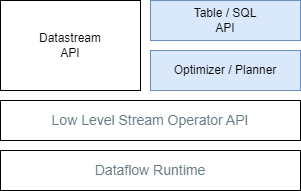
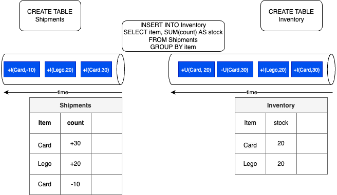

# Flink SQL

???- Info "Updates"
    - Created 02/2021 
    - Updated 12/20/24

## Introduction

Flink SQL is an ANSI-compliant SQL engine designed for processing both batch and streaming data on distributed computing servers managed by Flink.

Built on [Apache Calcite](https://calcite.apache.org/), Flink SQL facilitates the implementation of SQL-based streaming logic. It utilizes the [Table API](https://nightlies.apache.org/flink/flink-docs-release-1.19/docs/dev/table/tableapi/), a language-integrated query API for Java, Scala, and Python that enables the composition of queries using relational operators such as selection, filtering, and joining.

The Table API efficiently handles both bounded and unbounded streams within a unified and highly optimized ecosystem inspired by traditional databases and SQL.

Both the Table API and SQL operate on top of a lower-level stream operator API, which runs on the dataflow runtime:

{ width=500}

The optimizer and planner APIs transform SQL statements for execution across distributed nodes, leveraging the lower-level stream operator API. With Flink SQL, developers work with **dynamic tables**, a concept similar to materialized views in DB, while abstracting away the stream construct from the developers. Developers may write SQL and use the Table API in Java, Scala, or Python, or leverage the SQL client, an interactive tool for submitting SQL queries to Flink and visualizing the results.

Streams or bounded data are mapped to Tables. The following command loads data from a csv file and [creates a dynamic table](https://docs.confluent.io/cloud/current/flink/reference/statements/create-table.html) in Flink:

```sql
CREATE TABLE car_rides (
    cab_number VARCHAR,
    plate VARCHAR, 
    cab_type VARCHAR,
    driver_name VARCHAR, 
    ongoing_trip VARCHAR, 
    pickup_location VARCHAR, 
    destination VARCHAR, 
    passenger_count INT
) WITH ( 
    'connector' = 'filesystem',
    'path' = '/home/flink-sql-quarkus/data/cab_rides.txt',
    'format' = 'csv'
);
```

Show how the table is created:

```sql
show create table orders;
```

[See the getting started](../coding/getting-started.md) to run Flink open-source locally with a sql client connected to a Job Manager and Task manager running in container.

### Main use cases

Flink and Flink SQL can be used in two main categories of application:

1. Reactive application, event-driven function
1. Data products with real-time white box ETL pipeline: schematizing, cleaning, enriching for data lake, lake house, feature store or vector store. 

## Parallel with Database

Database applications are typically classified into two domains: Online Transaction Processing (OLTP) and Online Analytical Processing (OLAP), which are used for business reporting.

Databases consist of catalogs, databases, tables, views, and materialized views. The most critical component is the query processor, which receives queries, plans their execution using metadata from the catalog (including information about tables and functions), and then executes the query via the storage engine to access the data and generate results.

**Views** are virtual tables derived from the results of SQL queries. Some databases also support **materialized views**, which cache the results in a physical table. For example, a GROUP BY operation on an aggregate can store the results based on grouping elements and aggregates in a new table. Materialized views can be updated through a full refresh (by re-executing the query) or through incremental updates.

Flink SQL utilizes dynamic tables derived from data streams and employs materialized views with incremental updates. While it is not a traditional database, Flink functions as a query processor.The processor runs [continuous queries](https://nightlies.apache.org/flink/flink-docs-release-1.20/docs/dev/table/concepts/dynamic_tables/#continuous-queries). In Confluent Cloud, the catalog accesses the schema registry for a topic, and query execution occurs on a Flink cluster that retrieves records from topics.

Flink can provide either "exactly once" or "at least once" guarantees (with the possibility of duplicates), depending on the configuration and the external systems used for input and output tables.

For effective "exactly once" processing, the source must be replayable, and the sink must support transactions. Kafka topics support both of these requirements, and the consumer protocol adheres to the read-committed semantics. However, transaction scope in Kafka is at the single-key level, whereas ACID transactions in databases maintain integrity across multiple keys.

## Changelog mode

When mapping table view to stream, a query can generate two different type of messages: 1/ containing insert, update or delete changes or 2/ only insert changes. The changelog normalize function allows Flink to track the precise sequence of changes to data, which is essential for all stateful operations. In Kafka, records provide the current state of the records without information of what changed. In Flink, without this state tracking, any stateful operation would produce incorrect or inconsistent results when source records are updated or deleted, as operators would lack the context of how the data has changed. 

???+ warning "State size"
    Queries that make update changes, usually have to maintain more state. See [Flink table to stream conversion](https://nightlies.apache.org/flink/flink-docs-release-1.20/docs/dev/table/concepts/dynamic_tables/#table-to-stream-conversion) documentation.

There are [three different modes](https://docs.confluent.io/cloud/current/flink/reference/statements/create-table.html#changelog-mode) to persist table rows in a append logm like a Kafka topic: append, retract or upsert. 

* **append** is the simplest mode where records are only added to the result stream, never updated or retracted. It means that every insertion can be treated as an independent immutable fact. Records can be distributed using round robin to the different partitions. Do not use primary key with append, as windowing or aggregation will produce undefined, and may be wrong, results.  [Temporal join](https://developer.confluent.io/courses/flink-sql/streaming-joins/) may be possible. Some query will create append output, like window aggregation, or any operations using the watermark.
* **upsert** means that all rows with the same primary key are related and must be partitioned together. Events are only **U**psert or **D**elete for a primary key. Upsert mode needs a primary key. 
* **retract** means a fact can be undone, The stream includes only add (+X) or retract (-X) messages. One update is represented by a -X followed by a +X messages. The combination of +X and -X are related and must be partitioned together. Records are related by all the columns so the entire row is the key.

The `change.log` property is set up by using the `WITH ('changelog.mode' = 'upsert')` options when creating the table.

Some operations, such as group by, aggregation and deduplication can produce update events. Use the `EXPLAIN` feature to analyze the physical execution plan of a query to see the changelog mode of each operator.

Looking at the physical plan with `EXPLAIN create...` demonstrates the changelog mode and the state size used per operator.

[See the concept of changelog and dynamic tables in Confluent's documentation](https://docs.confluent.io/cloud/current/flink/concepts/dynamic-tables.html) and see [this example](https://github.com/jbcodeforce/flink-studies/tree/master/flink-sql/05-append-log) to study the behavior with a kafka topic as output, and a [SQL coding - changelog mode section](../coding/flink-sql.md#changelog-mode).

## SQL Programming Basics

Flink SQL tables are dynamic, meaning they change over time; some tables act more like changelog streams than static tables.

The following diagram illustrates the main processing concepts: the `shipments` table tracks product shipments, while the `inventory` table maintains the current quantity of each item. The INSERT statement processes streams to update the inventory based on new shipment records. This SQL statement uses the SUM aggregation operation to count each item, with the items shuffled to group them by type.



SQL is applied directly to the stream of data; data is not stored within Flink. Events can represent INSERT, UPDATE, or DELETE operations in the table. The diagram shows that, at the sink level, the initial events reflect the addition of items to the inventory. When the inventory for the "Card" item is updated, a record is first created to remove the current stock of the "Card" and then a new message is sent with the updated stock value (2 cards). This behavior arises from the GROUP BY semantics, where the right table is an update-only table while the left is append-only. Dynamic tables can also be persisted in Kafka topics, meaning the table definition includes statements on how to connect to Kafka. In batch processing, the sink can be a database table or a CSV file in the filesystem. 

Note that the SQL Client executes each INSERT INTO statement as a separate Flink job. The STATEMENT SET command can be used to group multiple insert statements into a single set. As the job manager schedules these jobs to the task managers, SQL statements are executed asynchronously. For batch processing, developers can set the set `table.dml-sync` option to `true`.

In streaming, the "ORDER BY" statement applies only to timestamps in ascending order, while in batch processing, it can be applied to any record field.

### Data lifecycle

In a pure Kafka integration architecture, such as Confluent Cloud, the data lifecycle follows these steps:

* Data is read from a Kafka topic to a Flink SQL table.
* Data is processed using Flink SQL statements.
* Results are returned as result sets in interactive mode, or to a table (mapped to a topic) in continuous streaming mode.

### Some SQL operators

| Type | Operators | Comments|
| --- | --- | --- |
| **Stateless** | SELECT {projection, transformation} WHERE {filter}; UNION ... | Can be distributed |
| **Materialized** | GROUP BY <aggregationss> or JOINS | Dangerously Stateful, keep an internal copy of the data related to the query |
| **Temporal** | Time windowed operations, interval **joins**, time-versioned joins, MATCH_RECOGNIZE <pattern> | Stateful but constrained in size |

As elements are stored for computing materialized projections, it's crucial to assess the number of elements to retain. Millions to billions of small items are possible. However, if a query runs indefinitely, it may eventually overflow the data store. In such cases, the Flink task will ultimately fail.

In a join any previously processed records can be used potentially to process the join operation on new arrived records, which means keeping a lot of records in memory. As memory will be bounded, there are other mechanisms to limit those joins or aggregation, for example using time windows.

## Challenges

* We cannot express everything in SQL but we can mix Flink Stream and Table APIs

## Deeper dive

* [SQL and Table API overview](https://nightlies.apache.org/flink/flink-docs-release-1.15/docs/dev/table/overview/)
* [Table API](https://nightlies.apache.org/flink/flink-docs-release-1.15/docs/dev/table/tableapi/)
* [Introduction to Apache Flink SQL by Timo Walther](https://www.youtube.com/watch?v=oaEkYg56Os4)
* [Flink API examples](https://github.com/twalthr/flink-api-examples) presents how the API solves different scenarios:

    * as a batch processor,
    * a changelog processor,
    * a change data capture (CDC) hub,
    * or a streaming ETL tool