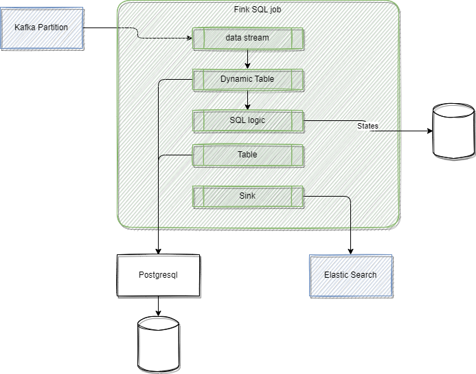

# Flink SQL and Table API

???- Info "Updates"
    Created 02/2021 Modified 10/24

## Introduction

Flink SQL is a compliant standard SQL engine for processing batch or streaming data on top of distributed computing server managed by Flink.

Flink’s SQL support is based on [Apache Calcite](https://calcite.apache.org/) to support SQL based streaming logic implementation. It is using the [Table API](https://nightlies.apache.org/flink/flink-docs-release-1.19/docs/dev/table/tableapi/) which is a language-integrated query API for Java, Scala, and Python that allows the composition of queries from relational operators such as selection, filter, and join.

The Table API can deal with bounded and unbounded streams in a unified and highly optimized ecosystem inspired by databases and SQL.

Table and SQL are implemented on top of low level stream operator API, which itself runs on the dataflow runtime:

{ width=400}

It is possible to code the SQL and Table API in a Java, Scala or Python or use SQL client, which is an interactive client to submit SQL queries to Flink and visualize the results.

Stream or bounded data are mapped to Table. The following command loads data from a csv file and [creates a dynamic table](https://docs.confluent.io/cloud/current/flink/reference/statements/create-table.html) in Flink:

```sql
CREATE TABLE car_rides (
    cab_number VARCHAR,
    plate VARCHAR, 
    cab_type VARCHAR,
    driver_name VARCHAR, 
    ongoing_trip VARCHAR, 
    pickup_location VARCHAR, 
    destination VARCHAR, 
    passenger_count INT
) WITH ( 
    'connector' = 'filesystem',
    'path' = '/home/flink-sql-quarkus/data/cab_rides.txt',
    'format' = 'csv'
);
```

Show how the table is created:

```sql
show create table orders;
```

[See the getting started](../coding/getting-started.md) to run locally with a sql client.

### Main use cases

Flink and Flink SQL can be used in two main categories of application:

1. Reactive application, event-driven
1. Data products with real-time white box ETL pipeline: schematizing, cleaning, enriching for data lake, lake house, feature store or vector store. 

## Parallel with Database

Database applications are classified in one of the two domains of Online Transaction Processing (OLTP) or Online Analytical Processing (OLAP) used for business reporting.

Databases have catalog, database, tables, views, materialized views. The most important component is the Query processor, which receives queries and then plans before the execution using the catalog (metadata of the tables. functions...), then executes the query using the Storage engine to access to the data to finally generate the results. 

The `views` are virtual tables based on the result of the SQL queries. Some Database has also the `Materialized View` that caches the results into a physical table. For example, a group_by on an aggregate, may cache the result by the grouping element and the aggregate in a new table. Materialized view can be updated by a full refresh, executing the query again, or with incremental result.

Flink SQL uses dynamic table, coming from data streams, and use material view with incremental updates. It is not a database but a query processor. The catalog in Confluent Cloud is accessing the schema registry for a topic. and the execution of the query is done on Flink cluser that access to records in topics. 

Flink can support exactly once or at least once (duplicates are possible) guarantee, depending of the configuration and the external systems used for input and output tables. 

For effectively exactly once processing the source needs to be replayable and the sink needs to support transaction. Kafka topics support both, and the consumer protocol supports the `read-committed` semantic. Transaction scope is at the single-key level. While ACID transaction in database supports multiple keys integrity. 

## SQL Programming Basic

Flink SQL tables are dynamic, because they change overtime, and some tables are more a changelog stream than static tables. 

The following diagram illustrates the main processing concepts: the `shipments` table keeps track of product shipments while the `inventory` keeps the current quantity of each item. The insert statement is the stream processing to update the inventory from the new shipment records. This SQL statement uses the sum aggregator operation on the count for each item. The items are shuffled to group them by item.


The SQL is applied to the stream of data, data is not stored in Flink. The events can be `insert`, `update` or `delete` record in the table. The diagram illustrates that, at the sink level, the first events reflect adding items to the inventory, while when there is an update to the Card inventory, a first record is created to remove the current stock of Card item and send a new message with the new stock value (2 cards). This last behavior is due to the `group by` semantic, and the fact that the right 'table' is an update only table, while the left one ia an append only table. 

Dynamic Table can also being persisted in Kafka Topic, so table definition includes statement on how to connect to Kafka. When doing batch processing the sink can be a table in database or a csv file on the filesystem.

Note that SQL Client executes each **INSERT INTO** statement as a single Flink job. `STATEMENT SET` can be used to group insert statements (into a set). As the  job manager schedules the job to the task managers, SQL statements are executed asynchronously. While for batch processing; developer can set `set table.dml-sync option to true` 

With streaming, the "ORDER BY" statement applies only on timestamp in ascending order, while with batch, it can apply to any record field.

### Data lifecycle

In a pure Kafka integration architecture, like Confluent Cloud, the data life cycle looks like the following:

* Data is read from a Kafka topic to a Flink SQL table
* Data is processed with SQL statements
* Data is returns as result sets in interactive mode, or to a table (mapped to a topic) in continuous streaming mode.

### Some SQL operators

| Type | Operators | Comments|
| --- | --- | --- |
| **Stateless** | SELECT <projection | transformation> WHERE <filter> | Can be distributed |
| **Materialized** | GROUP BY <aggregationss> or JOINS | Dangerously Stateful, keep an internal copy of the data related to the query |
| **Temporal** | time windowed operations, interval **joins**, time-versioned joins, MATCH_RECOGNIZE <pattern> | Stateful but contrained in size |

As elements are kept in storage to compute materialized projection, we need to assess the number of elements to keep. Million to billion of small items are possible. But query running forever may eventually overflow the data store. In this last case, the Flink task will eventually fail.

Below is an example of Join query:

```sql
SELECT transactions.amount, products.price
FROM transactions
JOIN products
ON transactions.product_id = products.id
```

Any previously processed records can be used potentially to process the join operation on new arrived records, which means keeping a lot of records in memory. As memory will be bounded, there are other mechanisms to limit those joins or aggregation, for example using time windows.


---

## Lower level Java based programming model

* Start Flink server using docker ([start with docker compose](../coding/getting-started.md#docker-compose-with-kafka-and-flink) or on [k8s](../coding/k8s-deploy.md)). 
* Start by creating a java application (quarkus create app for example or using maven) and a Main class. See code in [flink-sql-quarkus](https://github.com/jbcodeforce/flink-studies/blob/master/flink-sql-quarkus/) folder.
* Add dependencies in the pom

```xml
      <dependency>
        <groupId>org.apache.flink</groupId>
        <artifactId>flink-table-api-java-bridge</artifactId>
        <version>${flink-version}</version>
      </dependency>
        <dependency>
        <groupId>org.apache.flink</groupId>
        <artifactId>flink-table-runtime</artifactId>
        <version>${flink-version}</version>
        <scope>provided</scope>
      </dependency>
      <dependency>
        <groupId>org.apache.flink</groupId>
        <artifactId>flink-table-planner-loader</artifactId>
        <version>${flink-version}</version>
        <scope>provided</scope>
      </dependency>
```

The `TableEnvironment` is the entrypoint for Table API and SQL integration. See [Create Table environment](https://nightlies.apache.org/flink/flink-docs-release-1.19/docs/dev/table/common/#create-a-tableenvironment)

```java

public class FirstSQLApp {
 public static void main(String[] args) {
        StreamExecutionEnvironment env = StreamExecutionEnvironment.getExecutionEnvironment();
        StreamTableEnvironment tableEnv = StreamTableEnvironment.create(env);
```

A TableEnvironment maintains a map of catalogs of tables which are created with an identifier. Each identifier consists of 3 parts: catalog name, database name and object name.

```java
    // build a dynamic view from a stream and specifies the fields. here one field only
    Table inputTable = tableEnv.fromDataStream(dataStream).as("name");

    // register the Table object in default catalog and database, as a view and query it
    tableEnv.createTemporaryView("clickStreamsView", inputTable);
```




Tables may either be temporary, and tied to the lifecycle of a single Flink session, or permanent, and visible across multiple Flink sessions and clusters.

Queries such as SELECT ... FROM ... WHERE which only consist of field projections or filters are usually stateless pipelines. However, operations such as joins, aggregations, or deduplications require keeping intermediate results in a fault-tolerant storage for which Flink’s state abstractions are used.


### ETL with Table API

See code: [TableToJson](https://github.com/jbcodeforce/flink-studies/blob/master/flink-sql-quarkus/src/test/java/org/acme/TableToJson.java)

```java
public static void main(String[] args) throws Exception {
        StreamExecutionEnvironment streamEnv = StreamExecutionEnvironment.getExecutionEnvironment();
        StreamTableEnvironment tableEnv = StreamTableEnvironment.create(streamEnv);

        final Table t = tableEnv.fromValues(
                
            row(12L, "Alice", LocalDate.of(1984, 3, 12)),
            row(32L, "Bob", LocalDate.of(1990, 10, 14)),
            row(7L, "Kyle", LocalDate.of(1979, 2, 23)))
        .as("c_id", "c_name", "c_birthday")
        .select(
                jsonObject(
                JsonOnNull.NULL,
                    "name",
                    $("c_name"),
                    "age",
                    timestampDiff(TimePointUnit.YEAR, $("c_birthday"), currentDate())
                )
        );

        tableEnv.toChangelogStream(t).print();
        streamEnv.execute();
    }
```

### Join with a kafka streams

Join transactions coming from Kafka topic with customer information.

```java
    // customers is reference data loaded from file or DB connector
    tableEnv.createTemporaryView("Customers", customerStream);
    // transactions come from kafka
    DataStream<Transaction> transactionStream =
        env.fromSource(transactionSource, WatermarkStrategy.noWatermarks(), "Transactions");
    tableEnv.createTemporaryView("Transactions", transactionStream
    tableEnv
        .executeSql(
            "SELECT c_name, CAST(t_amount AS DECIMAL(5, 2))\n"
                + "FROM Customers\n"
                + "JOIN (SELECT DISTINCT * FROM Transactions) ON c_id = t_customer_id")
        .print();
```

## Challenges

* We cannot express everything in SQL but we can mix Flink Stream and Table APIs

## Read more

* [SQL and Table API overview](https://nightlies.apache.org/flink/flink-docs-release-1.15/docs/dev/table/overview/)
* [Table API](https://nightlies.apache.org/flink/flink-docs-release-1.15/docs/dev/table/tableapi/)
* [Flink API examples](https://github.com/twalthr/flink-api-examples) presents how the API solves different scenarios:

    * as a batch processor,
    * a changelog processor,
    * a change data capture (CDC) hub,
    * or a streaming ETL tool