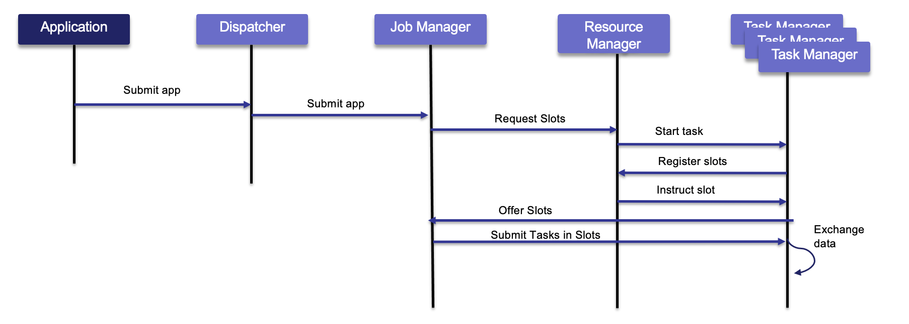
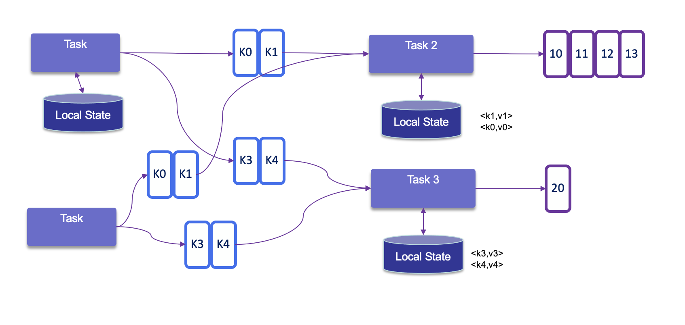
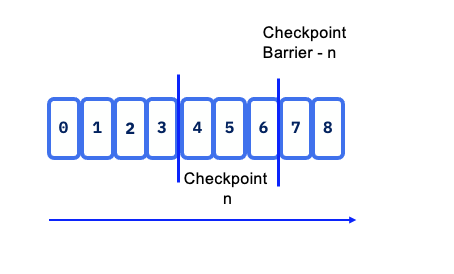
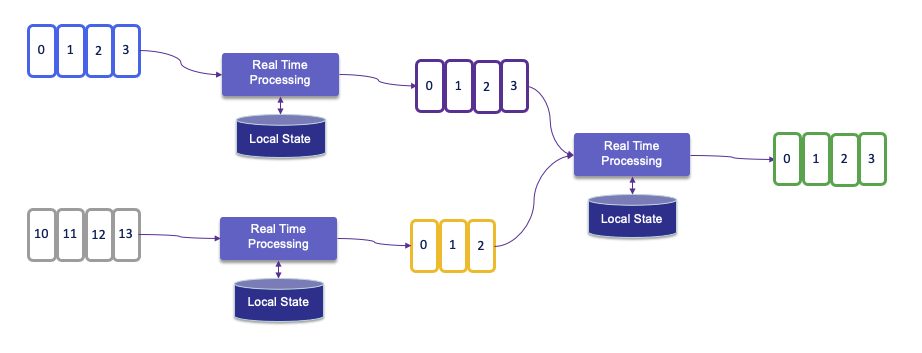

# Flink architecture

???- info "Update"
    * Created 2018 
    * Updated 11/2024 - review done.
    * 12/2024: move fault tolerance in this chapter

## Runtime architecture

Flink consists of a **Job Manager** and `n` **Task Managers** deployed on `k` hosts. 

<figure markdown="span">

<figcaption>Main Flink Components</figcaption>
</figure>

The **JobManager** controls the execution of a single application. Developers submit their application (jar file or SQL statements) via CLI, or k8s manifest. Job Manager receives the Flink application for execution and builds a Task Execution Graph from the defined **JobGraph**. It manages job submission which parallelizes the job and distributes slices of [the Data Stream](https://ci.apache.org/projects/flink/flink-docs-stable/dev/datastream_api.html) flow, the developers have defined. Each parallel slice of the job is a task that is executed in a **task slot**.  

Once the job is submitted, the **Job Manager** is scheduling the job to different task slots within the **Task Manager**. The Job manager may create resources from a computer pool, or when deployed on kubernetes, it creates pods. 

The **Resource Manager** manages Task Slots and leverages an underlying orchestrator, like Kubernetes or Yarn (deprecated).

A **Task slot** is the unit of work executed on CPU.
The **Task Managers** execute the actual stream processing logic. There are multiple task managers running in a cluster. The number of slots limits the number of tasks a TaskManager can execute. After it has been started, a TaskManager registers its slots to the ResourceManager:

<figure markdown="span">

<figcaption>Sequence flow from job submission</figcaption>
</figure>

The **Dispatcher** exposes API to submit applications for execution. It hosts the user interface too.

Once the job is running, the Job Manager is responsible to coordinate the activities of the Flink cluster, like checkpointing, and restarting task manager that may have failed.

Tasks are loading the data from sources, do their own processing and then send data among themselves for repartitioning and rebalancing, to finally push results out to the sinks.

When Flink is not able to process a real-time event, it may have to buffer it, until other necessary data has arrived. This buffer has to be persisted in longer storage, so data are not lost if a task manager fails and has to be restarted. In batch mode, the job can reload the data from the beginning. In batch the results are computed once the job is done (count the number of record like `select count(*) AS `count` from bounded_pageviews;` return one result), while in streaming mode, each event may be the last one received, so results are produced incrementally, after every events or after a certain period of time based on timers.


???- "Parameters"
    *  taskmanager.numberOfTaskSlots: 2

Once Flink is started (for example with the docker image), Flink Dashboard [http://localhost:8081/#/overview](http://localhost:8081/#/overview) presents the execution reporting:

<figure markdown="span">

<figcaption>Flink User Interface</figcaption>
</figure>

The execution is from one of the training examples, the number of task slot was set to 4, and one job is running.

Spark Streaming is using microbatching which is not a true real-time processing while Flink is a RT engine. Both Flink and Spark support batch processing. 

Only one Job Manager is active at a given point of time, and there may be `n` Task Managers. It is a single point of failure, but it startes quickly and can leverage the checkpoints data to restart its processing.

There are different [deployment models](https://ci.apache.org/projects/flink/flink-docs-release-1.20/ops/deployment/): 

* Deploy on executing cluster, this is the **session mode**. Use **session** cluster to run multiple jobs: we need a separate JobManager container for that. 
* **Per job** mode: spin up a cluster per job submission. This provides better resource isolation. 
* **Application mode**: creates a cluster per app with the `main()` function executed on the JobManager. It can include multiple jobs but they run inside the app. It allows for saving the required CPU cycles, but also save the bandwidth required for downloading the dependencies locally.

Flink can run on any common resource manager like Hadoop Yarn, Mesos, or Kubernetes. For development purpose, we can use docker images to deploy a **Session** or **Job cluster**.

See also [deployment to Kubernetes](../coding/k8s-deploy.md)

The new K8s operator, deploys and monitors Flink Application and Session deployments.

## Batch processing

Process all the data in one job with bounded dataset. It is used when we need all the data, to assess trend, develop AI model, and with a focus on throughput instead of latency. Jobs are run when needed, on input that can be pre-sorted by time or by any other key.

The results are reported at the end of the job execution. Any failure means to do of full restart of the job.

Hadoop was designed to do batch processing. Flink has capability to replace the Hadoop map-reduce processing.

When latency is a major requirements, like monitoring and alerting, fraud detection then streaming is the only choice.


## State management

[See 'working with state' from Flink documentation](https://nightlies.apache.org/flink/flink-docs-master/docs/dev/datastream/fault-tolerance/state/).

* All data maintained by a task and used to compute the results of a function belong to the state of the task. Function may use <k,V> pairs to store values, and may implement The ChekpointedFunctions to make local state fault tolerant.

* While processing the data, the task can read and update its state and computes its results based on its input data and state.
* State management may address very large states, and no state is lost in case of failures.
* Within a DAG, each operator needs to register its state.
* **Operator state** is scoped to an operator task: all records processed by the same parallel task have access to the same state.
* **Keyed state** is maintained and accessed with respect to a key defined in the records of an operator’s input stream. Flink maintains one state instance per key value and Flink partitions all records with the same key to the operator task that maintains the state for this key. The key-value map is sharded across all parallel tasks:

<figure markdown="span">
{ width=600 }
<figcaption>Keyes states</figcaption>
</figure>

* Each task maintains its state locally to improve latency. For small state, the state backends will use JVM heap, but for larger state RocksDB is used. A [**state backend**](https://nightlies.apache.org/flink/flink-docs-master/docs/ops/state/state_backends/) takes care of checkpointing the state of a task to a remote and persistent storage.
* With stateful distributed processing, scaling stateful operators, enforces state repartitioning and assigning to more or fewer parallel tasks. Keys are organized in key-groups, and key groups are assigned to tasks. Operators with operator list state are scaled by redistributing the list entries. Operators with operator union list state are scaled by broadcasting the full list of state entries to each task.

???- info "State Backend"
    * Embedded rockdb will persist on Task manager local data directories. It saves asynchronously. Serializes using bytes. But there is a limit to the size per key and valye of 2^31 bytes. Supports incremental checkpoints
    * ForStState use tree structured k-v store. May use object storage for remote file systems. Allows Flink to scale the state size beyond the local disk capacity of the TaskManager. 
    * `HashMapStateBackend` use Java heap to keep state, as java object. So unsafe to reuse!.

## High Availability

With Task managers running in parallel, if one fails the number of available slots drops, and the JobManager asks the Resource Manager to get new processing slots. The application's restart strategy determines how often the JobManager restarts the application and how long it waits between restarts.

Flink OSS uses Zookeeper to manage multiple JobManagers and select the leader to control the execution of the streaming jobs. Application's tasks checkpoints and other states are saved in a remote storage, but metadata are saved in Zookeeper. When a JobManager fails, all tasks that belong to its application are automatically cancelled. A new JobManager that takes over the work by getting information of the storage from Zookeeper, and then restarts the process with the JobManager.


## Fault Tolerance

The two major Flink features to support fault tolerance are the checkpoints and savepoints. 

### Checkpointing

[Checkpoints](https://nightlies.apache.org/flink/flink-docs-release-1.20/docs/ops/state/checkpoints/) are snapshots of the input data stream, capturing the state of each operator, of the DAG, at a specific point in time. They are created automatically and periodically by Flink. The saved states are used to recover from failures, and checkpoints are optimized for quick recovery.

**Checkpoints** allow a streaming dataflow to be resumed from a checkpoint while maintaining consistency through exactly-once processing semantics. When a failure occurs, Flink can restore the state of the operators and replay the records starting from the checkpoint.

In the event of a failure in a parallel execution, Flink halts the stream flow and restarts the operators from the most recent checkpoints. During data partition reallocation for processing, the associated states are also reallocated. States are stored in distributed file systems, and when Kafka is used as the data source, the committed read offsets are included in the checkpoint data.

Checkpointing is coordinated by the Job Manager, it knows the location of the latest completed checkpoint which will get important later on. This checkpointing and recovery mechanism can provide exactly-once consistency for application state, given that all operators checkpoint and restore all of their states and that all input streams are reset to the position up to which they were consumed when the checkpoint was taken. This will work perfectly with Kafka, but not with sockets or queues where messages are lost once consumed. Therefore exactly-once state consistency can be ensured only if all input streams are from reset-able data sources.

As part of the checkpointing process, Flink saves the 'offset read commit' information of the append log, so in case of a failure, Flink recovers the stateful streaming application by restoring its state from a previous checkpoint and resetting the read position on the append log.

During the recovery and depending on the sink operators of an application, some result records might be emitted multiple times to downstream systems. Downstream systems need to be idempotent.

Flink utilizes the concept of **Checkpoint Barriers** to delineate records. These barriers separate records so that those received after the last snapshot are included in the next checkpoint, ensuring a clear and consistent state transition.

Barrier can be seen as a mark, a tag, in the data stream and aims to close a snapshot. 

<figure markdown="span">
 { width=600 }
<figcaption>Checkpointing concepts</figcaption>
</figure>

Checkpoint barriers flow with the stream, allowing them to be distributed across the system. When a sink operator — located at the end of a streaming Directed Acyclic Graph (DAG) — receives `barrier n` from all its input streams, it acknowledges `snapshot n` to the checkpoint coordinator.

Once all sink operators have acknowledged a snapshot, it is considered completed. After `snapshot n` is finalized, the job will not request any records from the source prior to that snapshot, ensuring data consistency and integrity.

State snapshots are stored in a [state backend](https://nightlies.apache.org/flink/flink-docs-master/docs/ops/state/state_backends/), which can include options such as in-memory storage, HDFS, object storage or RocksDB. This flexibility allows for optimal performance and scalability based on the application’s requirements.

In the context of a KeyedStream, Flink functions as a key-value store where the key corresponds to the key in the stream. State updates do not require transactions, simplifying the update process.

For DataSet (Batch processing) there is no checkpoint, so in case of failure the stream is replayed from the beginning.

When addressing exactly once processing, it is crucial to consider the following steps:

* **Read Operation from the Source**: Ensuring that the data is read exactly once is foundational. Flink's source connectors are designed to handle this reliably through mechanisms like checkpointing.
* **Apply Processing Logic** which involves operations such as window aggregation or other transformations, which can also be executed with exactly-once semantics when properly configured.
* **Generate Results to a Sink** introduces more complexity. While reading from the source and applying processing logic can be managed to ensure exactly-once semantics, generating a unique result to a sink depends on the target technology and its capabilities. Different sink technologies may have varying levels of support for exactly-once processing, requiring additional strategies such as idempotent writes or transactional sinks to achieve the desired consistency.

<figure markdown="span">
{ width=800 }
<figcaption>End-to-end exactly once</figcaption>
</figure>

After reading records from Kafka, processing them, and generating results, if a failure occurs, Flink will revert to the last committed read offset. This means it will reload the records from Kafka and reprocess them. As a result, this can lead to duplicate entries being generated in the sink:

<figure markdown="span">
{ width=800 }
<figcaption>End-to-end recovery</figcaption>
</figure>

Since duplicates may occur, it is crucial to assess how downstream applications handle idempotence. Many distributed key-value stores are designed to provide consistent results even after retries, which can help manage duplicate entries effectively.

To achieve end-to-end exactly-once delivery, it is essential to utilize a sink that supports transactions and implements a two-phase commit protocol. In the event of a failure, this allows for the rollback of any output generated, ensuring that only successfully processed data is committed. However, it's important to note that implementing transactional outputs can impact overall latency.

Flink takes checkpoints periodically — typically every 10 seconds — which establishes the minimum latency we can expect at the sink level. This periodic checkpointing is a critical aspect of maintaining state consistency while balancing the need for timely data processing.

For Kafka Sink connector, as kafka producer, we need to set the `transactionId`, and the delivery guarantee type:

```java
new KafkaSinkBuilder<String>()
    .setBootstrapServers(bootstrapURL)
    .setDeliverGuarantee(DeliveryGuarantee.EXACTLY_ONCE)
    .setTransactionalIdPrefix("store-sol")
```

With transaction ID, a sequence number is sent by the Kafka producer API to the broker, and so the partition leader will be able to remove duplicate retries.

<figure markdown="span">
{ width=800 }
<figcaption>End-to-end with Kafka transaction id</figcaption>
</figure>

When the checkpointing period is set, we need to also configure `transaction.max.timeout.ms` of the Kafka broker and `transaction.timeout.ms` for the producer (sink connector) to a higher timeout than the checkpointing interval plus the max expected Flink downtime. If not the Kafka broker will consider the connection has failed and will remove its state management.


The evolution of microservice is to become more event-driven, which are stateful streaming applications that ingest event streams and process the events with application-specific business logic. This logic can be done in flow defined in Flink and executed in the clustered runtime.

<figure markdown="span">

<figcaption>Event-driven application as a sequence of Flink apps</figcaption>
</figure>

State is always accessed locally, which helps Flink applications achieve high throughput and low-latency. Developers can choose to keep state on the JVM heap, or if it is too large, save it on-disk.

<figure markdown="span">
 
<figcaption>Different State Storage</figcaption>
</figure>

### Savepoints

Savepoints are user triggered snapshot at a specific point in time. It is used during system operations like product upgrades. The Flink operator for kubernetes has [custom resource definition](../coding/k8s-deploy.md#ha-configuration) to support the savepoint process. See also the end to end demo for savepoint in [this folder.](https://github.com/jbcodeforce/flink-studies/blob/master/e2e-demos/savepoint-demo)


### FAQs

### Checkpoints impact throughput

* The persistence to remote storage is done asynchronously, but at the level of a task. So too frequent checkpointing will impact throughput. Now it also depends if the tasks are compute or IO intensive. 

### Interuption while writing checkpoints

* The processing will restart from the last persisted checkpoints so no data loss. Specially true when source of the data are coming from Kafka topics. The checkpoint points to last read-commited offset within topic/partition so Flink will reload from there

### When Flink cluster has 10 nodes what happen in one node failure

It will depend of the operator allocation to the task to the task manager and what the operator needs (as state). At worse case the full DAG needs to be restored, every operator needs to rebuild their state so multiple task managers in the cluster.

It can take sometime to recover. Reread data and reprocess it, will take many seconds, or minutes. 

With hot-hot deployment, it is possible to get the same running application running in parallel, and then switch the output sink / topic for the consumer. For real-time payment we can achieve around 3 to 7 seconds recovery time, with million of records per second.  

### Can we set one task manager one task to run all a DAG to make it simple?

It will depend of the application state size and logic to operate. If all state stays in memory, yes this is a common pattern to use. If state are bigger than physical memory of the computer running the task manager, then the processing needs more computers, so more task managers and need to distribute data. Then it needs distributed storage to persist states. 

## Network Stack

The Flink network stack helps connecting work units across TaskManagers using Netty. Flink uses a credit-based flow control for managing buffer availability and preventing backpressure.

See the [Deep dive article in Flink network stack](https://flink.apache.org/2019/06/05/a-deep-dive-into-flinks-network-stack/)
