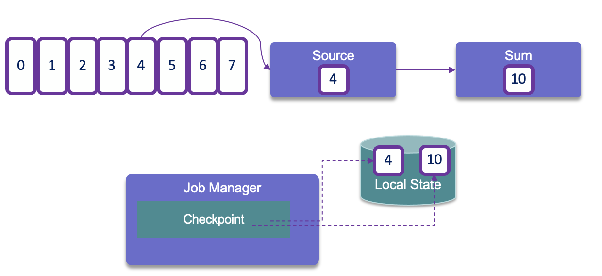
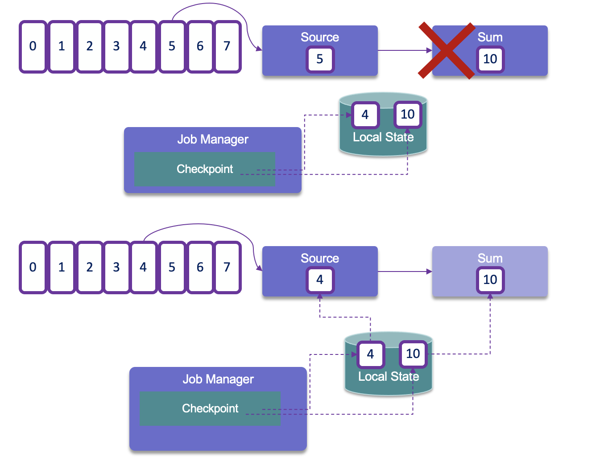

# Flink architecture

## Runtime architecture

Flink consists of a **Job Manager** and n **Task Managers**. 

 

The **JobManager** controls the execution of a single application. It receives an application for execution and builds a Task Execution Graph from the defined Job Graph. It manages job submission which parallelizes the job and distributes slices of [the Data Stream](https://ci.apache.org/projects/flink/flink-docs-stable/dev/datastream_api.html) flow, the developers have defined. Each parallel slice of the job is executed in a **task slot**.  

Once the job is submitted, the **Job Manager** is scheduling the job to different task slots within the **Task Manager**. The Job manager may create resources from a computer pool, or when deployed on kubernetes, it creates pods. 

The **Resource Manager** manages Task Slots and leverages underlying orchestrator, like Kubernetes or Yarn.

A **Task slot** is the unit of work executed on CPU.
The **Task Managers** execute the actual stream processing logic. There are multiple task managers running in a cluster. The number of slots limits the number of tasks a TaskManager can execute. After it has been started, a TaskManager registers its slots to the ResourceManager:

The **Disparcher** exposes API to submit applications for execution. It hosts the user interface too.

Once the job is running, the Job Manager is responsible to coordinate the activities of the Flink cluster, like checkpointing, and restarting task manager that may have failed.

Tasks are loading the data from sources, do their own processing and then send data among themselves for repartitioning and rebalancing, to finally push results out to the sinks.

When Flink is not able to process a real-time event, it may have to buffer it, until other necessary data has arrived. This buffer has to be persisted in longer storage, so data are not lost if a task manager fails and has to be restarted. In batch mode, the job can reload the data from the beginning. In batch the results are computed once the job is done (count the number of record like `select count(*) AS `count` from bounded_pageviews;` return one result), while in streaming, each event may be the last one recieved, so results are produced incrementally, after every events or after a certain period of time based on timers.

???- "Parameters"
    *  taskmanager.numberOfTaskSlots: 2

Once Flink is started (for example with the docker image), Flink Dashboard [http://localhost:8081/#/overview](http://localhost:8081/#/overview) presents the execution reporting:

 

The execution is from one of the training examples, the number of task slot was set to 4, and one job is running.

Spark Streaming is using microbatching which is not a true real-time processing while Flink is. Both Flink and Spark support batch processing. 

Only one Job Manager is active at a given point of time, and there may be `n` Task Managers. It is a single point of failure, but it startes quickly and can leverage the checkpoints data to restart its processing.

There are different [deployment models](https://ci.apache.org/projects/flink/flink-docs-release-1.14/ops/deployment/): 

* Deploy on executing cluster, this is the **session mode**. Use **session** cluster to run multiple jobs: we need a JobManager container. 
* **Per job** mode, spin up a cluster per job submission. This provides better resource isolation. 
* **Application mode** creates a cluster per app with the main() function executed on the JobManager. It can include multiple jobs but they run inside the app. It allows for saving the required CPU cycles, but also save the bandwidth required for downloading the dependencies locally.

Flink can run on any common resource manager like Hadoop Yarn, Mesos, or Kubernetes. For development purpose, we can use docker images to deploy a **Session** or **Job cluster**.

See also [deployment to Kubernetes](../coding/k8s-deploy.md)

The new K8s operator, deploys and monitors Flink Application and Session deployments.

! add screen shot of k8s deployment

## Batch processing

Process all the data in one job with bounded dataset. It is used when we need all the data, to assess trend, develop AI model, and with a focus on throughput instead of latency. Jobs are run when needed, on input that can be pre-sorted by time or by any other key.

The results are reported at the end of the job execution. Any failure means to do of full restart of the job.

Hadoop was designed to do batch processing. Flink has capability to replace the Hadoop map-reduce processing.

When latency is a major requirements, like monitoring and alerting, fraud detection then streaming is the only choice.
 
## High Availability

With Task managers running in parallel, if one fails the number of available slots drops, and the JobManager asks the Resource Manager to get new processing slots. The application's restart strategy determines how often the JobManager restarts the application and how long it waits between restarts.

Flink uses Zookeeper to manage multiple JobManagers and select the leader to control the execution of the streaming application. Application's tasks checkpoints and other states are saved in a remote storage, but metadata are saved in Zookeeper. When a JobManager fails, all tasks that belong to its application are automatically cancelled. A new JobManager that takes over the work by getting information of the storage from Zookeeper, and then restarts the process with the JobManager.

## State management

* All data maintained by a task and used to compute the results of a function belong to the state of the task.
* While processing the data, the task can read and update its state and compute its result based on its input data and state.
* State management may address very large states, and no state is lost in case of failures.
* Each operator needs to register its state.
* **Operator State** is scoped to an operator task: all records processed by the same parallel task have access to the same state
* **Keyed state** is maintained and accessed with respect to a key defined in the records of an operator’s input stream. Flink maintains one state instance per key value and Flink partitions all records with the same key to the operator task that maintains the state for this key. The key-value map is sharded across all parallel tasks:

* Each task maintains its state locally to improve latency. For small state, the state backends will use JVM heap, but for larger state RocksDB is used. A **state backend** takes care of checkpointing the state of a task to a remote and persistent storage.
* With stateful distributed processing, scaling stateful operators, enforces state repartitioning and assigning to more or fewer parallel tasks. Keys are organized in key-groups, and key groups are assigned to tasks. Operators with operator list state are scaled by redistributing the list entries. Operators with operator union list state are scaled by broadcasting the full list of state entries to each task.

Flink uses **Checkpointing** to periodically store the state of the various stream processing operators on durable storage. 

When recovering from a failure, the stream processing job can resume from the latest checkpoint. 

Checkpointing is coordinated by the Job Manager, it knows the location of the latest completed checkpoint which will get important later on. This checkpointing and recovery mechanism can provide exactly-once consistency for application state, given that all operators checkpoint and restore all of their states and that all input streams are reset to the position up to which they were consumed when the checkpoint was taken. This will work perfectly with Kafka, but not with sockets or queues where messages are lost once consumed. Therefore exactly-once state consistency can be ensured only if all input streams are from resettable data sources.

During the recovery and depending on the sink operators of an application, some result records might be emitted multiple times to downstream systems.

