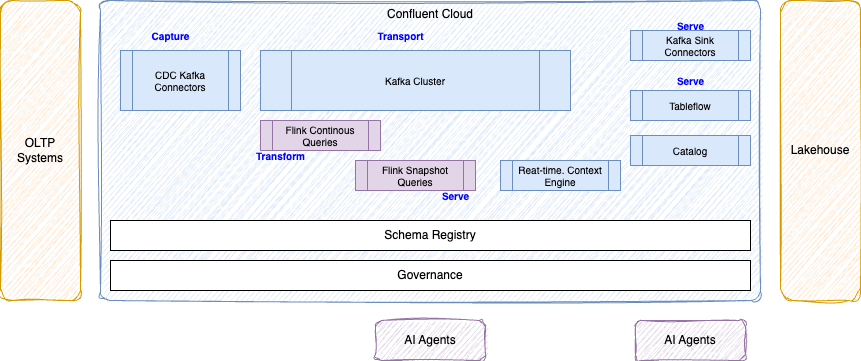

# Streamhouse

[Streamhouse](https://streamhouse.com/) is an open, vendor-neutral category for data architectures that keep the current state of a business continuously available to production applications, analytics, and AI agents. This is a key initiative, started by Ververica and embrassed by Confluent and IBM in 2026 with the need to serve fresh data to human and AI agents.

## High level View

It groups change data capture, event streams, stream processing, open table formats, catalogs, and low-latency serving. 

<figure markdown='span'>

<caption>High-level capabilities</caption>
</figure>

**Data remains continuously current as business events occur**. Streamhouse is in the operational critical path for data production to human and AI agents.

This is the architecture to support the end-to-end vision of data as a product, starting from the [methodology](../methodology/data_as_a_product.md/). 

## Concrete Confluent Based Architecture

The Confluent distribution of a streamhouse is the Data streaming platform (DSP). The DSP is a  complete, cloud-native foundation. It is built on open standards such as Apache Kafka, Apache Flink and Apache Iceberg and offers proprietary, differentiated features designed to abstract complexity of building and operating a streamhouse.

<figure markdown='span'>

<caption>High-level Confluent Cloud Streamhouse</caption>
</figure>

* A snapshot query is a one-time Flink SQL query that reads a consistent, point-in-time view of a table, returns the results, and then terminates
