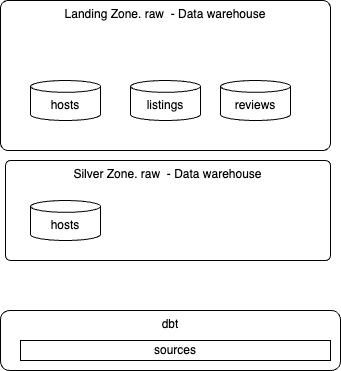

# Data Build Tool Summary

* [Dbt core](https://github.com/dbt-labs/dbt-core) is an open source ELT CLI and database agnostic used to allow data analysts and engineers to build reliable, modular data pipelines, creating "models" (SELECT statements) that are version-controlled, automatically documented, and tested for quality before consumption by analytics tools.  Learn more about `dbt` [in the docs](https://docs.getdbt.com/docs/introduction).
* [dbt Cloud](https://www.getdbt.com/product/dbt): A managed service with a web-based IDE, scheduler, job orchestration, and monitoring

Supported by ISVs in lake house market. 

## Relation with Flink

Confluent has also developed a [dbt adapter](https://pypi.org/project/dbt-confluent/) to deploy Flink SQL statements into Confluent Cloud for Flink.

```sh
pip install dbt-confluent
# or
uv add  dbt-confluent
```

Flink SQLs are defined in Models and `dbt` processes to the deployment to Confluent Cloud using the REST API. When adopting a 'shift left' strategy of moving part of the star model to real time processing, it makes sense to manage real-time streaming project as data engineers manages datawarehouse or lakehouse projects.

We will first work on a concrete [example on a database](), and then work on a [Flink project]().

[See Confluent cloud product documentation on dbt.](https://docs.confluent.io/cloud/current/flink/operate-and-deploy/deploy-flink-dbt.html)

## Use Cases

* Modelling changes are easy to follow and revert
* Explicit dependencies between models
* Data quality tests
* Incremental load of fact tables
* Track history of dimension tables
* Support automated testing, document generation, and data lineage visualization

## Install

* We need Python, as `dbt` should be installed in a virtual environment. [See installation instructions](https://docs.getdbt.com/docs/core/installation-overview). See the [supported Python database](https://docs.getdbt.com/faqs/Core/install-python-compatibility)
* Create a `$HOME/.dbt` folder to let `dbt` persists the `profile.yaml` file to keep user and Database credentials. 
1. Start a new python session under your working folder (e.g. dbt)
  ```sh
  uv venv
  source .venv/bin/activate
  ```
1. Install `dbt`, and dbt adapters
  ```sh
  uv add dbt-duckdb
  ```

## Getting started

We will go over the getting the foundations of a project, and then go over the main concepts while implementing the examples.

a `dbt` project is a directory on the data engineer's machine containing a lot of .sql files (called models) and YAML files for configurations.

### A data warehouse example

This example is in [code/dbt/airbnb](https://github.com/jbcodeforce/flink-studies/tree/master/code/dbt/airbnb).

1. Create the `dbt` project
    ```sh
    dbt init airbnb
    ```

    while running this, it will ask to set the `dbt` profile for this project (I selected duckdb). A project profile is a YAML file containing the connection details for your chosen data platform.  When there is an existing `~/.dbt/profiles.yml`, the previous command will add a new stanza to it.

    ```yaml
    airbnb:
      outputs:
        dev:
          type: duckdb
          path: dev.duckdb
          threads: 1

        prod:
          type: duckdb
          path: prod.duckdb
          threads: 4

      target: dev
    ```

    It specifies two configurations, `dev` and `prod`, with different data warehouse connections. The path specifies where in the working directory (e.g. airbnd) the database will be created.

    This will also create a set of folders to manage all the needed elements of data pipelines:
      
      ```
      models
      analyses
      tests
      seeds
      macros
      snapshots
      ```

      and the `dbt_project.yml`file to define `dbt` settings. 

1. Understand the `dbt_project.yml`
    * It refences the profile to use, the different paths to use
      ```yaml
      profile: 'airbnb'
      ```
    *  and the models may have many resources configured at once:
      ```yaml
      models:
        models:
          # namespace for model configs matching the project name
          airbnb:
            +materialized: view
      ```

Next we will cover the `dbt` [main concepts](#major-concepts) with concrete examples.

### A Confluent Cloud Flink example


[Confluent dbt adapter](https://docs.confluent.io/cloud/current/flink/operate-and-deploy/deploy-flink-dbt.html) aims to support standard `dbt` commands (init, debug, run, test, docs generate, etc.) against Confluent Cloud for Flink, so teams can manage pipelines end-to-end from `dbt` rather than using Terraform or confluent cli.

* For Confluent the adapter is installed via:
    ```sh
    uv add dbt-confluent
    ```

* Create the project
  ```sh
  dbt init flink_workshop
  ```
  
  The profile may include references to environment variables for API KEY and SECRET.
    ```yaml
    flink_workshop:
    outputs:
      dev:
        cloud_provider: aws
        cloud_region: us-west-2
        compute_pool_id: lfcp-
        dbname: j9r-kafka
        environment_id: env-
        execution_mode: streaming_query
        flink_api_key: "{{ env_var('CONFLUENT_FLINK_API_KEY') }}"
        flink_api_secret: "{{ env_var('CONFLUENT_FLINK_API_SECRET') }}"
        organization_id: 49......44
        statement_label: dbt-confluent
        statement_name_prefix: dbt-
        threads: 1
        type: confluent
    ```

## Major Concepts

* Batching in `dbt` with a data warehouse, like DuckDB or Snowflake, is primarily managed through different materialization strategies: 
    * *Table*: Replaces the entire target table with each run. Ideal for smaller datasets or full-refresh batches.
    * *Incremental*: Updates only new or changed data using append, merge, or delete+insert.
    * *Microbatch*: Breaks massive datasets into smaller, time-based segments (e.g., daily) that process independently.
    * *External*: Reads from and exports results directly to files (Parquet, CSV, JSON) on local storage or S3.

* `dbt` encourages building complex transformations in smaller, reusable SQL steps, reducing repetitive code.
* `dbt` uses a template mechanism (jinja), functions and a set of features to organize SQL and cross reference them. 
* The mandatory file for a project is the `dbt_project.yml` file as it contains information that tells `dbt` how to operate the project. `dbt` demarcates between a folder name and a configuration by using a + prefix before the configuration name.
* **Models**: are the basic building blocks of the business logic. They includes materialized tables and views, and SQL files. Models can reference each others and use templates and macros. 
* **Resources types** includes models, seeds, snapshots, tests, sources
* **Properties** describe resources
* **Configurations** control how `dbt` builds resources in the warehouse. Could be set cross resources in `dbt_project.yml`, in a `properties.yml` under a folder, `config()` in a sql or resource file.

### Models

Models are built in logical layers to keep the pipeline clean and scalable. They are dependent on each other, forming a Direct Acyclic Graph.

* Staging (stg_): Clean and rename the raw data (e.g., lowercase names, fix boolean types).
* Intermediate (int_): Perform complex joins, aggregations, and business logic here.
* Marts (fct_ or dim_): The final, analytics-ready models

The table below lists when to use View vs Table:

|  | View | Table|
| --- | --- | --- |
| **Purpose** | Use for minor transformation | For intensive transformation |
| **Execution** | At runtime and when referenced | Pre-executed, with the results saved in tables |
| **Storage** | None | Need Storage space for materialized tables |
| **Performance** | Lot of steps leads to slower performance | Chained processes get improved perf. | 

* `dbt` provides built-in testing (e.g., uniqueness, non-null checks) to catch broken logic 
* **schema** is the data contract of elements of the model, and defined in a separate yaml file.
* There are two macros to cross reference tables: `{{ ref() }}` used to reference a table within a model and `{{source() }}` to reference external data sources. 

???+ handson "Create the first model"
    [See the duckdb example](https://github.com/jbcodeforce/flink-studies/tree/master/code/dbt/airbnb). Let start by seeding reference data into the warehouse from a csv file. The `seeds/` folder includes all the csv to map to table inside duckdb. The following command let `dbt` to look inside the `seeds/` folder of your project, find any .csv files, and upload them as physical tables into your database.

    ```sh
    dbt seed --target dev
    ```

    Raw data are created in tables in a `raw` schema, as data landing zone.

    

    Once created, the second step, is to add `dbt` sources


#### Create sources

Sources are defined using a YAML file [`sources.yml`](https://docs.getdbt.com/reference/source-properties) inside your `models/` directory.

```yaml
sources:
  - name: airbnb  # This is the internal dbt name for the source
    schema: raw   # The actual schema name in your warehouse
    tables:
      - name: listings # This is the name of the raw table in the data warehouse
        identifier: raw_listings
```

When in sources, it is possible to reference the table with: `select * from {{ source('airbnb', 'listings') }}`. One first examples is to implement deeduplication, filtering and column renaming. This can be done by adding a `models/sources` folder and add a SQL like:

```sql
WITH ranked_hosts AS (
    SELECT
        *,
        ROW_NUMBER() OVER (
            PARTITION BY id
            ORDER BY updated_at DESC, created_at DESC
        ) AS row_num
    FROM
        {{ source('airbnb', 'hosts') }}
    WHERE id IS NOT NULL
)
SELECT
    id AS host_id,
    name AS host_name,
    is_superhost,
    created_at,
    updated_at
FROM
    ranked_hosts
WHERE
    row_num = 1
```

So running the following command will create the new table for cleaned records:

```sh
dbt run --target dev
# returns
Found 1 seed, 3 sources, 474 macros
```

which can be validated by opening the duckdb database:

```sql
duckdb data/airbnb.duckdb
# in the shell
select * from main.src_hosts;
```

Same may be done for `raw_reviews`, `raw_listings`

* For source freshness, we need to consider one DATE column and add a config element to the table to define refreshness condition:
    ```yaml
    - name: reviews
      identifier: raw_reviews
      config:
        loaded_at_field: date
        freshness:
            warn_after: {count: 1, period: hour}
            error_after: {count: 24, period: hour}
    ```

* Run the command: `dbt source freshness` to validate the data freshness.


### Project structure

`dbt` recursively scans everything under model-paths (by default models/). `dbt run`, `dbt build`, and `dbt seed` will all find those `.sql` files and deploy/run them.

The folder structure under the models folder can be a hierarchy based on the kimball architecture or star schema [See PM methodology](../cookbook/pm.md#flink-project-management):
```sh
models/
  sources/
    hosts/
      src_hosts.sql
    listings/
      src_listings.sql
  dimensions/
    hosts/
      dim_hosts_cleansed.sql
  facts/
    reviews/
      fct_reviews.sql
```

`dbt` names a model from the file name, not from the folder path.
`
* For `models/sources/src_hosts.sql` the model name is `src_hosts`
* Use `ref('src_hosts')`, not `ref('sources.hosts.src_hosts')`

So if two subfolders both contain model.sql, you get a name collision, therefore it is recommended to use distinct filenames (dim_hosts.sql, fct_reviews.sql), or set an explicit alias in config.

For incremental deployment it should be possible to run `dbt` as:
```sh
uv run dbt run --select dimensions.hosts 
# or --select dimensions.*

# Select a unique model
uv run dbt  run --project-dir . --select withdrawals_by_account.sql --target dev --profiles-dir ~/.dbt --full-refresh
```

### Materializations

There are four possible materializations for a model:

* **View:** this is a lightweight representation of the data,  not reused. no recreation of the table at each execution.
* **Table:** reusable data in external table, recreated at each run
* **Incremental:** fact tables appends to tables - more like event data - table is not recreated each time.
* **Ephemeral (CTEs):** aliasing of the data and filtering data. Not adversitized in the data warehouse. For example all the sql under the `sources` are becoming CTEs

Materialization can be set globally in the `dbt_profile.yaml`: all models are views, except in the `dimensions` folder where there are tables:

```yaml
models:
  airbnb:
    +materialized: view
    dimensions:
      +materialized: table 
    sources:
      +materialized: ephemeral
```

Also it is possible to define at the model level the materialization: 

* Create dimensions folder, add sql with config:
  ```sql 
  {{
    config(
      materialized = 'view'
      )
  }}
  SELECT
    listing_id,
    listing_name,
    room_type,
    CASE
      WHEN minimum_nights = 0 THEN 1
      ELSE minimum_nights
    END AS minimum_nights,
    host_id,
    CAST(
      REPLACE(price_str, '$', '') AS DECIMAL(10, 2)
    ) AS price,
    created_at,
    updated_at
  FROM    {{ ref('src_listings') }}
  ```


### Incremental

Each time dbt run, the tables will be recreated in the data warehouse. But Fact tables may be kept and the dml can run to continue processing only new records. To do so 
we need to specify the materialization to be `incremental`. We also want to stop the dml if schema is changed, for that we add conditions: `on_schema_change='fail'`.
  ```sql
  {{
    config(
      materialized = 'incremental',
      on_schema_change='fail'
      )
  }}
  WITH src_reviews AS (
    SELECT * FROM {{ ref('src_reviews') }}
  )
  SELECT * FROM src_reviews
  WHERE review_text is not null

  
    AND review_date > (select max(review_date) from {{ this }})
  
  ```

  Finally we need to specify how dbt should increment records in this fact table: this is done by adding jinja template to test if dbt run in incrementatl mode, therefore condition could be added on one of the column like the `review_date` of the record. It needs to be after the last record in the `fct_reviews` table () '{{ this }}'.

* `dbt run` with run the fct_reviews in incremental view. If we add records to the raw_reviews with something like:
    ```sql
    INSERT INTO raw_reviews VALUES(3176, CURRENT_TIMESTANP(), 'j9r', 'Excellent sejour', 'positive');
    ```

    then rerun dbt, the new records will be added as last record in the fct_reviews.

* To rebuild everything, make a full-refresh:
  ```
  dbt run --full-refresh
  ```

* With the sources as ephemeral the output of `dbt` run becomes:
  ```sh
  23:16:16  1 of 4 START sql table model DEV.dim_hosts_cleansed ............................ [RUN]
  23:16:18  1 of 4 OK created sql table model DEV.dim_hosts_cleansed ....................... [SUCCESS 14111 in 1.93s]
  23:16:18  2 of 4 START sql table model DEV.dim_listings_cleansed ......................... [RUN]
  23:16:20  2 of 4 OK created sql table model DEV.dim_listings_cleansed .................... [SUCCESS 17499 in 2.47s]
  23:16:20  3 of 4 START sql incremental model DEV.fct_reviews ............................. [RUN]
  23:16:23  3 of 4 OK created sql incremental model DEV.fct_reviews ........................ [SUCCESS 0 in 2.37s]
  23:16:23  4 of 4 START sql table model DEV.dim_listings_with_hosts ....................... [RUN]
  23:16:24  4 of 4 OK created sql table model DEV.dim_listings_with_hosts .................. [SUCCESS 17499 in 1.58s]
  23:16:24  
  23:16:24  Finished running 1 incremental model, 3 table models in 0 hours 0 minutes and 9.83 seconds (9.83s).
  ```

* `dbt compile` does not deploy to the target data warehouse
    ```sh
    23:39:49  Running with dbt=1.11.6
    23:39:50  Registered adapter: snowflake=1.11.2
    23:39:50  Found 8 models, 1 seed, 3 sources, 522 macros
    23:39:50  
    23:39:50  Concurrency: 1 threads (target='dev')
    ```

#### Incremental strategies

| mode             | pros | cons |
| ---------------- | ---- | ---- |
| append           | simplest. fully transparent logic | no duplicate checks |
| merge            | idempotent. updates existing records | slower, require unique key |
| delete+insert    | works for data warehouse without merge. | two operations. require unique key |
| insert+overwrite | fast for partitioned tables | requires partitioned table. Replaces the whole partitions|


This is set in the config() element.

```
  {{
    config(
      materialized = 'incremental',
      on_schema_change='fail',
      incremental_strategy='merge',
      
      )
  }}
```

! STOPPED HERE

### Type-2 slowly changing dimensions

The goal is to keep history of changes to the records over time and not just the last record per key. `dbt` adds `dbt_valid_from` and `dbt_valid_to` columns to mark each records to be valid time from and to. A current correct records have `dbt_valid_to` sets to null.

**snapshots** live in the snapshot folder. There are two strategies for assessing data changes:
* *Timestamp*: a unique key and updated_at fields is defined at the source model. These columns are used for determining changes
* *Check*: any changes in a set of columns (or all columns) will be picked up as an update.

* To create snapshots we need a yaml file under the snapshot folder:
    ```yaml
    snapshots:
    - name: scd_raw_listings
        relation: source('airbnb', 'listings')
        config:
        unique_key: id
        strategy: timestamp
        updated_at: updated_at
        hard_deletes: invalidate
    ```

* the `dbt snapshot` will create a new table with the columns added for the referenced table.
    ```sh
    00:04:36  1 of 1 START snapshot DEV scd_raw_listings ..................................... [RUN] 
    00:04:40  1 of 1 OK snapshotted DEV.scd_raw_listings ..................................... [SUCCESS 17499 in 3.44s]
    ```

    

* An update to an existing record and a new `dbt snapshot` will create historical record.


## 
* Init a project: This command creates some folders to organize work inside the data project (without modifying user's profile).
    ```sh
    uv run dbt init --skip-profile-setup airbnb
    ```

### profile.yaml

* [profile.yaml](https://docs.getdbt.com/docs/local/profiles.yml?version=1.12) defines the structure of the project, and keeps information to connect to database.

## Work on Models

* Add Kimball structure as sources, dimensions, facts under the `models` folder
* Add SQL materialized view using `SELECT ...`. Do not use `INSERT INTO`, as it will be added automatically by `dbt`
* Validate each new SQL creation: within the folder with the `dbt_profile.yaml`, to build a view in Snowflake for example
    ```sh
    dbt run
    ```

    Example of output:
    ```sh
    22:20:56  Found 1 model, 522 macros
    22:20:56  
    22:20:56  Concurrency: 1 threads (target='dev')
    22:20:56  
    22:20:57  1 of 1 START sql view model DEV.src_listings ................................... [RUN]
    22:20:58  1 of 1 OK created sql view model DEV.src_listings .............................. [SUCCESS 1 in 1.17s]
    22:20:59  
    22:20:59  Finished running 1 view model in 0 hours 0 minutes and 2.78 seconds (2.78s).
    22:20:59  
    22:20:59  Completed successfully
    22:20:59  
    22:20:59  Done. PASS=1 WARN=0 ERROR=0 SKIP=0 NO-OP=0 TOTAL=1
    ```

    and within Snowflake:

    


* `dbt run` creates final sql queries under the `target` folder. This `run` command can also apply to a specific table:
  ```sh
  dbt run --select +models/facts/fct_reviews.sql
  ```

  The + in front of the name, specifies to deploy parents tables too.


## Tests

* Two types of tests:
    * Unit Tests
    * Data Tests: run on actual data

* There are two types of data tests: singular(SQL queries stored in tests) and generic

* Defining test is by adding a `schema.yaml` with conditions on table. [See example in models folder](https://github.com/jbcodeforce/flink-studies/blob/master/code/dbt/airbnb/models/schema.yaml)

* To run the tests
  ```sh
  dbt text --target duckdb -x
  # -x it to continue even if one test fails
  ```

* To debug a test, we can always look at where the `dbt` created the SQL to run, and execute this SQL in a SQL client, like duckdb cli.
* By setting in the dbt_project.yaml
  ```yaml
  data_tests:
    _store_failures: true
  ```

  Then any test failures will be saved in a new schema with table in the datawarehouse.

  ```sh
  02:48:41  Failure in test accepted_values_dim_listings_cleansed_room_type__Private_room__Entire_home_apt__Shared_room__Hotelroom (models/schema.yaml)
  02:48:41    Got 1 result, configured to fail if != 0
  02:48:41  
  02:48:41    compiled code at target/compiled/airbnb/models/schema.yaml/accepted_values_dim_listings_c_72f6cd1e8c350657dd7c7e44ed95fd70.sql
  02:48:41  
  02:48:41    See test failures:
  ---------------------------------------------------------------------------------------------------------------
  select * from "airbnb"."main_dbt_test__audit"."accepted_values_dim_listings_c_72f6cd1e8c350657dd7c7e44ed95fd70"
  ---------------------------------------------------------------------------------------------------------------
  ```

* See [elementary-data.com](https://elementary-data.com)
* For unit test, we can define a yaml file at the same level as the SQL under validation. See [unit_test.yaml](https://github.com/jbcodeforce/flink-studies/blob/master/code/dbt/airbnb/models/mart/unit_test.yaml), then run:
  ```sh
  dbt test -s mart_fullmoon_reviews
  ```
* Example to validate consistency among the created_at fields of the listings and reviews, we may want to add a singular test under the tests folder in the form of SQL:
  ```sql
  ```

## Other Databases

### Using `dbt` with DuckDB

* Install dbt-duckdb python module: `uv add dbt-duckd`
* Import raw data to the Duckdb table or use Airflow to ETL such data.  For example in `code/dbt/airbnb/`, bootstrap the DuckDB raw tables with:
   ```bash
   export DBT_DUCKDB_PATH=./data/airbnb.duckdb
   duckdb "${DBT_DUCKDB_PATH:-./data/airbnb.duckdb}" < scripts/bootstrap_duckdb_raw.sql
   ```
* Run `dbt` against DuckDB:
   ```bash
   cd airbnd
   dbt seed --target duckdb
   dbt run --target duckdb
   dbt test --target duckdb
   ```

* Use duckdb query engine to look at the tables: First `duckdb ./data/airbnb.duckdb` command. See [the dot commands](https://duckdb.org/docs/current/clients/cli/dot_commands)
  ```sql
  .open data/airbnd.duckdb
  .databases
  .schema
  .read FILENAME  Read and execute SQL from an external file
  select * from raw.raw_hosts;
  ```

* As duckDb can be embedded into Python code, it is possible to load a Pandas dataframe from a table in duckdb.

### Using `dbt` with postgresql

* Install Kubernetes Postgresql operator, then a postgres cluster and PGadmin webapp. See the minikube/posgresql folder 
* Do port forwarding for both Postgresql server and pgadmin webapp

    ```sh
    kubectl port-forward service/pg-cluster 5432:5432
    kubectl port-forward service/pgadmin-service 8080:80 
    ```

* get user, database name , password and URI from the postgresql secrets (see Makefile)
* Create customers and orders tables, insert some records
* Define the connection to the database in the `.dbt/profiles.yaml` 
* Validate with the connection `dbt debug`
* Write some sql scripts in the `models` folder, then use `dbt run` and it will create new views in the `default` schema and one table. Example of join

    ```sql

    ```

* The results can be also seen by querying the newly created views or tables.

    ```sql
    select * from "default".customerorders;
    ```

## Confluent Cloud Flink Specifics

In Confluent Cloud for Flink context, the `dbt run` does not process data; it deploys or updates the definition of a continuous dataflow to the streaming engine. User runs `dbt run` only when the SQL queries changes. Important chapter from [Confluent cloud product documentation on dbt.](https://docs.confluent.io/cloud/current/flink/operate-and-deploy/deploy-flink-dbt.html)

* A `dbt` schema is a Flink database, while a `dbt` database is a Flink Catalog, and finally a `dbt` identifier is a Flink Table. The `schema` field in `profiles.yml` actually refers to a Kafka cluster name. The `database` field refers to an environment ID. Some error messages reference "schema" when they mean "Kafka cluster/database". It is confusing to set the environment_id where is Confluent Cloud the environment name is used.

* The `dbt` mapping:

| Dbt construct | CC Flink | dbt confluent materialization |
| --------- | -------- | ------- |
| view     | create view .. as select | view |
| table     | snapshot query | streaming_table  |
| incremental | not-supported | | 
| ephemeral | not supported | | 
| materialized_view | create table ... as select | streaming_table |
| seeds | CREATE TABLE + INSERT VALUES (point-in-time) | seed (default) |


### How to

???+ handson "Seed reference data on Confluent Cloud for Flink"
    The [airbnb_streaming](https://github.com/jbcodeforce/flink-studies/tree/master/code/dbt/airbnb_streaming) project loads small reference CSVs into Flink tables with `dbt seed`. The dbt-confluent adapter infers column types from the CSV (via agate) and issues `CREATE TABLE` followed by `INSERT INTO ... VALUES`. Override types in `seeds/seeds.yml` when inference is too coarse (e.g. map date strings to `DATE`).

    ```yaml
    # seeds/seeds.yml (dbt properties format)
    version: 2
    seeds:
      - name: seed_full_moon_dates
        config:
          alias: raw_full_moon_dates
          column_types:
            full_moon_date: DATE
    ```

    Set `+execution_mode: snapshot` on seeds in `dbt_project.yml` so DDL and INSERT run as point-in-time statements (not streaming queries). Seeds are limited to 10,000 rows per file.

    ```bash
    cd code/dbt/airbnb_streaming
    dbt seed --target dev
    ```

    Optionally run `make seed` to regenerate `seeds.yml` column types from CSV headers before seeding.


???+ question "How to specify table properties?"
    Use the config function, and the `with` as json.

    ```sql
    {{ config(
        materialized = 'streaming_table',
        with         = {
            'changelog.mode: 'upsert'
        }
       ) 
    }}
    ```

???+ question "How to define primary key for non source tables?"
    This is done in the schema.yml file. For a column: 
    ```yaml
    columns:
      - name: account_number
        data_type: varchar(2147483647)
        constraints:
          - type: not_null
          - type: primary_key
            expression: "not enforced"
    ``` 
    or as combined keys set with external contraints:
    ```yaml
    columns:
      - name: account_number
        data_type: varchar(255)
      - name: transaction_type
        data_type: varchar(50)
      - name: total_withdrawn
        data_type: decimal(38, 2)
    constraints:
      - type: primary_key
        columns: [account_number, transaction_type]
        expression: "NOT ENFORCED"
    ```

???+ question "How to define materialized table"
    Add the config element in the model file
      ```sql
      {{ config(
          materialized       = 'materialized_table',
          freshness_interval = "INTERVAL '1' MINUTE",
          distributed_by     = "order_id",
          start_mode         = 'RESUME_OR_FROM_BEGINNING'
          with               = {
              'key.format: 'avro-registry',
              'value.format: 'avro-registry'
          }
        ) 
      }}
      ```

### Flink Demos using dbt:
    
* [Research on PTF](https://github.com/jbcodeforce/research/tree/main/flink-ptf-multitenant-debezium-spanout/sql/order_pipeline)
* [wd-flink-demo](https://github.com/jbcodeforce/wd-flink-demo)
* [Airbnb streaming](https://github.com/jbcodeforce/flink-studies/tree/main/code/dbt/airbnb)

## Sources of Information

* [Udemy training from Zoltan C. Toth](https://www.udemy.com/course/complete-dbt-data-build-tool-bootcamp-zero-to-hero-learn-dbt) with [Git Repo](https://github.com/nordquant/complete-dbt-bootcamp-zero-to-hero). Example of data [from Inside AirBnB](https://insideairbnb.com/berlin/).
* [Dbt core](https://github.com/dbt-labs/dbt-core)
- Learn more about dbt [in the docs](https://docs.getdbt.com/docs/introduction)
* [Preset](https://preset.io/product/) is a SaaS for [Apache Superset](https://superset.apache.org/) to develop BI dashboard, on cloud with dbt integration. It also includes a SQL Editor.
* [Snowflake](https://app.snowflake.com)  username: jbcodeforce. Using key-pair authentication. Public [key in Snowlflake](https://docs.snowflake.com/en/user-guide/opencatalog/key-pair-auth-configure#generate-a-private-and-public-key)
* [Youtube tutorial](https://www.youtube.com/watch?v=cW7KFaos2cw)
* [Patrick Neff's git repo: Stream Processing in Confluent Cloud Flink with data build tool (dbt)](https://github.com/pneff93/dbt-cc-stream-processing)
- Check out [Discourse](https://discourse.getdbt.com/) for commonly asked questions and answers
- Check out [the blog](https://blog.getdbt.com/) for the latest news on dbt's development and best practices