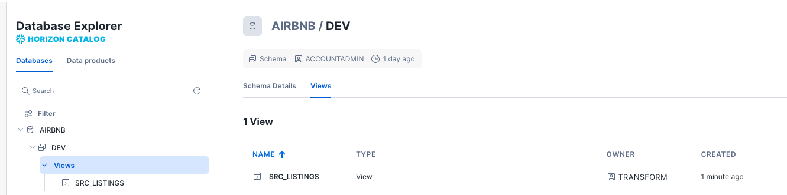
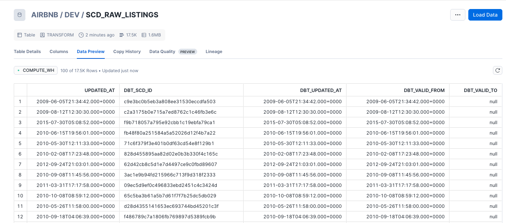

# Data Build Tool Summary

* [Dbt core](https://github.com/dbt-labs/dbt-core) is an open source CLI and database agnostic. It enables data teams to transform data within their warehouse using SQL by applying software engineering best practices like version control.
* [dbt Cloud](): A managed service with a web-based IDE, scheduler, job orchestration, and monitoring

## Use Cases

* Modelling changes are easy to follow and revert
* Explicit dependencies between models
* Explore dependencies between models
* Data quality tests
* Incremental load of fact tables
* Track history of dimension tables

## Major Concepts

* **Models**: basic building block of the business logic. Includes materialized tables and views, and SQL files. Models can reference each other and use templates and macros

## Install

* [Supported Python database](https://docs.getdbt.com/faqs/Core/install-python-compatibility)
* Init a project:
    ```sh
    uv run dbt init --skip-profile-setup airbnb
    ```
* Or in virtual env created wuth uv and uv sync use `dbt` directly.

???- info "pyproject.toml"
    The following dependencies are needed:
    ```yaml
    dependencies = [
        "dagster-dbt>=0.28.14",
        "dagster-webserver>=1.12.14",
        "dbt-autofix>=0.20.0",
        "dbt-core>=1.11.6",
        "dbt-snowflake>=1.8.4",
    ]
    ```
### dbt_profile.yaml

Defines the structure of the project.

## Work on Models

* Add Kimball structure as sources, dimensions, facts under the `models` folder
* Add SQL materialized view using `SELECT ...`. No insert into
* Validate each new SQL creation: within the folder with the dbt_profile.yaml, to build a view in Snowflake
    ```sh
    dbt run
    ```

    Example of output:
    ```sh
    22:20:56  Found 1 model, 522 macros
    22:20:56  
    22:20:56  Concurrency: 1 threads (target='dev')
    22:20:56  
    22:20:57  1 of 1 START sql view model DEV.src_listings ................................... [RUN]
    22:20:58  1 of 1 OK created sql view model DEV.src_listings .............................. [SUCCESS 1 in 1.17s]
    22:20:59  
    22:20:59  Finished running 1 view model in 0 hours 0 minutes and 2.78 seconds (2.78s).
    22:20:59  
    22:20:59  Completed successfully
    22:20:59  
    22:20:59  Done. PASS=1 WARN=0 ERROR=0 SKIP=0 NO-OP=0 TOTAL=1
    ```

    adn within Snowflake:

    


* `dbt run` creates final sql under the `target` folder
## Materialization

There are four materialization:

* **View:** this is a lightweight representation of the data,  not reused. no recreationg of the table as each execution.
* **Table:** reusable data in external table- recreate at each run
* **Incremental:** fact tables appends to tables - more like event data - table is not recreated each time.
* **Ephemeral (CTEs):** aliasing of the data and filtering data. Not adversitized in the data warehouse. For example all the sql under the `sources` are becoming CTEs

Materializatio an be set golbally in the `dbt_profile.yaml`: all models are view, except in the dimensions folder as table:
```yaml
models:
  airbnb:
    +materialized: view
    dimensions:
      +materialized: table
    sources:
      +materialized: ephemeral
```


### Incremental

Specify a fact table is incremental and add condition for which the records are added to the table. The review_date of the record needs to be after the last record in the fct_reviews table:

```sql
{{
  config(
    materialized = 'incremental',
    on_schema_change='fail'
    )
}}
WITH src_reviews AS (
  SELECT * FROM {{ ref('src_reviews') }}
)
SELECT * FROM src_reviews
WHERE review_text is not null


  AND review_date > (select max(review_date) from {{ this }})

```

* Making a full-refresh:
```
dbt run --full-refresh
```

* With the sources as ephemeral the output of dbt run becomes:

```sh
23:16:16  1 of 4 START sql table model DEV.dim_hosts_cleansed ............................ [RUN]
23:16:18  1 of 4 OK created sql table model DEV.dim_hosts_cleansed ....................... [SUCCESS 14111 in 1.93s]
23:16:18  2 of 4 START sql table model DEV.dim_listings_cleansed ......................... [RUN]
23:16:20  2 of 4 OK created sql table model DEV.dim_listings_cleansed .................... [SUCCESS 17499 in 2.47s]
23:16:20  3 of 4 START sql incremental model DEV.fct_reviews ............................. [RUN]
23:16:23  3 of 4 OK created sql incremental model DEV.fct_reviews ........................ [SUCCESS 0 in 2.37s]
23:16:23  4 of 4 START sql table model DEV.dim_listings_with_hosts ....................... [RUN]
23:16:24  4 of 4 OK created sql table model DEV.dim_listings_with_hosts .................. [SUCCESS 17499 in 1.58s]
23:16:24  
23:16:24  Finished running 1 incremental model, 3 table models in 0 hours 0 minutes and 9.83 seconds (9.83s).
```

* `dbt compile` does not deploy to the target data warehouse
    ```sh
    23:39:49  Running with dbt=1.11.6
    23:39:50  Registered adapter: snowflake=1.11.2
    23:39:50  Found 8 models, 1 seed, 3 sources, 522 macros
    23:39:50  
    23:39:50  Concurrency: 1 threads (target='dev')
    ```

## Sources and Seeds
* Seeds are local files that is uploaded to the data warehouse from dbt
* Sources is an abstraction layer on top of the input tables. The source freshness can be checked automatically.
* use `dbt seed` to populate the seed (csv file) to the data warehouse.
    ```sh
    23:29:14  1 of 1 START seed file DEV.seed_full_moon_dates ................................ [RUN]
    23:29:17  1 of 1 OK loaded seed file DEV.seed_full_moon_dates ............................ [INSERT 272 in 2.76s]
    ```

* Sources may be defined in a yaml:
```yaml
sources:
  - name: airbnb
    schema: raw
    tables:
      - name: listings
        identifier: raw_listings

      - name: hosts
        identifier: raw_hosts

      - name: reviews
        identifier: raw_reviews
```

* From there the src_*.sql needs to be modified to do not reference ay table name in the data warehouse, but the source aliases.
```sql
WITH raw_hosts AS (
    SELECT
        *
    FROM
        {{ source('airbnb', 'hosts') }}
)
```

* For source freshness, we need to consider one DATE column and add a config element to the table to define refreshness condition:
    ```yaml
    - name: reviews
      identifier: raw_reviews
      config:
        loaded_at_field: date
        freshness:
            warn_after: {count: 1, period: hour}
            error_after: {count: 24, period: hour}
    ```

* Run the command: `sbt source freshness` to validate the data freshness.

## Type-2 slowly changing dimensions

The goal is to keep history of change to the records over time and not just the last record per key. dbt adds `dbt_valid_from` and `dbt_valid_to` columns to mark each records to be valid time from and to. A current correct records have `dbt_valid_to` sets to null.

**snapshots** live in the snapshot folder. There are two strategies for assessing data changes:
* *Timestamp*: a unique key and updated_at fields is defined at the source model. These columns are used for determining changes
* *Check*: any changes in a set of columns (or all columns) will be picked up as an update.

* To create snapshots we need a yaml file under the snapshot folder:
    ```yaml
    snapshots:
    - name: scd_raw_listings
        relation: source('airbnb', 'listings')
        config:
        unique_key: id
        strategy: timestamp
        updated_at: updated_at
        hard_deletes: invalidate
    ```

* the `dbt snapshot` will create a new table with the columns added for the referenced table.
    ```sh
    00:04:36  1 of 1 START snapshot DEV scd_raw_listings ..................................... [RUN] 
    00:04:40  1 of 1 OK snapshotted DEV.scd_raw_listings ..................................... [SUCCESS 17499 in 3.44s]
    ```

    
* An update to an existing record and a new `dbt snapshot` will create historical record.

## Tests

## Sources of Information

* [Udemy training from Zoltan C. Toth](https://www.udemy.com/course/complete-dbt-data-build-tool-bootcamp-zero-to-hero-learn-dbt) with [Git Repo](https://github.com/nordquant/complete-dbt-bootcamp-zero-to-hero). Example of data [from Inside AirBnB](https://insideairbnb.com/berlin/).
* [Dbt core](https://github.com/dbt-labs/dbt-core)
* [Preset]()
* [Snowflake](https://app.snowflake.com)  username: jbcodeforce. Using key-pair authentication. Public [key in Snowlflake](https://docs.snowflake.com/en/user-guide/opencatalog/key-pair-auth-configure#generate-a-private-and-public-key)