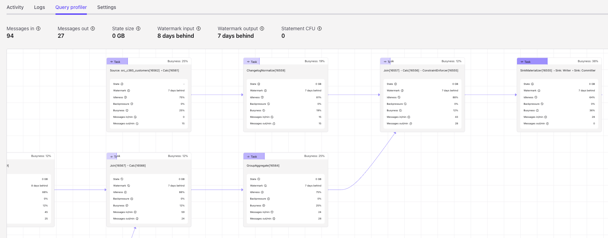

# Flink SQL DML

???- Info "Updates"
    Created 10/24, Updated 12/20/24
    Revised 12/06/24

This chapter offers continue on the best practices for implementing Flink SQL solutions, for Data Manipulation Language queries. DML is used to define statements which modify the data and don’t change the metadata.

## Sources Of Information

* [Confluent SQL documentation for DML samples](https://docs.confluent.io/cloud/current/flink/reference/queries/overview.html#flink-sql-queries) 
* [Apache Flink SQL](https://nightlies.apache.org/flink/flink-docs-master/docs/dev/table/sql/insert/)
* [Confluent Developer Flink tutorials](https://developer.confluent.io/tutorials/)
* [The Flink built-in system functions.](https://nightlies.apache.org/flink/flink-docs-release-1.20/docs/dev/table/functions/systemfunctions/)

## Common Patterns

This is important to recall that a select applies to a stream of record so the results will change at each new record. A query as below will show the last top 10 orders, and when a new record arrives this list is updated. 

```sql
select * from `examples`.`marketplace`.`orders` order by $rowtime limit 10;
```


???+ question "What are the different SQL execution modes? (OSS)"

    Using previous table it is possible to count the elements in the table using:

    ```sql
    select count(*) AS `count` from pageviews;
    ```

    and we get different behaviors depending of the execution mode:

    ```sql
    set 'execution.runtime-mode' = 'batch';
    # default one
    set 'execution.runtime-mode' = 'streaming';

    set 'sql-client.execution.result-mode' = 'table';
    ```

    In changelog mode, the SQL Client doesn't just update the count in place, but instead displays each message in the stream of updates it's receiving from the Flink SQL runtime.
    
    ```sql
    set 'sql-client.execution.result-mode' = 'changelog';
    ```

    

[See this lab in changelog mode](https://github.com/jbcodeforce/flink-studies/tree/master/code/flink-sql/05-changelog) and [this section in SQL concepts chapter](../concepts/flink-sql.md#changelog-mode).

### Filtering

* [Start by looking at this Confluent tutorial](https://developer.confluent.io/confluent-tutorials/filtering/flinksql/) or [The Apache Flink doc section]()
* SELECT ... FROM ... WHERE ... consists of column projections or filters and are stateless. Except if the output table has a a `retract` changelog while input is `upsert`, the sink will have a `changelog materializer` (see [section below.](#sinkupsertmaterializer))
* SELECT DISTINCT to remove duplicate rows. Which leads to keep state for each row.

???+ question "How to filter out records?"

    using the [WHERE clause](https://nightlies.apache.org/flink/flink-docs-master/docs/dev/table/sql/queries/select/)

    ```sql
    select * from flight_events where status = 'cancelled';
    ```

    Count the number of events related to a cancelled flight (need to use one of the selected field as grouping key):

    ```sql
    select fight_id, count(*) as cancelled_fl from FlightEvents where status = 'cancelled' group by flight_id;
    ```

    Recall that this results produces a dynamic table.

???+ question "HAVING to filter after aggregation"
    The `HAVING` clause is used to filter results after the aggregation (i.e., like `GROUP BY`). It is similar to the `WHERE` clause, but while `WHERE` filters rows before aggregation, `HAVING` filters rows after aggregation.
    ```sql
    SELECT url as product_page, 
        COUNT(click_id) as num_of_times_viewed, 
        COUNT(DISTINCT user_id) as num_of_users,
        AVG(view_time) as avg_view_time,
        MAX(view_time) as max_view_time
    FROM clicks
    GROUP BY url
    HAVING COUNT(click_id)  > 2;
    ```

???+ question "How to combine records from multiple tables (UNION)?"
    When the two tables has the same number of columns of the same type, then we can combine them:

    ```sql
    SELECT * FROM T1
    UNION ALL
    SELECT * FROM T2;
    ```

    [See product documentation on Union](https://docs.confluent.io/cloud/current/flink/reference/queries/set-logic.html#flink-sql-set-logic-union). Remember that UNION will apply distinct, and avoid duplicate, while UNION ALL will generate duplicates. 


???+ question "How to filter row that has column content not matching a regular expression?"

    Use [REGEX](https://docs.confluent.io/cloud/current/flink/reference/functions/string-functions.html#flink-sql-regexp-function)

    ```sql
    WITH filtered_data AS (
    SELECT *,
        CASE 
            WHEN NOT REGEXP(user_agent, '.*Opera/.*') 
            THEN TRUE  -- Keep this row
            ELSE FALSE -- Filter out rows that match "Opera/"
        END AS keep_row
    FROM examples.marketplace.clicks
    )

    SELECT * 
    FROM filtered_data
    WHERE keep_row = TRUE;
    ```


???+ info "Navigate a hierarchical structure in a table"
    The unique table has node and ancestors representation. Suppose the graph represents a Procedure at the highest level, then an Operation, then a Phase and a Phase Step at the level 4. In the Procedures table we can have rows like:
    
    ```csv
    id, parent_ids, depth, information
    'id_1', [], 0 , 'procedure 1'
    'id_2', ['id_1'], 1 , 'operation 1'
    'id_3', ['id_1','id_2'], 2 , 'phase 1'
    'id_4', ['id_1','id_2','id_3'], 3 , 'phase_step 1'
    'id_5', ['id_1','id_2','id_3'], 3 , 'phase_step 2'
    ```

    Suppose we want to extract the matching  procedure_id, operation_id, phase_id, phase_step_id like
    ```csv
    id, procedure_id, operation_id, phase_id, phase_step_id, information
    'id_1', 'id_1', NULL, NULL, NULL, 'procedure 1'
    'id_2', 'id_1', 'id_2', NULL, NULL, 'operation 1'
    'id_3', 'id_1', 'id_2', 'id_3', NULL, 'phase 1'
    'id_4', 'id_1', 'id_2', 'id_3', 'id_4', 'phase_step 1'
    'id_5', 'id_1', 'id_2', 'id_3', 'id_5', 'phase_step 2'
    ```
    
    if the depth is 3, then the response should have all ids populated, if 0 only the top level is returned.
    
    ```sql
    with `procedures` as (
        select 'id_1' as id, array[''] as parentIds, 0 as `depth` , 'procedure 1' as info
        UNION ALL
        select 'id_2' as id, array['id_1'] as parentIds, 1 as `depth` , 'operation 1' as info
        UNION ALL
        select 'id_3' as id, array['id_1','id_2'] as parentIds, 2 as `depth`, 'phase 1' as info
        UNION ALL
        select 'id_4' as id, array['id_1','id_2','id_3'] as parentIds, 3 as `depth`, 'phase_step 1' as info
        UNION ALL
        select 'id_5' as id, array['id_1','id_2','id_3'] as parentIds, 3 as `depth`, 'phase_step 2' as info
        )
    select 
        id, 
        parent_id, 
        case when `depth` = 3 then id end as phase_step_id,
        case when `depth` = 2 then id end as phase_id,
        case when `depth` = 1 then id end as operation_id,
        case when `depth` = 0 then id end as procedure_id,
        info from `procedures` cross join unnest(parentIds) as ids(parent_id)
    ```


### Deduplication

Deduplication will occur on `upsert` table with primary key: the last records per `$rowtime` or other timestamp will be kept. When the source table is in `append` mode, the approach is to use the [ROW_NUMBER()](https://nightlies.apache.org/flink/flink-docs-master/docs/dev/table/functions/systemfunctions/#aggregate-functions) combined with [OVER()](https://nightlies.apache.org/flink/flink-docs-master/docs/dev/table/sql/queries/over-agg/):


```sql
CREATE TABLE unique_clicks
AS SELECT ip_address, url, TO_TIMESTAMP(FROM_UNIXTIME(click_ts_raw)) as click_timestamp
    FROM (
        SELECT *,
        ROW_NUMBER() OVER ( PARTITION BY ip_address ORDER BY TO_TIMESTAMP(FROM_UNIXTIME(click_ts_raw)) ASC) as rownum 
        FROM clicks
        )
    WHERE rownum = 1;
```

* The query is designed to identify and persist only the earliest record. Once the record is written to the table_deduped any subsequent events pertaining to the same `ip_address` are effectively discarded by the `WHERE rownum = 1` filter.
* ROW_NUMBER() Assigns an unique, sequential number to each row. It is part of the Top-N queries pattern.
* Use OVER aggregation to compute agg value for every input window clause and a filter condition to express a Top-N query. Combined with PARTITION BY clause, Flink supports a per group Top-N. 
* The internal CTE add a row_num for each 
* The subsequent `WHERE rownum = 1` clause filters the results to retain only the very first event observed for each unique `ip_address` based on its timestamp.
* The created table is an append table. There is no mechanism within this query to generate update or delete operations for records that have already been processed. Even if the underlying `clicks` table has a primary key defined, the transformation applied here dictates that the `unique_clicks` table will only ever grow by appending new, unique `ip_address` entries.
* If the sorting was DESC when a new record arrive a retraction/update record is emitted. 
* If after deduplication, the upsert sink needs to have the same key as the partition keys used. 

[See this example](https://docs.confluent.io/cloud/current/flink/how-to-guides/deduplicate-rows.html#flink-sql-deduplicate-topic-action) in the Confluent product documentation which demonstrates there is no duplicate in the query result with `select * from dedup_table;` returns 8 messages. Same in the Kafka topic there are 8 messages . 

But it does not demonstrate the last message is kept. The [deduplication sample](https://github.com/jbcodeforce/flink-studies/tree/master/code/flink-sql/00-basic-sql#deduplication-example) demonstrates that an upsert table is already removing duplicates, and keep the last record per key. 

* Confluent Cloud has limitations: the order by can only be timestamp in ASC mode.
* Example of deduplication on OSS Flink where order can apply to any column type.
```sql
select *  FROM (
    SELECT 
        *,
        ROW_NUMBER() OVER (
            PARTITION BY emp_id 
            ORDER BY emp_id DESC
        ) AS row_num
    FROM employees
) WHERE row_num = 1
```

### Transformation

???+ question "How to transform a field representing epoch to a timestamp?"
    
    epoch is a BIGINT.
    
    ```sql
     TO_TIMESTAMP(FROM_UNIXTIME(click_ts_epoch)) as click_ts
    ```

???+ question "How to change a date string to a timestamp?"

    ```sql
    TO_TIMESTAMP('2024-11-20 12:34:568Z'),
    ```

    ```sql
    to_timestamp(transaction_date, 'yyyy-MM-dd HH:mm:ss') as tx_date, -- bigint
    ```

    See all the [date and time functions](https://docs.confluent.io/cloud/current/flink/reference/functions/datetime-functions.html).

???+ question "How to compare a date field with current system time?"

    ```sql
    WHEN TIMESTAMPDIFF(day, event.event_launch_date, now()) > 120 THEN ...
    ```

    If the target table is set with a `changelog mode = upsert`, the use of the now() function is problematic because the exact execution time is not deterministic for each row. So the above statement works only for `append` mode.


???+ question "How to extract the number of DAY, from a date field and now?"
    The only diff is on timestamp. So need to first to cast the DATE column to a ts, and then use CURRENT_DATE and the DAY dimension. [See the supported dimensions (SECOND, MINUTE, HOUR, DAY, MONTH, or YEAR)](https://nightlies.apache.org/flink/flink-docs-master/docs/dev/table/functions/systemfunctions/#temporal-functions)
    ```sql
     TIMESTAMPDIFF(DAY, CAST(created_date AS TIMESTAMP_LTZ(3)), CURRENT_DATE) as days_since_launch,
    ```

???+ question "How to access element of an array of rows?"
    The table has a column that is an array of rows. 
    ```sql
     CREATE TABLE my_table (
        key_col INT,
        nested_data ARRAY<ROW<id INT, name STRING>>
    ) WITH (...)
    ```

    To create one record per row within the array, so exploding the array, use CROSS JOIN UNNEST:
    ```sql
     SELECT
        t.key_col,
        unnested_row.id,
        unnested_row.name
    FROM
        my_table AS t
    CROSS JOIN UNNEST(t.nested_data) AS unnested_row;
    ```

    Each row in the nested_data array will be a row in the output table with the matching key_col. 


???+ question "How to access json data from a string column being a json object?"
    
    Use json_query function in the select.

    ```sql
     json_query(task.object_state, '$.dueDate') AS due_date,
    ```

    Use `json_value()` instead if the column content is a dict or json {}.


???+ question "How to transform a json array column (named data) into an array to then generate n rows?"
    Returning an array from a json string:
    ```sql
    json_query(`data`, '$' RETURNING ARRAY<STRING>) as anewcolumn
    ```

    To create as many rows as there are elements in the nested array:
    ```sql
    SELECT existing_column, anewcolumn from table_name
    cross join unnest (json_query(`data`, '$' RETURNING ARRAY<STRING>)) as t(anewcolumn)
    ```

    UNNEST returns a new row for each element in the array
    [See multiset expansion doc](https://nightlies.apache.org/flink/flink-docs-master/docs/dev/table/sql/queries/joins/#array-multiset-and-map-expansion)

???+ question "How to implement the equivalent of SQL explode?"
    SQL EXPLODE creates a row for each element in the array or map, and ignore null or empty values in array.
    ```sql
    SELECT explode(col1) from values (array(10,20)), (null)
    ```

    SQL has also EXPLODE_OUTER, which returns all values in array including null or empty.

    To translate this to Flink SQL we can use MAP_ENTRIES and MAP_FROM_ARRAYS. MAP_ENTRIES returns an array of all entries in the given map. While MAP_FROM_ARRAYS returns a map created from an arrays of keys and values.
    ```sql
    select map_entries(map_from_arrays())
    ```

???+ question "How to use conditional functions?"
    [Flink has built-in conditional functions](https://nightlies.apache.org/flink/flink-docs-master/docs/dev/table/functions/systemfunctions/#conditional-functions) (See also [Confluent support](https://docs.confluent.io/cloud/current/flink/reference/functions/conditional-functions.html)) and specially the CASE WHEN:

    ```sql
    SELECT 
        *
        FROM `stocks`
        WHERE  
        CASE 
            WHEN price > 200 THEN 'high'
            WHEN price <=200 AND price > 150 THEN 'medium'
            ELSE 'low'
        END;
    ```

???+ question "How to mask a field?"
    Create a new table from the existing one, and then use REGEXP_REPLACE to mask an existing attribute

    ```sql
    create table users_msk like users;
    INSERT INTO users_msk SELECT ..., REGEXP_REPLACE(credit_card,'(\w)','*') as credit_card FROM users;
    ```

### Statement Set

The benefit of bundling statements in a single set is to reduce the repeated read from the source for each Insert. A single read from the source is executed and shared with all downstream INSERTS.

Do not use `Statement Set` when the source are different for all statements within the Statement Sets. Take into account that within the statement set if one statement fails, then all queries fail. The state is shared by all the statements within Statement set, so one stateful query can impact all other statements.

???+ question "How to manage late message to be sent to a DLQ using Statement Set?"
    First, create a DLQ table like `late_orders` based on the order table:
    
    ```sql
        create table late_orders
        with (
            'connector'= ''
        ) 
        LIKE orders (EXCLUDING OPTIONS)
    ```

    Groups the main stream processing and the late arrival processing in a statement set:

    ```sql
    EXECUTE STATEMENT SET
    BEGIN
        INSERT INTO late_orders SELECT from orders WHERE `$rowtime` < CURRENT_WATERMARK(`$rowtime`);
        INSERT INTO order_counts -- the sink table
            SELECT window_time, COUNT(*) as cnt
            FROM TABLE(TUMBLE(TABLE orders DESCRIPTOR(`$rowtime`), INTERVAL '1' MINUTE))
            GROUP BY window_start, window_end, window_time
    END
    ```

## Stateful aggregations

An aggregate function computes a single result from multiple input rows.

### Group BY

Classical SQL grouping of records, but with Streaming the state may grow infinitely. The size will depend of the # of groups and the amount of data to keep per group.
`group by` generate upsert events as it manages key-value and repartition data.

```sql
EXPLAIN 
SELECT 
  account_number,
  transaction_type,
  SUM(amount) 
  FROM `transactions` 
  where transaction_type = 'withdrawal' 
  GROUP BY account_number,  transaction_type
HAVING SUM(amount) > 5000
```

The physical plan looks like
```
== Physical Plan ==

StreamSink [6]
  +- StreamCalc [5]
    +- StreamGroupAggregate [4]
      +- StreamExchange [3]
        +- StreamCalc [2]
          +- StreamTableSourceScan [1]

== Physical Details ==

[1] StreamTableSourceScan
Table: `j9r-env`.`j9r-kafka`.`transactions`
Primary key: (txn_id)
Changelog mode: append
Upsert key: (txn_id)
State size: low
Startup mode: earliest-offset
Key format: avro-registry
Key registry schemas: (:.:transactions/100220)
Value format: avro-registry
Value registry schemas: (:.:transactions/100219)

[4] StreamGroupAggregate
Changelog mode: retract
Upsert key: (account_number,transaction_type)
State size: medium
State TTL: never

[5] StreamCalc
Changelog mode: retract
Upsert key: (account_number,transaction_type)

[6] StreamSink
Table: Foreground
Changelog mode: retract
Upsert key: (account_number,transaction_type)
State size: low
```

### Distinct

Remove duplicate before doing the aggregation:

```sql
ARRAY_AGG(DISTINCT user_name) as persons
```

### ARRAY_AGG

This [aggregate function](https://nightlies.apache.org/flink/flink-docs-master/docs/dev/table/functions/systemfunctions/#aggregate-functions) 

???+ question "How to Aggregate a field into an ARRAY - ARRAY_AGG?"
    Let start by a simple array indexing (the index is between 1 to n_element). Below, the `values array` creates test data into a memory table aliased a `T` with a column named `array_field`:

    ```sql
    SELECT array_field[4] FROM ((VALUES ARRAY[5,4,3,2,1])) AS T(array_field)
    ```

    The following SQL, is creating a view with an [array of aggregates](https://nightlies.apache.org/flink/flink-docs-master/docs/dev/table/functions/systemfunctions/#aggregate-functions), which in this case, is concatenating the urls for each user_id over a 1 minute tumble window.

    ```sql
    CREATE VIEW visited_pages_per_minute AS 
    SELECT 
        window_time,
        user_id, 
        ARRAY_AGG(url) AS urls
    FROM TABLE(TUMBLE(TABLE `examples.marketplace.clicks`, DESCRIPTOR(`$rowtime`), INTERVAL '1' MINUTE))
    GROUP BY window_start, window_end, window_time, user_id;
    -- once the view is created
    SELECT * from visited_pages_per_minute;
    
    -- it is possible to expand an array into multiple rows using cross join unnest

    SELECT v.window_time, v.user_id, u.url FROM visited_pages_per_minute AS v
    CROSS JOIN UNNEST(v.urls) AS u(url)
    ```

    One thing important is that new clicks for the same user_id with new url, will create a new output record with the aggregated array. See [cc-array-agg study](https://github.com/jbcodeforce/flink-studies/tree/master/code/flink-sql/03-nested-row/cc-array-agg)

???- info "More Array aggregation behaviors"
    * The type within the array can be a row. [See SQL examples](https://github.com/jbcodeforce/flink-studies/tree/master/code/flink-sql/03-nested-row/cc-array-agg/cc_array_agg_on_row.sql)
    ```sql
    select 
        suite_id, 
        ARRAY_AGG(ROW (asset_id, asset_name, asset_price_min, asset_price_max)) as asset_data 
    from suites 
    group by suite_id;
    ```

    * and subrow:
    ```sql
    create table suites_agg (
    suite_id INTEGER,
    asset_data ARRAY<
        ROW<
          asset_id INTEGER, 
          asset_name STRING, 
          asset_price_range ROW<
             asset_price_min DECIMAL(24,4), 
             asset_price_max DECIMAL(24,4)
          >
        >,
    ts_ltz timestamp_ltz(3),
    insert_ts_ltz timestamp_ltz(3),
    PRIMARY KEY(suite_id) NOT ENFORCED
    ```


### OVER 

[OVER aggregations](https://nightlies.apache.org/flink/flink-docs-release-1.20/docs/dev/table/sql/queries/over-agg/) computes an aggregated value for every input row over a range of ordered rows. It does not reduce the number of resulting rows, as GROUP BY does, but produces one result for every input row. 

OVER specifies the time window over which the aggregation is performed. A classical example is to get a moving sum or average: the number of orders in the last 10 seconds: 

```sql
SELECT 
    order_id,
    customer_id,
    `$rowtime`,
    SUM(price) OVER w AS total_price_ten_secs, 
    COUNT(*) OVER w AS total_orders_ten_secs
FROM `examples`.`marketplace`.`orders`
WINDOW w AS (
    PARTITION BY customer_id
    ORDER BY `$rowtime`
    RANGE BETWEEN INTERVAL '10' SECONDS PRECEDING AND CURRENT ROW
)
```

The source topic needs to be append mode as over window operaton does not supporting retraction/update semantic.

The changelog mode, of the output of OVER is `append`. This is helpful when we need to act on each input row, but consider some time interval. 


To get the order exceeding some limits for the first time and then when the computed aggregates go below other limits. [LAG](https://docs.confluent.io/cloud/current/flink/reference/functions/aggregate-functions.html#lag)

```sql
-- compute the total price and # of orders for a period of 10s for each customer
WITH orders_ten_secs AS ( 
SELECT 
    order_id,
    customer_id,
    `$rowtime`,
    SUM(price) OVER w AS total_price_ten_secs, 
    COUNT(*) OVER w AS total_orders_ten_secs
FROM `examples`.`marketplace`.`orders`
WINDOW w AS (
    PARTITION BY customer_id
    ORDER BY `$rowtime`
    RANGE BETWEEN INTERVAL '10' SECONDS PRECEDING AND CURRENT ROW
    )
),
-- get previous orders and current order per customer
orders_ten_secs_with_lag AS (
SELECT 
    *,
    LAG(total_price_ten_secs, 1) OVER w AS total_price_ten_secs_lag, 
    LAG(total_orders_ten_secs, 1) OVER w AS total_orders_ten_secs_lag
FROM orders_ten_secs
WINDOW w AS (
    PARTITION BY customer_id
    ORDER BY `$rowtime`
    )
-- Filter orders when the order price and number of orders were above some limits for previous or current order aggregates
)
SELECT customer_id, 'BLOCK' AS action, `$rowtime` AS updated_at 
FROM orders_ten_secs_with_lag 
WHERE 
    (total_price_ten_secs > 300 AND total_price_ten_secs_lag <= 300) OR
    (total_orders_ten_secs > 5 AND total_orders_ten_secs_lag <= 5)
UNION ALL 
SELECT customer_id, 'UNBLOCK' AS action, `$rowtime` AS updated_at 
FROM orders_ten_secs_with_lag 
WHERE 
    (total_price_ten_secs <= 300 AND total_price_ten_secs_lag > 300) OR
    (total_orders_ten_secs <= 5 AND total_orders_ten_secs_lag > 5);
```


???+ question "When and how to use custom watermark?"
    Developer should use their own [watermark strategy](https://docs.confluent.io/cloud/current/flink/reference/statements/create-table.html#watermark-clause) when there are not a lot of records per topic/partition, there is a need for a large watermark delay, and need to use another timestamp. 
    The default watermark strategy in SOUCE_WATERMARK(), a watermark defined by the source. The common strategy used is the `maximim-out-of-orderness` to allow messages arriving later to be part of the window, to ensure more accurate results, as a tradeoff of latency. It can be defined using:

    ```sql
    ALTER TABLE <table_name> MODIFY WATERMARK for `$rowtime` as `$rowtime` - INTERVAL '20' SECONDS
    ```

    The minimum out-of-orderness is 50ms and can be set up to 7 days. See [Confluent documentation.](https://docs.confluent.io/cloud/current/flink/reference/functions/datetime-functions.html#flink-sql-source-watermark-function) 


## Joins

When doing a join in a database, the result reflects the state of the join at the time we execute the query. In streaming, as both side of a join receive new rows, both side of joins need to continuously change. This is a **continuous query on dynamic tables**, where the engine needs to keep a lot of state: each row of each table. 

This is the common join we do between two tables: 

```sql
SELECT t.amount, t.order_type, s.name, s.opening_value FROM transactions t
LEFT JOIN stocks s
ON t.stockid = s.id
```

On the left side, the fact table, has high velocity of changes, but the events are immutables, while on the right side, the dimension, the new records arrive slowly.

When doing a join, Flink needs to fully materialize both the right and left of the join tables in state, which may cost a lot of memory, because if a row in the left-hand table (LHT), also named the **probe side**, is updated, the operator needs to emit an updated match for all matching rows in the right-hand table (RHT) or **build side**. The cardinality of right side will be mostly bounded at a given point of time, but the left side may vary a lot. A join emits matching rows to downstream operator.

The key points to keep in mind are:

* The order of joins is important, try to get the first join done on table with the lowest update frequency.
* Cross join makes the query fails
* When the RHS is an upsert table, the result will be upsert too. Which means a result will be re-emitted if the RHS change. To avoid that we need to take the reference data, RHS, in effect at time of the event on LHS. The result is becoming **time-versioned**.
    ```sql
    insert into enriched_transactions
    SELECT t.amount, t.order_type, s.name, s.opening_value FROM transactions t
    LEFT JOIN stocks s FOR SYSTEM_TIME AS OF t.purchase_ts
    ON t.stockid = s.id
    ```
* The above query is a Temporal join. Temporal joins help to reduce the state size, as we need to keep recent records on both side. The time will be linked to the watermark progress. If the opening_value of the stock change over time, it will not trigger update to the prevuously generated enriched transactions.  
* INNER JOIN is a cartesian product.
* OUTER joins like left, right or full, may generate records with empty columns for non-matching row.
* Interval joins are particularly useful when working with unbounded data streams. Here is an example for orders and payments, whetre 
    ```sql
    CREATE TABLE valid_orders (
        order_id STRING,
        customer_id INT,
        product_id STRING,
        order_time TIMESTAMP_LTZ(3),
        payment_time TIMESTAMP_LTZ(3),
        amount DECIMAL,
        WATERMARK FOR order_time AS order_time - INTERVAL '5' SECOND
    ) AS SELECT unique_orders.order_id, customer_id, product_id, unique_orders.`$rowtime` AS order_time, payment_time, amount
    FROM unique_orders
        INNER JOIN payments
        ON unique_orders.order_id = payments.order_id
        WHERE unique_orders.`$rowtime` BETWEEN payment_time - INTERVAL '10' MINUTES AND payment_time;
    ```
    
* INTERVAL JOIN requires at least one equi-join predicate and a join condition that bounds the time on both sides.
    ```sql
    SELECT t.amount, t.order_type, s.name, s.opening_value FROM transactions t, stocks s
    WHERE t.stockid = s.id AND t.ts BETWEEN s.ts - INTERVAL '6' HOURS AND s.ts
    ```

### Lateral Joins

LATERAL TABLE clause is used to invoke a Table-Valued Function (TVF) or a [User-Defined Table Function](./udf_sql.md) (UDTF) for every row of a base (outer) table. The Lateral Join evaluates a subquery or a function for each row of the first table, and the result of that evaluation is then joined back to the original row. The UDTF/TVF on the right side of the join can reference columns from the table on the left side.

```sql
SELECT
    t.*,
    tf.*
FROM
    input_table AS t,
    LATERAL TABLE(udtf_function(t.column_a, t.column_b)) AS tf(output_column_1, output_column_2)
```

We can combine the LATERAL TABLE with different join types to control which rows are preserved

| Joins | Behavior |
| --- | --- |
| CROSS JOIN LATERAL TABLE(...) | If the UDTF returns zero rows for a given input row, the original row from the outer table is discarded. |
| LEFT JOIN LATERAL | Returns all rows from the outer table, even if the UDTF produces zero rows.|

The Lateral Table allows to dynamically transform stream records in a row-by-row fashion, which is often difficult with standard joins.

### References

Here is a list of important tutorials on Joins:

* [Confluent Cloud: video on joins](https://docs.confluent.io/cloud/current/flink/reference/queries/joins.html) with details on fow joins work.
* [Confluent -developer: How to join streams](https://developer.confluent.io/tutorials/join-a-stream-to-a-stream/flinksql.html). The matching content is in [flink-sql/04-joins folder](https://github.com/jbcodeforce/flink-studies/tree/master/flink-sql/04-joins) for Confluent Cloud or Platform for Flink. This folder also includes more SQL exercises.
* [Confluent temporal join documentation.](https://docs.confluent.io/cloud/current/flink/reference/queries/joins.html#temporal-joins)
* [Window Join Queries in Confluent Cloud for Apache Flink](https://docs.confluent.io/cloud/current/flink/reference/queries/window-join.html)
* [Temporal Join Study in this repo.](https://github.com/jbcodeforce/flink-studies/tree/master/code/flink-sql/09-temporal-joins)


### FAQs
???+ info "Inner knowledge on temporal join"
    Event-time temporal joins are used to join two or more tables based on a **common** event time (in one of the record table or the kafka record: `$rowtime` system column). With an event-time attribute, the operator can retrieve the value of a key as it was at some point in the past. The right-side, versioned table, stores all versions, identified by time, since the last watermark.

    The temporal Flink sql looks like:
    
    ```sql
    SELECT [column_list]
    FROM table1 [AS <alias1>]
    [LEFT] JOIN table2 FOR SYSTEM_TIME AS OF table1.{ rowtime } [AS <alias2>]
    ON table1.column-name1 = table2.column-name1
    ```

    When enriching a particular `table1`, an event-time temporal join waits until the watermark on the table2 stream reaches the timestamp of that `table1` row, because only then is it reasonable to be confident that the result of the join is being produced with complete knowledge of the relevant `table2` data. This table2 record can be old as the watermark on that table being late.

???+ info "How to join two tables on a key within a time window using event column as timestamp and store results in a target table?"
    Full example:

    ```sql
    -- use separate statements to create the tables
    create table Transactions (ts TIMESTAMP(3), tid BIGINT, amount INT);
    create table Payments (ts TIMESTAMP(3), tid BIGINT, type STRING);
    create table Matched (tid BIGINT, amount INT, type STRING);

    execute statement set
    begin
    insert into Transactions values(now(), 10,20),(now(),11,25),(now(),12,34);
    insert into Payments values(now(), 10, 'debit'),(now(),11,'debit'),(now(),12,'credit');
    insert into Matched 
        select T.tid, T.amount, P.type
        from Transactions T join Payments P ON T.tid = P.tid 
        where P.ts between T.ts and T.ts + interval '1' minutes;
    end
    ```

???+ question "how primary key selection impacts joins?"
    Primary keys on source tables do not impact joins as the joins can be done on any column of the left and right tables. The important keys are the one on the sink table and they need to match the last join columns.

???+ info "Understand Left side velocity and update strategy"
    If the left table has a high velocity and there is no new event for the defined primary key, then it is important to set a TTL on the left side that is short so the state will stay under control. Use the aliases set on the tables and set the retention time.
    ```sql
    select /* STATE_TTL('tx'='120s', 'c'='4d') */
        tx_id, account_id, amount, merchant_id, tx_type 
    from transaction tx
    LEFT JOIN account c
    on tx.account_id = c.id
    ```

    **Remark**: Running an EXPLAIN on the above statement give the TTL.

???+ warning "Join on 1x1 relationship"
    In current Flink SQL it is not possible to *efficiently* join elements from two tables when we know the relation is 1 to 1: one transaction to one account, one shipment to one order. As soon as there is a match, normally we want to emit the result and clear the state. This is possible to do so with the DataStream API, not SQL.

## Windowing / Table Value Functions

[Windowing Table-Valued Functions](https://docs.confluent.io/cloud/current/flink/reference/queries/window-tvf.html) groups the Tumble, Hop, Cumulate, and Session Windows. Windows split the stream into “buckets” of finite size, over which we can implement logic. The return value adds three additional columns named “window_start”, “window_end”, “window_time” to indicate the assigned window.

* The TUMBLE function assigns each element to a window of specified window size. Tumbling windows have a fixed size and do not overlap.

???+ question "Count the number of different product type per 10 minutes (TUMBLE window)"
    [Aggregate a Stream in a Tumbling Window documentation.](https://docs.confluent.io/cloud/current/flink/how-to-guides/aggregate-tumbling-window.html). 
    The following query counts the number of different product types arriving from the event stream by interval of 10 minutes.

    ```sql
    SELECT window_start, product_type, count(product_type) as num_ptype
        FROM TABLE(
            TUMBLE(
                TABLE events,
                DESCRIPTOR(`$rowtime`),
                INTERVAL '10' MINUTES
            )
        )
        GROUP BY window_start, window_end, ;
    ```
    *DESCRIPTOR* indicates which time attributes column should be mapped to tumbling windows (here the kafka record ingestion timestamp). 
    
    When the internal time has expired the results will be published. This puts an upper bound on how much state Flink needs to keep to handle a query, which in this case is related to the number of different product type. 

    It is possible to use another timestamp from the input table. For example the `transaction_ts TIMESTAMP(3),` 
    then we need to declare a watermark on this ts:

    `WATERMARK FOR transaction_ts AS transaction_ts - INTERVAL '5' SECOND,`
    so it can be used in the descriptor function.
    
    ```sql
    INSERT INTO app_orders
    select 
        window_start, 
        window_end, 
        customer_id, sum(order_amount) 
    from table(tumble(table `daily_spend`, DESCRIPTOR(transaction_ts), interval '24' hours)) 
    group by window_start, window_end, customer_id 
    ```


???+ question "Aggregation over a window"
    Windows over approach is to end with the current row, and stretches backwards through the history of the stream for a specific interval, either measured in time, or by some number of rows.
    For example counting the umber of flight_schedule events of the same key over the last 100 events:

    ```sql
    select
        flight_id,
        evt_type,
        count(evt_type) OVER w as number_evt,
    from flight_events
    window w as( partition by flight_id order by $rowtime rows between 100 preceding and current row);
    ```

    The results are updated for every input row. The partition is by flight_id. Order by $rowtime is necessary.

???+ question "Find the number of elements in x minutes intervals advanced by 5 minutes? (HOP)"
    [Confluent documentation on window integration.](https://docs.confluent.io/cloud/current/flink/reference/queries/window-tvf.html). For **HOP** wuindow, there is the slide parameter to control how frequently a hopping window is started:

    ```sql
        SELECT
            window_start, window_end,
            COUNT(DISTINCT order_id) AS num_orders
        FROM TABLE(
            HOP(TABLE shoe_orders, DESCRIPTOR(`$rowtime`), INTERVAL '5' MINUTES, INTERVAL '10' MINUTES))
        GROUP BY window_start, window_end;
    ```

???+ question "How to compute the accumulate price over time in a day (CUMULATE)"
    Needs to use the cumulate window, which adds up records to the window until max size, but emits results at each window steps. 
    The is image summarizes well the behavior:
    

    ```sql
    SELECT window_start, window_end, SUM(price) as `sum`
        FROM TABLE(
            CUMULATE(TABLE `examples`.`marketplace`.`orders`, DESCRIPTOR($rowtime), INTERVAL '30' SECONDES, INTERVAL '3' MINUTES))
        GROUP BY window_start, window_end;
    ```

## SinkUpsertMaterializer

When operating in upsert mode and processing two update events, a potential issue arises. If input operators for two tables in upsert mode are followed by a join and then a sink operator, update events might arrive at the sink out of order. If the downstream operator's implementation doesn't account for this out-of-order delivery, it can lead to incorrect results.

Flink typically determines the ordering of update history based on the primary key (or upsert keys) through a global analysis in the Flink planner. However, a mismatch can occur between the upsert keys of the join output and the primary key of the sink table. The `SinkUpsertMaterializer` operator addresses this mapping discrepancy.

This operator maintains a complete list of RowData in its state to correctly process any deletion events originating from the source table. However, this approach can lead to a significant state size, resulting in increased state access I/O overhead and reduced job throughput. Also the output value for each primary key is always the last (tail) element in the maintained list. It is generally advisable to avoid using `SinkUpsertMaterializer` whenever possible. 

Consider a scenario where 1 million records need to be processed across a small set of 1,000 keys. In this case, `SinkUpsertMaterializer` would need to store a potentially long list, averaging approximately 1,000 records per key. 

To mitigate the usage of `SinkUpsertMaterializer`:

* Ensure that the partition keys used for deduplication, group aggregation, etc., are identical to the sink table's primary keys.
* `SinkUpsertMaterializer` is unnecessary if retractions are generated using the same key as the sink table's primary key. If a large number of records are processed but most are subsequently retracted, SinkUpsertMaterializer can significantly reduce its state size.
* Utilize Time-To-Live (TTL) to limit the state size based on time.
* A higher number of distinct values per primary key directly increases the state size of the SinkUpsertMaterializer.


## Row pattern recognition

???+ question "Find the longest period of time for which the average price of a stock did not go below a value"
    Create a Datagen to publish StockTicker to a Kafka topic.
    [See product documentation on CEP pattern with SQL](https://nightlies.apache.org/flink/flink-docs-release-1.15/docs/dev/table/sql/queries/match_recognize/)
    
    ```sql
    create table StockTicker(symbol string, price int tax int) with ('connector' = 'kafka',...)
    SELECT * From StockTicker 
    MATCH_RECOGNIZE ( 
        partition by symbol 
        order by rowtime
        measures
            FIRST(A.rowtime) as start_tstamp,
            LAST(A.rowtime) as last_tstamp,
            AVG(A.price) as avgPrice
        ONE ROW PER MATCH
        AFTER MATCH SKIP PAST LAST ROW
        PATTERN (A+ B)
        DEFINE
            A as AVG(A.price) < 15
    );
    ```

    MATCH_RECOGNIZE helps to logically partition and order the data that is used with the PARTITION BY and ORDER BY clauses, then defines patterns of rows to seek using the PATTERN clause.
    The logical components of the row pattern variables are specified in the DEFINE clause.
    B is defined implicitly as not being A.

## Confluent Cloud Specifics

[See Flink Confluent Cloud queries documentation.](https://docs.confluent.io/cloud/current/flink/reference/queries/overview.html)

Each topic is automatically mapped to a table with some metadata fields added, like the watermark in the form of `$rowtime` field, which is mapped to the Kafka record timestamp. To see it, run `describe extended table_name;` With watermarking. arriving event records will be ingested roughly in order with  respect to the `$rowtime` time attribute field.

???+ question "Mapping from Kafka record timestamp and table $rowtime"
    The Kafka record timestamp is automatically mapped to the `$rowtime` attribute, which is a read only field. Using this field we can order the record by arrival time:

    ```sql
    select 'flight_id', 'aircraft_id', 'status', $rowtime
    from Aircrafts
    order by $rowtime;
    ```


???+ question "How to run Confluent Cloud for Flink?"
    See [the note](../techno/ccloud-flink.md), but can be summarized as: 1/ create a stream processing compute pool in the same environment and region as the Kafka cluster, 2/ use Console or CLI (flink shell) to interact with topics.

    

    ```sh
    confluent flink quickstart --name my-flink-sql --max-cfu 10 --region us-west-2 --cloud aws
    ```

???+ question "Running Confluent Cloud Kafka with local Flink"
    The goal is to demonstrate how to get a cluster created in an existing Confluent Cloud environment and then send message via FlinkFaker using local table to Kafka topic:
    
    

    The [scripts and readme](https://github.com/jbcodeforce/flink-studies/tree/master/flink-sql/01-confluent-kafka-local-flink) .

???+ question "Reading from a topic specific offsets"
    ```sql
    ALTER TABLE table_name SET (
        'scan.startup.mode' = 'specific-offsets',
        'scan.startup.specific-offsets' = 'partition:0,offset:25; partition:1,offset:10'
    );
    -- Returns from offsets 26 and 11
    SELECT * FROM table_name;
    ```

???+ question "create a long running SQL with cli"
    Get or create a service account.
    
    ```sh
    confluent iam service-account create my-service-account --description "new description"
    confluent iam service-account list
    confluent iam service-account describe <id_of_the_sa>
    ```

    ```sh
    confluent flink statement create my-statement --sql "SELECT * FROM my-topic;" --compute-pool <compute_pool_id> --service-account sa-123456 --database my-cluster
    ```

## Analyzing Statements

???+ question "Assess the current flink statement running in Confluent Cloud"
    To assess which jobs are still running, which jobs failed, and which stopped, we can use the user interface, go to the Flink console > . Or the `confluent` CLI:

    ```sh
    confluent environment list
    confluent flink compute-pool list
    confluent flink statement list --cloud aws --region us-west-2 --environment <your env-id> --compute-pool <your pool id>
    ```


### Understand the physical execution plan for a SQL query

See the [explain keyword](https://nightlies.apache.org/flink/flink-docs-master/docs/dev/table/sql/explain/) or [Confluent Flink documentation](https://docs.confluent.io/cloud/current/flink/reference/statements/explain.html) for the output explanations.

```sql
explain select ...
```

Indentation indicates data flow, with each operator passing results to its parent. 

Review the state size, the changelog mode, the upsert key... Operators change changelog modes when different update patterns are needed, such as when moving from streaming reads to aggregations.

Pay special attention to data skew when designing your queries. If a particular key value appears much more frequently than others, it can lead to uneven processing where a single parallel instance becomes overwhelmed handling that key’s data. Consider strategies like adding additional dimensions to your keys or pre-aggregating hot keys to distribute the workload more evenly. Whenever possible, configure the primary key to be identical to the upsert key.


### Troubleshooting SQL statement running slow

???+ info "How to search for hot key?"
    ```sql
    SELECT 
        id, 
        tenant_id, 
        count(*) as record_count,
    FROM table_name 
    GROUP BY id, tenant_id
    ```

    A more advanced statistical query ( TO BE TESTED)
    ```sql
    WITH key_stats AS (
        SELECT 
            id,
            tenant_id,
            count(*) as record_count
        FROM src_aqem_tag_tag 
        GROUP BY id, tenant_id
    ),
    distribution_stats AS (
        SELECT 
            AVG(record_count) as mean_count,
            STDDEV(record_count) as stddev_count,
            PERCENTILE_APPROX(record_count, 0.75) as q3,
            PERCENTILE_APPROX(record_count, 0.95) as p95,
            PERCENTILE_APPROX(record_count, 0.99) as p99
        FROM key_stats
    )
    SELECT 
        ks.*,
        ds.mean_count,
        ds.stddev_count,
        -- Z-score calculation for outlier detection
        CASE 
            WHEN ds.stddev_count > 0 
            THEN (ks.record_count - ds.mean_count) / ds.stddev_count
            ELSE 0
        END as z_score,
        -- Hot key classification
        CASE 
            WHEN ks.record_count > ds.p99 THEN 'EXTREME_HOT'
            WHEN ks.record_count > ds.p95 THEN 'VERY_HOT'
            WHEN ks.record_count > ds.q3 * 1.5 THEN 'HOT'
            ELSE 'NORMAL'
        END as hot_key_category
    FROM key_stats ks
    CROSS JOIN distribution_stats ds
    WHERE ks.record_count > ds.mean_count 
    ```

### Confluent Flink Query Profiler

This is a specific, modern implementation of the Flink WebUI, used to monitor the performance of the query.



* [Query Profiler Product documentation](https://docs.confluent.io/cloud/current/flink/operate-and-deploy/query-profiler.html)
* [See how to use QP to debug statement, in the techno chapter](../techno/ccloud-flink.md#query-profiler).


