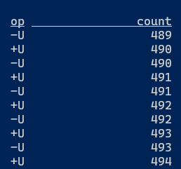
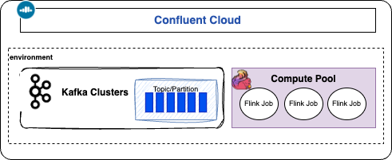
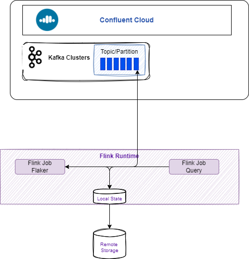

# Flink SQL DML

???- Info "Updates"
    Created 10/24
    Revised 4/07/26

This chapter continues the discussion of best practices for implementing Flink SQL Data Manipulation Language (DML) queries. DML defines statements that modify data without changing metadata.

## Sources of information

* [Confluent SQL documentation for DML samples](https://docs.confluent.io/cloud/current/flink/reference/queries/overview.html#flink-sql-queries) 
* [Apache Flink SQL](https://nightlies.apache.org/flink/flink-docs-master/docs/dev/table/sql/insert/)
* [Confluent Developer Flink tutorials](https://developer.confluent.io/tutorials/)
* [The Flink built-in system functions.](https://nightlies.apache.org/flink/flink-docs-release-1.20/docs/dev/table/functions/systemfunctions/)

## Common Patterns

It is important to recall that a `SELECT` applies to a stream of records, so the results change as new records arrive. The query below shows the latest top 10 orders; when a new record arrives, the list updates. 

```sql
select * from `examples`.`marketplace`.`orders` order by $rowtime limit 10;
```


???+ question "What are the different SQL execution modes? (OSS)"

    Using the previous table, you can count rows with:

    ```sql
    select count(*) AS `count` from pageviews;
    ```

    and we get different behavior depending on the execution mode:

    ```sql
    set 'execution.runtime-mode' = 'batch';
    # default one
    set 'execution.runtime-mode' = 'streaming';

    set 'sql-client.execution.result-mode' = 'table';
    ```

    In changelog mode, the SQL Client doesn't just update the count in place, but instead displays each message in the stream of updates it's receiving from the Flink SQL runtime.
    
    ```sql
    set 'sql-client.execution.result-mode' = 'changelog';
    ```

    

[See this lab in changelog mode](https://github.com/jbcodeforce/flink-studies/tree/master/code/flink-sql/05-changelog) and [this section in SQL concepts chapter](../concepts/flink-sql.md#changelog-mode).

### Filtering

* [Start with this Confluent tutorial](https://developer.confluent.io/confluent-tutorials/filtering/flinksql/) or [the Apache Flink `SELECT` documentation](https://nightlies.apache.org/flink/flink-docs-master/docs/dev/table/sql/queries/select/).
* `SELECT ... FROM ... WHERE ...` uses column projections or filters and is stateless. Unless the output table has a `retract` changelog while the input is `upsert`, the sink will use a `changelog materializer` (see [section below](#sinkupsertmaterializer)).
* `SELECT DISTINCT` removes duplicate rows, which requires keeping state for each distinct row.

???+ question "How to filter out records?"

    using the [WHERE clause](https://nightlies.apache.org/flink/flink-docs-master/docs/dev/table/sql/queries/select/)

    ```sql
    select * from flight_events where status = 'cancelled';
    ```

    Count the number of events related to a cancelled flight (need to use one of the selected field as grouping key):

    ```sql
    select flight_id, count(*) as cancelled_fl from FlightEvents where status = 'cancelled' group by flight_id;
    ```

    Recall that this query produces a dynamic table.

???+ question "HAVING to filter after aggregation"
    The `HAVING` clause is used to filter results after the aggregation (i.e., like `GROUP BY`). It is similar to the `WHERE` clause, but while `WHERE` filters rows before aggregation, `HAVING` filters rows after aggregation.
    ```sql
    SELECT url as product_page, 
        COUNT(click_id) as num_of_times_viewed, 
        COUNT(DISTINCT user_id) as num_of_users,
        AVG(view_time) as avg_view_time,
        MAX(view_time) as max_view_time
    FROM clicks
    GROUP BY url
    HAVING COUNT(click_id)  > 2;
    ```

???+ question "How to combine records from multiple tables (UNION)?"
    When the two tables have the same number of columns of compatible types, we can combine them:

    ```sql
    SELECT * FROM T1
    UNION ALL
    SELECT * FROM T2;
    ```

    [See product documentation on UNION](https://docs.confluent.io/cloud/current/flink/reference/queries/set-logic.html#flink-sql-set-logic-union). Remember that `UNION` applies `DISTINCT` and removes duplicates, while `UNION ALL` keeps all rows, including duplicates. 


???+ question "How to filter rows whose column content does not match a regular expression?"

    Use [REGEX](https://docs.confluent.io/cloud/current/flink/reference/functions/string-functions.html#flink-sql-regexp-function)

    ```sql
    WITH filtered_data AS (
    SELECT *,
        CASE 
            WHEN NOT REGEXP(user_agent, '.*Opera/.*') 
            THEN TRUE  -- Keep this row
            ELSE FALSE -- Filter out rows that match "Opera/"
        END AS keep_row
    FROM examples.marketplace.clicks
    )

    SELECT * 
    FROM filtered_data
    WHERE keep_row = TRUE;
    ```


???+ info "Navigate a hierarchical structure in a table"
    The table uses a node-and-ancestors representation. Suppose the graph represents a procedure at the highest level, then an operation, then a phase, and a phase step at level 4. The procedures table can have rows like:
    
    ```csv
    id, parent_ids, depth, information
    'id_1', [], 0 , 'procedure 1'
    'id_2', ['id_1'], 1 , 'operation 1'
    'id_3', ['id_1','id_2'], 2 , 'phase 1'
    'id_4', ['id_1','id_2','id_3'], 3 , 'phase_step 1'
    'id_5', ['id_1','id_2','id_3'], 3 , 'phase_step 2'
    ```

    Suppose we want to extract matching `procedure_id`, `operation_id`, `phase_id`, and `phase_step_id` like:
    ```csv
    id, procedure_id, operation_id, phase_id, phase_step_id, information
    'id_1', 'id_1', NULL, NULL, NULL, 'procedure 1'
    'id_2', 'id_1', 'id_2', NULL, NULL, 'operation 1'
    'id_3', 'id_1', 'id_2', 'id_3', NULL, 'phase 1'
    'id_4', 'id_1', 'id_2', 'id_3', 'id_4', 'phase_step 1'
    'id_5', 'id_1', 'id_2', 'id_3', 'id_5', 'phase_step 2'
    ```
    
    if the depth is 3, then the response should have all ids populated, if 0 only the top level is returned.
    
    ```sql
    with `procedures` as (
        select 'id_1' as id, array[''] as parentIds, 0 as `depth` , 'procedure 1' as info
        UNION ALL
        select 'id_2' as id, array['id_1'] as parentIds, 1 as `depth` , 'operation 1' as info
        UNION ALL
        select 'id_3' as id, array['id_1','id_2'] as parentIds, 2 as `depth`, 'phase 1' as info
        UNION ALL
        select 'id_4' as id, array['id_1','id_2','id_3'] as parentIds, 3 as `depth`, 'phase_step 1' as info
        UNION ALL
        select 'id_5' as id, array['id_1','id_2','id_3'] as parentIds, 3 as `depth`, 'phase_step 2' as info
        )
    select 
        id, 
        parent_id, 
        case when `depth` = 3 then id end as phase_step_id,
        case when `depth` = 2 then id end as phase_id,
        case when `depth` = 1 then id end as operation_id,
        case when `depth` = 0 then id end as procedure_id,
        info from `procedures` cross join unnest(parentIds) as ids(parent_id)
    ```


### Deduplication

Deduplication will occur on `upsert` table with primary key: the last records per `$rowtime` or other timestamp will be kept. When the source table is in `append` mode, the approach is to use the [ROW_NUMBER()](https://nightlies.apache.org/flink/flink-docs-master/docs/dev/table/functions/systemfunctions/#aggregate-functions) combined with [OVER()](https://nightlies.apache.org/flink/flink-docs-master/docs/dev/table/sql/queries/over-agg/):


```sql
CREATE TABLE unique_clicks
AS SELECT ip_address, url, TO_TIMESTAMP(FROM_UNIXTIME(click_ts_raw)) as click_timestamp
    FROM (
        SELECT *,
        ROW_NUMBER() OVER ( PARTITION BY ip_address ORDER BY TO_TIMESTAMP(FROM_UNIXTIME(click_ts_raw)) ASC) as rownum 
        FROM clicks
        )
    WHERE rownum = 1;
```

* The query is designed to identify and persist only the earliest record. Once the record is written to the table_deduped any subsequent events pertaining to the same `ip_address` are effectively discarded by the `WHERE rownum = 1` filter.
* `ROW_NUMBER()` assigns a unique, sequential number to each row. It is part of the Top-N query pattern.
* Use `OVER` aggregation to compute aggregate values for each input row under a window specification and a filter condition to express a Top-N query. Combined with `PARTITION BY`, Flink supports per-group Top-N.
* The inner query adds a `row_num` for each row in each partition.
* The subsequent `WHERE rownum = 1` clause filters the results to retain only the very first event observed for each unique `ip_address` based on its timestamp.
* The created table is an append table. There is no mechanism within this query to generate update or delete operations for records that have already been processed. Even if the underlying `clicks` table has a primary key defined, the transformation applied here dictates that the `unique_clicks` table will only ever grow by appending new, unique `ip_address` entries.
* If the sort order is `DESC`, when a new record arrives a retraction or update may be emitted.
* After deduplication, the upsert sink primary key should align with the partition keys used in the deduplication logic.

[See this example](https://docs.confluent.io/cloud/current/flink/how-to-guides/deduplicate-rows.html#flink-sql-deduplicate-topic-action) in the Confluent product documentation: `select * from dedup_table;` returns eight messages with no duplicates, and the Kafka topic also contains eight messages.

That walkthrough does not show that the *last* message per key is kept. The [deduplication sample](https://github.com/jbcodeforce/flink-studies/tree/master/code/flink-sql/00-basic-sql#deduplication-example) shows how an upsert table removes duplicates and retains the last record per key. 

* Confluent Cloud has limitations: `ORDER BY` in this pattern may be restricted to a timestamp column in ascending order.
* Example of deduplication on OSS Flink where `ORDER BY` can use columns of other types (where supported).
```sql
select *  FROM (
    SELECT 
        *,
        ROW_NUMBER() OVER (
            PARTITION BY emp_id 
            ORDER BY emp_id DESC
        ) AS row_num
    FROM employees
) WHERE row_num = 1
```

### Transformation

Some **important resources:**

* [Transform a Topic with Confluent Cloud for Apache Flink (product doc)](https://docs.confluent.io/cloud/current/flink/how-to-guides/transform-topic.html#transform-a-topic-with-af-long) covers topic transformation from the Data Portal: Actions → Transform Topic, which creates a CTAS Flink SQL statement and deploys it to the configured compute pool. This is efficient for Avro-to-JSON conversion, field renames, and primary-key changes.

???+ question "How to transform a field representing epoch to a timestamp?"
    
    epoch is a BIGINT.
    
    ```sql
     TO_TIMESTAMP(FROM_UNIXTIME(click_ts_epoch)) as click_ts
    ```

???+ question "How to change a date string to a timestamp?"

    ```sql
    TO_TIMESTAMP('2024-11-20 12:34:56Z'),
    ```

    ```sql
    to_timestamp(transaction_date, 'yyyy-MM-dd HH:mm:ss') as tx_date, -- bigint
    ```

    See all the [date and time functions](https://docs.confluent.io/cloud/current/flink/reference/functions/datetime-functions.html).

???+ question "How to compare a date field with current system time?"

    ```sql
    WHEN TIMESTAMPDIFF(day, event.event_launch_date, now()) > 120 THEN ...
    ```

    If the target table uses `changelog-mode` = `upsert`, using `now()` is problematic because the execution time is not deterministic per row. The statement above is appropriate mainly for `append` mode.


???+ question "How to extract the number of days between a date field and now?"
    The difference is in timestamp types. First cast the `DATE` column to a timestamp, then use `CURRENT_DATE` and the `DAY` unit. [See supported units (SECOND, MINUTE, HOUR, DAY, MONTH, or YEAR)](https://nightlies.apache.org/flink/flink-docs-master/docs/dev/table/functions/systemfunctions/#temporal-functions).
    ```sql
     TIMESTAMPDIFF(DAY, CAST(created_date AS TIMESTAMP_LTZ(3)), CURRENT_DATE) as days_since_launch,
    ```

???+ question "How to access elements of an array of rows?"
    The table has a column that is an array of rows. 
    ```sql
     CREATE TABLE my_table (
        key_col INT,
        nested_data ARRAY<ROW<id INT, name STRING>>
    ) WITH (...)
    ```

    To create one record per row within the array, so exploding the array, use CROSS JOIN UNNEST:
    ```sql
     SELECT
        t.key_col,
        unnested_row.id,
        unnested_row.name
    FROM
        my_table AS t
    CROSS JOIN UNNEST(t.nested_data) AS unnested_row;
    ```

    Each row in the nested_data array will be a row in the output table with the matching key_col. 


???+ question "How to use conditional functions?"
    [Flink has built-in conditional functions](https://nightlies.apache.org/flink/flink-docs-master/docs/dev/table/functions/systemfunctions/#conditional-functions) (see also [Confluent](https://docs.confluent.io/cloud/current/flink/reference/functions/conditional-functions.html)), especially `CASE WHEN`:

    ```sql
    SELECT 
        *
        FROM `stocks`
        WHERE  
        CASE 
            WHEN price > 200 THEN 'high'
            WHEN price <=200 AND price > 150 THEN 'medium'
            ELSE 'low'
        END;
    ```

???+ question "How to mask a field?"
    Create a new table from the existing one, and then use REGEXP_REPLACE to mask an existing attribute

    ```sql
    create table users_msk like users;
    INSERT INTO users_msk SELECT ..., REGEXP_REPLACE(credit_card,'(\w)','*') as credit_card FROM users;
    ```

### JSON Transformation

Flink provides JSON [built-in functions](https://nightlies.apache.org/flink/flink-docs-stable/docs/dev/table/functions/systemfunctions/#json-functions). `'$'` denotes the root node in a JSON path.

Paths can access properties ($.a), array elements ($.a[0].b), or branch over all elements in an array ($.a[*].b).

???+ question "How to access JSON data from a string column that contains a JSON object?"
    
    Use json_query function in the select.

    ```sql
     json_query(task.object_state, '$.dueDate') AS due_date,
    ```

    Use `json_value()` when you need a scalar extracted from JSON object content.
    ```sql
    select before, after, json_value(after, '$.patient_id') as patient_id from `hc_raw_patients`
    ```


???+ question "How to transform a JSON array column (named data) into an array and then generate n rows?"
    Returning an array from a json string:
    ```sql
    json_query(`data`, '$' RETURNING ARRAY<STRING>) as anewcolumn
    ```

    To create as many rows as there are elements in the nested array:
    ```sql
    SELECT existing_column, anewcolumn from table_name
    cross join unnest (json_query(`data`, '$' RETURNING ARRAY<STRING>)) as t(anewcolumn)
    ```

    UNNEST returns a new row for each element in the array
    [See multiset expansion doc](https://nightlies.apache.org/flink/flink-docs-master/docs/dev/table/sql/queries/joins/#array-multiset-and-map-expansion)

???+ question "Extract content from a JSON array as strings and explode to multiple rows?"
    The input record has a `parameters` column with an array of objects (key-value fields), like:
    ```json
    [{"parameter_name": "Pressure", "parameter_value": 10.0, "parameter_type": "float", "parameter_tolerance": 1.0}, {"parameter_name": "FlowRate", "parameter_value": 2.5, "parameter_type": "float", "parameter_tolerance": 0.5}, {"parameter_name": "MotorSpeed", "parameter_value": 3200.0, "parameter_type": "float", "parameter_tolerance": 150.0}]
    ```
    The first step is to explode the array using `CROSS JOIN UNNEST` on an array. Then extract each JSON object. Guard with conditions on the `parameters` string so `JSON_QUERY` receives valid input.
    ```sql
    SELECT
        prescription_id,
        patient_id,
        device_id,
        medication_or_therapy,
        JSON_VALUE(param_obj, 'lax $.parameter_name')     AS metric_name,
        CAST(JSON_VALUE(param_obj, 'lax $.parameter_value' RETURNING DOUBLE) AS DOUBLE) AS target_value,
        CAST(JSON_VALUE(param_obj, 'lax $.parameter_tolerance' RETURNING DOUBLE) AS DOUBLE) AS tolerance_range,
        start_date,
        end_date
    FROM `healthcare.public.prescriptions`
    CROSS JOIN UNNEST(
        JSON_QUERY(parameters, 'lax $[*]' RETURNING ARRAY<STRING>)
        ) AS t(param_obj)
    WHERE parameters IS NOT NULL AND TRIM(parameters) <> '' AND TRIM(parameters) <> '[]';
    ```

???+ question "How to implement the equivalent of SQL explode?"
    In classical SQL, `EXPLODE` creates a row for each element in the array or map and ignores null or empty entries in the array.
    ```sql
    SELECT explode(col1) from values (array(10,20)), (null)
    ```

    SQL also defines `EXPLODE_OUTER`, which returns all values in the array, including null or empty entries.

    To translate this to Flink SQL you can use `MAP_ENTRIES` and `MAP_FROM_ARRAYS`. `MAP_ENTRIES` returns an array of all entries in the given map. `MAP_FROM_ARRAYS` returns a map created from parallel arrays of keys and values.
    ```sql
    select map_entries(map_from_arrays())
    ```

    As presented in previous question, `CROSS JOIN UNNEST(array)` is also the recommended solution.
    

### Statement Set

Bundling statements in a single set reduces repeated reads from the source for each `INSERT`: one read from the source is executed and shared across downstream inserts.

Do not use a statement set when the sources differ for each statement inside the set. If one statement in the set fails, all queries in the set fail. State is shared across statements in the set, so one stateful query can affect the others.

???+ question "How to route late messages to a DLQ using a statement set?"
    First, create a DLQ table like `late_orders` based on the order table:
    
    ```sql
        create table late_orders
        with (
            'connector'= ''
        ) 
        LIKE orders (EXCLUDING OPTIONS)
    ```

    Group the main stream processing and late-arrival handling in one statement set:

    ```sql
    EXECUTE STATEMENT SET
    BEGIN
        INSERT INTO late_orders SELECT * FROM orders WHERE `$rowtime` < CURRENT_WATERMARK(`$rowtime`);
        INSERT INTO order_counts -- the sink table
            SELECT window_time, COUNT(*) as cnt
            FROM TABLE(TUMBLE(TABLE orders DESCRIPTOR(`$rowtime`), INTERVAL '1' MINUTE))
            GROUP BY window_start, window_end, window_time
    END
    ```

## Stateful aggregations

An aggregate function computes a single result from multiple input rows.

### GROUP BY

Classical SQL grouping of records, but with streaming the state may grow without bound. The size depends on the number of groups and how much data must be retained per group.
`group by` generates upsert events as it manages key-value and repartitions data.

```sql
EXPLAIN 
SELECT 
  account_number,
  transaction_type,
  SUM(amount) 
  FROM `transactions` 
  where transaction_type = 'withdrawal' 
  GROUP BY account_number,  transaction_type
HAVING SUM(amount) > 5000
```

The physical plan looks like
```
== Physical Plan ==

StreamSink [6]
  +- StreamCalc [5]
    +- StreamGroupAggregate [4]
      +- StreamExchange [3]
        +- StreamCalc [2]
          +- StreamTableSourceScan [1]

== Physical Details ==

[1] StreamTableSourceScan
Table: `j9r-env`.`j9r-kafka`.`transactions`
Primary key: (txn_id)
Changelog mode: append
Upsert key: (txn_id)
State size: low
Startup mode: earliest-offset
Key format: avro-registry
Key registry schemas: (:.:transactions/100220)
Value format: avro-registry
Value registry schemas: (:.:transactions/100219)

[4] StreamGroupAggregate
Changelog mode: retract
Upsert key: (account_number,transaction_type)
State size: medium
State TTL: never

[5] StreamCalc
Changelog mode: retract
Upsert key: (account_number,transaction_type)

[6] StreamSink
Table: Foreground
Changelog mode: retract
Upsert key: (account_number,transaction_type)
State size: low
```

### DISTINCT

Remove duplicates before aggregating:

```sql
ARRAY_AGG(DISTINCT user_name) as persons
```

### ARRAY_AGG

Array aggregation combines multiple data elements into a single array. It is widely used to regroup data points for downstream processing.

This [Flink `ARRAY_AGG` aggregate function](https://nightlies.apache.org/flink/flink-docs-master/docs/dev/table/functions/systemfunctions/#aggregate-functions) is common in record transformations. It returns an array whose elements come from multiple input rows.

Start with simple array indexing (indexes are 1-based through *n*). Below, `VALUES` creates in-memory test data in table alias `T` with column `array_field`:

```sql
SELECT array_field[4] FROM ((VALUES ARRAY[5,4,3,2,1])) AS T(array_field)
```

The following SQL creates a view with an [array aggregate](https://nightlies.apache.org/flink/flink-docs-master/docs/dev/table/functions/systemfunctions/#aggregate-functions): it collects URLs per `user_id` over one-minute tumbling windows.

```sql
CREATE VIEW visited_pages_per_minute AS 
SELECT 
    window_time,
    user_id, 
    ARRAY_AGG(url) AS urls
FROM TABLE(TUMBLE(TABLE `examples.marketplace.clicks`, DESCRIPTOR(`$rowtime`), INTERVAL '1' MINUTE))
GROUP BY window_start, window_end, window_time, user_id;
-- once the view is created
SELECT * from visited_pages_per_minute;

-- it is possible to expand an array into multiple rows using cross join unnest

SELECT v.window_time, v.user_id, u.url FROM visited_pages_per_minute AS v
CROSS JOIN UNNEST(v.urls) AS u(url)
```

Important: new clicks for the same `user_id` with a new URL produce a new output row with the updated aggregated array. See [cc-array-agg study](https://github.com/jbcodeforce/flink-studies/tree/master/code/flink-sql/03-nested-row/cc-array-agg).

To optimize processing, deduplicate and/or filter before aggregating; a Flink view is a typical pattern:

```sql
create view suites_versioned as 
select  suite_id, suite_name, asset_id, asset_name, asset_price_min, asset_price_max, ts_ltz
from (
    select *,
       ROW_NUMBER() OVER (PARTITION BY suite_id, asset_id ORDER BY ts_ltz DESC) as rn
        from suites
    ) where rn = 1;
```

Then the array aggregation:

```sql
select 
    suite_id,
    ARRAY_AGG(ROW (asset_id, asset_name,  ROW(asset_price_min, asset_price_max))) as asset_data, 
    max(ts_ltz) as ts_ltz
from suites_versioned group by suite_id;
```

As in the example above, the array element type can be a row containing nested rows. [See SQL examples](https://github.com/jbcodeforce/flink-studies/tree/master/code/flink-sql/03-nested-row/cc-array-agg/cc_array_agg_on_row.sql).


### OVER 

[OVER aggregations](https://nightlies.apache.org/flink/flink-docs-release-1.20/docs/dev/table/sql/queries/over-agg/) compute an aggregated value for every input row **over a range** of ordered rows. They do not reduce row count the way `GROUP BY` does; they emit one result per input row. 

OVER specifies the **time window** over which the aggregation is performed. A classical example is to get a moving sum or average: the number of orders in the last 10 seconds: 

```sql
SELECT 
    order_id,
    customer_id,
    `$rowtime`,
    SUM(price) OVER w AS total_price_ten_secs, 
    COUNT(*) OVER w AS total_orders_ten_secs
FROM `examples`.`marketplace`.`orders`
WINDOW w AS (
    PARTITION BY customer_id
    ORDER BY `$rowtime`
    RANGE BETWEEN INTERVAL '10' SECONDS PRECEDING AND CURRENT ROW
)
```

The source topic should be in append mode because over-window aggregation does not support retraction/update semantics. `OVER` is useful when each input row must be evaluated against a time or row interval. 


To detect when orders exceed limits for the first time and when aggregates later fall below other limits, use [LAG](https://docs.confluent.io/cloud/current/flink/reference/functions/aggregate-functions.html#lag).

```sql
-- compute the total price and # of orders for a period of 10s for each customer
WITH orders_ten_secs AS ( 
SELECT 
    order_id,
    customer_id,
    `$rowtime`,
    SUM(price) OVER w AS total_price_ten_secs, 
    COUNT(*) OVER w AS total_orders_ten_secs
FROM `examples`.`marketplace`.`orders`
WINDOW w AS (
    PARTITION BY customer_id
    ORDER BY `$rowtime`
    RANGE BETWEEN INTERVAL '10' SECONDS PRECEDING AND CURRENT ROW
    )
),
-- get previous orders and current order per customer
orders_ten_secs_with_lag AS (
SELECT 
    *,
    LAG(total_price_ten_secs, 1) OVER w AS total_price_ten_secs_lag, 
    LAG(total_orders_ten_secs, 1) OVER w AS total_orders_ten_secs_lag
FROM orders_ten_secs
WINDOW w AS (
    PARTITION BY customer_id
    ORDER BY `$rowtime`
    )
-- Filter orders when the order price and number of orders were above some limits for previous or current order aggregates
)
SELECT customer_id, 'BLOCK' AS action, `$rowtime` AS updated_at 
FROM orders_ten_secs_with_lag 
WHERE 
    (total_price_ten_secs > 300 AND total_price_ten_secs_lag <= 300) OR
    (total_orders_ten_secs > 5 AND total_orders_ten_secs_lag <= 5)
UNION ALL 
SELECT customer_id, 'UNBLOCK' AS action, `$rowtime` AS updated_at 
FROM orders_ten_secs_with_lag 
WHERE 
    (total_price_ten_secs <= 300 AND total_price_ten_secs_lag > 300) OR
    (total_orders_ten_secs <= 5 AND total_orders_ten_secs_lag > 5);
```


???+ question "Aggregation over the last n preceding elements"
    The OVER window ends at the current row and stretches backward through the stream for a bounded interval, either in time or by row count.
    For example counting the number of flight_schedule events of the same key over the last 100 events:

    ```sql
    select
        flight_id,
        evt_type,
        count(evt_type) OVER w as number_evt
    from flight_events
    window w as (partition by flight_id order by $rowtime rows between 100 preceding and current row);
    ```

    The results are updated for every input row. The partition is by flight_id. Order by $rowtime is necessary.

???+ question "When and how to use custom watermark?"
    Developers should define a custom [watermark strategy](https://docs.confluent.io/cloud/current/flink/reference/statements/create-table.html#watermark-clause) when there are few records per topic or partition, a large watermark delay is required, or a non-default event-time column is used.
    The default uses `SOURCE_WATERMARK()`, a watermark supplied by the source. A common explicit choice is `maximum-out-of-orderness` so late-arriving events can still fall in the correct window, trading latency for accuracy. Example:

    ```sql
    ALTER TABLE <table_name> MODIFY WATERMARK for `$rowtime` as `$rowtime` - INTERVAL '20' SECONDS
    ```

    The minimum out-of-orderness is 50ms and can be set up to 7 days. See [Confluent documentation.](https://docs.confluent.io/cloud/current/flink/reference/functions/datetime-functions.html#flink-sql-source-watermark-function) 


## Joins

When you run a join in a database, the result reflects the join state at execution time. In streaming, as both sides of a join receive new rows, both sides keep evolving. This is a **continuous query on dynamic tables**, and the engine must retain substantial state—effectively rows from each input. 

This is the common join we do between two tables: 

```sql
SELECT t.amount, t.order_type, s.name, s.opening_value FROM transactions t
LEFT JOIN stocks s
ON t.stockid = s.id
```

On the left, the fact table changes at high velocity; events are typically append-only or immutable. On the right, the dimension table receives new records more slowly.

When doing a join, Flink needs to fully materialize both the right and left of the join tables in state, which may cost a lot of memory, because if a row in the left-hand table (LHT), also named the **probe side**, is updated, the operator needs to emit an updated match for all matching rows in the right-hand table (RHT) or **build side**. The cardinality of right side will be mostly bounded at a given point of time, but the left side may vary a lot. A join emits matching rows to downstream operator.

The key points to keep in mind are:

* Regular joins typically produce a full cross-product of all matching records. However, in streaming scenarios, this behavior is often undesirable, for example if you want to enrich an event with additional information.
* Join order matters: prefer joining the slowest-changing dimension first when you can.
* A cross join without selective predicates can explode cardinality or hit resource limits.
* When the RHS is an upsert table, the join output is often upsert-shaped as well: results may be re-emitted when the RHS changes. To pin dimension values to event time, use a temporal join so the RHS is **as of** the LHS event time (**time-versioned** enrichment).

### Temporal Join

A [temporal join](https://docs.confluent.io/cloud/current/flink/reference/queries/joins.html#temporal-joins) joins one table with another table that is updated over time. This join is made possible by linking both tables using a time attribute, which allows the join to consider the historical changes in the table. 

    ```sql
    insert into enriched_transactions
    SELECT t.amount, t.order_type, s.name, s.opening_value FROM transactions t
    LEFT JOIN stocks s FOR SYSTEM_TIME AS OF t.purchase_ts
    ON t.stockid = s.id
    ```
* The query above is a temporal join. Temporal joins reduce state because only time-relevant versions of the RHS are needed. Progress is tied to watermarks. If `opening_value` changes over time, earlier enriched rows are not retroactively updated.  
* Temporal JOINs must include all of the PRIMARY KEY columns of the versioned (right-side) table: the ON conditions need to include exactly the same primary key columns:
    ```sql
    create table dim_rule_config(
       tenant_id STRING NOT NULL,
       rule_id BIGINT NOT NULL,
       rule_name STRING NOT NULL,
       parameter_id BIGINT NOT NULL,
       parameter_value BIGINT,
       primary key (tenant_id, rule_id, parameter_id) not enforced
    )
    # joining in a separate DML
    ...
    from extended_sensors s
    left join dim_rule_config for system as of s.event_ts as rule
    ON  s.tenant_id = rule.tenant_id
       AND s.rule_id = rule.rule_id 
       AND s.parameter_id = rule.parameter_id
    ```

    `extended_sensors` is a CTE that adds constant columns so the `ON` conditions reference columns on the LHS. To look up a specific rule and parameter, define those constants in the CTE:
    ```sql
    with extended_sensors (
        select
        ... all sensors attributes
        10 as rule_id,
        1 as parameter_id
        from sensors
    ) select ... 
    ```

    [See also this sample for rule-based control](https://github.com/jbcodeforce/flink-studies/tree/master/code/flink-sql/04-joins/rule_match_on_sensors/README.md) with temporal joins and constant columns.

* When the LHS of a temporal join is upsert, the sink often needs retract changelog mode; with an append LHS, an append sink is typical.
* An inner join with only equality predicates is not a full Cartesian product; unconstrained joins can behave like one.
* Outer joins (left, right, full) may emit rows with nulls for non-matching sides.

### Interval Join 
* Interval joins are particularly useful when working with unbounded data streams. Here is an example for orders and payments, where 
    ```sql
    CREATE TABLE valid_orders (
        order_id STRING,
        customer_id INT,
        product_id STRING,
        order_time TIMESTAMP_LTZ(3),
        payment_time TIMESTAMP_LTZ(3),
        amount DECIMAL,
        WATERMARK FOR order_time AS order_time - INTERVAL '5' SECOND
    ) AS SELECT unique_orders.order_id, customer_id, product_id, unique_orders.`$rowtime` AS order_time, payment_time, amount
    FROM unique_orders
        INNER JOIN payments
        ON unique_orders.order_id = payments.order_id
        WHERE unique_orders.`$rowtime` BETWEEN payment_time - INTERVAL '10' MINUTES AND payment_time;
    ```
    
* INTERVAL JOIN requires at least one equi-join predicate and a join condition that bounds the time on both sides.
    ```sql
    SELECT t.amount, t.order_type, s.name, s.opening_value FROM transactions t, stocks s
    WHERE t.stockid = s.id AND t.ts BETWEEN s.ts - INTERVAL '6' HOURS AND s.ts
    ```

### Lateral Joins

LATERAL TABLE clause is used to invoke a Table-Valued Function (TVF) or a [User-Defined Table Function](./udf_sql.md) (UDTF) for every row of a base (outer) table. The Lateral Join evaluates a subquery or a function for each row of the first table, and the result of that evaluation is then joined back to the original row. The UDTF/TVF on the right side of the join can reference columns from the table on the left side.

```sql
SELECT
    t.*,
    tf.*
FROM
    input_table AS t,
    LATERAL TABLE(udtf_function(t.column_a, t.column_b)) AS tf(output_column_1, output_column_2)
```

You can combine `LATERAL TABLE` with different join types to control which rows are preserved.

| Joins | Behavior |
| --- | --- |
| CROSS JOIN LATERAL TABLE(...) | If the UDTF returns zero rows for a given input row, the original row from the outer table is discarded. |
| LEFT JOIN LATERAL | Returns all rows from the outer table, even if the UDTF produces zero rows.|

`LATERAL TABLE` lets you transform stream records row by row, which is awkward with standard joins alone.

### Multi-way joins

[See Confluent Flink SQL documentation](https://docs.confluent.io/cloud/current/flink/reference/queries/joins.html#enabling-multi-way-joins) for multi-way joins and Flink state optimization. Add hints such as:
    ```sql
    SELECT /*+ MULTI_JOIN(o, c, a) */ 
    * FROM orders o
    JOIN customers c ON o.customer_id = c.id
    JOIN addresses a ON c.id = a.customer_id;
    ```


### References

Here is a list of important tutorials on Joins:

* [Confluent Cloud: joins documentation](https://docs.confluent.io/cloud/current/flink/reference/queries/joins.html) explains how joins behave in Flink SQL.
* [Confluent Developer: How to join streams](https://developer.confluent.io/tutorials/join-a-stream-to-a-stream/flinksql.html). Related exercises live in the [flink-sql/04-joins folder](https://github.com/jbcodeforce/flink-studies/tree/master/flink-sql/04-joins) for Confluent Cloud or Confluent Platform for Flink.
* [Confluent temporal join documentation.](https://docs.confluent.io/cloud/current/flink/reference/queries/joins.html#temporal-joins)
* [Window Join Queries in Confluent Cloud for Apache Flink](https://docs.confluent.io/cloud/current/flink/reference/queries/window-join.html)
* [Temporal Join Study in this repo.](https://github.com/jbcodeforce/flink-studies/tree/master/code/flink-sql/09-temporal-joins)


### FAQs
???+ info "Inner knowledge on temporal join"
    Event-time temporal joins align two or more tables on a **common** event time (from a business timestamp column or the Kafka record timestamp in `$rowtime`). With event time, the operator can read a key as it was at a past instant. The versioned RHS retains rows keyed by time up to the watermark horizon.

    Temporal Flink SQL looks like:
    
    ```sql
    SELECT [column_list]
    FROM table1 [AS <alias1>]
    [LEFT] JOIN table2 FOR SYSTEM_TIME AS OF table1.{ rowtime } [AS <alias2>]
    ON table1.column-name1 = table2.column-name1
    ```

    When enriching `table1`, an event-time temporal join waits until the watermark on `table2` reaches that `table1` row's timestamp, so the join uses a complete snapshot of relevant `table2` rows as of that time. `table2` rows may be older if that side's watermark lags.

???+ info "How to join two tables on a key within a time window using event column as timestamp and store results in a target table?"
    Full example:

    ```sql
    -- use separate statements to create the tables
    create table Transactions (ts TIMESTAMP(3), tid BIGINT, amount INT);
    create table Payments (ts TIMESTAMP(3), tid BIGINT, type STRING);
    create table Matched (tid BIGINT, amount INT, type STRING);

    execute statement set
    begin
    insert into Transactions values(now(), 10,20),(now(),11,25),(now(),12,34);
    insert into Payments values(now(), 10, 'debit'),(now(),11,'debit'),(now(),12,'credit');
    insert into Matched
        select T.tid, T.amount, P.type
        from Transactions T join Payments P ON T.tid = P.tid
        where P.ts between T.ts and T.ts + interval '1' minutes;
    end
    ```

???+ question "How does primary key selection impact joins?"
    Primary keys on source tables do not constrain which columns you join on. What matters for sinks is that the sink primary key aligns with the effective key produced by the final join shape.

???+ info "Understand left-side velocity and update strategy"
    If the left table has a high velocity and there is no new event for the defined primary key, then it is important to set a TTL on the left side that is short so the state will stay under control. Use the aliases set on the tables and set the retention time.
    ```sql
    select /* STATE_TTL('tx'='120s', 'c'='4d') */
        tx_id, account_id, amount, merchant_id, tx_type 
    from transaction tx
    LEFT JOIN account c
    on tx.account_id = c.id
    ```

    **Remark**: Running `EXPLAIN` on the statement above shows the configured TTL.

???+ warning "Join on 1x1 relationship"
    In current Flink SQL it is not possible to *efficiently* join elements from two tables when we know the relation is 1 to 1: one transaction to one account, one shipment to one order. As soon as there is a match, normally we want to emit the result and clear the state. This is possible to do so with the DataStream API, not SQL.

## Windowing / Table Value Functions

[Windowing Table-Valued Functions](https://docs.confluent.io/cloud/current/flink/reference/queries/window-tvf.html) cover Tumble, Hop, Cumulate, and Session windows. Windows split the stream into finite buckets for aggregation and other logic. TVFs add `window_start`, `window_end`, and `window_time` columns for the assigned window.

* The TUMBLE function assigns each element to a window of specified window size. Tumbling windows have a fixed size and do not overlap.

???+ question "Count the number of different product types per 10 minutes (TUMBLE window)"
    [Aggregate a stream in a tumbling window](https://docs.confluent.io/cloud/current/flink/how-to-guides/aggregate-tumbling-window.html).
    The following query counts distinct product types from the event stream in 10-minute tumbling windows.

    ```sql
    SELECT window_start, product_type, count(product_type) as num_ptype
        FROM TABLE(
            TUMBLE(
                TABLE events,
                DESCRIPTOR(`$rowtime`),
                INTERVAL '10' MINUTES
            )
        )
        GROUP BY window_start, window_end, product_type;
    ```
    `DESCRIPTOR` selects the time attribute for windowing (here, Kafka record ingestion time as `$rowtime`).

    When the window closes, results are emitted. That bounds how much window state Flink retains—here, roughly by the number of distinct `product_type` values per window. 

    It is possible to use another timestamp from the input table. For example the `transaction_ts TIMESTAMP(3),` 
    then we need to declare a watermark on this ts:

    `WATERMARK FOR transaction_ts AS transaction_ts - INTERVAL '5' SECOND,`
    so it can be used in the descriptor function.
    
    ```sql
    INSERT INTO app_orders
    SELECT
        window_start,
        window_end,
        customer_id,
        SUM(order_amount)
    FROM TABLE(TUMBLE(TABLE `daily_spend`, DESCRIPTOR(transaction_ts), INTERVAL '24' HOURS))
    GROUP BY window_start, window_end, customer_id
    ```


???+ question "Find the number of elements in x minutes intervals advanced by 5 minutes? (HOP)"
    [Confluent documentation on window TVFs.](https://docs.confluent.io/cloud/current/flink/reference/queries/window-tvf.html) For **HOP** windows, the slide interval controls how often a new hopping window starts:

    ```sql
        SELECT
            window_start, window_end,
            COUNT(DISTINCT order_id) AS num_orders
        FROM TABLE(
            HOP(TABLE shoe_orders, DESCRIPTOR(`$rowtime`), INTERVAL '5' MINUTES, INTERVAL '10' MINUTES))
        GROUP BY window_start, window_end;
    ```

???+ question "How to compute accumulated price over a day (CUMULATE)?"
    Use a cumulate window: it grows toward a maximum window size and emits partial results at each step.
    This image summarizes the behavior:
    

    ```sql
    SELECT window_start, window_end, SUM(price) as `sum`
        FROM TABLE(
            CUMULATE(TABLE `examples`.`marketplace`.`orders`, DESCRIPTOR($rowtime), INTERVAL '30' SECONDS, INTERVAL '3' MINUTES))
        GROUP BY window_start, window_end;
    ```

## SinkUpsertMaterializer

When operating in upsert mode and processing two update events, a potential issue arises. If input operators for two tables in upsert mode are followed by a join and then a sink operator, update events might arrive at the sink out of order. If the downstream operator's implementation doesn't account for this out-of-order delivery, it can lead to incorrect results.

Flink typically determines the ordering of update history based on the primary key (or upsert keys) through a global analysis in the Flink planner. However, a mismatch can occur between the upsert keys of the join output and the primary key of the sink table. The `SinkUpsertMaterializer` operator addresses this mapping discrepancy.

This operator maintains a complete list of RowData in its state to correctly process any deletion events originating from the source table. However, this approach can lead to a significant state size, resulting in increased state access I/O overhead and reduced job throughput. Also the output value for each primary key is always the last (tail) element in the maintained list. It is generally advisable to avoid using `SinkUpsertMaterializer` whenever possible. 

Consider a scenario where 1 million records need to be processed across a small set of 1,000 keys. In this case, `SinkUpsertMaterializer` would need to store a potentially long list, averaging approximately 1,000 records per key. 

To mitigate the usage of `SinkUpsertMaterializer`:

* Ensure that the partition keys used for deduplication, group aggregation, etc., are identical to the sink table's primary keys.
* `SinkUpsertMaterializer` is unnecessary if retractions already use the same key as the sink primary key. When most rows are soon retracted, the materializer may retain far less state.
* Utilize Time-To-Live (TTL) to limit the state size based on time.
* A higher number of distinct values per primary key directly increases the state size of the SinkUpsertMaterializer.


## Row pattern recognition

???+ question "Find the longest period of time for which the average price of a stock did not go below a value"
    Create a Datagen to publish StockTicker to a Kafka topic.
    [See product documentation on CEP pattern with SQL](https://nightlies.apache.org/flink/flink-docs-release-1.15/docs/dev/table/sql/queries/match_recognize/)
    
    ```sql
    create table StockTicker(symbol string, price int, tax int) with ('connector' = 'kafka',...)
    SELECT * FROM StockTicker 
    MATCH_RECOGNIZE ( 
        partition by symbol 
        order by rowtime
        measures
            FIRST(A.rowtime) as start_tstamp,
            LAST(A.rowtime) as last_tstamp,
            AVG(A.price) as avgPrice
        ONE ROW PER MATCH
        AFTER MATCH SKIP PAST LAST ROW
        PATTERN (A+ B)
        DEFINE
            A as AVG(A.price) < 15
    );
    ```

    MATCH_RECOGNIZE helps to logically partition and order the data that is used with the PARTITION BY and ORDER BY clauses, then defines patterns of rows to seek using the PATTERN clause.
    The logical components of the row pattern variables are specified in the DEFINE clause.
    B is defined implicitly as not being A.

## Confluent Cloud Specifics

[See Flink Confluent Cloud queries documentation.](https://docs.confluent.io/cloud/current/flink/reference/queries/overview.html)

Each topic maps to a table with metadata columns such as `$rowtime`, aligned to the Kafka record timestamp. To inspect columns and watermarks, run `DESCRIBE EXTENDED table_name;`. With watermarking, arriving events are processed roughly in order with respect to `$rowtime`.

???+ question "Mapping from Kafka record timestamp and table $rowtime"
    The Kafka record timestamp maps to `$rowtime`, a read-only field. Use it to order rows by ingestion time:

    ```sql
    select 'flight_id', 'aircraft_id', 'status', $rowtime
    from Aircrafts
    order by $rowtime;
    ```


???+ question "How to run Confluent Cloud for Flink?"
    See [the note](../techno/ccloud-flink.md), but can be summarized as: 1/ create a stream processing compute pool in the same environment and region as the Kafka cluster, 2/ use Console or CLI (flink shell) to interact with topics.

    

    ```sh
    confluent flink quickstart --name my-flink-sql --max-cfu 10 --region us-west-2 --cloud aws
    ```

???+ question "Running Confluent Cloud Kafka with local Flink"
    The goal is to show how to use a Confluent Cloud cluster and send messages via FlinkFaker from a local table into a Kafka topic:
    
    

    See the [scripts and README](https://github.com/jbcodeforce/flink-studies/tree/master/flink-sql/01-confluent-kafka-local-flink).

???+ question "Reading from a topic at specific offsets"
    ```sql
    ALTER TABLE table_name SET (
        'scan.startup.mode' = 'specific-offsets',
        'scan.startup.specific-offsets' = 'partition:0,offset:25; partition:1,offset:10'
    );
    -- Returns from offsets 26 and 11
    SELECT * FROM table_name;
    ```

???+ question "Create a long-running SQL job with the CLI"
    Get or create a service account.
    
    ```sh
    confluent iam service-account create my-service-account --description "new description"
    confluent iam service-account list
    confluent iam service-account describe <id_of_the_sa>
    ```

    ```sh
    confluent flink statement create my-statement --sql "SELECT * FROM my-topic;" --compute-pool <compute_pool_id> --service-account sa-123456 --database my-cluster
    ```

## Analyzing Statements

???+ question "Assess the current Flink statement running in Confluent Cloud"
    To see which jobs are running, failed, or stopped, use the Confluent Cloud UI (Flink workspace) or the `confluent` CLI:

    ```sh
    confluent environment list
    confluent flink compute-pool list
    confluent flink statement list --cloud aws --region us-west-2 --environment <your env-id> --compute-pool <your pool id>
    ```


### Understand the physical execution plan for a SQL query

See the [`EXPLAIN` statement](https://nightlies.apache.org/flink/flink-docs-master/docs/dev/table/sql/explain/) or [Confluent Flink documentation](https://docs.confluent.io/cloud/current/flink/reference/statements/explain.html) for how to read the plan.

```sql
explain select ...
```

Indentation indicates data flow, with each operator passing results to its parent. 

Review the state size, the changelog mode, the upsert key... Operators change changelog modes when different update patterns are needed, such as when moving from streaming reads to aggregations.

Pay special attention to data skew when designing your queries. If a particular key value appears much more frequently than others, it can lead to uneven processing where a single parallel instance becomes overwhelmed handling that key’s data. Consider strategies like adding additional dimensions to your keys or pre-aggregating hot keys to distribute the workload more evenly. Whenever possible, configure the primary key to be identical to the upsert key.


### Troubleshooting SQL statement running slow

???+ info "How to search for hot key?"
    ```sql
    SELECT
        id,
        tenant_id,
        count(*) AS record_count
    FROM table_name
    GROUP BY id, tenant_id
    ```

    A more advanced statistical query ( TO BE TESTED)
    ```sql
    WITH key_stats AS (
        SELECT 
            id,
            tenant_id,
            count(*) as record_count
        FROM src_aqem_tag_tag 
        GROUP BY id, tenant_id
    ),
    distribution_stats AS (
        SELECT 
            AVG(record_count) as mean_count,
            STDDEV(record_count) as stddev_count,
            PERCENTILE_APPROX(record_count, 0.75) as q3,
            PERCENTILE_APPROX(record_count, 0.95) as p95,
            PERCENTILE_APPROX(record_count, 0.99) as p99
        FROM key_stats
    )
    SELECT 
        ks.*,
        ds.mean_count,
        ds.stddev_count,
        -- Z-score calculation for outlier detection
        CASE 
            WHEN ds.stddev_count > 0 
            THEN (ks.record_count - ds.mean_count) / ds.stddev_count
            ELSE 0
        END as z_score,
        -- Hot key classification
        CASE 
            WHEN ks.record_count > ds.p99 THEN 'EXTREME_HOT'
            WHEN ks.record_count > ds.p95 THEN 'VERY_HOT'
            WHEN ks.record_count > ds.q3 * 1.5 THEN 'HOT'
            ELSE 'NORMAL'
        END as hot_key_category
    FROM key_stats ks
    CROSS JOIN distribution_stats ds
    WHERE ks.record_count > ds.mean_count 
    ```

### Confluent Flink Query Profiler

This is a Confluent-specific view of Flink performance, related to the Flink Web UI, for monitoring statement execution.


* [Query Profiler Product documentation](https://docs.confluent.io/cloud/current/flink/operate-and-deploy/query-profiler.html)
* [See how to use the Query Profiler to debug statements in the techno chapter](../techno/ccloud-flink.md#query-profiler).


