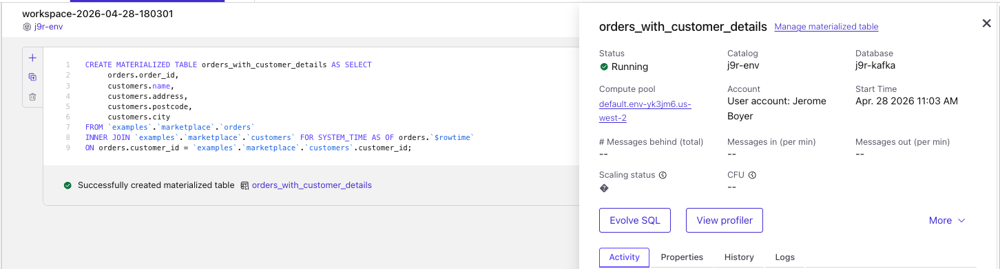
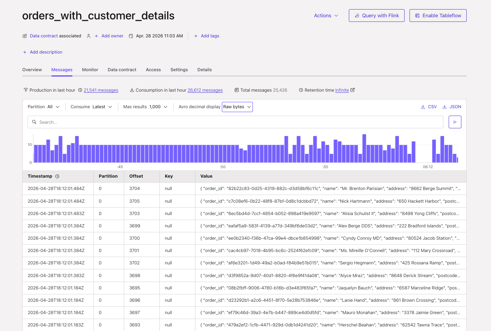
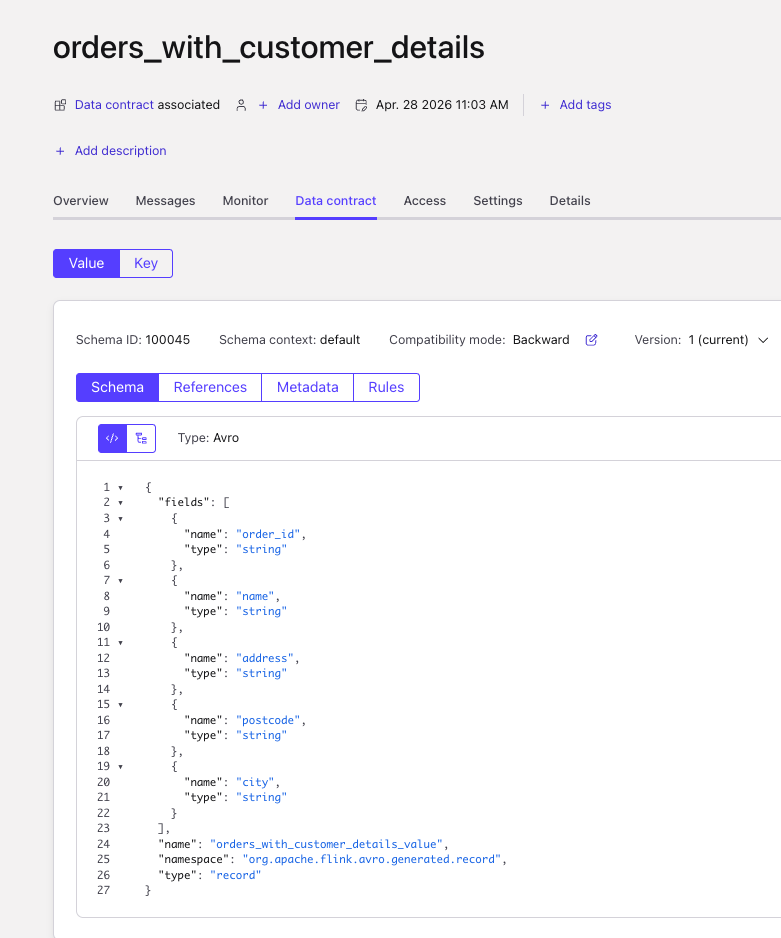
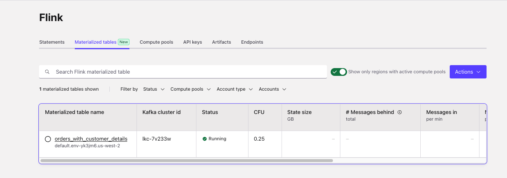
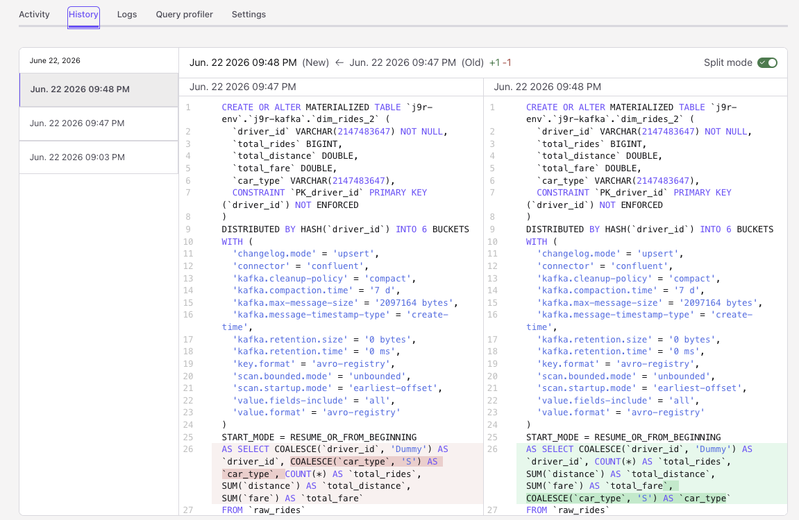

# Materialized Tables


## Current Challenges

With Flink SQL statements, developers who need to update the pipeline's logic (e.g., changing a query), have to perform a manual, error-prone process: they must stop the existing statement, create a new table with the updated query, manually manage stream offsets to prevent data loss, and migrate the downstream consumers to the new topic. This process is largely incompatible with modern CI/CD and GitOps practices.

## Concepts

[Materialized Tables](https://nightlies.apache.org/flink/flink-docs-stable/docs/dev/table/materialized-table/overview/) helps to manage Tables in long term with easier development life cycle than traditional Flink Tables. They are the recommended solution for creating permanent, evolving streaming pipelines.

Materialized Tables support in-place evolution via the CREATE OR ALTER command. This feature automates complex administrative tasks such as offset management and schema synchronization. Whenever a new MT definition is submitted, the control plane stops the system statement, performs the necessary evolutions and starts a new system statement.
*Unlike a regular CREATE TABLE combined with an INSERT INTO statement, a materialized table is a single declarative object that owns both the table definition and the continuous query.*

They use the concept of data freshness as the maximum amount of time that the materialized table’s content should lag behind updates to the base tables. The default refreshness is 3 minutes for CONTINUOUS mode and 1 hours for FULL mode. The query results are updated to the materialized table continuously, while in FULL mode, the query results overwrite the materialized table each time.

* With full mode, there is a scheduler that triggers a batch job to refresh the materialized table data. 
* With CONTINUOUS, data freshness is converted into the checkpoint interval of the Flink streaming job.
* Materialized Tables are defined as other Flink tables, with the MATERIALIZED keywords. [See the syntax](https://nightlies.apache.org/flink/flink-docs-release-2.2/docs/dev/table/materialized-table/statements/), and uses a CTAS structure
    ```sql
    CREATE MATERIALIZED TABLE orders_table
    FRESHNESS = INTERVAL '10' SECOND
    AS SELECT * FROM kafka_catalog.db1.orders;
    ```

* Use CREATE OR ALTER MATERIALIZED TABLE, to suspend and resume, refresh pipeline of materialized tables, to manually trigger data refreshes, and to modify the query definition of materialized tables. Users can control how much historical data is processed during these updates by configuring the START_MODE parameter. In Confluent Cloud the default is RESUME_OR_FROM_BEGINNING.

* In Apache Flink, SUSPEND needs to set the savepoint directory:
    ```sql
    SET 'execution.checkpointing.savepoint-dir' = 'file:///Users/jerome/Documents/Code/flink-studies/code/flink-sql/13-materialized-table/savepoints';

    ALTER MATERIALIZED TABLE continuous_users_shops SUSPEND;
    ```

* It is possible to trigger a refresh:
    ```sql
    CREATE OR ALTER MATERIALIZED TABLE my_materialized_table REFRESH;
    ```
* `ALTER... AS` will change the table schema, and then refresh the data. In FULL mode, not partitioned, the table will be overwritten. With partioning it will refresh the latest partition. With CONTINUOUS, the new refresh job starts from the beginning and does not restore from the previous state.
* When runing, ALTER MATERIALIZED TABLE that changes a GROUP BY or window definition in a stateful aggregation, the old aggregation state is discarded. The new results are rebuilt from scratch. Users often expect continuity and are surprised by the reprocessing cost. Use START_MODE = FROM_NOW if the statement do not need historical recomputation. 
* Use SHOW CREATE MATERIALIZED TABLE <name> to get the changelog mode (upsert, retract, append-only), the current query, and the WITH properties. Zombie / duplicate triage depends on knowing the changelog mode first. This command also shows FRESHNESS and REFRESH_MODE values.

## Architecture

The SQL Gateway is the important component to manage the life cycle of MT. It includes a workflow scheduler to manage periodic refresh jobs.


For Confluent Cloud, MTs use exactly the same RBAC model as current Statements do, including the Flink roles and the requires Kafka and/or Schema Registry roles. If a user adds a projection to their query, Flink will take care of evolving the schema in Schema Registry (for the schema belonging to the sink table/topic) too. If there is a failure during an evolution, the MT will transition to Failed and not roll back to the previous state

## Limitations

* No Statement Sets: Materialized tables cannot be grouped or used within Flink statement sets
* **Not Idempotent**: Running a CREATE OR ALTER command on a materialized table will always trigger a new evolution and **discard state**, even if the query logic hasn't changed. State is rebuilt from the source. 
* Net-New Only: You cannot convert an existing standard table into a materialized table; you must create a new MT
* User can’t define a Materialized Table on an existing Kafka topic, a new MT needs to be defined from data of this topic.
* **No Automatic Change Detection**: Neither materialized tables nor statements will automatically detect changes to upstream dependencies (like a source topic's schema changing); an evolution must be explicitly triggered by using CREATE OR ALTER TABLE.
* During reprocessing, append-sinks will **receive duplicates**.
* Confluent Cloud: All existing capabilities from Statements are also available for MTs (like Query Profiler, Billing, Metrics API). System Statements are only visible via the REST API and Metrics API, but users can not control them.

## CI/CD considerations

* CREATE OR ALTER MATERIALIZED TABLE in CI/CD without a change-detection gate will trigger a MT migration. It is strongly recommended to add control using a SHA or git-diff check, before running the CREATE OR ALTER dml. When idempotency will be support this restriction may change.
* When deploying MTs in the same compute pool, as all are mutable, any Flink developers can change those tables. It may be better to use one compute pool per MT as security isolation boundary. 


## Demonstrations

* For Apache Flink [See 13-materialized table folder](https://github.com/jbcodeforce/flink-studies/tree/master/code/flink-sql/13-materialized-table) in this repository. 
* For Confluent Code, use the new Materialized Tables tab, and create the new table.
    

    This will execute a Flink Statement to create the table, topic and schema, and it will complete.
    
* Looking at the default configuration of the table (`show create materialized table`) we get:

    ```sql
    CREATE OR ALTER MATERIALIZED TABLE `j9r-env`.`j9r-kafka`.`orders_with_customer_details` (
        `order_id` VARCHAR(2147483647) NOT NULL,
        `name` VARCHAR(2147483647) NOT NULL,
        `address` VARCHAR(2147483647) NOT NULL,
        `postcode` VARCHAR(2147483647) NOT NULL,
        `city` VARCHAR(2147483647) NOT NULL
    )
    DISTRIBUTED INTO 6 BUCKETS
    WITH (
        'changelog.mode' = 'append',
        'connector' = 'confluent',
        'kafka.retention.time' = '0 ms',
        'scan.bounded.mode' = 'unbounded',
        'scan.startup.mode' = 'earliest-offset',
        'value.format' = 'avro-registry'
    )
    START_MODE = RESUME_OR_FROM_BEGINNING
    FRESHNESS = INTERVAL '1' MINUTE
    REFRESH_MODE = CONTINUOUS
    AS SELECT `orders`.`order_id`, `customers`.`name`, `customers`.`address`, `customers`.`postcode`, `customers`.`city`
    FROM `examples`.`marketplace`.`orders`
    INNER JOIN `examples`.`marketplace`.`customers` FOR SYSTEM_TIME AS OF `orders`.`$rowtime` ON `orders`.`customer_id` = `examples`.`marketplace`.`customers`.`customer_id`
    ```

* Topic is created with key, value records:

    

* Schemas are created too:

    

* And the table is visible in `Flink/Materialized Tables` view:

    

* From this view, it is possible to stop, resume, delete the MT. 
* The History view of a MT is able to illustrate differences between query versions:
    

### Change source topic schema
 
We want to demonstrate how a change the source schema, with controlled records. See the folder [flink-sql/13-materialized-table/cc](https://github.com/jbcodeforce/flink-studies/tree/master/code/flink-sql/13-materialized-table/cc) with Kafka producer and materialized table.