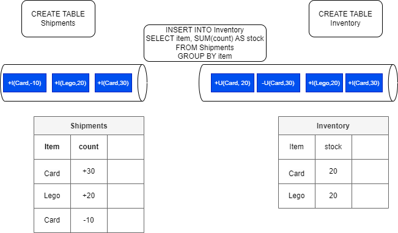

# Flink SQL and Table API

???- Info "Updates"
    Created 02/2021 Modified 10/24

## Introduction

Flink SQL is a compliant standard SQL engine for processing batch or streaming data on top of distributed computing server managed by Flink.

Flink’s SQL support is based on [Apache Calcite](https://calcite.apache.org/) to support SQL based streaming logic implementation. It is using the [Table API](https://nightlies.apache.org/flink/flink-docs-release-1.19/docs/dev/table/tableapi/) which is a language-integrated query API for Java, Scala, and Python that allows the composition of queries from relational operators such as selection, filter, and join.

The Table API can deal with bounded and unbounded streams in a unified and highly optimized ecosystem inspired by databases and SQL.

Table and SQL are implemented on top of low level stream operator API, which itself runs on the dataflow runtime:

{ width=400}

It is possible to code the SQL and Table API in a Java, Scala or Python or use SQL client, which is an interactive client to submit SQL queries to Flink and visualize the results.

Stream or bounded data are mapped to Table. The following command loads data from a csv file and creates a dynamic table in Flink:

```sql
CREATE TABLE car_rides (
    cab_number VARCHAR,
    plate VARCHAR, 
    cab_type VARCHAR,
    driver_name VARCHAR, 
    ongoing_trip VARCHAR, 
    pickup_location VARCHAR, 
    destination VARCHAR, 
    passenger_count INT
) WITH ( 
    'connector' = 'filesystem',
    'path' = '/home/flink-sql-quarkus/data/cab_rides.txt',
    'format' = 'csv'
);
```

[See the getting started](./getting-started.md) to run locally with a sql client.

## SQL programming samples

Those tables are dynamic, because they change overtime, and some tables are more a changelog stream than static tables. 

The following diagram illustrates the main processing concepts: the `shipments` table keeps track of product shipments while the `inventory` keeps the current quantity of each item. The insert statement is the stream processing to update the inventory from the new shipment records. This SQL statement uses the sum aggregator operation on the count for each item. The items are shuffled to group them by item.



The SQL is applied to the stream of data, data is not stored in Flink. The events can be `insert`, `update` or `delete` record in the table. The diagram illustrates that, at the sink level, the first events reflect adding items to the inventory, while when there is an update to the Card inventory, a first record is created to remove the current stock of Card item and send a new message with the new stock value (2 cards). This last behavior is due to the `group by` semantic, and the fact that the right 'table' is an update only table, while the left one ia an append only table. 

Dynamic Table can also being persisted in Kafka Topic, so table definition includes statement on how to connect to Kafka. When doing batch processing the sink can be a table in database or a csv file on the filesystems.

Note that SQL Client executes each **INSERT INTO** statement as a single Flink job. `STATEMENT SET` can be used to group insert statements (into a set). As the  job manager schedules the job to the task managers, SQL statements are executed asynchronously. While for batch processing; developer can set `set table.dml-sync option to true` 

With streaming, the "ORDER BY" is one time ascending order, with batch it can apply to anything. In Streaming, SQL `ORDER BY` is only based on time ascending sorting.

SQL client can intract in interactive mode or [using a SQL file](https://nightlies.apache.org/flink/flink-docs-release-1.20/docs/dev/table/sqlclient/#execute-sql-files) to process to the server. 


### SQL operators

| Type | Operators | Comments|
| --- | --- | --- |
| **Stateless** | SELECT <projection | transformation> WHERE <filter> | Can be distributed |
| **Materialized** | GROUP BY <aggregationss> or JOINS | Dangerously Stateful, keep an internal copy of the data related to the query |
| **Temporal** | time windowed operation, interval joins, time-versioned joins, MATCH_RECOGNIZE <pattern> | Stateful but contrained in size |

As elements are kept in storage to compute materialized projection then we need to assess the number of elements to keep Million to billion of small items is possible. But query running for ever may eventually overflow the data store. In this last case the Flink task will eventually fail.

As an example the query:

```sql
SELECT transactions.amount, products.price
FROM transactions
JOIN products
ON transactions.product_id = products.id
```

Any previously processed records can be used potentially to process the join operation on new arrived record.

To avoid this we need to consider time windows. The following query count the number of different product type arriving from the event stream by interval of 10 minutes.

```sql
SELECT window_start, product_type, count(product_type)
    FROM TABLE(
        TUMBLE(
            TABLE events,
            DESCRIPTOR(timestamp),
            INTERVAL '10' MINUTES
        )
    )
    GROUP BY window_start, window_end, product_type
```

When the internal time has expired the results will be published. This put an upper boundon how much state Flink needs to keep to handle a query, which in this case is related to the number of different product type. 

### How to

???- question "How to load data from a csv file using filesystem connector"
    Enter the following statement in a SQL client session:

    ```sql
    SET execution.runtime-mode=BATCH;
    ```
    Create a table from the content of the file

    ```sql
    CREATE TABLE employee_info (
        emp_id INT,
        name VARCHAR,
        dept_id INT
    ) WITH ( 
        'connector' = 'filesystem',
        'path' = '/home/flink-sql-demos/00-basic-sql/data/employes.csv',
        'format' = 'csv'
    );
    ```

    Show tables and list some elements within the table.
    ```sql
    SHOW TABLES;

    SELECT * from employee_info WHERE dept_id = 101;
    ```

    [See complete example in the readme](https://github.com/jbcodeforce/flink-studies/tree/master/flink-sql-demos/00-basic-sql)


??? - question "How to generate data using [Flink Faker](https://github.com/knaufk/flink-faker)?"
    Create at table with records generated with `faker` connector using the [DataFaker expressions.](https://github.com/datafaker-net/datafaker). 

    ```sql
    CREATE TABLE `bounded_pageviews` (
      `url` STRING,
      `user_id` STRING,
      `browser` STRING,
      `ts` TIMESTAMP(3)
    )
    WITH (
      'connector' = 'faker',
      'number-of-rows' = '500',
      'rows-per-second' = '100',
      'fields.url.expression' = '/#{GreekPhilosopher.name}.html',
      'fields.user_id.expression' = '#{numerify ''user_##''}',
      'fields.browser.expression' = '#{Options.option ''chrome'', ''firefox'', ''safari'')}',
      'fields.ts.expression' =  '#{date.past ''5'',''1'',''SECONDS''}'
    );
    ```

???- question "The different execution mode"

    Using previous question table and counting the element in the table using

    ```sql
    select count(*) AS `count` from pageviews;
    ```

    we get different behavior depending of the execution mode:

    ```sql
    set 'execution.runtime-mode' = 'batch';
    # default one
    set 'execution.runtime-mode' = 'streaming';

    set 'sql-client.execution.result-mode' = 'table';
    ```

    In changelog mode, the SQL Client doesn't just update the count in place, but instead displays each message in the stream of updates it's receiving from the Flink SQL runtime.
    
    ```sql
    set 'sql-client.execution.result-mode' = 'changelog';
    ```

    

???- question "How to run Confluent Cloud for Flink"
    See [the note](../techno/ccloud-flink.md), but can be summarized as, create a stream processing compute pool in the same environment and region as the Kafka cluster, then use Console or CLI (flink shell) to interact with topics.

    

???- question "Running Confluent Cloud Kafka with local Flink"
    The goal is to demonstrate how to get a cluster created in an existing Confluent Cloud environment and then send message via FlinkFaker using local table to Kafka topic:
    
    

    The [scripts and readme](https://github.com/jbcodeforce/flink-studies/tree/master/flink-sql-demos/01-confluent-kafka-local-flink) .

???- question "How to mask a field"
    Create a new table from the existing one, and then use REGEXP_REPLACE to mask an existing attribute

    ```sql
    create table users_msk like users;
    INSERT INTO users_msk SELECT ..., REGEXP_REPLACE(credit_card,'(\w)','*') as credit_card FROM users;
    ```

---

## Lower level Java based programming model

* Start Flink server using docker ([start with docker compose](./getting-started.md/#docker-compose-for-dev-environment) or on [k8s](./k8s-deploy.md)). 
* Start by creating a java application (quarkus create app for example or using maven) and a Main class. See code in [flink-sql-quarkus](https://github.com/jbcodeforce/flink-studies/blob/master/flink-sql-quarkus/) folder.
* Add dependencies in the pom

```xml
      <dependency>
        <groupId>org.apache.flink</groupId>
        <artifactId>flink-table-api-java-bridge</artifactId>
        <version>${flink-version}</version>
      </dependency>
        <dependency>
        <groupId>org.apache.flink</groupId>
        <artifactId>flink-table-runtime</artifactId>
        <version>${flink-version}</version>
        <scope>provided</scope>
      </dependency>
      <dependency>
        <groupId>org.apache.flink</groupId>
        <artifactId>flink-table-planner-loader</artifactId>
        <version>${flink-version}</version>
        <scope>provided</scope>
      </dependency>
```

The `TableEnvironment` is the entrypoint for Table API and SQL integration. See [Create Table environment](https://nightlies.apache.org/flink/flink-docs-release-1.19/docs/dev/table/common/#create-a-tableenvironment)

```java

public class FirstSQLApp {
 public static void main(String[] args) {
        StreamExecutionEnvironment env = StreamExecutionEnvironment.getExecutionEnvironment();
        StreamTableEnvironment tableEnv = StreamTableEnvironment.create(env);
```

A TableEnvironment maintains a map of catalogs of tables which are created with an identifier. Each identifier consists of 3 parts: catalog name, database name and object name.

```java
    // build a dynamic view from a stream and specifies the fields. here one field only
    Table inputTable = tableEnv.fromDataStream(dataStream).as("name");

    // register the Table object in default catalog and database, as a view and query it
    tableEnv.createTemporaryView("clickStreamsView", inputTable);
```


Tables may either be temporary, and tied to the lifecycle of a single Flink session, or permanent, and visible across multiple Flink sessions and clusters.

Queries such as SELECT ... FROM ... WHERE which only consist of field projections or filters are usually stateless pipelines. However, operations such as joins, aggregations, or deduplications require keeping intermediate results in a fault-tolerant storage for which Flink’s state abstractions are used.


### ETL with Table API

See code: [TableToJson](https://github.com/jbcodeforce/flink-studies/blob/master/flink-sql-quarkus/src/test/java/org/acme/TableToJson.java)

```java
public static void main(String[] args) throws Exception {
        StreamExecutionEnvironment streamEnv = StreamExecutionEnvironment.getExecutionEnvironment();
        StreamTableEnvironment tableEnv = StreamTableEnvironment.create(streamEnv);

        final Table t = tableEnv.fromValues(
                
            row(12L, "Alice", LocalDate.of(1984, 3, 12)),
            row(32L, "Bob", LocalDate.of(1990, 10, 14)),
            row(7L, "Kyle", LocalDate.of(1979, 2, 23)))
        .as("c_id", "c_name", "c_birthday")
        .select(
                jsonObject(
                JsonOnNull.NULL,
                    "name",
                    $("c_name"),
                    "age",
                    timestampDiff(TimePointUnit.YEAR, $("c_birthday"), currentDate())
                )
        );

        tableEnv.toChangelogStream(t).print();
        streamEnv.execute();
    }
```

### Join with a kafka streams

Join transactions coming from Kafka topic with customer information.

```java
    // customers is reference data loaded from file or DB connector
    tableEnv.createTemporaryView("Customers", customerStream);
    // transactions come from kafka
    DataStream<Transaction> transactionStream =
        env.fromSource(transactionSource, WatermarkStrategy.noWatermarks(), "Transactions");
    tableEnv.createTemporaryView("Transactions", transactionStream
    tableEnv
        .executeSql(
            "SELECT c_name, CAST(t_amount AS DECIMAL(5, 2))\n"
                + "FROM Customers\n"
                + "JOIN (SELECT DISTINCT * FROM Transactions) ON c_id = t_customer_id")
        .print();
```

## Challenges

* We cannot express everything in SQL but we can mix Flink Stream and Table APIs

## Read more

* [SQL and Table API overview](https://nightlies.apache.org/flink/flink-docs-release-1.15/docs/dev/table/overview/)
* [Table API](https://nightlies.apache.org/flink/flink-docs-release-1.15/docs/dev/table/tableapi/)
* [Flink API examples](https://github.com/twalthr/flink-api-examples) presents how the API solves different scenarios:

    * as a batch processor,
    * a changelog processor,
    * a change data capture (CDC) hub,
    * or a streaming ETL tool