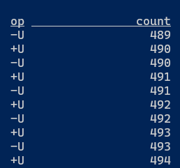
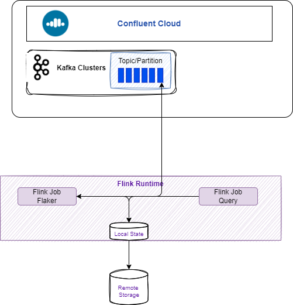

# Flink SQL 

???- Info "Updates"
    Created 10/24, Updated 12/20/24
    Revised 12/06/24


This chapter offers a compilation of best practices for implementing Flink SQL solutions, applicable to local Flink open-source, the Confluent Platform for Flink or the Confluent Cloud for Flink.

## Getting started with a SQL client

Confluent Cloud enables users to write Flink SQL statements through the web console or a CLI shell, while Flink Open Source features a `sql-client` shell that communicates with an existing job manager. Currently, the Flink Kubernetes operator does not support the SQL client for Session Clusters. When using Kubernetes deployment, any SQL script must be packaged with a Java program called SQL Runner and deployed as a Flink Application using a FlinkDeployment descriptor."

Use one of the following approaches:

* Once Flink project is downloaded locally, and the cluster started, use `sql-client.sh` to connect to the cluster.
* When using Flink with docker compose: the SQL client in the docker container runs against local Flink cluster (see [deployment/custom-flink-image](https://github.com/jbcodeforce/flink-studies/tree/master/deployment/custom-flink-image) folder to build a custom image using the dockerfile with the `sql-client` service and any specific connector jars).
* Use Confluent Cloud Flink console to write SQL Statements in a Workspace, and run them directly from there: statements may run on a compute pool and may run forever.
* Use Confluent cli connected to a compute pool defined in a **Confluent Cloud** environment. (To create a new environment using Terraform see [this note](terraform.md))

???- tip "Local SQL client"
    The SQL Client aims to provide an easy way to write, debug, and submit table programs to a Flink cluster without a single line of code in any programming language. To interact with Flink using the SQL client, open a bash in the running container, or in the flink bin folder:

    ```sh
    docker exec -ti sql-client bash
    # in the shell
    ./sql-client.sh
    ```


???- example  "SQL client with Confluent cli"
    [See quick start note](https://docs.confluent.io/cloud/current/flink/get-started/quick-start-shell.html) which is summarized as:

    * Connect to Confluent Cloud with CLI, then get environment and compute pool identifiers

    ```sh
    confluent login --save
    export ENV_ID=$(confluent environment list -o json | jq -r '.[] | select(.name == "aws-west") | .id')
    export COMPUTE_POOL_ID=$(confluent flink compute-pool list -o json | jq -r '.[0].id')
    ```

    * Start local SQL client - using the `aws-west` environment.

    ```sh
    confluent flink shell --compute-pool $COMPUTE_POOL_ID --environment $ENV_ID
    ```

    * Write SQL statements

???- info "Run SQL in Kubernetes application" 
    Write SQL statements and test them with Java SQL runner. The Class is in [https://github.com/jbcodeforce/flink-studies/tree/master/flink-java/sql-runner](https://github.com/jbcodeforce/flink-studies/tree/master/flink-java/sql-runner) folder. Then package the java app and sql script into a docker image then use a FlinkDeployment  descriptor; (see [this git doc](https://github.com/apache/flink-kubernetes-operator/tree/main/examples/flink-sql-runner-example)).

[See the Flink SQL CLI commands documentation](https://nightlies.apache.org/flink/flink-docs-release-1.20/docs/dev/table/sqlclient/).

See [the flink-sql/00-basic-sql folder](https://github.com/jbcodeforce/flink-studies/tree/master/flink-sql/00-basic-sql) to get some basic examples.

## Basic commands

* Show catalogs, tables... By default there is a default catalog and database withour any table.

    ```sql
    SHOW CATALOGS;
    USE CATALOG `examples`;
    USE `marketplace`;
    SHOW TABLES;
    SHOW TABLES LIKE '*_raw'
    SHOW JOBS;
    DESCRIBE tablename;
    DESCRIBE EXTENDED table_name;
    ```

???- info "Understand a type of attribute or get table structure with metadata"
    ```sql
    show create table 'tablename';
    -- for a specific attribute
    select typeof(column_name) from table_name limit 1;
    ```

    Flink SQL planner performs type checking. Assessing type of inferred table is helpful specially around timestamp. See [Data type mapping documentation.](https://docs.confluent.io/cloud/current/flink/reference/serialization.html)

???- info "Understand the execution plan for SQL query"
    The [explain keyword](https://nightlies.apache.org/flink/flink-docs-master/docs/dev/table/sql/explain/)

    ```sql
    explain select ...
    ```

## DDL statements

Data Definition Language (DDL) are statements to define metadata in Flink SQL by creating, updating, or deleting tables.

A table registered with the CREATE TABLE statement can be used as a table source or a table sink.

There are [three different modes](https://docs.confluent.io/cloud/current/flink/reference/statements/create-table.html#changelog-mode) to persist table rows in a log (Kafka topic in Confluent Cloud): append, retract or upsert. 

* **append** means that every insertion can be treated as an independent immutable fact. Records can be distributed using round robin to the different partitions. Do not use primary key with append, as windowing or aggregation will product undefined, may be wrong results. Regular joins between two append only streams may not make any sense at the semantic level. While [temporal join](https://developer.confluent.io/courses/flink-sql/streaming-joins/) may be possible. Some query will create append output, like window aggregation, or any operations using the watermark.
* **upsert** means that all rows with same primary key are related and must be partitioned together. Events are upsert or delete for a primary key. Upsert needs a primary key.
* **retract** means a fact can be undone, and the combination of +X and -X are related and must be partitioned together. Records are related by all the columns so the entire row is the key.

The `change.log` property is set up by using the `WITH ('changelog.mode' = 'upsert')` options when creating the table.

Changelog in Flink SQL is used to record the data changes in order to achieve incremental data processing. Some operations in Flink such as group by, aggregation and deduplication can produce update events.

Looking at the physical plan with `EXPLAIN create...` demonstrates the changelog mode and the state size used per operator.

[See the concept of changelog and dynamic tables in Confluent's documentation](https://docs.confluent.io/cloud/current/flink/concepts/dynamic-tables.html). 

### Table creation

???- tip "Primary key considerations"
    * Primary key can have one or more columns, all of them should be not null
    * In Flink the keys can only be `NOT ENFORCED`
    * The PRIMARY KEY declaration partitions the table implicitly by the key column(s)
    * The primary key is becoming the kafka key implicitly and in Confluent Cloud, it will generate a key schema, except if using the option (`'key.format' = 'raw'`)

    ```sql
    -- simplest table
    CREATE TABLE human (race STRING, origin STRING);
    -- with primary key 
    CREATE TABLE manufactures (m_id INT PRIMARY KEY NOT ENFORCED, site_name STRING);
    -- with hash distribution to 4 partitions
    CREATE TABLE humans (race INT, s STRING) DISTRIBUTED BY HASH (race) INTO 4 BUCKETS;
    ```

???- tip "Create a table with csv file as persistence - Flink OSS"
    We need to use the file system connector.

    ```sql
    create table user (
        'user_id' VARCHAR(250),
        'name' VARCHAR(50)
    ) partitioned by ('used-id')
    WITH (
        'format' = 'json', -- other format are: csv, parquet
        'connector' = 'filesystem',
        'path' = '/tmp/users'
    );
    ```


???- question "How to consume from a Kafka topic to a SQL table? -- Flink OSS"
    On Confluent Cloud for flink, there are already tables created for each topic. For local Flink we need to create table with column definitions that maps to attributes of the record. The `From` right operand proposes the list of topic/table for the catalog and database selected. For Flink OSS or Confluent Platform for Flink the `WITH` statement helps to specify the source topic.

    ```sql
    select .... from TableName 
    WITH (
        'connector' = 'kafka',
        'topic' = 'flight_schedules',
        'properties.bootstrap.servers' = 'localhost:9092',
        'properties.group.id' = 'fs_grp',
        'scan.startup.mode' = 'earliest-offset',
    )
    ```

    For Avro and schema registry with open source Flink. See the tool [extract_sql_from_avro.py](https://github.com/jbcodeforce/flink-studies/blob/master/tools/extract_sql_from_avro.py) to query Confluent Schema Registry and build the matching SQL to create a table connected to the topic using this schema.

    ```sql
    CREATE TABLE shoe_customers (
        id STRING,
        first_name STRING,
        last_name STRING,
        email STRING,
        phone STRING,
        street_address STRING,
        state STRING,
        zip_code STRING,
        country STRING,
        country_code STRING
    ) WITH (
        'connector' = 'kafka',
        'topic' = 'shoe_customers',
        'properties.bootstrap.servers' = 'broker:29092',
        'scan.startup.mode' = 'earliest-offset',
        'key.format' = 'raw',
        'key.fields' = 'id',
        'value.format' = 'avro-confluent',
        'properties.group.id' = 'flink-sql-consumer',
        'value.fields-include' = 'ALL',
        'value.avro-confluent.url' = 'http://schema-registry:8081'
    );
    ```

 

???- question "How to load data from a csv file using filesystem connector using SQL (Local execution only)"
    Enter the following statement in a SQL client session:

    ```sql
    SET execution.runtime-mode=BATCH;
    ```
    Create a table from the content of the file

    ```sql
    CREATE TABLE employee_info (
        emp_id INT,
        name VARCHAR,
        dept_id INT
    ) WITH ( 
        'connector' = 'filesystem',
        'path' = '/home/flink-sql-demos/00-basic-sql/data/employees.csv',
        'format' = 'csv'
    );
    ```

    Show tables and list some elements within the table.
    
    ```sql
    SHOW TABLES;

    SELECT * from employee_info WHERE dept_id = 101;
    ```

    Show how the table is created:

    ```sql
    show create table orders;
    ```

    [See complete example in the readme](https://github.com/jbcodeforce/flink-studies/tree/master/flink-sql-demos/00-basic-sql)


???- question "How to add a field in a table?"
    [Use ALTER TABLE](https://docs.confluent.io/cloud/current/flink/reference/statements/alter-table.html)
    
    ```sql
    alter table flight_schedules add(dt string);
    ```


???- tip "Create a table as another table by inserting all records (CTAS create table as select)"
    [CREATE TABLE AS SELECT](https://docs.confluent.io/cloud/current/flink/reference/statements/create-table.html#create-table-as-select-ctas) is used to create table and insert values in the same statement. It derives the physical column data types and names (from aliased columns), the changelog.mode (from involved tables, operations, and upsert keys), and the primary key.
    
    By using a primary key:

    ```sql
    create table shoe_customer_keyed(
        primary key(id) not enforced
    ) distributed by(id) into 1 buckets
    as select id, first_name, last_name, email from shoe_customers;
    ```

???- example "Combine deduplication with create table as select"
    Attention the '`' is important. Ordering with DESC means takes the earliest record
    
    ```sql
    CREATE TABLE tenant_dedup (
	    PRIMARY KEY (`tenantId`) NOT ENFORCED
    ) DISTRIBUTED BY HASH(`tenantId`) into 1 buckets 
        WITH (
            'changelog.mode' = 'upsert',
            'value.fields-include' = 'all'
        ) AS SELECT 
        `tenantId`,
        `hostname`,
        `ts`
        FROM (
            SELECT
            *,
            ROW_NUMBER() OVER (
                PARTITION BY `tenantId`
                ORDER
                BY $rowtime DESC
            ) AS row_num
            FROM tenants
        ) WHERE row_num = 1;
    ```

??? - question "How to generate data using Flink Faker? (Flink OSS)"
    Create at table with records generated with [Flink faker](https://github.com/knaufk/flink-faker) connector using the [DataFaker expressions.](https://github.com/datafaker-net/datafaker). Valid only on OSS Flink or Confluent platform for Flink.

    ```sql
    CREATE TABLE `bounded_pageviews` (
      `url` STRING,
      `user_id` STRING,
      `browser` STRING,
      `ts` TIMESTAMP(3)
    )
    WITH (
      'connector' = 'faker',
      'number-of-rows' = '500',
      'rows-per-second' = '100',
      'fields.url.expression' = '/#{GreekPhilosopher.name}.html',
      'fields.user_id.expression' = '#{numerify ''user_##''}',
      'fields.browser.expression' = '#{Options.option ''chrome'', ''firefox'', ''safari'')}',
      'fields.ts.expression' =  '#{date.past ''5'',''1'',''SECONDS''}'
    );
    ```
    This will only work in customized Flink client with the jar from Flink faker.

???- info "Generate data with DataGen for Flink OSS"
    [Use DataGen to do in-memory data generation](https://nightlies.apache.org/flink/flink-docs-release-1.20/docs/connectors/table/datagen/)

???- question "How to generate test data to Confluent Cloud Flink?"
    Use Kafka Connector with DataGen. Those connector exists with a lot of different pre-defined model. Also it is possible to define custom Avro schema and then use predicates to generate data. There is a [Produce sample data quick start tutorial from the Confluent Cloud home page](https://docs.confluent.io/cloud/current/connectors/cc-datagen-source.html). See also [this readme](https://github.com/jbcodeforce/flink-studies/tree/master/flink-sql/01-confluent-kafka-local-flink).

???- question "How to transfer the source timestamp to another table"
    As $rowtime is the timestamp of the record in Kafka, it may be interesting to keep the source timestamp to the downstream topic.

    ```sql
    create table `some_clicks` (
          `order_id` STRING NOT NULL,
          ...
          `event_time` TIMESTAMP_LTZ(3) METADATA FROM 'timestamp')
    distributed.... 
    ```

    Then the statement to insert record to the new table:
    
    ```sql
    insert into `some_clicks`
    select
        order_id, 
        user_id,

        $rowtime as event_time
    from  `src_table`
    ```

???- question "Dealing with late event"
    Any streams mapped to a table have records arriving more-or-less in order, according to the `$rowtime`, and the watermarks let the Flink SQL runtime know how much buffering of the incoming stream is needed to iron out any out-of-order-ness before emitting the sorted output stream.

    We need to  specify the watermark strategy: for example within 30 second of the event time:

    ```sql
    create table new_table (
        ....
        `event_time` TIMESTAMP_LTZ(3) METADATA FROM 'timestamp',
     watermark for `event_time` as `event_time` - INTERVAL '30' SECOND
    );
    ```

    On CCF the watermark is on the `$rowtime` by default.

???- question "Change system watermark"

    ```sql
    ALTER TABLE table_name MODIFY WATERMARK FOR $rowtime AS $rowtime - INTERVAL '1' SECOND;
    -- in case we need to reverse back
    ALTER TABLE table_name DROP WATERMARK;
    ```

    This can be used when doing enrichment join on reference table. We do not want to wait for watermark arriving on the reference table, so set the watermark of this reference table to the max INT using `ALTER TABLE table_name SET `$rowtime` TO_TIMESTAMP(,0)`

???- question "Create a table with topic as one day persistence"
    See the [WITH options](https://docs.confluent.io/cloud/current/flink/reference/statements/create-table.html#with-options).

    ```sql
    create table `small-orders` (
        `order_id` STRING NOT NULL,
        `customer_id` INT NOT NULL,
        `product_id` STRING NOT NULL,
        `price` DOUBLE NOT NULL
    ) distributed by hash(order_id) into 1 buckets
    with (
        'kafka.retention.time' = '1 d'
    );

    insert into `small-orders` select * from `examples`.`marketplace`.`orders` where price < 20;
    ```
    `distributed by hash(order_id)` and `into 1 buckets` specify that the table is backed by a Kafka topic with 1 partitions, and the order_id field will be used as the partition key. 

???- tip "Table with Kafka Topic metadata"
    The headers and timestamp are the only options not read-only, all are VIRTUAL. Virtual columns are by default excluded from a SELECT * similar to the system column like `$rowtime`. 

    ```sql
    ALTER TABLE <table_name> ADD (
        `headers` MAP<STRING,STRING> METADATA,
        `leader-epoch`INT METADATA VIRTUAL,
        `offset` BIGINT METADATA VIRTUAL,
        `partition` BIGINT METADATA VIRTUAL,
        `timestamp` TIMESTAMP_LTZ(3) METADATA,
        `timestamp-type` STRING METADATA VIRTUAL,
        `topic` STRING METADATA VIRTUAL
    );
    ```

    The headers can be updated within SQL statements, some values may be static or coming from the value of one of the selected field. The timestamp can also being updated and for example in most time window queries will be set to the `window_time`.

    ```sql
    CREATE TABLE clicks_per_seconds (
        events_per_second BIGINT,
        window_time TIMESTAMP_LTZ(3) METADATA FROM 'timestamp'
        )

    INSERT INTO clicks_per_seconds
    SELECT
        COUNT(*) AS events_per_second,
        window_time
    FROM TABLE(TUMBLE(TABLE clicks, DESCRIPTOR(`$rowtime`), INTERVAL '1' SECOND))
    GROUP BY window_time, window_end, window_start
    ``` 

???- question "How to support nested rows?"
    Avro, Protobuf or Json schemas are very often hierarchical per design. It is possible to use CTAS to name a column within a sub-schema:

    ```sql
    -- example of defining attribute from the n element of an array from a nested json schema:
      CAST(StatesTable.states[6] AS DECIMAL(10, 4)) AS longitude,
      CAST(StatesTable.states[7] AS DECIMAL(10, 4)) AS latitude,
    ```

    See the [CROSS JOIN UNNEST](https://nightlies.apache.org/flink/flink-docs-release-1.20/docs/dev/table/sql/queries/joins/#array-expansion) keywords.

    See also running demo in [flink-sql/03-nested-row](https://github.com/jbcodeforce/flink-studies/tree/master/flink-sql/03-nested-row)

### Confluent Cloud Flink table creation

[See the product documentation](https://docs.confluent.io/cloud/current/flink/reference/statements/create-table.html#create-table-statement-in-af-long) with some specificities, like source and sink tables are mapped to Kafka Topics. The `$rowtime` TIMESTAMP_LTZ(3) NOT NULL is provided as a system column.

* For each topic there is an inferred table created. The catalog is the Confluent environment and the Kafka cluster is the databsase. We can use the ALTER TABLE statement to evolve schemas for those inferred tables.

* A table by default is mapped to a topic with 6 partitions, and the changelog being append. Primary key leads to an implicit DISTRIBUTED BY(k), and value and key schemas are created in Schema Registry. It is possible to create table with primary key and append mode, while by default it is a upsert mode. 

    ```sql
    CREATE TABLE telemetries (
        device_id INT PRIMARY KEY NOT ENFORCED, 
        geolocation STRING, metric BIGINT,
        ts TIMESTAMP_LTZ(3) NOT NULL METADATA FROM 'timestamp')
    DISTRIBUTED INTO 4 BUCKETS
    WITH ('changelog.mode' = 'append');
    ```

The statement above also creates a metadata column for writing a Kafka message timestamp. This timestamp will not be defined in the schema registry. Compared to `$rowtime` which is declared as a `METADATA VIRTUAL` column, `ts` is selected in a `SELECT *` and is writable.

* When the primary key is specified, then it will not be part of the value schema, except if we specify (using `value.fields-include' = 'all'`) that the value contains the full table schema. The payload of k is stored twice in Kafka message:

    ```sql
    CREATE TABLE telemetries (k INT, v STRING)
    DISTRIBUTED BY (k)
    WITH ('value.fields-include' = 'all');
    ```

* If the key is a string, it may make sense to do not have a schema for the key in this case declare (the key columns are determined by the DISTRIBUTED BY clause): This does not work if the key name is not `key`.

    ```sql
    CREATE TABLE telemetries (device_id STRING, metric BIGINT)
    DISTRIBUTED BY (key)
    WITH ('key.format' = 'raw');
    ```

* To keep the record in the topic forever add this `kafka.retention.time' = '0'` as options in the WITH. The supported units are:

```sh
"d", "day", "h", "hour", "m", "min", "minute", "ms", "milli", "millisecond",
"micro", "microsecond", "ns", "nano", "nanosecond"
```


## DML statements

Data modification language, is used to define statements which modify the data and don’t change the metadata.

### Common patterns

This is important to recal that a select apply. to stream of record so the result will change at each new record. A query like below will show the last top 10 orders, and when a new record arrive this list changes. 

```sql
select * from `examples`.`marketplace`.`orders` order by $rowtime limit 10;
```

???- question "How to filter out records?"

    using the [WHERE clause](https://nightlies.apache.org/flink/flink-docs-master/docs/dev/table/sql/queries/select/)

    ```sql
    select * from flight_events where status = 'cancelled';
    ```

    Count the number of events related to a cancelled flight (need to use one of the selected field as grouping key):

    ```sql
    select fight_id, count(*) as cancelled_fl from FlightEvents where status = 'cancelled' group by flight_id;
    ```

    Recall that this results produces a dynamic table.

???- question "How to combine records from multiple tables?"
    When the two tables has the same number of columns of the same type, then we can combine them:

    ```sql
    SELECT * FROM T1
    UNION ALL
    SELECT * FROM T2;
    ```


???- info "OVER aggregations"
    [OVER aggregations](https://nightlies.apache.org/flink/flink-docs-release-1.20/docs/dev/table/sql/queries/over-agg/) compute an aggregated value for every input row over a range of ordered rows. It does not reduce the number of resulting rows, as GROUP BY, but produce one result for every input row. This is helpful when we need to act on each input row, but consider some time interval. To get the number of order in the last 10 seconds.

    ```sql
    SELECT 
        order_id,
        customer_id,
        `$rowtime`,
        SUM(price) OVER w AS total_price_ten_secs, 
        COUNT(*) OVER w AS total_orders_ten_secs
    FROM `examples`.`marketplace`.`orders`
    WINDOW w AS (
        PARTITION BY customer_id
        ORDER BY `$rowtime`
        RANGE BETWEEN INTERVAL '10' SECONDS PRECEDING AND CURRENT ROW
    )
    ```

    To get the order exceeding some limits for the first time and then when the computed aggregates go below other limits. [LAG]()

    ```sql
    -- compute the total price and # of orders for a period of 10s for each customer
    WITH orders_ten_secs AS ( 
    SELECT 
        order_id,
        customer_id,
        `$rowtime`,
        SUM(price) OVER w AS total_price_ten_secs, 
        COUNT(*) OVER w AS total_orders_ten_secs
    FROM `examples`.`marketplace`.`orders`
    WINDOW w AS (
        PARTITION BY customer_id
        ORDER BY `$rowtime`
        RANGE BETWEEN INTERVAL '10' SECONDS PRECEDING AND CURRENT ROW
        )
    ),
    -- get previous orders and current order per customer
    orders_ten_secs_with_lag AS (
    SELECT 
        *,
        LAG(total_price_ten_secs, 1) OVER w AS total_price_ten_secs_lag, 
        LAG(total_orders_ten_secs, 1) OVER w AS total_orders_ten_secs_lag
    FROM orders_ten_secs
    WINDOW w AS (
        PARTITION BY customer_id
        ORDER BY `$rowtime`
        )
    -- Filter orders when the order price and number of orders were above some limits for previous or current order aggregates
    )
    SELECT customer_id, 'BLOCK' AS action, `$rowtime` AS updated_at 
    FROM orders_ten_secs_with_lag 
    WHERE 
        (total_price_ten_secs > 300 AND total_price_ten_secs_lag <= 300) OR
        (total_orders_ten_secs > 5 AND total_orders_ten_secs_lag <= 5)
    UNION ALL 
    SELECT customer_id, 'UNBLOCK' AS action, `$rowtime` AS updated_at 
    FROM orders_ten_secs_with_lag 
    WHERE 
        (total_price_ten_secs <= 300 AND total_price_ten_secs_lag > 300) OR
        (total_orders_ten_secs <= 5 AND total_orders_ten_secs_lag > 5);
    ```

???- question "How to Aggregating a field into an ARRAY?"
    Let start by simple array indexing (the index is between 1 to nn_element). Below the values array create test data into a n memory table aliased a T:

    ```sql
    SELECT array_field[4] FROM ((VALUES ARRAY[5,4,3,2,1])) AS T(array_field)
    ```

    The following is creating a view with an [array of aggregates](https://nightlies.apache.org/flink/flink-docs-master/docs/dev/table/functions/systemfunctions/#aggregate-functions), which in this case concatenating the urls over a 1 minute tumble window.

    ```sql
    CREATE VIEW visited_pages_per_minute AS 
    SELECT 
    window_time,
    user_id, 
    ARRAY_AGG(url) AS urls
    FROM TABLE(TUMBLE(TABLE examples.marketplace.clicks, DESCRIPTOR(`$rowtime`), INTERVAL '1' MINUTE))
    GROUP BY window_start, window_end, window_time, user_id;
    -- once the view is created
    SELECT * from visited_pages_per_minute;
    -- it is possible to expand an array into multiple rows
    SELECT v.window_time, v.user_id, u.url FROM visited_pages_per_minute AS v
    CROSS JOIN UNNEST(v.urls) AS u(url)
    ```

???- question "How to transform a field representing epoch to a timestamp?"
    
    epoch is a BIGINT.
    
    ```sql
     TO_TIMESTAMP(FROM_UNIXTIME(click_ts_epoch)) as click_ts
    ```

???- question "How to change a date string to a timestamp?"

    ```sql
    TO_TIMESTAMP('2024-11-20 12:34:568Z'),
    ```

    See all the [date and time functions](https://docs.confluent.io/cloud/current/flink/reference/functions/datetime-functions.html).

???- question "How to compare a date field with current system time?"

    ```sql
    WHEN TIMESTAMPDIFF(day, event.event_launch_date, now()) > 120 THEN ...
    ```

    The table used as target to this processing, if new records are added to it, then needs to be append log, as if it is upsert then the now() time is not determenistic for each row to process.

???- question "How to mask a field?"
    Create a new table from the existing one, and then use REGEXP_REPLACE to mask an existing attribute

    ```sql
    create table users_msk like users;
    INSERT INTO users_msk SELECT ..., REGEXP_REPLACE(credit_card,'(\w)','*') as credit_card FROM users;
    ```

???- question "What are the different SQL execution modes?"

    Using previous table it is possible to count the elements in the table using:

    ```sql
    select count(*) AS `count` from pageviews;
    ```

    and we get different behaviors depending of the execution mode:

    ```sql
    set 'execution.runtime-mode' = 'batch';
    # default one
    set 'execution.runtime-mode' = 'streaming';

    set 'sql-client.execution.result-mode' = 'table';
    ```

    In changelog mode, the SQL Client doesn't just update the count in place, but instead displays each message in the stream of updates it's receiving from the Flink SQL runtime.
    
    ```sql
    set 'sql-client.execution.result-mode' = 'changelog';
    ```

    

???- question "How to expand a column being an array into new rows?"

    The table order has n product ids in the product_ids column.

    ```sql
    
    ```

???- question "How to use conditional functions?"
    [Flink has built-in conditional functions](https://nightlies.apache.org/flink/flink-docs-master/docs/dev/table/functions/systemfunctions/#conditional-functions) (See also [Confluent support](https://docs.confluent.io/cloud/current/flink/reference/functions/conditional-functions.html)) and specially the CASE WHEN:

    ```sql
    SELECT 
        *
        FROM `stocks`
        WHERE  
        CASE 
            WHEN price > 200 THEN 'high'
            WHEN price <=200 AND price > 150 THEN 'medium'
            ELSE 'low'
        END;
    ```

???- question "When and how to use custom watermark?"
    Developer should use their own [watermark strategy](https://docs.confluent.io/cloud/current/flink/reference/statements/create-table.html#watermark-clause) when there are not a lot of records per topic/partition, there is a need for a large watermark delay, and need to use another timestamp. 
    The default watermark strategy in SOUCE_WATERMARK(), a watermark defined by the source. The common strategy used is the `maximim-out-of-orderness` to allow messages arriving later to be part of the window, to ensure more accurate results, as a tradeoff of latency. It can be defined using:

    ```sql
    ALTER TABLE <table_name> MODIFY WATERMARK for `$rowtime` as `$rowtime` - INTERVAL '20' SECONDS
    ```

    The minimum out-of-orderness is 50ms and can be set up to 7 days. See [Confluent documentation.](https://docs.confluent.io/cloud/current/flink/reference/functions/datetime-functions.html#flink-sql-source-watermark-function) 
    
???- question "Deduplication example"

    ```sql
    SELECT ip_address, url, TO_TIMESTAMP(FROM_UNIXTIME(click_ts_raw)) as click_timestamp
    FROM (
        SELECT *,
        ROW_NUMBER() OVER ( PARTITION BY ip_address ORDER BY TO_TIMESTAMP(FROM_UNIXTIME(click_ts_raw)) ) as rownum FROM clicks
        )
    WHERE rownum = 1;
    ```

  

    [See this example](https://docs.confluent.io/cloud/current/flink/how-to-guides/deduplicate-rows.html#flink-sql-deduplicate-topic-action).

???- question "How to manage late message to be sent to a DLQ?"
    First create a DLQ table like late_orders based on the order table:
    
    ```sql
        create table late_orders
        with (
            'connector'= ''
        ) 
        LIKE orders (EXCLUDING OPTIONS)
    ```

    Groups the main stream processing and late arrival in a statement set:

    ```sql
    EXECUTE STATEMENT SET
    BEGIN
        INSERT INTO late_orders SELECT from orders WHERE `$rowtime` < CURRENT_WATERMARK(`$rowtime`);
        INSERT INTO order_counts -- the sink table
        SELECT window_time, COUNT(*) as cnt
        FROM TABLE(TUMBLE(TABLE orders DESCRIPTOR(`$rowtime`), INTERVAL '1' MINUTE))
        GROUP BY window_start, window_end, window_time
    END
    ```

### Joins

When doing a join, Flink needs to materialize both the right and left of the join tables fully in state, which can cost a lot of memory, because if a row in the left-hand table (LHT), also named the **probe side**, is updated, the operator needs to emit an updated match for all matching rows in the right-hand table (RHT) or **build side**. The cardinality of right side will be mostly bounded at a given point of time, but the left side may vary a lot. A join emit matching row to downstream processing.

Here are important tutorials:

* [Confluent Cloud: video on joins.](https://docs.confluent.io/cloud/current/flink/reference/queries/joins.html)
* [Confluent -developer: How to join a stream and a stream](https://developer.confluent.io/tutorials/join-a-stream-to-a-stream/flinksql.html): use local Flink and one Kafka Kraft broker. The matching content is in [flink-sql/04-joins folder](), with a docker for CP 7.8.0.
* [Confluent temporal join](https://docs.confluent.io/cloud/current/flink/reference/queries/joins.html#temporal-joins)
* [Window Join Queries in Confluent Cloud for Apache Flink](https://docs.confluent.io/cloud/current/flink/reference/queries/window-join.html)

???- info "Inner knowledge on temporal join"
    Event-time temporal joins are used to join two or more tables based on a **common** event time (in one of the record table or the kafka record: `$rowtime` system column). With an event-time attribute, the operator can retrieve the value of a key as it was at some point in the past. The right-side, versioned table, stores all versions, identified by time, since the last watermark.

    The temporal Flink sql looks like:
    
    ```sql
    SELECT [column_list]
    FROM table1 [AS <alias1>]
    [LEFT] JOIN table2 FOR SYSTEM_TIME AS OF table1.{ rowtime } [AS <alias2>]
    ON table1.column-name1 = table2.column-name1
    ```

    When enriching a particular `table1`, an event-time temporal join waits until the watermark on the table2 stream reaches the timestamp of that `table1` row, because only then is it reasonable to be confident that the result of the join is being produced with complete knowledge of the relevant `table2` data. This table2 record can be old as the watermark on that table being late.

???- info "How to join two tables on a key within a time window using event column as timestamp and store results in a target table?"
    Full example:

    ```sql
    -- use separate statements to create the tables
    create table Transactions (ts TIMESTAMP(3), tid BIGINT, amount INT);
    create table Payments (ts TIMESTAMP(3), tid BIGINT, type STRING);
    create table Matched (tid BIGINT, amount INT, type STRING);

    execute statement set
    begin
    insert into Transactions values(now(), 10,20),(now(),11,25),(now(),12,34);
    insert into Payments values(now(), 10, 'debit'),(now(),11,'debit'),(now(),12,'credit');
    insert into Matched 
        select T.tid, T.amount, P.type
        from Transactions T join Payments P ON T.tid = P.tid 
        where P.ts between T.ts and T.ts + interval '1' minutes;
    end
    ```

### Windowing / Table Value Functions

[Windowing Table-Valued Functions](https://docs.confluent.io/cloud/current/flink/reference/queries/window-tvf.html) groups the Tumble, Hop, Cumulate, and Session Windows. Windows split the stream into “buckets” of finite size, over which we can implement logic. The return value adds three additional columns named “window_start”, “window_end”, “window_time” to indicate the assigned window.

* The TUMBLE function assigns each element to a window of specified window size. Tumbling windows have a fixed size and do not overlap.

???- question "Count the number of different product type per 10 minutes (TUMBLE window)"
    [Aggregate a Stream in a Tumbling Window documentation.](https://docs.confluent.io/cloud/current/flink/how-to-guides/aggregate-tumbling-window.html). 
    The following query counts the number of different product types arriving from the event stream by interval of 10 minutes.

    ```sql
    SELECT window_start, product_type, count(product_type) as num_ptype
        FROM TABLE(
            TUMBLE(
                TABLE events,
                DESCRIPTOR(`$rowtime`),
                INTERVAL '10' MINUTES
            )
        )
        GROUP BY window_start, window_end, ;
    ```
    *DESCRIPTOR* indicates which time attributes column should be mapped to tumbling windows (here the kafka record ingestion timestamp). 
    
    When the internal time has expired the results will be published. This puts an upper bound on how much state Flink needs to keep to handle a query, which in this case is related to the number of different product type. 


???- question "Aggregation over a window"
    Windows over approach is to end with the current row, and stretches backwards through the history of the stream for a specific interval, either measured in time, or by some number of rows.
    For example counting the umber of flight_schedule events of the same key over the last 100 events:

    ```sql
    select
        flight_id,
        evt_type,
        count(evt_type) OVER w as number_evt,
    from flight_events
    window w as( partition by flight_id order by $rowtime rows between 100 preceding and current row);
    ```

    The results are updated for every input row. The partition is by flight_id. Order by $rowtime is necessary.

???- question "Find the number of elements in x minutes intervals advanced by 5 minutes? (HOP)"
    [Confluent documentation on window integration.](https://docs.confluent.io/cloud/current/flink/reference/queries/window-tvf.html). For **HOP** wuindow, there is the slide parameter to control how frequently a hopping window is started:

    ```sql
        SELECT
            window_start, window_end,
            COUNT(DISTINCT order_id) AS num_orders
        FROM TABLE(
            HOP(TABLE shoe_orders, DESCRIPTOR(`$rowtime`), INTERVAL '5' MINUTES, INTERVAL '10' MINUTES))
        GROUP BY window_start, window_end;
    ```

???- question "How to compute the accumulate price over time in a day (CUMULATE)"
    Needs to use the cumulate window, which adds up records to the window until max size, but emits results at each window steps. 
    The is image summarizes well the behavior:
    

    ```sql
    SELECT window_start, window_end, SUM(price) as `sum`
        FROM TABLE(
            CUMULATE(TABLE `examples`.`marketplace`.`orders`, DESCRIPTOR($rowtime), INTERVAL '30' SECONDES, INTERVAL '3' MINUTES))
        GROUP BY window_start, window_end;
    ```

### Row pattern recognition

???- question "Find the longest period of time for which the average price of a stock did not go below a value"
    Create a Datagen to publish StockTicker to a Kafka topic.
    [See product documentation on CEP pattern with SQL](https://nightlies.apache.org/flink/flink-docs-release-1.15/docs/dev/table/sql/queries/match_recognize/)
    
    ```sql
    create table StockTicker(symbol string, price int tax int) with ('connector' = 'kafka',...)
    SELECT * From StockTicker 
    MATCH_RECOGNIZE ( 
        partition by symbol 
        order by rowtime
        measures
            FIRST(A.rowtime) as start_tstamp,
            LAST(A.rowtime) as last_tstamp,
            AVG(A.price) as avgPrice
        ONE ROW PER MATCH
        AFTER MATCH SKIP PAST LAST ROW
        PATTERN (A+ B)
        DEFINE
            A as AVG(A.price) < 15
    );
    ```

    MATCH_RECOGNIZE helps to logically partition and order the data that is used with the PARTITION BY and ORDER BY clauses, then defines patterns of rows to seek using the PATTERN clause.
    The logical components of the row pattern variables are specified in the DEFINE clause.
    B is defined implicitly as not being A.

### Confluent Cloud Specific

[See Flink Confluent Cloud queries documentation.](https://docs.confluent.io/cloud/current/flink/reference/queries/overview.html)

Each topic is automatically mapped to a table with some metadata fields added, like the watermark in the form of `$rowtime` field, which is mapped to the Kafka record timestamp. To see it, run `describe extended table_name;` With watermarking. arriving event records will be ingested roughly in order with  respect to the `$rowtime` time attribute field.

???- question "Mapping from Kafka record timestamp and table $rowtime"
    The Kafka record timestamp is automatically mapped to the `$rowtime` attribute, which is a read only field. Using this field we can order the record by arrival time:

    ```sql
    select 'flight_id', 'aircraft_id', 'status', $rowtime
    from Aircrafts
    order by $rowtime;
    ```


???- question "How to run Confluent Cloud for Flink?"
    See [the note](../techno/ccloud-flink.md), but can be summarized as: 1/ create a stream processing compute pool in the same environment and region as the Kafka cluster, 2/ use Console or CLI (flink shell) to interact with topics.

    

    ```sh
    confluent flink quickstart --name my-flink-sql --max-cfu 10 --region us-west-2 --cloud aws
    ```

???- question "Running Confluent Cloud Kafka with local Flink"
    The goal is to demonstrate how to get a cluster created in an existing Confluent Cloud environment and then send message via FlinkFaker using local table to Kafka topic:
    
    

    The [scripts and readme](https://github.com/jbcodeforce/flink-studies/tree/master/flink-sql/01-confluent-kafka-local-flink) .

???- question "Reading from a topic specific offsets"
    ```sql
    ALTER TABLE table_name SET (
        'scan.startup.mode' = 'specific-offsets',
        'scan.startup.specific-offsets' = 'partition:0,offset:25; partition:1,offset:10'
    );
    -- Returns from offsets 26 and 11
    SELECT * FROM table_name;
    ```

???- question "create a long running SQL with cli"
    Get or create a service account.
    
    ```sh
    confluent iam service-account create my-service-account --description "new description"
    confluent iam service-account list
    confluent iam service-account describe <id_of_the_sa>
    ```

    ```sh
    confluent flink statement create my-statement --sql "SELECT * FROM my-topic;" --compute-pool <compute_pool_id> --service-account sa-123456 --database my-cluster
    ```

???- question "Assess the current flink statement running in Confluent Cloud"
    To assess which jobs are still running, which jobs failed, and which stopped, we can use the user interface, go to the Flink console > . Or the `confluent` CLI:

    ```sh
    confluent environment list
    confluent flink compute-pool list
    confluent flink statement list --cloud aws --region us-west-2 --environment <your env-id> --compute-pool <your pool id>
    ```

## Recommended Labs and demos

* [Shoe Store lab](https://github.com/griga23/shoe-store) to run demonstrations on Confluent Cloud. 
* [Confluent Flink how to](https://docs.confluent.io/cloud/current/flink/reference/sql-examples.html#)
* [Confluent scene](https://github.com/confluentinc/demo-scene)
* [Confluent developer SQL training]()

### Quick personal demo on Confluent Cloud

Using the data generator and the `confluent flink shell`

* Login to Confluent using cli
* Be sure to use the environment with the compute pool: 

```sh
confluent environment list
confluent environment use <env_id>
confluent flink compute-pool list
# get the region and cloud and the current max CFU
confluent flink compute-pool use <pool_id>
```

* Start one of the Datagen in the Confluent Console. 

