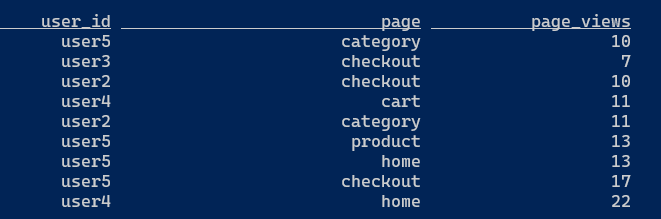

# Getting started

???- info "Update"
    Created 2018 Updated 09/2024
    Flink supports Java 11 so Quarkus code needs to be limited to quarkus 3.2.12_Final and maven should compile in JDK 11.
    Use jbang to install jdk 11. WSL ubuntu has OpenJDK 11 and 17.

## Pre-requisites

* Need a docker engine, with docker and docker compose CLIs
* Clone this repository.

## Docker compose for dev environment

During development, we can use docker-compose to start a simple `Flink session` cluster or a standalone job manager to execute one unique job, which has the application jar mounted inside the docker image. We can use this same environment to do SQL based Flink apps. 

As Task manager will execute the job, it is important that the container running the flink has access to jars needed to connect to external sources like Kafka or other tools like FlinkFaker. Therefore there is a Dockerfile to get some important jars to build a custom Flink image that we will use for Taskmanager and SQL client.

* Build Custom Flink image, go under `custom-flink-image` folder

```sh
docker build -t jbcodeforce/myflink .
```

* Start Flink session cluster using the following command: 

  ```shell
  # under this repository and deployment/local folder
  docker compose up -d
  ```

The docker compose starts one job manager and one task manager server:

```yaml
services:
  jobmanager:
    image: flink:latest
    hostname: jobmanager
    ports:
      - "8081:8081"
    command: jobmanager
    user: "flink:flink"
    environment:
      FLINK_PROPERTIES: "jobmanager.rpc.address: jobmanager"
    volumes:  
        - .:/home
  taskmanager:
    image: flink:latest 
    hostname: taskmanager
    depends_on:
      - jobmanager
    command: taskmanager
    user: "flink:flink"
    scale: 1
    volumes:
        - .:/home
    environment:
      - |
        FLINK_PROPERTIES=
        jobmanager.rpc.address: jobmanager
        taskmanager.numberOfTaskSlots: 4
```

The docker compose mounts the local folder to `/home` in both the job manager and task manager containers so that, we can submit the job from the job manager (accessing the compiled jar) and also access the input data files in the task manager container.

## SQL Client

The SQL Client aims to provide an easy way of writing, debugging, and submitting table programs to a Flink cluster without a single line of code in any programming language.

Build the image within the sql-client folder using the dockerfile. Modify the flink version as needed.

```shell
#under sql-client folder
docker build -t jbcodeforce/flink-sql-client .
```

Then to interact with Flink using the SQL client open a bash in the running container

```sh
docker exec -ti sql-client bash
# in the shell
./sql-client.sh
```

Then use Flink SQL CLI commands. ([See documentation for sqlclient](https://nightlies.apache.org/flink/flink-docs-release-1.20/docs/dev/table/sqlclient/)).

See [this folder](https://github.com/jbcodeforce/flink-studies/tree/master/flink-sql-demos/00-basic-sql) to get some examples.


## Docker compose with Kafka and Flink

In the `deployment/local` folder the docker compose start a one node kafka broker, one zookeeper, one job manager and one task manager.

```sh
docker compose -f kafka-docker-compose.yaml up -d
```

The SQL client can be used to compute some aggregation on the sale events created by the `E-commerce simulator`. To start the simluator using a Python virtual environment do:

```sh 
pip install -r requirements.txt
python simulator.py
```
The application sends events like the following:

```json
{'event_type': 'user_action', 
 'timestamp': '2024-09-04T15:24:59.450582', 
 'user_id': 'user5', 
 'action': 'add_to_cart', 
 'page': 'category', 
 'product': 'headphones'
}
```

* Use the [Kafdrop interface to verify the messages in the topic](http://localhost:9000/topic/ecommerce_events)
* Connect to SQL client container

```sh
docker exec -ti sql-client bash
# in the shell
./sql-client.sh
```

```sql title="User page view on kafka stream"
CREATE TABLE user_page_views (
    event_type STRING,
    user_id STRING,
    action STRING,
    page STRING,
    product STRING,
    timestamp_str STRING,        # (1)
    timestamp_sec TIMESTAMP(3),  # derived field
    WATERMARK FOR timestamp_sec AS TO_TIMESTAMP(timestamp_str, 'yyyy-MM-dd HH:mm:ss') - INTERVAL '5' SECOND
) WITH (
    'connector' = 'kafka',
    'topic' = 'ecommerce_events',
    'properties.bootstrap.servers' = 'kafka:29092',
    'properties.group.id' = 'sql-flink-grp-1',
    'properties.auto.offset.reset' = 'earliest',
    'format' = 'json'  
);
```

1. The event timestamp as string created by the Kafka producer

**WATERMARK** statement is used to define a watermark strategy for handling event time in streaming applications. Watermarks are crucial for dealing with out-of-order events, allowing Flink to manage late arrivals and trigger processing based on event time rather than processing time. A watermark is a timestamp that indicates that no events with a timestamp earlier than the watermark will arrive. 

It is important to set the consumer properties like consumer group id, the offset reset strategy...

The next SQL statement is to count the number of page per user

```sql
SELECT 
    user_id, 
    page,
    COUNT(page) AS page_views 
FROM 
    user_page_views 
GROUP BY 
    user_id,
    page;
```

The results



## Kubernetes deployment

[See dedicated chapter](./k8s-deploy.md)