# Flink Kubernetes Deployment

???- info "This chapter updates"
    * Created 10/2024
    * 12/24: move some content to hands-on readme, clean content
    * 01/25: sql processing section
    * 05/25: merge content, simplify, add some details on deployment - fully test k8s deployment on Colima
    * 07/25: Update for Confluent Platform v8
    * 09/29: Update to diagrams and doc structure.
    * 10/12: update to Minio and snapshot / checkpoint configuration
    * 11/16: Reorganize content - integrate new CMF 2.1.0, CP3.1, cmf 2.1.0


Apache Flink has defined a Kubernetes Operator (FKO) to deploy and manage custom resources for Flink deployments. Confluent Platform Manager for Flink (CMF) is also deployed on Kubernetes with its own operator, leveraging the FKO. Also as part of the Confluent Platform it is integrated with Confluent Kubernetes Operator (CKO).

We assume reader has good [understanding and knowledge of Kubernetes](https://kubernetes.io/docs/tutorials/), and kubectl.

Let start to review the Apache Flink Kubernetes Operator concepts.

## Apache Flink Kubernetes Operator Concepts

[Apache Flink Kubernetes Operator](https://nightlies.apache.org/flink/flink-kubernetes-operator-docs-main/)(FKO) acts as a control plane to manage the complete deployment lifecycle of Apache Flink applications. This note summarizes how to use this operator. 

The [operator](https://nightlies.apache.org/flink/flink-kubernetes-operator-docs-main/) takes care of submitting, savepointing, upgrading and generally managing Flink jobs using the built-in Flink Kubernetes integration. The operator fully automates the entire lifecycle of the job manager, the task managers, and the applications. A FlinkDeployment is a manifest to define what needs to be deployed, and then the FKO manages the deployment by using Kubernetes deployments, pods... It supports query on the custom resources it manages. 

<figure markdown="span">
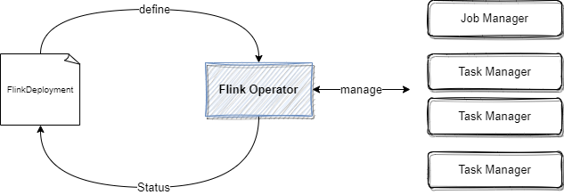
<figcaption>Figure 1: Apache Flink Kubernetes Operator to manage Flink Job and Task managers</figcaption>
</figure>

Failures of Job Manager pod are handled by the Deployment Controller which takes care of spawning a new Job Manager.

As any Kubernetes operators, FKO can run **namespace-scoped**, to get multiple versions of the operator in the same Kubernetes cluster, or **cluster-scoped** for highly distributed  deployment. The operator maps its custom resources to existing Kubernetes resources of deployments, replica sets, config maps, secrets, service accounts...

The following figure represents a simple deployment view of a Flink Cluster, in parallel of a Kafka cluster running on a Kubernetes platform:

<figure markdown="span">
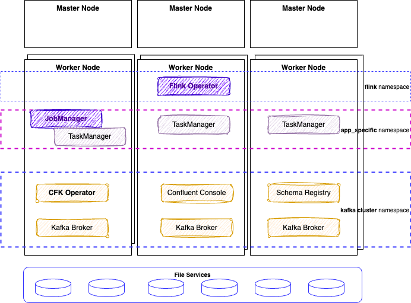
<figcaption>Figure 2: Flink and Kafka OSS - K8S deployment</figcaption>
</figure>

The FKO may have two instances running in parallel. A Flink application may run on its own namespace and will be one job manager and n task managers pods. 
The Kafka cluster runs in its own namespace. PVC or File services are needed for Flink to persist checkpoints and savepoints. 

### [Confluent for Kubernetes Operator (CFK)](https://docs.confluent.io/operator/current/overview.html)

The deployments for [Confluent Platform](https://docs.confluent.io/operator/current/overview.html) and Confluent Manager for Flink, may look like in the following figure:

<figure markdown="span">
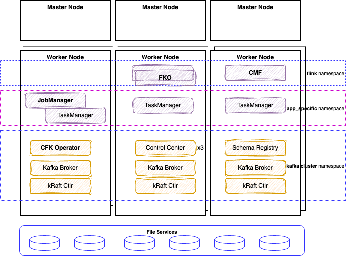
<figcaption>Figure 3: K8S deployment</figcaption>
</figure>

[**CFK Operator**](https://docs.confluent.io/operator/current/co-deploy-cfk.html) is the control plane for deploying and managing Confluent in your Kubernetes private cloud environment. It defines custom resource definitions to support Kafka based resources like brokers, kraft controllers, topics, schema registry, connectors, cmfrestclass, OSS flink application, OSS flink environment...

* Helpful commands to work on CRDs:

```sh
kubectl get crds | grep confluent
kubectl describe crd kafkatopics.platform.confluent.io  
kubectl describe crd cmfrestclasses.platform.confluent.io      
```

* See [This makefile](https://github.com/jbcodeforce/flink-studies/blob/master/deployment/k8s/cfk/Makefile) and [documentation](https://github.com/jbcodeforce/flink-studies/tree/master/deployment/k8s/cfk/README.md).
* See the [KraftCluster manifest](https://github.com/jbcodeforce/flink-studies/blob/master/deployment/k8s/cfk/basic-kraft-cluster.yaml) used for all demonstrations in this repository.

### Confluent Manager for Flink (CMF)

**Confluent Manager for Flink (CMF)** is a Kubernetes operator, to manage Confluent Flink Applications, Environments, Compute pools, SQL Catalogs, we will detail those in a later section.

The following figure illustrates the relationships between those kubernetes operators:

<figure markdown="span">
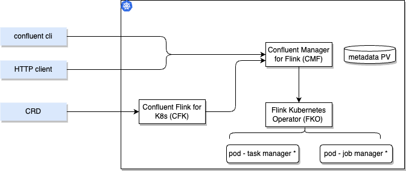
<figcaption>Figure 4: The operators playing together</figcaption>
</figure>

It is important to note that all CR deployments via `kubectl` go to the CFK with the `apiVersion: platform.confluent.io/v1beta1`. CRs touching Flink resources are delegated to the CMF operator. While deploying Flink components via the Confluent CLI or via REST API, the CMF CRDs use different apiVersion. Therefore it is possible to run CMF without CFK. Any CR with `cmf.confluent.io/v1` as apiVersion needs to be created with confluent CLI, as using `kubectl` will not work because the CRDs are not known by Kubernetes.

The [examples in Confluent github](https://github.com/confluentinc/confluent-Kubernetes-examples) provides scenario workflows to deploy and manage Confluent on Kubernetes including Flink and [this article: How to Use Confluent for Kubernetes to Manage Resources Outside of Kubernetes](https://www.confluent.io/blog/resource-management-with-confluent-for-Kubernetes/) covers part of the deployment. 

## Custom Resources
### Apache Flink specific custom resources

A **Flink Application** is any user's program that spawns one or multiple Flink jobs from its `main()` method and is deploying a JobManager and n Task managers. They may run in their own namespace. 

The **Flink Kubernetes Operator** is looking at different `Flink Deployment`, so it can be isolated within its own namespace. When deploying the FKO it is important to **specify the namespaces to watch** for future deployments. The following command modify this list:
```sh
helm upgrade --install cp-flink-Kubernetes-operator --version "~1.130.0"  confluentinc/flink-Kubernetes-operator --set watchNamespace="{flink, confluent, el-demo, rental}" -n flink
```

It is important to delete the operator pod and let Kubernetes restarts the FKO pod with the new config.

The custom resource definition that describes the schema of a FlinkDeployment is a cluster wide resource. The Operator continuously tracks cluster events relating to the `FlinkDeployment` and `FlinkSessionJob` custom resources. [The operator control flow is described in this note.](https://nightlies.apache.org/flink/flink-Kubernetes-operator-docs-main/docs/concepts/controller-flow/). The important points to remember are:

* The operator control flow is: 1/ Observes the status of the currently deployed resource. 2/ Validates the new resource spec, 3/ Reconciles any required changes based on the new spec and the observed status.
* The **Observer** module assesses the current stateus of any deployed Flink resources. 
* Observer is responsible for application upgrade.
* The job manager is validated via a call to its REST api and the status is recorded in the `jobManagerDeploymentStatus`
* A Job cannot be in running state without a healthy jobmanager.

### Confluent Manager for Flink and FKO

[Confluent Manager for Apache Flink®](https://docs.confluent.io/platform/current/flink/installation/overview.html#install-and-upgrade-cmf-long) (CMF) manages a fleet of Flink Applications (cluster) across multiple `Environments`. CP Console is integrated with CMF. CMF exposes a REST API and cli integration for managing Flink statements.

CMF integrates with FKO to support Flink native custom resources. The following figure illustrates the current (Oct 2025) configuration of Flink solution deployment using the different CRs apiVersion.

<figure markdown="span">
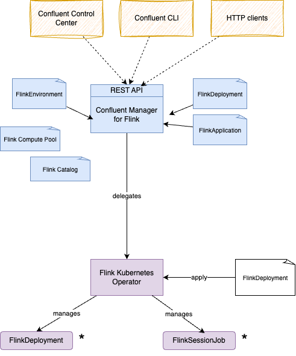
<figcaption>Figure 5: CFK, CMF and CKO</figcaption>
</figure>

* Confluent Flink Environments may be created with Manifests or using the Confluent CLI. Confluent Flink Environment differs from the Apache Flink Environment: it specifies which kubernetes namespace to use, which cmf REST class to connect to.

* The metadata is persisted in an embedded database. 
* The 'Environment' concept is to group multiple Flink applications together. This is an isolation layer for RBAC, and to define Flink Configuration cross compute pools and applications deployed within an environment. Flink Configuration may include common observability and checkpointing storage (HDFS or S3) definitions. [See one definition of FlinkEnvironment](https://github.com/jbcodeforce/flink-studies/blob/master/deployment/k8s/cmf/flink-dev-env.yaml).
* a REST API supports all the external integration to the operator. **Confluent Control Center** and  the `confluent` cli are using this REST end point.
* CMF manages FlinkDeployment resources internally


It is still possible to do pure OSS FlinkDeployment CRs but this strongly not recommended to leverage the full power of Confluent Platform and get Confluent Support.

???+ info "Versioning"
    There is a Confluent [version and interoperability document](https://docs.confluent.io/platform/current/flink/installation/versions-interoperability.html) that should be updated at each release. But each time there is a new release you need to be sure to modify the references for:

    * Confluent Platform (e.g. 8.1)
    * Confluent Flink image (e.g. confluentinc/cp-flink-sql:1.19-cp2) in compute pool manifests

Let review the Kubernetes custom resources for Flink.

### Apache Flink Custom Resources

Once the Flink for Kubernetes Operator is running, we can submit jobs using  `FlinkDeployment` (for Flink Application or for Job manager and task manager for session cluster) and `FlinkSessionJob` for Flink Session. The following figure represents those concepts: 

<figure markdown=span>
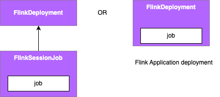
<caption>FKO main Custom Resources Definitions</capture>
</figure>

On the left, a `FlinkSessionJob` references an existing FlinkDeployment as multiple session jobs can run into the same Flink cluster. The `job` declaration specifies the code to run with its specific configuration. While on the right, the application mode, has the job definition as part of the FlinkDeployment, as the JobManager and TaskManager mininum resource requirements.

The [Apache Flink FlinkDeployment spec is here](https://nightlies.apache.org/flink/flink-Kubernetes-operator-docs-main/docs/custom-resource/reference/) and is used to define Flink application (will have a job section) or session cluster (only job and task managers configuration).

It is important to note that `FlinkDeployment` and `FlinkApplication` CRDs have a podTemplate, so ConfigMap(s) and Secret(s) can be used to configure environment variables for the Flink app. (Be sure to keep the container name as `flink-main-container`)

```yaml
spec:
  podTemplate:
    spec:
      containers:
        - name: flink-main-container
          envFrom:
            - configMapRef:
                name: flink-app-cm
```


### Confluent Flink Specific CRs

[First an important document to read: The Confluent Operator API references.](https://docs.confluent.io/operator/current/co-api.html)

Confluent Managed for Flink only manages Flink application mode and is using its own CRDs to define `FlinkEnvironment` and `FlinkApplication`. [The CRDs are defined here](https://docs.confluent.io/operator/current/co-manage-flink.html#create-a-af-application). To be complete, it also define KafkaCatalog and ComputePool CRDs to defne SQL catalog, and other components introduced by Confluent Cloud.

* The new CRs for Environment, Application,  Compute pool, and Flink Catalog:

<figure markdown=span>
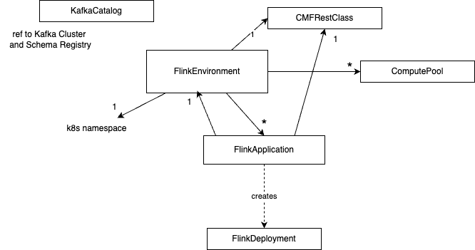
<caption>Confluent Manager for Flink - Custom Resources Definitions</capture>
</figure>

* An [FlinkEnvironment](https://docs.confluent.io/operator/current/co-manage-flink.html#create-a-af-environment) define access control to flink resources and may define FlinkConfigurations cross applications. Environment level has precedence over Flink configuration for individual Flink applications. See [one example in deployment/k8s/cmf](https://github.com/jbcodeforce/flink-studies/blob/master/deployment/k8s/cmf/flink-dev-env.yaml). 
  ```yaml
  apiVersion: platform.confluent.io/v1beta1
  kind: FlinkEnvironment
  metadata:
    name: dev-env
    namespace: confluent
  spec:
    kubernetesNamespace: el-demo
    flinkApplicationDefaults: 
      metadata:
        labels:
          env: dev-env
      spec:
        flinkConfiguration:
          taskmanager.numberOfTaskSlots: '1'
          state.backend.type: rocksdb
          state.checkpoints.dir: 's3a://flink/checkpoints'
          state.savepoints.dir: 's3a://flink/savepoints'
          state.backend.incremental: 'true'
          state.backend.rocksdb.use-bloom-filter: 'true'
          state.checkpoints.num-retained: '3'
          ...
        podTemplate:
          metadata:
            name: flink-pod-template
          spec:
            containers:
            - name: flink-main-container
              env:
              - name: S3_ENDPOINT
                valueFrom:
                  secretKeyRef:
                    name: minio-s3-credentials
                    key: s3.endpoint
            ...
    cmfRestClassRef:
      name: default
      namespace: confluent
  ```

  Some important elements to consider are: 
  
  * `kubernetesNamespace` is the namespace where the Flink deployment(s) will be deployed. So one environment establishes foundations for those Flink applications. It can define default Flink configuration for all applications and add common labels, like specifying the environment name they run in. `FlinkApplication` is referencing back the Flink Environment which is not what Flink OSS Application does. The last piece is the `cmfRestClassRef` to reference the Kubernetes object/resource used to define access point to the CMF REST api.

* `CMFRestClass` defines the client configuration to access CMF Rest APIs. This resource is referenced by other CMF resources (ex FlinkEnvironment, FlinkApplication) to access CMF Rest APIs. It alos supports security configuration, like the authentication mechanism and mTLS to access the REST api.
  ```yaml
  apiVersion: platform.confluent.io/v1beta1
  kind: CMFRestClass
  metadata:
    name: default
    namespace: confluent
  spec:
    cmfRest:
      endpoint: http://cmf-service.confluent.svc.cluster.local
  ```

* [`FlinkApplication`](https://docs.confluent.io/platform/current/flink/get-started/get-started-application.html#step-2-deploy-af-jobs), in the context of Confluent Manager for Flink, is the same as Apache Flink but adds references to Environment and to the CMFRestClass. Every application runs on its own cluster, providing isolation between all applications.
* **Service Account**: Service accounts provide a secure way for applications (like Flink jobs deployed via CMF) to interact with Confluent platform resources (e.g., Kafka clusters, Schema Registry) without relying on individual user credentials. Service accounts are central to the RBAC system. Need one service account per application or most likely per environment. The SA, cluster role, role and the role bindings need to be defined in the target namespace where the Flink app will be deployed. [See this example for one application](https://github.com/jbcodeforce/flink-studies/blob/master/e2e-demos/external-lookup/flink/k8s/rbac.yaml) or [the rental demo based on Table API app.](https://github.com/jbcodeforce/flink-studies/blob/master/e2e-demos/json-transformation)
* **[KafkaCatalog](https://docs.confluent.io/platform/current/flink/configure/catalog.html#create-a-catalog)** is used to expose Kafka Topics as Tables for Flink. This CRD defines a Kafka Catalog object to connect to a Schema Registry. See [catalog definition for the rental demo](https://github.com/jbcodeforce/flink-studies/blob/master/e2e-demos/json-transformation/k8s/kafka-catalog-cmf.json):
  ```json
  {
    "apiVersion": "cmf.confluent.io/v1",
    "kind": "KafkaCatalog",
    "metadata": {
      "name": "rental"
    },
    "spec": {
      "srInstance": {
        "connectionConfig": {
          "schema.registry.url": "http://schemaregistry.confluent.svc.cluster.local:8081"
        }
      }
    }
  }
  ```
* Create a database to reference a Kafka cluster: See [product documentation](https://docs.confluent.io/platform/current/flink/configure/catalog.html#create-a-database), [one example of database definition](https://github.com/jbcodeforce/flink-studies/blob/master/e2e-demos/json-transformation/k8s/database.json)
* **[ComputePools](https://docs.confluent.io/platform/current/flink/configure/compute-pools.html)** are used in the context of Flink SQL to execute SQL queries or statements.  The ComputePool will only be used when the statement is deployed which happens after the compilation. It is a second level of Flink configuration for Flink cluster settings. See [the kafka catalog example in external lookup demo](https://github.com/jbcodeforce/flink-studies/blob/master/e2e-demos/external-lookup/flink/k8s/compute-pool-cmf.json). One important element is to specify the `image` attribute to referent a flink with SQL like `confluentinc/cp-flink-sql:1.19-cp1`. [See docker hub for last tags available.](https://hub.docker.com/u/confluentinc)

The configuration flexibility:

* FlinkConfiguration defined  at the environment level can apply to all compute pools of this environment, and applications
* Compute pool configuration can apply to all SQL statements executed within the compute pool
* Flink Application has its own configuration, knowing that an application can be done with DataStream, or TableAPI.

## Installation

The Components to install for each deployment approach:

=== "Confluent Platform"
    In the context of a Confluent Platform deployment, the components to install are represented in the following figure from bottom to higher layer:

    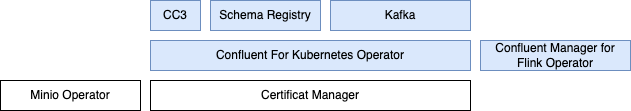

=== "Open Source Approach"
    For an equivalent open source the components are:

    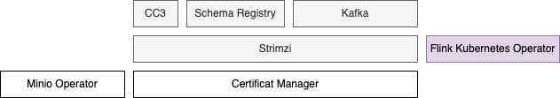

### Prerequisites

Any Kubernetes deployment should include the following pre-requisites:

* [kubectl](https://Kubernetes.io/docs/tasks/tools/) 
* A Kubernetes cluster. For local deployment use [Colima](https://github.com/abiosoft/colima) with Kubernetes enabled. See start colima with [deployment/k8s/start_colima.sh](https://github.com/jbcodeforce/flink-studies/blob/master/deployment/k8s/start_colima.sh) or `make start_colima` under `deployment/k8s` folder. 
    * [For production deployment the resource sizing for the two operator pods](https://docs.confluent.io/platform/current/flink/installation/helm.html#step-1-confirm-prerequisites).
* Be sure to have helm cli installed: ([see installation instructions](https://helm.sh/docs/intro/install/))
  ```sh
  # for mac
  brew install helm
  # or 
  brew upgrade helm
  # for WSL2 - ubuntu
  sudo apt-get install helm
  ```

* Install [Confluent CLI](https://docs.confluent.io/confluent-cli/current/install.html#install-confluent-cli) or update existing CLI with: 
  ```sh
  confluent update
  ```

* Install Confluent Platform. [See Confluent Platform deployment documentation.](https://docs.confluent.io/operator/current/co-plan.html#cp). The following table is a recap of what is needed to run CP Flink 

| Product | Version | Local command |
| --- | --- | --- |
| Kubernetes | 1.26 - 1.34 | |
| Confluent for kubernetes | 3.1 | under cfk, make deploy |
| CP | 7.3.x - 8.1.x | |
| CP FKO | .130.0 |under k8s/cmf folder,  make install_upgrade_fko |
| CMF | 2.1.0 | under k8s/cmf folder,  make deploy_cmf | 

* For private image repository [see this documentation](https://docs.confluent.io/operator/current/co-custom-registry.html#co-custom-registry).

* Verify the CP components run
  * Pods are running and healthy: `kubectl get pods -n confluent`
  * Services are deployed: `kubectl get svcs -n confluent`
  * Control Center is accessible and monitors Kafka and other components:
    ```sql
    make expose_services
    ```
  
#### Colima playground

See the [Colima installation instructions.](https://github.com/abiosoft/colima?tab=readme-ov-file#installation)

* Start a Kubernetes cluster, using one of the following options:
  ```sh
  colima start --Kubernetes
  # or under deployment/k8s folder
  ./start_colima.sh
  # or using make under deployment/k8s
  make start_colima
  ```

### External Components

The certificate manager and minio operator may be deployed in one command under `deployment/k8s`: 
  ```sh
  make deploy
  ```

#### Certificate manager 


* [See certificate manager current releases](https://github.com/cert-manager/cert-manager/releases), and update the CERT_MGR_VERSION=v1.18.1 in the [Makefile](https://github.com/jbcodeforce/flink-studies/blob/master/deployment/k8s/Makefile), then run the command:
  ```sh
  make deploy_cert_manager
  ```

* Which is doing:
  ```sh
  kubectl create -f https://github.com/jetstack/cert-manager/releases/download/v1.18.1/cert-manager.yaml
  ```

* Verify deployment with
  ```sh
    kubeclt get pods -n cert-manager
    # or
    make verify_cert_manager
    ```
    
#### Using MinIO

MinIO is an object storage solution that provides an Amazon Web Services S3-compatible API and supports all core S3 features, on k8s. It may be used for Flink checkpoint and snapshot persistenace, or when deploying application jar file to Flink, as a file storage.

* First be sure to have [the MinIO CLI](https://min.io/docs/minio/linux/reference/minio-mc.html#quickstart) installed. 
    ```sh
    brew install minio/stable/mc
    # or to upgrade to a new version
    brew upgrade minio/stable/mc
    # Verify installation
    mc --help
    ``` 

    [mc cli command summary](https://min.io/docs/minio/linux/reference/minio-mc.html)

* Deploy Minio operator under `minio-dev` namespace, using `Make
    ```sh
    make deploy_minio
    make verify_minio
    ```

* Access MinIO S3 API and Console
    ```sh
    kubectl port-forward pod/minio 9000 9090 -n minio-dev
    # or
    make port_forward_minio_console
    ```

* Log in to the Console with the credentials `minioadmin | minioadmin`
* Setup a minio client with credential saved to  $HOME/.mc/config.json
    ```sh
    mc alias set dev-minio http://localhost:9000 minioadmin minioadmin
    # make a bucket
    mc mb dev-minio/flink
    ```
#### Using Persistence Volume

* Network file system, SAN and any distributed storage can be used to persist Flink checkpoints and savepoints. The storage class needs to be defined.

### CFK installation

[See this Makefile](https://github.com/jbcodeforce/flink-studies/blob/master/deployment/k8s/cfk/Makefile) and [Readme](https://github.com/jbcodeforce/flink-studies/blob/master/deployment/k8s/cfk/README.md)

[See the Confluent Platform product installation documentation](https://docs.confluent.io/operator/current/overview.html) for details. We can summarize as: 

* The deployment leverages Kubernetes native API to configure, deploy, and manage Kafka cluster, Connect workers, Schema Registry, Confluent Control Center, Confluent REST Proxy and application resources such as topics.
* The following diagram illustrates those components in one namespace.
    <figure markdown="span">
    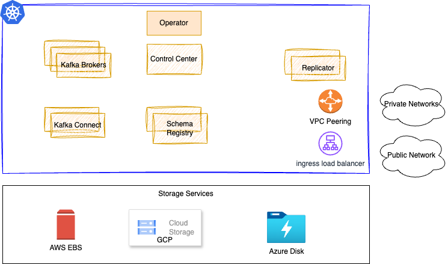
    <caption>Confluent Platform Components - k8s deployment</caption>
    </figure>

* Under the [deployment/k8s/cfk](https://github.com/jbcodeforce/flink-studies/tree/master/deployment/k8s/cfk) folder, run `make deploy` which will do the following operations:
    * Create a namespace for Confluent products deployment. By default, it deploys Confluent Platform in the namespaced deployment, and it manages Confluent Platform components in this namespace . 
    * Add Confluent Platform **Helm** repositories
    * Deploy Confluent Kafka Broker using one Kraft controller, one to three brokers, the new Confluent Center Console, with REST api and Schema Registry.
        ```sh
              NAME                                  READY   STATUS      RESTARTS          AGE
        confluent-operator-764dbdf6f9-6f7gx   1/1     Running     158 (5h41m ago)   89d
        controlcenter-ng-0                    3/3     Running     13 (5h41m ago)    32d
        kafka-0                               1/1     Running     4 (5h41m ago)     32d
        kraftcontroller-0                     1/1     Running     4 (5h41m ago)     32d
        schemaregistry-0                      1/1     Running     7 (5h41m ago)     32d
        ```
    * The console may be accessed via port-forwarding:
        ```sh
        kubectl -n confluent port-forward svc/controlcenter-ng 9021:9021 
        chrome localhost:9021
        ```

        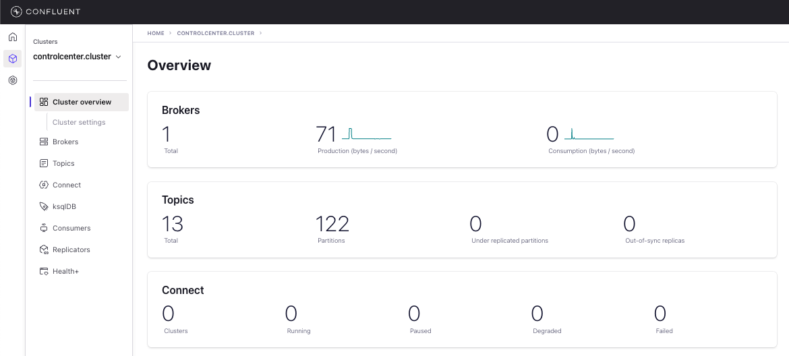

* See [Confluent Platform releases information.](https://docs.confluent.io/platform/current/installation/versions-interoperability.html#cp-af-compat)


### [Confluent Manager for Flink (CMF)](https://docs.confluent.io/operator/current/co-deploy-cp.html#co-deploy-cp)

Updated 10.18.2025: For CFK version 2.0.3 and CP v8.0.2

[See the Makefile under deployment/k8s/cmf](https://github.com/jbcodeforce/flink-studies/tree/master/deployment/k8s/cmf/Makefile) which includes a set of targets to simplify the deployment. [See Confluent Manager for Flink product documentation](https://docs.confluent.io/platform/current/flink/get-started/get-started-application.html#step-1-install-cmf-long) for deeper information. The following steps are a summary of what should be done.


* Install Confluent Manager for Flink operator, under `deployment/k8s/cmf`
  ```sh
  make help
  make deploy
  make status
  ```

See [deploy application section for SQL or Java app deployment](#flink-application-deployment)

---

### HA configuration

Within Kubernetes, we can enable Flink HA in the ConfigMap of the cluster configuration that will be shared with deployments:

```yaml
  flinkConfiguration:
    taskmanager.numberOfTaskSlots: "2"
    state.backend: rockdb
    state.savepoints.dir: file:///flink-data/savepoints
    state.checkpoints.dir: file:///flink-data/checkpoints
    high-availability.type: Kubernetes
    high-availability.storageDir: file:///flink-data/ha
    job.autoscaler.enabled: true
```

This configuration settings is supported via FKO. 
[See product documentation](https://nightlies.apache.org/flink/flink-Kubernetes-operator-docs-main/docs/operations/configuration/), and the [autoscaler section](https://nightlies.apache.org/flink/flink-Kubernetes-operator-docs-main/docs/operations/configuration/#autoscaler-configuration) for deeper parameter explanations. The Flink autoscaler monitors the number of unprocessed records in the input (pending records), and will allocate more resources to absorb the lag. It adjusts parallelism at the flink operator level within the DAG. 

JobManager metadata is persisted in the file system specified by `high-availability.storageDir` . This `storageDir` stores all metadata needed to recover a JobManager failure.

JobManager Pods, that crashed, are restarted automatically by the Kubernetes scheduler, and as Flink persists metadata and the job artifacts, it is important to mount pv to the expected paths.

```yaml
podTemplate:
  spec:
    containers:
      - name: flink-main-container
        volumeMounts:
        - mountPath: /flink-data
          name: flink-volume
    volumes:
    - name: flink-volume
      hostPath:
        # directory location on host
        path: /tmp/flink
        # this field is optional
        type: Directory
```

Recall that `podTemplate` is a base declaration common for job and task manager pods. Can be overridden by the jobManager and taskManager pod template sub-elements (spec.taskManager.podTemplate). The previous declaration will work for local k8s with hostPath access, for Kubernetes cluster with separate storage class then the volume declaration is:

```yaml
volumes:
  - name: flink-volume
    persistenceVolumeClaim:
      claimName: flink-pvc
```

podTemplate can include nodeAffinity to allocate taskManager to different node characteristics:

```yaml
  podTemplate:
      spec:
        affinity:
          nodeAffinity:
            requiredDuringSchedulingIgnoredDuringExecution:
              nodeSelectorTerms:
                - matchExpressions:
                    - key: cfk-cr
                      operator: In
                      values:
                        - flink
        tolerations:
          - key: cfk-cr
            operator: Equal
            value: flink
            effect: NoSchedule
```
### Documentations

* [Confluent Platform for Flink has another operator](https://docs.confluent.io/platform/current/flink/get-started-cpf.html) integrated with FKO. [See my CP Flink summary](../techno/cp-flink.md).
* [Confluent Flink operator documentation](https://docs.confluent.io/operator/current/co-prepare.html)
* [Getting started with Flink OSS Standalone Kubernetes Setup.](https://nightlies.apache.org/flink/flink-docs-release-1.20/docs/deployment/resource-providers/standalone/Kubernetes/)
* [Apache Flink Native Kubernetes deployment.](https://nightlies.apache.org/flink/flink-docs-release-1.20/docs/deployment/resource-providers/native_Kubernetes/)
* [A Confluent Platform demonstration git repo: confluentinc/confluent-demo](https://github.com/confluentinc/confluent-demo)

---
* Next steps is to upload jar files for the different applications to deploy, or data sets for SQL table. See [application section](#flink-application-deployment).

---

TO UPDATE 

#### Durable Storage

Durable storage is used to store consistent checkpoints of the Flink state. Review [the state management](../concepts/index.md#state-management) section in the concept chapter. The checkpoints are saved to object storage [compatible with S3](https://docs.confluent.io/platform/current/flink/how-to-guides/checkpoint-s3.html), or HDFS protocol. The FlinkConfiguration can be set at the Application, ComputePool or Environment level.

Two important elements to configure: 
1. the environment variable ENABLE_BUILT_IN_PLUGINS
1. The `state.checkpoints.dir` to the location of S3 bucket.

The following is a configuration using minio and the presto S3FileSystem which is a specific implementation (created by Presto) of the file system interface within Apache Flink. (See the [S3FileSystemFactory class](https://nightlies.apache.org/flink/flink-docs-master/api/java/org/apache/flink/fs/s3presto/S3FileSystemFactory.html)). 

```json
"flinkConfiguration": {
        "pipeline.operator-chaining.enabled": "false",
        "execution.checkpointing.interval": "10s",
        "taskmanager.numberOfTaskSlots": "4",
        "fs.s3.impl": "org.apache.flink.fs.s3presto.S3FileSystem",
        "presto.s3.endpoint": "http://minio.minio-dev.svc.cluster.local:9000",
        "presto.s3.path.style.access": "true",
        "presto.s3.connection.ssl.enabled": "false",
        "presto.s3.access-key": "admin",
        "presto.s3.secret-key": "admin123",
        "state.checkpoints.dir": "s3://flink/stateful-flink/checkpoints",
        "state.savepoints.dir": "s3://flink/stateful-flink/savepoints",
        "state.checkpoints.interval": "10000",
        "state.checkpoints.timeout": "600000"
  
      },
```

For Minio settings:

```yaml
  s3.endpoint: http://minio.minio-dev.svc.cluster.local:9000
  s3.path.style.access: "true"
  s3.connection.ssl.enabled: "false"
  s3.access-key: minioadmin
  s3.secret-key: minioadmin
  state.checkpoints.dir: s3://flink/stateful-flink/checkpoints
  state.savepoints.dir: s3://flink/stateful-flink/savepoints
  state.checkpoints.interval: "10000"
  state.checkpoints.timeout: "600000"
```

TO BE CONTINUED

A RWX, shared PersistentVolumeClaim (PVC) for the Flink JobManagers and TaskManagers provides persistence for stateful checkpoint and savepoint of Flink jobs. 

<figure markdown=span>
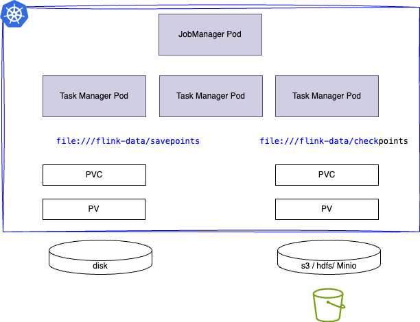
</figure>

A flow is a packaged as a jar, so developers need to define a docker image with the Flink API and any connector jars. Example of [Dockerfile](https://github.com/jbcodeforce/flink-studies/blob/master/e2e-demos/e-com-sale/flink-app/Dockerfile) and [FlinkApplication manifest](https://github.com/jbcodeforce/flink-studies/blob/master/e2e-demos/e-com-sale/k8s/cmf_app_deployment.yaml).

Also one solution includes using MinIO to persist application jars.

## Apache Flink OSS 

* Add the Apache Flink **Helm** repositories: 
    ```sh
    helm repo add flink-operator-repo https://downloads.apache.org/flink/flink-Kubernetes-operator-1.11.0
    # Verify help repo entries exist
    helm repo list
    # Be sure to change the repo as the URL may not be valid anymore
    helm repo remove  flink-operator-repo
    # try to update repo content
    helm repo update
    ```
   
    See [Apache Flink Operator documentation](https://nightlies.apache.org/flink/flink-Kubernetes-operator-docs-main/) 

### Deploy Apache Flink Kubernetes Operator

The [Apache flink Kubernetes operator product documentation](https://nightlies.apache.org/flink/flink-Kubernetes-operator-docs-main/docs/try-flink-Kubernetes-operator/quick-start/) lists the setup steps.

* Get the [list of Apache Flink releases and tags here](https://downloads.apache.org/flink/) 
* To get access to k8s deployment manifests and a Makefile to simplify deployment, of Apache Flink, or Confluent Platform on k8s (local colima or minikube) see [the deployment/k8s/flink-oss folder](https://github.com/jbcodeforce/flink-studies/blob/master/deployment/k8s/fink-oss/README.md). 
  ```sh
  make prepare
  make verify_flink
  make deploy_basic_flink_deployment  
  ```
* [Access Flink UI](http://localhost:8081)
* Mount a host folder as a PV to access data or SQL scripts, using hostPath.


## Flink Config Update

* If a write operation fails when the pod creates a folder or updates the Flink config, verify the following:

    * Assess PVC and R/W access. Verify PVC configuration. Some storage classes or persistent volume types may have restrictions on directory creation
    * Verify security context for the pod. Modify the pod's security context to allow necessary permissions.
    * The podTemplate can be configured at the same level as the task and job managers so any mounted volumes will be available to those pods. See [basic-reactive.yaml](https://github.com/apache/flink-Kubernetes-operator/blob/main/examples/basic-reactive.yaml) from Flink Operator examples.

[See PVC and PV declarations](https://github.com/jbcodeforce/flink-studies/blob/master/deployment/k8s/pvc.yaml)

## Flink Session Cluster

For Session cluster, there is no jobSpec. See [this deployment definition](https://github.com/jbcodeforce/flink-studies/blob/master/deployment/k8s/basic-job-task-mgrs.yaml). Once a cluster is defined, it has a name and can be referenced to submit SessionJobs.

A SessionJob is executed as a long-running Kubernetes Deployment. We may run multiple Flink jobs on a Session cluster. Each job needs to be submitted to the cluster after the cluster has been deployed.
To deploy a job, we need at least three components:

* a Deployment which runs a JobManager
* a Deployment for a pool of TaskManagers
* a Service exposing the JobManager’s REST and UI ports


For a deployment select the execution mode: `application, or session`. For production it is recommended to deploy in `application` mode for better isolation, and using a cloud native approach. We can just build a dockerfile for our application using the Flink jars.

### Session Deployment

Flink has a [set of examples](https://github.com/apache/flink/blob/master/flink-examples/) like the [Car top speed computation with simulated record](https://github.com/apache/flink/blob/master/flink-examples/flink-examples-streaming/src/main/java/org/apache/flink/streaming/examples/windowing/TopSpeedWindowing.java). As this code is packaged in a jar available in maven repository, we can declare a job session.

Deploy a config map to define the `log4j-console.properties` and other parameters for Flink (`flink-conf.yaml`)

The diagram below illustrates the standard deployment of a job on k8s with session mode:

 
 
 *src: apache Flink site*
 

```yaml
apiVersion: flink.apache.org/v1beta1
kind: FlinkSessionJob
metadata:
  name: car-top-speed-job
spec:
  deploymentName: flink-session-cluster
  job:
    jarURI: https://repo1.maven.org/maven2/org/apache/flink/flink-examples-streaming_2.12/1.17.2/flink-examples-streaming_2.12-1.17.2-TopSpeedWindowing.jar
    parallelism: 4
    upgradeMode: stateless
```

Before deploying this job, be sure to deploy a session cluster using the following command:

```sh
# under deployment/k8s
kubectl apply -f basic-job-task-mgrs.yaml 
```

Once the job is deployed we can see the pod and then using the user interface the job continuously running:

* Example of deploying Java based [SQL Runner](https://github.com/apache/flink-Kubernetes-operator/blob/main/examples/flink-sql-runner-example/README.md) to interpret a Flink SQL script: package it as docker images, and deploy it with a Session Job. There is a equivalent for Python using [Pyflink](https://nightlies.apache.org/flink/flink-docs-release-1.18/docs/dev/python/overview/).

    * [See the ported code for Java](https://github.com/jbcodeforce/flink-studies/tree/master/flink-sql-demos/sql-runner)
    * And for the [Python implementation](https://github.com/jbcodeforce/flink-studies/tree/master/flink-sql-demos/flink-python-sql-runner)


### Flink State Snapshot

To help managing snapshots, there is another CR called [FlinkStateSnapshot](https://nightlies.apache.org/flink/flink-Kubernetes-operator-docs-main/docs/custom-resource/reference/#flinkstatesnapshotspec)


## Flink Application Deployment 

There two types of Flink application: the java packaging or the SQL client with open session to the cluster.

### Flink SQL processing

There are multiple choices to run Flink SQL: using the SQL client, or package the SQL scripts in a docker container with the [java SQL runner](https://github.com/jbcodeforce/flink-studies/tree/master/code/flink-java/sql-runner) executing the SQL statements from a file, or use the Table API. The application deployment is Java based even if SQL scripts are used for stream processing.

With Apache Flink OSS, Flink Session Cluster is the most suitable deployment mode for the SQL Client. This is a long-running Flink cluster (JobManager and TaskManagers) on which you can submit multiple jobs to. The sql client is a long-running, interactive application that submits jobs to an existing cluster.

For Confluent Manager For Flink the recommended approach is to use a Flink Application, which per design, is one Job manager with multiple Task managers or use the Flink SQL Shell.

#### Confluent Manager for Flink

As seen previously in **Confluent Manager for Flink** the method is to create an **Environment** and **Compute pool** to run the SQL statements in a pool. Those concepts and components are the same as the Confluent Cloud for Flink.

* Be sure that the port-forward to the svc/cmf-service is active.

* Define an environment: 
  ```sh
  export CONFLUENT_CMF_URL=http://localhost:8084
  # be sure to not be connected to confluent cloud, if not do:
  confluent logout
  # Look at current environment
  confluent flink environment  list
  # Create new env
  confluent flink environment create dev --kubernetes-namespace el-demo
  # or under deployment/k8s/cmf
  make create_flink_env
  ```


* Define a compute pool (verify current [docker image tag](https://hub.docker.com/r/confluentinc/cp-flink-sql/tags)) and see the [compute_pool.json](https://github.com/jbcodeforce/flink-studies/blob/master/deployment/k8s/cmf/compute_pool.json)
  ```sh
  make create_compute_pool
  ```

* Flink SQL uses the concept of Catalogs to connect to external storage systems. CMF features built-in KafkaCatalogs to connect to Kafka and Schema Registry.  A `KafkaCatalog` exposes Kafka topics as tables and derives their schema from Schema Registry. Define a Flink Catalog as json file: (see [cmf/kafka_catalog.json](https://github.com/jbcodeforce/flink-studies/blob/master/deployment/k8s/cmf/kafka_catalog.json)). The catalog is configured with connection properties for the Kafka and Schema Registry clients.
  ```sh
  make create_kafka_catalog
  ```

* Define secret to access Kafka Cluster [See this secret](https://github.com/jbcodeforce/flink-studies/blob/master/deployment/k8s/cmf/kafka_secret.json) and [the mapping](https://github.com/jbcodeforce/flink-studies/blob/master/deployment/k8s/cmf/env_secret_mapping.json)
  ```sh
  make create_kafka_secret
  make create_env_secret_mapping
  ```

* Use the confluent cli to start a Flink  SQL shell
  ```sh
  confluent --environment dev --compute-pool pool1 flink shell --url http://localhost:8084
  ```


#### Apache Flink (OSS)

You can run the SQL Client in a couple of ways:

* As a separate Docker container: The Flink Docker images include the SQL Client. You can run a container and connect to the JobManager. You will need to mount a volume to persist SQL scripts and other data.
  ```sh
  kubectl exec -it <sql-client-pod-name> -- /opt/flink/bin/sql-client.sh
  ```

  When running the SQL Client as a pod within the same Kubernetes cluster, you can use the internal DNS name of the JobManager service to connect. The format is typically <service-name>.<namespace>.svc.cluster.local

* Locally: Download the Flink distribution, extract it, and run the SQL Client from your local machine.
  ```sh
  # port forwarding
  kubectl port-forward svc/<jobmanager-service-name> 8081:8081

  ./bin/sql-client.sh -s <jobmanager-service-name>:8081
  ```


### Flink Application

An **application deployment** must define the job (JobSpec) field with the `jarURI`, `parallelism`, `upgradeMode` one of (stateless/savepoint/last-state) and the desired `state` of the job (running/suspended). [See this sample app](https://github.com/jbcodeforce/flink-studies/blob/master/deployment/k8s/basic-sample.yaml) or the [cmf_app_deployment.yaml](https://github.com/jbcodeforce/flink-studies/tree/master/e2e-demos/e-com-sale/k8s/cmf_app_deployment.yaml) in the e-com-sale demonstration.

Here is an example of FlinkApplication, the CRD managed by the CMF operator:

```yaml
apiVersion: "cmf.confluent.io/v1
kind: FlinkApplication"
spec:
  flinkVersion: v1_19
  image: confluentinc/cp-flink:1.19.1-cp2  # or a custom image based on this one.
  job:
      jarURI: local:///opt/flink/examples/streaming/StateMachineExample.jar
      # For your own deployment, use your own jar
      jarURI: local:///opt/flink/usrlib/yourapp01.0.0.jar
      parallelism: 2
      upgradeMode: stateless
      state: running
  jobManager: 
    resource: 
      cpu: 1
      memory: 1048m
  taskManager: 
    resource: 
      cpu: 1
      memory: 1048m
```

* [See manage Flink app using Confluent for Flink](https://docs.confluent.io/operator/current/co-manage-flink.html)

#### Fault tolerance

For Flink job or application that are stateful and for fault tolerance, it is important to enable checkpointing and savepointing:

```yaml
job:
  jarURI: local:///opt/flink/examples/streaming/StateMachineExample.jar

  parallelism: 2
  upgradeMode: savepoint
  #savepointTriggerNonce: 0
  # initialSavepointPath: file:///
```

The other upgradeMode is ``

???- question "How to validate checkpointing?"
    Checkpointing let Flink to periodically save the state of a job into local storage. 
    Look at the pod name of the task manager and stop it with `kubectl delete pod/....`
    Flink should automatically restart the job and recover from the latest checkpoint. Use the Flink UI or CLI to see the job status.

???- question "How to validate savepointing?"
    Savepoints are manually triggered snapshots of the job state, which can be used to upgrade a job or to perform manual recovery.
    To trigger a savepoint we need to set a value into `savepointTriggerNonce` in the FlinkDeployment descriptor and then apply the changes. 
    Get the location of the save point and then add to the yaml `initialSavepointPath` to redeploy the applicationL: it will reload its state from the savepoint. There is a custom resource definition ([FlinkStateSnapshotSpec](https://nightlies.apache.org/flink/flink-Kubernetes-operator-docs-main/docs/custom-resource/reference/#flinkstatesnapshotspec)) to trigger savepoints. 

`flinkConfiguration` is a hash map used to define the Flink configuration, such as the task slot, HA and checkpointing parameters.

```yaml
  flinkConfiguration:
    high-availability.type: org.apache.flink.Kubernetes.highavailability.KubernetesHaServicesFactory
    high-availability.storageDir: 'file:///opt/flink/volume/flink-ha'
    restart-strategy: failure-rate
    restart-strategy.failure-rate.max-failures-per-interval: '10'
    restart-strategy.failure-rate.failure-rate-interval: '10 min'
    restart-strategy.failure-rate.delay: '30 s'
    execution.checkpointing.interval: '5000'
    execution.checkpointing.unaligned: 'false'
    state.backend.type: rocksdb
    state.backend.incremental: 'true'
    state.backend.rocksdb.use-bloom-filter: 'true'
    state.checkpoints.dir: 'file:///opt/flink/volume/flink-cp'
    state.checkpoints.num-retained: '3'
    state.savepoints.dir: 'file:///opt/flink/volume/flink-sp'
    taskmanager.numberOfTaskSlots: '10'
    table.exec.source.idle-timeout: '30 s'
```


The application jar needs to be in a custom Flink docker image built using the [Dockerfile as in e-com-sale-demo](https://github.com/jbcodeforce/flink-studies/blob/master/e2e-demos/e-com-sale/flink-app/Dockerfile), or uploaded to a MinIO bucket. 

The following Dockerfile is used for deploying a solution in **application mode**, which packages the Java Flink jars with the app, and any connector jars needed for the integration and starts the `main()` function.

```dockerfile
FROM confluentinc/cp-flink:1.19.1-cp2
RUN mkdir -p $FLINK_HOME/usrlib
COPY /path/of/my-flink-job-*.jar $FLINK_HOME/usrlib/my-flink-job.jar
```

* With Confluent Platform for Flink:

    ```sh
      # First be sure the service is expose
      kubectl port-forward svc/cmf-service 8080:80 -n flink
      # Deploy the app given its deployment
      confluent flink application create k8s/cmf_app_deployment.yaml  --environment $(ENV_NAME) --url http://localhost:8080 
    ```

???- info "Access to user interface"
    To forward your jobmanager’s web ui port to local 8081.

    ```sh
    kubectl port-forward ${flink-jobmanager-pod} 8081:8081 
    # Or using confluent cli CP for Flink command:
    confluent flink application web-ui-forward $(APP_NAME) --environment $(ENV_NAME) --port 8081 --url http://localhost:8080
    ```

    And navigate to [http://localhost:8081](http://localhost:8081).

### Using MinIO for app deployment

* Upload an application to minio bucket:

    ```sh
    mc cp ./target/flink-app-0.1.0.jar dev-minio/flink/flink-app-0.1.0.jar
    mc ls dev-minio/flink
    ```

* Start the application using confluent cli:

    ```sh
    confluent flink application create --environment env1 --url http://localhost:8080 app-deployment.json
    ```

* Open Flink UI:

    ```sh
    confluent flink application web-ui-forward --environment env1 flink-app --url http://localhost:8080
    ```

* Produce messages to kafka topic

    ```sh
    echo 'message1' | kubectl exec -i -n confluent kafka-0 -- /bin/kafka-console-producer --bootstrap-server kafka.confluent.svc.cluster.local:9092 --topic in
    ```

* Cleanup

    ```sh
    # the Flink app
    confluent flink application delete kafka-reader-writer-example --environment development --url http://localhost:8080
    # the Kafka cluster
    # the operators
    ```

## Practices

* It is not recommended to host a Flink Cluster across multiple Kubernetes clusters. Flink node exchanges data between task managers and so better to run in same region, and within same k8s. 