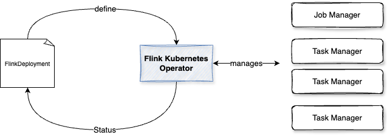

# Flink Kubernetes Deployment

Flink consists of Job Manager and Task Manager. The Job Manager coordinates the stream processing job, manages job submission and the job lifecycle then allocates work to Task Managers. Task Managers execute the actual stream processing logic. Only one Job Manager is active at a given point of time, and there may be n Task Managers (n replicas).
Failures of Job Manager pods are handled by the Deployment Controller which will take care of spawning a new Job Manager.

A flow is a packaged as a jar, so need to be in a docker image with the Flink executable.

Flink offers [a k8s Operator](https://flink.apache.org/news/2022/04/03/release-kubernetes-operator-0.1.0.html) to deploy and manage applications. This note summarize how to use this operator, with basic getting started yaml files.



The [operator](https://nightlies.apache.org/flink/flink-kubernetes-operator-docs-main/) takes care of submitting, savepointing, upgrading and generally managing Flink jobs using the built-in Flink Kubernetes integration. It fully automates the entire lifecycle of job manager, task managers, and applications. As other operator it can run **namespace-scoped**, to get multiple versions of the operator in the same Kubernetes cluster, or **cluster-scoped** for highly distributed  deployment. 

The following figure represents a simple deployment view of Flink with a Kafka solution on kubernetes cluster:


The custom resource definition that describes the schema of a FlinkDeployment is a cluster wide resource. The Operator continuously tracks cluster events relating to the FlinkDeployment and FlinkSessionJob custom resources. [The operator control flow is described in this note.](https://nightlies.apache.org/flink/flink-kubernetes-operator-docs-main/docs/concepts/controller-flow/) 

[Confluent Platform for Flink has also an operator](https://docs.confluent.io/platform/current/flink/get-started-cpf.html)

## Pre-requisites

* Be sure to have helm client installed. On Mac: `brew install helm`

```sh
helm version
# version.BuildInfo{Version:"v3.9.0", GitCommit:"7ceeda6c585217a19a1131663d8cd1f7d641b2a7", GitTreeState:"clean", GoVersion:"go1.17.5"}
```

* Install a certitication manager, only one time per k8s cluster: `kubectl create -f https://github.com/jetstack/cert-manager/releases/download/v1.8.2/cert-manager.yaml`
* Get the [list of open-source Flink releases here](https://downloads.apache.org/flink/) or [Confluent one](https://docs.confluent.io/platform/current/installation/versions-interoperability.html#cp-af-compat)

* Add Helm repo: 

```sh
helm repo add flink-operator-repo https://downloads.apache.org/flink/flink-kubernetes-operator-1.9.0
# or confluent
helm repo add confluentinc https://packages.confluent.io/helm
# Verify help repo entry exist
helm repo list
# Be sure to change the repo as the URL may not be valid anymore
helm repo remove  flink-operator-repo
# try to update repo content
helm repo update
```

## Deploy Flink Kubernetes Operator

[Flink Kubernetes Operator](https://nightlies.apache.org/flink/flink-kubernetes-operator-docs-stable/) acts as a control plane to manage the complete deployment lifecycle of Apache Flink applications.

(See the [pre-requisites](https://nightlies.apache.org/flink/flink-kubernetes-operator-docs-stable/docs/try-flink-kubernetes-operator/quick-start/))
```sh
kubectl create namespace flink
# Set the cert manager if not done before
# Open source
helm install flink-kubernetes-operator flink-operator-repo/flink-kubernetes-operator
# Confluent packaging
helm install cp-flink-kubernetes-operator confluentinc/flink-kubernetes-operator  --set webhook.create=false

# output
NAME: flink-kubernetes-operator
LAST DEPLOYED: Thu Jul 28 19:00:31 2022
STATUS: deployed
REVISION: 1
TEST SUITE: None
```

* Then verify deployment

```sh
helm list
NAME                      NAMESPACE   REVISION  UPDATED                            STATUS  CHART APP VERSION
flink-kubernetes-operator flink-demo  1    	2022-07-28 19:00:31.459524 -0700 PDT	deployed flink-kubernetes-operator-1.0.1	1.0.1
```

* Verify the k8s deployment for the operator

```sh
k describe deployment flink-kubernetes-operator
```

???- info "resources"
    The operator uses a config map to define its  own configuration mounted to `/opt/flink/conf` and a volume to `/opt/flink/artifacts`, and a secrets to hold the certificates for the flink webhook.

* In case of ImageBackOff issue, for example of minikube, it may come from the image name and the adoption of a private registry. (Using a minikube image load <> takes the image from docker and upload to private minikube registry)

* If the pod is not running verify in the deployment the condition, we may need to add security policy, like in this OpenShift example:

```sh
oc adm policy add-scc-to-user privileged -z default
```

and remove runAs elements in the deployment.yaml.

???- info "Access to user interface"
    To forward your jobmanager’s web ui port to local 8081.

    ```sh
    kubectl port-forward ${flink-jobmanager-pod} 8081:8081 
    ```

    And navigate to [http://localhost:8081](http://localhost:8081).

* To remove the operator

```sh
helm uninstall flink-kubernetes-operator
```

## Custom Resources

Once the operator is running we can submit jobs using  `FlinkDeployment` (for Flink Application) and `FlinkSessionJob`Custom Resources.

The [FlinkDeployment spec is here](https://nightlies.apache.org/flink/flink-kubernetes-operator-docs-release-1.10/docs/custom-resource/overview/#flinkdeployment-spec-overview) and is used to define Flink application (will have a job section) or session cluster (only job and task managers configuration).

An RWX, shared PersistentVolumeClaim (PVC) for the Flink JobManagers and TaskManagers provides stateful checkpoint and savepoint for Flink jobs. 

[For more detail see the CRD reference documentation.](https://nightlies.apache.org/flink/flink-kubernetes-operator-docs-main/docs/custom-resource/reference/)

### HA configuration

Within Kubernetes, we can enable Flink HA in the ConfigMap of the cluster configuration:

```yaml
  flinkConfiguration:
    taskmanager.numberOfTaskSlots: "2"
    state.backend: rockdb
    state.savepoints.dir: file:///flink-data/savepoints
    state.checkpoints.dir: file:///flink-data/checkpoints
    high-availability.type: kubernetes
    high-availability.storageDir: file:///flink-data/ha
```

JobManager metadata is persisted in the file system high-availability.storageDir . This `storageDir` stores all metadata needed to recover a JobManager failure.

JobManager Pod that crashed are restarted automatically by the kubernetes scheduler, and as Flink persists metadata and the job artifacts, it is important to mount pv to the expected paths.

```yaml
podTemplate:
    spec:
      containers:
        - name: flink-main-container
          volumeMounts:
          - mountPath: /flink-data
            name: flink-volume
      volumes:
      - name: flink-volume
        hostPath:
          # directory location on host
          path: /tmp/flink
          # this field is optional
          type: Directory
```

Recall that `podTemplate` is a base declaration common for job and task manager pods. Can be overridden by the jobManager and taskManager pod templates. The previous declaration will work for minikube with hostPath access, for Kubernetes cluster with separate storage class then the volume declaration is:

```yaml
volumes:
  - name: flink-volume
    persistenceVolumeClaim:
      claimName: flink-pvc
```

For Flink job or application, it is important to enable checkpointing and savepointing:

```
job:
  jarURI: local:///opt/flink/examples/streaming/StateMachineExample.jar
  parallelism: 2
  upgradeMode: savepoint
  #savepointTriggerNonce: 0
  # initialSavepointPath: file:///
```

???- question "How to validate checkpointing?"
    Checkpointing let Flink to periodically save the state of a job into local storage. 
    Look at the pod name of the taskmanager and stop it with `kubectl delete pod/....`
    Flink should automatically restert the job and recover from the latest checkpoint. Use the Flink UI or CLI to see the job status.

???- question "How to validate savepointing?"
    Savepoints are manually triggered snapshots of the job state, which can be used to upgrade a job or to perform manual recovery.
    To trigger a savepoint we need to set a value into `savepointTriggerNonce` in the FlinkDeployment descriptor and then apply the changes. 
    Get the location of the save pint and then add to the yaml `initialSavepointPath` to redeploy the applicationL: it will reload its state from the savepoint. There is a custom resource definition ([FlinkStateSnapshotSpec](https://nightlies.apache.org/flink/flink-kubernetes-operator-docs-main/docs/custom-resource/reference/#flinkstatesnapshotspec)) to trigger savepoints. 

### Application deployment 

An **application deployment** must define the job (JobSpec) field with the `jarURI`, `parallelism`, `upgradeMode` one of (stateless/savepoint/last-state) and the desired `state` of the job (running/suspended). [See this sample app](https://github.com/jbcodeforce/flink-studies/blob/master/deployment/k8s/basic-sample.yaml).

```yaml
job:
    jarURI: local:///opt/flink/examples/streaming/StateMachineExample.jar
    parallelism: 2
    upgradeMode: stateless
    state: running
```

`flinkConfiguration` is a hash map used to define  the Flink configuration, like, task slot, HA and checkpointing parameters.

```yaml
   flinkConfiguration:
    high-availability.type: org.apache.flink.kubernetes.highavailability.KubernetesHaServicesFactory
    high-availability.storageDir: 'file:///opt/flink/volume/flink-ha'
    restart-strategy: failure-rate
    restart-strategy.failure-rate.max-failures-per-interval: '10'
    restart-strategy.failure-rate.failure-rate-interval: '10 min'
    restart-strategy.failure-rate.delay: '30 s'
    execution.checkpointing.interval: '5000'
    execution.checkpointing.unaligned: 'false'
    state.backend.type: rocksdb
    state.backend.incremental: 'true'
    state.backend.rocksdb.use-bloom-filter: 'true'
    state.checkpoints.dir: 'file:///opt/flink/volume/flink-cp'
    state.checkpoints.num-retained: '3'
    state.savepoints.dir: 'file:///opt/flink/volume/flink-sp'
    taskmanager.numberOfTaskSlots: '10'
    table.exec.source.idle-timeout: '30 s'
```

### Flink Config Update

* If a write operation fails when the pod creates a folder or updates the Flink config, verify the following:

    * Assess PVC and R/W access. Verify PVC configuration. Some storage classes or persistent volume types may have restrictions on directory creation
    * Verify security context for the pod. Modify the pod's security context to allow necessary permissions.
    * The podTemplate can be configured at the same level as the task and job managers so any mounted volumes will be available to those pods. See [basic-reactive.yaml](https://github.com/apache/flink-kubernetes-operator/blob/main/examples/basic-reactive.yaml) from Flink Operator examples.

[See PVC and PV declarations](https://github.com/jbcodeforce/flink-studies/blob/master/deployment/k8s/pvc.yaml)

## Flink Session

For Session cluster, there is no jobSpec. See [this deployment definition](https://github.com/jbcodeforce/flink-studies/blob/master/deployment/k8s/basic-job-task-mgrs.yaml). Once a cluster is defined, it has a name and can be referenced to submit SessionJobs.

A SessionJob is executed as a long-running Kubernetes Deployment. We may run multiple Flink jobs on a Session cluster. Each job needs to be submitted to the cluster after the cluster has been deployed.
To deploy a job, we need at least three components:

* a Deployment which runs a JobManager
* a Deployment for a pool of TaskManagers
* a Service exposing the JobManager’s REST and UI ports


For a deployment select the execution mode: `application, or session`. For production it is recommended to deploy in `application` mode for better isolation, and using a cloud native approach. We can just build a dockerfile for our application using the Flink jars.

### Session Deployment

Flink has a [set of examples](https://github.com/apache/flink/blob/master/flink-examples/) like the [Car top speed computation with simulated record](https://github.com/apache/flink/blob/master/flink-examples/flink-examples-streaming/src/main/java/org/apache/flink/streaming/examples/windowing/TopSpeedWindowing.java). As this code is packaged in a jar available in maven repository, we can declare a job session.

Deploy a config map to define the `log4j-console.properties` and other parameters for Flink (`flink-conf.yaml`)

The diagram below illustrates the standard deployment of a job on k8s with session mode:

 
 *src: apache Flink site*
 

```yaml
apiVersion: flink.apache.org/v1beta1
kind: FlinkSessionJob
metadata:
  name: car-top-speed-job
spec:
  deploymentName: flink-session-cluster
  job:
    jarURI: https://repo1.maven.org/maven2/org/apache/flink/flink-examples-streaming_2.12/1.17.2/flink-examples-streaming_2.12-1.17.2-TopSpeedWindowing.jar
    parallelism: 4
    upgradeMode: stateless
```

Before deploying this job, be sure to deploy a session cluster using the following command:

```sh
# under deployment/k8s
k apply -f basic-job-task-mgrs.yaml 
```

Once the job is deployed we can see the pod and then using the user interface the job continuously running:


* Example of deploying Java based [SQL Runner](https://github.com/apache/flink-kubernetes-operator/blob/main/examples/flink-sql-runner-example/README.md) to interprete a Flink SQL script: package it as docker images, and deploy it with a Session Job. There is a equivalent for Python using [Pyflink](https://nightlies.apache.org/flink/flink-docs-release-1.18/docs/dev/python/overview/).

    * [See the ported code for Java](https://github.com/jbcodeforce/flink-studies/tree/master/flink-sql-demos/sql-runner)
    * And for the [Python implementation](https://github.com/jbcodeforce/flink-studies/tree/master/flink-sql-demos/flink-python-sql-runner)


### Flink State Snapshot

To help managing snapshots, there is another CR called [FlinkStateSnapshot](https://nightlies.apache.org/flink/flink-kubernetes-operator-docs-main/docs/custom-resource/reference/#flinkstatesnapshotspec)


---

## Flink application deployment

The following Dockerfile is used for deploying a solution in **application mode**, which packages the Java Flink jars with the app, and starts the main() function.

```dockerfile
FROM flink
RUN mkdir -p $FLINK_HOME/usrlib
COPY /path/of/my-flink-job-*.jar $FLINK_HOME/usrlib/my-flink-job.jar
```

As an example the `kafka-flink-demo` has such dockerfile.

We need to define following components (See yaml files in the `kafka-flink-demo`):

* an Application which runs a JobManager
* Deployment for a pool of TaskManagers
* Service exposing the JobManager’s REST and UI ports

The Application Mode makes sure that all Flink components are properly cleaned up after the termination of the application.

### Flink SQL processing

Ther eare multiple choices to run Flink SQL, using the SQL client, or package the SQL scripts and get a [java SQL runner] (https://github.com/jbcodeforce/flink-studies/tree/master/flink-java/sql-runner) executing the SQL, so the application deployment is Java based even if SQL scripts are used for stream processing.

## Practices

* It is not recommended to host a Flink Cluster across multiple Kubernetes clusters. Flink node exchanges data between task managers and so better to run in same region, and within same k8s. 