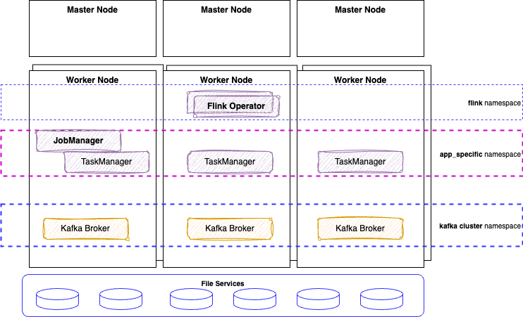

# Flink Kubernetes Deployment

???- info "This chapter updates"
    * Created 10/2024
    * 12/24: move some content to hands-on readme, clean content
    * 01/25: sql processing section
    * 05/25: merge content, simplify, add some details on deployment - fully test k8s deployment on Colima
    * 07/25: Update for Confluent Platform v8
    * 08/25: 

## Apache Flink Kubernetes Operator Concepts

[Apache Flink Kubernetes Operator](https://nightlies.apache.org/flink/flink-kubernetes-operator-docs-main/) acts as a control plane to manage the complete deployment lifecycle of Apache Flink applications. This note summarizes how to use this operator, with present the different getting started yaml files. 

The [operator](https://nightlies.apache.org/flink/flink-kubernetes-operator-docs-main/) takes care of submitting, savepointing, upgrading and generally managing Flink jobs using the built-in Flink Kubernetes integration. 

<figure markdown="span">

<figcaption>Flink Operator to manage Flink Job and Task managers</figcaption>
</figure>

The operator fully automates the entire lifecycle of job manager, task managers, and applications. Failures of Job Manager pods are handled by the Deployment Controller which will take care of spawning a new Job Manager.

As other operators, it can run **namespace-scoped**, to get multiple versions of the operator in the same Kubernetes cluster, or **cluster-scoped** for highly distributed  deployment. 

The following figure represents a simple deployment view of a Flink and a Kafka clusters on a kubernetes platform:

<figure markdown="span">

<figcaption>K8S deployment</figcaption>
</figure>

The custom resource definition that describes the schema of a FlinkDeployment is a cluster wide resource. The Operator continuously tracks cluster events relating to the `FlinkDeployment` and `FlinkSessionJob` custom resources. [The operator control flow is described in this note.](https://nightlies.apache.org/flink/flink-kubernetes-operator-docs-main/docs/concepts/controller-flow/) 

### FlinkDeployment

FlinkDeployment CR defines Flink Application and Session cluster deployments.

### Important documentations

* [Confluent Platform for Flink has also an operator](https://docs.confluent.io/platform/current/flink/get-started-cpf.html) compatible with the open-source one.
* [Confluent operator documentation](https://docs.confluent.io/operator/current/co-prepare.html)
* [Getting started with Flink OSS Standalone Kubernetes Setup.](https://nightlies.apache.org/flink/flink-docs-release-1.20/docs/deployment/resource-providers/standalone/kubernetes/)
* [Apache Flink Native Kubernetes deployment.](https://nightlies.apache.org/flink/flink-docs-release-1.20/docs/deployment/resource-providers/native_kubernetes/)

## Pre-requisites

Any Flink on Kubernetes deployment should include the following pre-requisites:

* [kubectl](https://kubernetes.io/docs/tasks/tools/) 
* [Colima](https://github.com/abiosoft/colima) for local Kubernetes. Start colima with [deployment/k8s/start_colima.sh](https://github.com/jbcodeforce/flink-studies/blob/master/deployment/k8s/start_colima.sh) or `make start_colima` under cp-flink folder.
* Be sure to have helm cli installed: ([see installation instructions](https://helm.sh/docs/intro/install/))
  ```sh
  # for mac
  brew install helm
  # or 
  brew upgrade helm
  # for WSL2 - ubuntu
  sudo apt-get install helm
  ```

**Two Options to run Flink on Kubernetes**: 

1. [Confluent Manager for Apache Flink](#confluent-manager-for-apache-flink)
1. [Apache Flink Open Source](#deploy-apache-flink-kubernetes-operator)

Once the platform is up and running [see the different application deployment patterns](#flink-application-deployment)

### Colima playground

[Colima installation instructions.](https://github.com/abiosoft/colima?tab=readme-ov-file#installation)

* Start a kubernetes cluster, for colima do one of the following option:
  ```sh
  colima start --kubernetes
  # or under deployment/k8s folder
  ./start_colima.sh
  # with make under deployment/k8s
  make start_colima
  ```

* Install Certification manager [See current releases](https://github.com/cert-manager/cert-manager/releases):
  ```sh
  make deploy_cert_manager
  ```
  Which is doing:
  ```sh
  kubectl create -f https://github.com/jetstack/cert-manager/releases/download/v1.18.1/cert-manager.yaml
  # verify
  kubeclt get pods -n cert-manager
  # or
  make verify_cert_manager
  ```

### Using MinIO

MinIO is an object storage solution that provides an Amazon Web Services S3-compatible API and supports all core S3 features, on k8s.

* First be sure [the MinIO CLI](https://min.io/docs/minio/linux/reference/minio-mc.html#quickstart) is installed. 
    ```sh
    brew install minio/stable/mc
    # or to upgrade to a new version
    brew upgrade minio/stable/mc
    # Verify installation
    mc --help
    ``` 

    [mc cli command summary](https://min.io/docs/minio/linux/reference/minio-mc.html)

* Config Minio under `minio-dev` namespace
    ```sh
    # under deployment/k8s/MinIO
    kubectl apply -f minio-dev.yaml
    kubectl get pods -n minio-dev
    # same as doing
    make deploy_minio
    make verify_minio
    ```

* Access MinIO S3 API and Console
    ```sh
    kubectl port-forward pod/minio 9000 9090 -n minio-dev
    # or
    make port_forward_minio_console
    ```

* Log in to the Console with the credentials `minioadmin | minioadmin`
* Setup a minio client with credential saved to  $HOME/.mc/config.json
    ```sh
    mc alias set dev-minio http://localhost:9000 minioadmin minioadmin
    # make a bucket
    mc mb dev-minio/flink
    ```

* Next steps is to upload jar files for the different applications to deploy, or data sets for SQL table. See [application section](#flink-application-deployment).

## [Confluent Manager](https://docs.confluent.io/operator/current/co-deploy-cp.html#co-deploy-cp) for Apache Flink

Updated 07.01.2025: For CFK version 3.0.0 and CP v8.0.0

[See the Makefile under deployment/k8s/cp-flink](https://github.com/jbcodeforce/flink-studies/tree/master/deployment/k8s/cp-flink) which includes a set of targets to simplify the deployment. [See Confluent Manager for Apache Flink product documentation](https://docs.confluent.io/platform/current/flink/get-started/get-started-application.html#step-1-install-cmf-long) for deeper information. The following steps are a summary of what should be done.

* Install [Confluent CLI](https://docs.confluent.io/confluent-cli/current/install.html#install-confluent-cli) or update existing CLI with: 
  ```sh
  confluent update
  ```
* Install [Confluent plugin for kubectl](https://docs.confluent.io/operator/current/co-deploy-cfk.html#co-install-plugin)
  ```sh
  sudo tar -xvf kubectl-plugin/kubectl-confluent-darwin-arm64.tar.gz -C /usr/local/bin/
  ```

### Install Confluent Platform for Kafka

* Using make, run `make install_cp` which will do the following:
  * Create a namespace for Confluent products deployment. By default, CMF deploys Confluent Platform in the namespaced deployment, and it manages Confluent Platform component clusters and resources in the same Kubernetes namespace where CFK itself is deployed. 
  * Add Confluent Platform **Helm** repositories
      ```sh
      helm repo add confluentinc https://packages.confluent.io/helm
      # Verify help repo entries exist
      helm repo list
      # try to update repo content
      helm repo update
      helm upgrade --install confluent-operator confluentinc/confluent-for-kubernetes
      ```
  *  Deploy Confluent Kafka Broker using one Kraft controller, three brokers, new Confluent Console, with REST api and schema registry.

* See [Confluent Platform releases information.](https://docs.confluent.io/platform/current/installation/versions-interoperability.html#cp-af-compat)


### Install Confluent Manager for Flink

* Install the Flink Kubernetes Operator
  ```sh
  make install_flink_kubernetes_operator
  # which does:
  helm upgrade --install cp-flink-kubernetes-operator --version "~1.120.0"  confluentinc/flink-kubernetes-operator --set watchNamespace="{flink, confluent}"
  ```

* Install Confluent Manager for Apache Flink (The `cmf.sql.production=false` setting initializing the CMF database without encryption.)
  ```sh
  make deploy_cmf
  # same as:
  helm upgrade --install cmf --version "~2.0.0" confluentinc/confluent-manager-for-apache-flink --namespace flink --set cmf.sql.production=false
  ```

* Open port forwarding to CMF so the confluent cli can access the REST API, this is mandatory to deploy job
  ```sh
  make port_forward_cmf
  ```

See [deploy application section for SQL or Java app deployment](#flink-application-deployment)


---

TO UPDATE 

## Apache Flink OSS 

* Add the Apache Flink **Helm** repositories: 
    ```sh
    helm repo add flink-operator-repo https://downloads.apache.org/flink/flink-kubernetes-operator-1.11.0
    # Verify help repo entries exist
    helm repo list
    # Be sure to change the repo as the URL may not be valid anymore
    helm repo remove  flink-operator-repo
    # try to update repo content
    helm repo update
    ```
   
    See [Apache Flink Operator documentation](https://nightlies.apache.org/flink/flink-kubernetes-operator-docs-main/) 

## Deploy Apache Flink Kubernetes Operator

The [Apache flink kubernetes operator product documentation](https://nightlies.apache.org/flink/flink-kubernetes-operator-docs-main/docs/try-flink-kubernetes-operator/quick-start/) lists the setup steps.

* Get the [list of Apache Flink releases and tags here](https://downloads.apache.org/flink/) 
* To get access to k8s deployment manifests and a Makefile to simplify deployment, of Apache Flink, or Confluent Platform on k8s (local colima or minikube) see [the deployment/k8s/flink-oss folder](https://github.com/jbcodeforce/flink-studies/blob/master/deployment/k8s/fink-oss/README.md). 
  ```sh
  make prepare
  make verify_flink
  make deploy_basic_flink_deployment  
  ```
* [Access Flink UI](http://localhost:8081)
* Mount a host folder as a PV to access data or SQL scripts, using hostPath.


### Custom Resources

Once the operator is running, we can submit jobs using  `FlinkDeployment` (for Flink Application) and `FlinkSessionJob` Custom Resources for Session. Confluent Managed for Flink supports application mode only and is using a new CRD for `FlinkApplication`.

The [Apache Flink FlinkDeployment spec is here](https://nightlies.apache.org/flink/flink-kubernetes-operator-docs-main/docs/custom-resource/reference/) and is used to define Flink application (will have a job section) or session cluster (only job and task managers configuration).

It is important to note that `FlinkDeployment` and `FlinkApplication` CRD have a podTemplate, so config map and secrets can be used to configure environment variables for the flink app. (Be sure to keep the name `flink-main-container`)

```yaml
spec:
  podTemplate:
    spec:
      containers:
        - name: flink-main-container
          envFrom:
            - configMapRef:
                name: flink-app-cm
```

A RWX, shared PersistentVolumeClaim (PVC) for the Flink JobManagers and TaskManagers provides persistence for stateful checkpoint and savepoint of Flink jobs. 

A flow is a packaged as a jar, so developers need to define a docker image with the Flink API and any connector jars. Example of [Dockerfile](https://github.com/jbcodeforce/flink-studies/blob/master/e2e-demos/e-com-sale/flink-app/Dockerfile) and [FlinkApplication manifest](https://github.com/jbcodeforce/flink-studies/blob/master/e2e-demos/e-com-sale/k8s/cmf_app_deployment.yaml).

Also one solution includes using MinIO to persist application jars.

### HA configuration

Within Kubernetes, we can enable Flink HA in the ConfigMap of the cluster configuration:

```yaml
  flinkConfiguration:
    taskmanager.numberOfTaskSlots: "2"
    state.backend: rockdb
    state.savepoints.dir: file:///flink-data/savepoints
    state.checkpoints.dir: file:///flink-data/checkpoints
    high-availability.type: kubernetes
    high-availability.storageDir: file:///flink-data/ha
```

JobManager metadata is persisted in the file system high-availability.storageDir . This `storageDir` stores all metadata needed to recover a JobManager failure.

JobManager Pod that crashed are restarted automatically by the kubernetes scheduler, and as Flink persists metadata and the job artifacts, it is important to mount pv to the expected paths.

```yaml
podTemplate:
  spec:
    containers:
      - name: flink-main-container
        volumeMounts:
        - mountPath: /flink-data
          name: flink-volume
    volumes:
    - name: flink-volume
      hostPath:
        # directory location on host
        path: /tmp/flink
        # this field is optional
        type: Directory
```

Recall that `podTemplate` is a base declaration common for job and task manager pods. Can be overridden by the jobManager and taskManager pod template sub-elements. The previous declaration will work for minikube with hostPath access, for Kubernetes cluster with separate storage class then the volume declaration is:

```yaml
volumes:
  - name: flink-volume
    persistenceVolumeClaim:
      claimName: flink-pvc
```

For Flink job or application, it is important to enable checkpointing and savepointing:

```yaml
job:
  jarURI: local:///opt/flink/examples/streaming/StateMachineExample.jar

  parallelism: 2
  upgradeMode: savepoint
  #savepointTriggerNonce: 0
  # initialSavepointPath: file:///
```

???- question "How to validate checkpointing?"
    Checkpointing let Flink to periodically save the state of a job into local storage. 
    Look at the pod name of the task manager and stop it with `kubectl delete pod/....`
    Flink should automatically restart the job and recover from the latest checkpoint. Use the Flink UI or CLI to see the job status.

???- question "How to validate savepointing?"
    Savepoints are manually triggered snapshots of the job state, which can be used to upgrade a job or to perform manual recovery.
    To trigger a savepoint we need to set a value into `savepointTriggerNonce` in the FlinkDeployment descriptor and then apply the changes. 
    Get the location of the save point and then add to the yaml `initialSavepointPath` to redeploy the applicationL: it will reload its state from the savepoint. There is a custom resource definition ([FlinkStateSnapshotSpec](https://nightlies.apache.org/flink/flink-kubernetes-operator-docs-main/docs/custom-resource/reference/#flinkstatesnapshotspec)) to trigger savepoints. 

### Flink Config Update

* If a write operation fails when the pod creates a folder or updates the Flink config, verify the following:

    * Assess PVC and R/W access. Verify PVC configuration. Some storage classes or persistent volume types may have restrictions on directory creation
    * Verify security context for the pod. Modify the pod's security context to allow necessary permissions.
    * The podTemplate can be configured at the same level as the task and job managers so any mounted volumes will be available to those pods. See [basic-reactive.yaml](https://github.com/apache/flink-kubernetes-operator/blob/main/examples/basic-reactive.yaml) from Flink Operator examples.

[See PVC and PV declarations](https://github.com/jbcodeforce/flink-studies/blob/master/deployment/k8s/pvc.yaml)

## Flink Session Cluster

For Session cluster, there is no jobSpec. See [this deployment definition](https://github.com/jbcodeforce/flink-studies/blob/master/deployment/k8s/basic-job-task-mgrs.yaml). Once a cluster is defined, it has a name and can be referenced to submit SessionJobs.

A SessionJob is executed as a long-running Kubernetes Deployment. We may run multiple Flink jobs on a Session cluster. Each job needs to be submitted to the cluster after the cluster has been deployed.
To deploy a job, we need at least three components:

* a Deployment which runs a JobManager
* a Deployment for a pool of TaskManagers
* a Service exposing the JobManager’s REST and UI ports


For a deployment select the execution mode: `application, or session`. For production it is recommended to deploy in `application` mode for better isolation, and using a cloud native approach. We can just build a dockerfile for our application using the Flink jars.

### Session Deployment

Flink has a [set of examples](https://github.com/apache/flink/blob/master/flink-examples/) like the [Car top speed computation with simulated record](https://github.com/apache/flink/blob/master/flink-examples/flink-examples-streaming/src/main/java/org/apache/flink/streaming/examples/windowing/TopSpeedWindowing.java). As this code is packaged in a jar available in maven repository, we can declare a job session.

Deploy a config map to define the `log4j-console.properties` and other parameters for Flink (`flink-conf.yaml`)

The diagram below illustrates the standard deployment of a job on k8s with session mode:

 
 
 *src: apache Flink site*
 

```yaml
apiVersion: flink.apache.org/v1beta1
kind: FlinkSessionJob
metadata:
  name: car-top-speed-job
spec:
  deploymentName: flink-session-cluster
  job:
    jarURI: https://repo1.maven.org/maven2/org/apache/flink/flink-examples-streaming_2.12/1.17.2/flink-examples-streaming_2.12-1.17.2-TopSpeedWindowing.jar
    parallelism: 4
    upgradeMode: stateless
```

Before deploying this job, be sure to deploy a session cluster using the following command:

```sh
# under deployment/k8s
kubectl apply -f basic-job-task-mgrs.yaml 
```

Once the job is deployed we can see the pod and then using the user interface the job continuously running:

* Example of deploying Java based [SQL Runner](https://github.com/apache/flink-kubernetes-operator/blob/main/examples/flink-sql-runner-example/README.md) to interpret a Flink SQL script: package it as docker images, and deploy it with a Session Job. There is a equivalent for Python using [Pyflink](https://nightlies.apache.org/flink/flink-docs-release-1.18/docs/dev/python/overview/).

    * [See the ported code for Java](https://github.com/jbcodeforce/flink-studies/tree/master/flink-sql-demos/sql-runner)
    * And for the [Python implementation](https://github.com/jbcodeforce/flink-studies/tree/master/flink-sql-demos/flink-python-sql-runner)


### Flink State Snapshot

To help managing snapshots, there is another CR called [FlinkStateSnapshot](https://nightlies.apache.org/flink/flink-kubernetes-operator-docs-main/docs/custom-resource/reference/#flinkstatesnapshotspec)


## Flink Application Deployment 

There two types of Flink application: the java packaging or the SQL client with open session to the cluster.

### Flink SQL processing

There are multiple choices to run Flink SQL, using the SQL client, or package the SQL scripts in a docker container with the [java SQL runner](https://github.com/jbcodeforce/flink-studies/tree/master/code/flink-java/sql-runner) executing the SQL statements from a file. The application deployment is Java based even if SQL scripts are used for stream processing.

Flink Session Cluster is the most suitable deployment mode for the SQL Client. This is a long-running Flink cluster (JobManager and TaskManagers) that you can submit multiple jobs to. The sql client is a long-running, interactive application that submits jobs to an existing cluster.

#### Confluent Manager for Flink

In **Confluent Manager for Flink** the method is to create an environment and compute pool and run the SQL statements in a pool.

* Define an environment: Environment is used for isolation and share configuration between Flink applications. It can include settings of a common observability configuration, or checkpoint storage destination for all Flink clusters in an environment.

  ```sh
  export CONFLUENT_CMF_URL=http://localhost:8084
  # be sure to be not connected to confluent cloud
  confluent logout
  # Look at current environment
  confluent flink environment  list
  # Create new env
  confluent flink environment create test --kubernetes-namespace flink
  # or
  make create_flink_env
  ```

* Define a compute pool (verify current [docker image tag](https://hub.docker.com/r/confluentinc/cp-flink-sql/tags)) and see the [compute_pool.json](https://github.com/jbcodeforce/flink-studies/blob/master/deployment/k8s/cmf/compute_pool.json)
  ```sh
  make create_compute_pool
  ```

* Flink SQL uses the concept of Catalogs to connect to external storage systems. CMF features built-in KafkaCatalogs to connect to Kafka and Schema Registry.  A `KafkaCatalog` exposes Kafka topics as tables and derives their schema from Schema Registry. Define a Flink Catalog as json file: (see [cmf/kafka_catalog.json](https://github.com/jbcodeforce/flink-studies/blob/master/deployment/k8s/cmf/kafka_catalog.json)). The catalog is configured with connection properties for the Kafka and Schema Registry clients.
  ```sh
  make create_kafka_catalog
  ```

* Define secret to access Kafka Cluster [See this secret](https://github.com/jbcodeforce/flink-studies/blob/master/deployment/k8s/cmf/kafka_secret.json) and [the mapping](https://github.com/jbcodeforce/flink-studies/blob/master/deployment/k8s/cmf/env_secret_mapping.json)
  ```sh
  make create_kafka_secret
  make create_env_secret_mapping
  ```

* Use the confluent cli to start a Flink  SQL shell
  ```sh
  confluent --environment env1 --compute-pool pool1 flink shell
  ```

#### Apache Flink 

You can run the SQL Client in a couple of ways:

* As a separate Docker container: The Flink Docker images include the SQL Client. You can run a container and connect to the JobManager. You will need to mount a volume to persist SQL scripts and other data.
  ```sh
  kubectl exec -it <sql-client-pod-name> -- /opt/flink/bin/sql-client.sh
  ```

  When running the SQL Client as a pod within the same Kubernetes cluster, you can use the internal DNS name of the JobManager service to connect. The format is typically <service-name>.<namespace>.svc.cluster.local

* Locally: Download the Flink distribution, extract it, and run the SQL Client from your local machine.
  ```sh
  # port forwarding
  kubectl port-forward svc/<jobmanager-service-name> 8081:8081

  ./bin/sql-client.sh -s <jobmanager-service-name>:8081
  ```


### Application

An **application deployment** must define the job (JobSpec) field with the `jarURI`, `parallelism`, `upgradeMode` one of (stateless/savepoint/last-state) and the desired `state` of the job (running/suspended). [See this sample app](https://github.com/jbcodeforce/flink-studies/blob/master/deployment/k8s/basic-sample.yaml) or the [cmf_app_deployment.yaml](https://github.com/jbcodeforce/flink-studies/tree/master/e2e-demos/e-com-sale/k8s/cmf_app_deployment.yaml) in the e-com-sale demonstration.

```yaml
job:
    jarURI: local:///opt/flink/examples/streaming/StateMachineExample.jar
    # For your own deployment, use your own jar
    jarURI: local:///opt/flink/usrlib/yourapp01.0.0.jar
    parallelism: 2
    upgradeMode: stateless
    state: running
```

`flinkConfiguration` is a hash map used to define the Flink configuration, such as the task slot, HA and checkpointing parameters.

```yaml
  flinkConfiguration:
    high-availability.type: org.apache.flink.kubernetes.highavailability.KubernetesHaServicesFactory
    high-availability.storageDir: 'file:///opt/flink/volume/flink-ha'
    restart-strategy: failure-rate
    restart-strategy.failure-rate.max-failures-per-interval: '10'
    restart-strategy.failure-rate.failure-rate-interval: '10 min'
    restart-strategy.failure-rate.delay: '30 s'
    execution.checkpointing.interval: '5000'
    execution.checkpointing.unaligned: 'false'
    state.backend.type: rocksdb
    state.backend.incremental: 'true'
    state.backend.rocksdb.use-bloom-filter: 'true'
    state.checkpoints.dir: 'file:///opt/flink/volume/flink-cp'
    state.checkpoints.num-retained: '3'
    state.savepoints.dir: 'file:///opt/flink/volume/flink-sp'
    taskmanager.numberOfTaskSlots: '10'
    table.exec.source.idle-timeout: '30 s'
```


The application jar needs to be in a custom Flink docker image built using the [Dockerfile as in e-com-sale-demo](https://github.com/jbcodeforce/flink-studies/blob/master/e2e-demos/e-com-sale/flink-app/Dockerfile), or uploaded to a MinIO bucket. 

The following Dockerfile is used for deploying a solution in **application mode**, which packages the Java Flink jars with the app, and any connector jars needed for the integration and starts the `main()` function.

```dockerfile
FROM flink
RUN mkdir -p $FLINK_HOME/usrlib
COPY /path/of/my-flink-job-*.jar $FLINK_HOME/usrlib/my-flink-job.jar
```

* With Confluent Platform for Flink:

    ```sh
      # First be sure the service is expose
      kubectl port-forward svc/cmf-service 8080:80 -n flink
      # Deploy the app given its deployment
      confluent flink application create k8s/cmf_app_deployment.yaml  --environment $(ENV_NAME) --url http://localhost:8080 
    ```

???- info "Access to user interface"
    To forward your jobmanager’s web ui port to local 8081.

    ```sh
    kubectl port-forward ${flink-jobmanager-pod} 8081:8081 
    # Or using CP for Flink
    confluent flink application web-ui-forward $(APP_NAME) --environment $(ENV_NAME) --port 8081 --url http://localhost:8080
    ```

    And navigate to [http://localhost:8081](http://localhost:8081).

### Using MinIO for app deployment

* Upload an application to minio bucket:

    ```sh
    mc cp ./target/flink-app-0.1.0.jar dev-minio/flink/flink-app-0.1.0.jar
    mc ls dev-minio/flink
    ```

* Start the application using confluent cli:

    ```sh
    confluent flink application create --environment env1 --url http://localhost:8080 app-deployment.json
    ```

* Open Flink UI:

    ```sh
    confluent flink application web-ui-forward --environment env1 flink-app --url http://localhost:8080
    ```

* Produce messages to kafka topic

    ```sh
    echo 'message1' | kubectl exec -i -n confluent kafka-0 -- /bin/kafka-console-producer --bootstrap-server kafka.confluent.svc.cluster.local:9092 --topic in
    ```

* Cleanup

    ```sh
    # the Flink app
    confluent flink application delete kafka-reader-writer-example --environment development --url http://localhost:8080
    # the Kafka cluster
    # the operators
    ```
## Demonstrations in this repository

* Deploy a Kafka python producer as pod to write to Confluent Platform topic, create a Flink app that deduplicate the records, 
* A schema evolution study:

## Practices

* It is not recommended to host a Flink Cluster across multiple Kubernetes clusters. Flink node exchanges data between task managers and so better to run in same region, and within same k8s. 