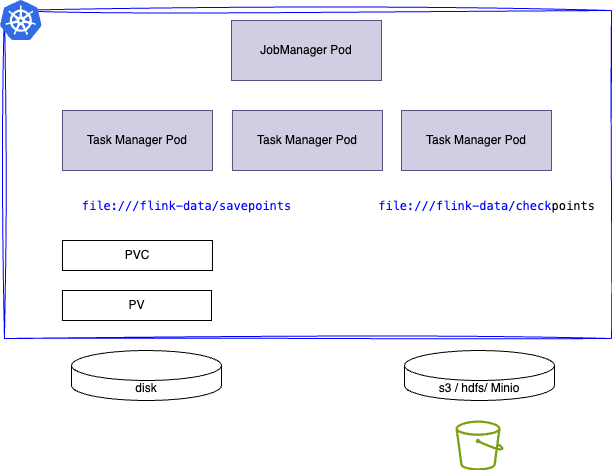

# Flink Kubernetes Deployment

???- info "This chapter updates"
    * Created 10/2024
    * 12/24: move some content to hands-on readme, clean content
    * 01/25: sql processing section
    * 05/25: merge content, simplify, add some details on deployment - fully test k8s deployment on Colima
    * 07/25: Update for Confluent Platform v8
    * 09/29: Update to diagrams and doc structure.
    * 10/12: update to Minio and snapshot / checkpoint configuration
    * 11/16: Reorganize content - integrate new CMF 2.1.0, CP3.1, cmf 2.1.0 - swap to orbstack instead of colima
    * 01/2026: update to cmf 2.2 CCC 2.4
    * 02/2026: Move some content to cookbook


Apache Flink has defined a Kubernetes Operator (FKO) to deploy and manage custom resources for Flink deployments. Confluent Platform Manager for Flink (CMF) is also deployed on Kubernetes with its own operator, leveraging the FKO. Also as part of the Confluent Platform,CMF is integrated with Confluent Kubernetes Operator (CKO).

We assume reader has good [understanding and knowledge of Kubernetes](https://kubernetes.io/docs/tutorials/), and kubectl, and has read the [cookbook considerations chapter](../cookbook/considerations.md) which presents the high level concepts and architeture for deployment.

In this chapter we will address Confluent Platform manager for Flink deployment. 

## Installation

[See docker hub confluentinc account for the last version and tags](https://hub.docker.com/u/confluentinc)

The Components to install for each deployment approach:

=== "Confluent Platform"
    In the context of a Confluent Platform deployment, the components to install are represented in the following figure from bottom to higher layer:

    

=== "Open Source Approach"
    For an equivalent open source the components are:

    

### Prerequisites

Any Kubernetes deployment should include the following pre-requisites:

* [kubectl](https://Kubernetes.io/docs/tasks/tools/) CLI.
* A Kubernetes cluster. For local deployment use [Orbstack](https://orbstack.dev/) with Kubernetes enabled. Start the cluster with `make start_obstack` under `deployment/k8s` folder. 
    * [For production deployment, see the resource sizing for the two operator pods](https://docs.confluent.io/platform/current/flink/installation/helm.html#step-1-confirm-prerequisites).
* Be sure to have helm cli installed: ([see installation instructions](https://helm.sh/docs/intro/install/))
  ```sh
  # for mac
  brew install helm
  # or 
  brew upgrade helm
  # for WSL2 - ubuntu
  sudo apt-get install helm
  ```

* Install [Confluent CLI](https://docs.confluent.io/confluent-cli/current/install.html#install-confluent-cli) or update existing CLI with: 
  ```sh
  confluent update
  ```

* Install Confluent Platform. [See Confluent Platform deployment documentation.](https://docs.confluent.io/operator/current/co-plan.html#cp). The following table is a recap of what is needed to run CP Flink 

| Product | Version | Local command |
| --- | --- | --- |
| Kubernetes | 1.26 - 1.34 | |
| Confluent for kubernetes | 3.1 | under cfk, make deploy |
| CP | 7.3.x - 8.1.x | |
| CP FKO | .130.0 |under k8s/cmf folder,  make install_upgrade_fko |
| CCC | 2.4.0 | under k8s/cfk |
| CMF | 2.2.0 | under k8s/cmf folder,  make deploy_cmf | 

* To use private image repository [see this Confluent kubernetes operator documentation](https://docs.confluent.io/operator/current/co-custom-registry.html#co-custom-registry).


* Helpful commands to work on CRDs once Confluent Platform is deployed:
  ```sh
  kubectl get crds | grep confluent
  kubectl describe crd kafkatopics.platform.confluent.io  
  kubectl describe crd cmfrestclasses.platform.confluent.io      
  ```

### 1- Install External Components

The certificate manager and minio operator may be deployed. There is one make target under `deployment/k8s` to do so:
```sh
make deploy
```

[See the certificate manager current releases](https://github.com/cert-manager/cert-manager/releases), and update the CERT_MGR_VERSION=v1.18.1 in the [Makefile](https://github.com/jbcodeforce/flink-studies/blob/master/deployment/k8s/Makefile)

???- info "what it does"
    * install certification manager
    ```sh
    kubectl create -f https://github.com/jetstack/cert-manager/releases/download/$(CERT_MGR_VERSION)/cert-manager.yaml; 
    ```
    * install minio
    ```sh
    kubectl apply -f ./MinIO/minio-dev.yaml 
    kubectl apply -f./MinIO/minio-credentials-secret.yaml
    ```
    * Verify deployment with
    ```sh
      kubeclt get pods -n cert-manager
      # or
      make verify_cert_manager
      ```

    
#### Using MinIO

MinIO is an object storage solution that provides an Amazon Web Services S3-compatible API and supports all core S3 features, on k8s. It may be used for Flink checkpoint and snapshot persistenace, or when deploying application jar file to Flink, as a file storage.

* First be sure to have [the MinIO CLI](https://min.io/docs/minio/linux/reference/minio-mc.html#quickstart) installed. 
    ```sh
    brew install minio/stable/mc
    # or to upgrade to a new version
    brew upgrade minio/stable/mc
    # Verify installation
    mc --help
    ``` 

    [mc cli command summary](https://min.io/docs/minio/linux/reference/minio-mc.html)

* Deploy Minio operator under `minio-dev` namespace, using `Make
    ```sh
    make deploy_minio
    make verify_minio
    ```

* Access MinIO S3 API and Console
    ```sh
    kubectl port-forward pod/minio 9000 9090 -n minio-dev
    # or
    make port_forward_minio_console
    ```

* Log in to the Console with the credentials `minioadmin | minioadmin`
* Setup a minio client with credential saved to  $HOME/.mc/config.json
    ```sh
    mc alias set dev-minio http://localhost:9000 minioadmin minioadmin
    # make a bucket
    mc mb dev-minio/flink
    ```

#### Using Persistence Volume

Network file system, SAN and any distributed storage can be used to persist Flink checkpoints and savepoints. The storage class needs to be defined.

### 2- Confluent For Kubernetes Installation

[See the Confluent Platform product installation documentation](https://docs.confluent.io/operator/current/overview.html) for details, which is summarized as: 

* The deployment leverages Kubernetes native API to configure, deploy, and manage Kafka cluster, Connect workers, Schema Registry, Confluent Control Center, Confluent REST Proxy and application resources such as topics.
* The following diagram illustrates those components in one namespace.
    <figure markdown="span">
    
    <caption>Confluent Platform Components - k8s deployment</caption>
    </figure>

* [The makefile in deployment/k8s/cfk](https://github.com/jbcodeforce/flink-studies/blob/master/deployment/k8s/cfk/Makefile) support a simple `deploy` target to deploy Operator, Kraft Controller, Kafka Cluster, Control Center, Schema Registry, on a local kubernetes cluster. See [the corresponding readme](https://github.com/jbcodeforce/flink-studies/tree/master/deployment/k8s/cfk/README.md) for explanations. The  `make deploy` does not use security by default. 
  ```sql
  make deploy
  make status
  make undeploy
  ```


* For CP with security deployment the new target is `make deploy-with_security`, and described in the [readme](https://github.com/jbcodeforce/flink-studies/tree/master/deployment/k8s/cfk/README.md).

* Verify the CP components run:

    * Pods are running and healthy: `kubectl get pods -n confluent`
        ```sh
              NAME                                  READY   STATUS      RESTARTS          AGE
        confluent-operator-764dbdf6f9-6f7gx   1/1     Running     158 (5h41m ago)   89d
        controlcenter-ng-0                    3/3     Running     13 (5h41m ago)    32d
        kafka-0                               1/1     Running     4 (5h41m ago)     32d
        kraftcontroller-0                     1/1     Running     4 (5h41m ago)     32d
        schemaregistry-0                      1/1     Running     7 (5h41m ago)     32d
        ```
      * Services are deployed: `kubectl get svcs -n confluent`
    * The console may be accessed via port-forwarding:
        ```sh
        kubectl -n confluent port-forward svc/controlcenter-ng 9021:9021 
        chrome localhost:9021
        # or from deployment/k8s/cfk folder
        make port_forward_cp_console
        ```

        

* See also the [Confluent Platform releases information, for product interopability.](https://docs.confluent.io/platform/current/installation/versions-interoperability.html#cp-af-compat)


### 3- [Confluent Manager for Flink (CMF)](https://docs.confluent.io/operator/current/co-deploy-cp.html#co-deploy-cp)

Updated 1.10.2026: For CFK version 2.2.0 and CP v8.1.1

[See the Makefile under deployment/k8s/cmf](https://github.com/jbcodeforce/flink-studies/tree/master/deployment/k8s/cmf/Makefile) which includes a set of targets to simplify the deployment. [See Confluent Manager for Flink product documentation](https://docs.confluent.io/platform/current/flink/get-started/get-started-application.html#step-1-install-cmf-long) for deeper information. The following steps are a summary of what should be done.


* Install Confluent Manager for Flink operator, under `deployment/k8s/cmf`
  ```sh
  make help
  make deploy
  make status
  ```

???- info "What it does"
    * Install Flink Kubernetes Operator (OSS updated by Confluent)
    ```sh
    helm upgrade --install cp-flink-kubernetes-operator --version $(FKO_VERSION) confluentinc/flink-kubernetes-operator --set watchNamespaces="{$(NS_LIST)}
    ```
    * Define `flink` service account, a cluster role and role binding
    * Define specific role and role bidning
    * Install CMF operator using Helm
    ```sh
	  helm upgrade --install cmf --version $(CMF_VERSION)  confluentinc/confluent-manager-for-apache-flink --namespace $(FLCK_NS)  --values cmf_values.yaml 
    ```
    * Install the REST Class for CMF
    ```sh
    kubectl apply -f cmf-rest-class.yaml
    ```

Next to deploy an application see [deploy application section for SQL or Java app deployment](#5--next-deploy-flink-applications-or-flink-sql-statements)

### Security

Confluent Platform Flink security principals are summarized [in this section](../techno/cp-flink.md/#authentication-and-authorization).

### 4- Create an [Environment for Flink](https://docs.confluent.io/platform/current/flink/configure/environments.html)

Flink environment is used as the scope to control access, and to group Flink applications

Normally running `make deploy` under `cmf folder` will create a dev environment. The creation of an environment can be done via the confluent cli

```sh
confluent flink environment create $(ENV_NAME) --url $(CONFLUENT_CMF_URL) --kubernetes-namespace $(FLCK_NS) 
```

From the Console Center UI, create new environment

<figure markdown="span">

</figure>

which creates this:

<figure markdown="span">

</figure>

Or via REST API - do a port forward on port 8084

```sh
# under deployment/k8s/cmf
make port_forward_cmf
# which is doing
kubectl port-forward svc/cmf-service 8084:8080 -n $(FLCK_NS)
# Use an environment definition as json
curl -v -H "Content-Type: application/json" -X POST http://localhost:8084/cmf/api/v1/environments -d @staging_env.json
```

Now we have two environments

<figure markdown="span">

</figure>

### 5- Next Deploy Flink Applications or Flink SQL Statements

* [Deploy a DataStream / TableAPI app]()
* [Deploy a Flink SQL statement]() with [catalog]()

### Documentations

* [Confluent Platform for Flink has another operator](https://docs.confluent.io/platform/current/flink/get-started-cpf.html) integrated with FKO. [See my CP Flink summary](../techno/cp-flink.md).
* [Confluent Flink operator documentation](https://docs.confluent.io/operator/current/co-prepare.html)
* [Getting started with Flink OSS Standalone Kubernetes Setup.](https://nightlies.apache.org/flink/flink-docs-release-1.20/docs/deployment/resource-providers/standalone/Kubernetes/)
* [Apache Flink Native Kubernetes deployment.](https://nightlies.apache.org/flink/flink-docs-release-1.20/docs/deployment/resource-providers/native_Kubernetes/)
* [A Confluent Platform demonstration git repo: confluentinc/confluent-demo](https://github.com/confluentinc/confluent-demo)
* []()

## Apache Flink OSS 

As seen in previous section, Apache Flink has implemented a [Kubernetes Operator](https://nightlies.apache.org/flink/flink-kubernetes-operator-docs-main/) with the [stable versions](https://nightlies.apache.org/flink/flink-kubernetes-operator-docs-stable/)

* The prerequisites includes getting Certificat Manager deployed. (Optional with Minio).
* Get the [list of Apache Flink releases and tags here](https://downloads.apache.org/flink/) 
* Add the Apache Flink **Helm** repositories: 
    ```sh
    helm repo add flink-operator-repo https://downloads.apache.org/flink/flink-Kubernetes-operator-1.13.0
    # Verify help repo entries exist
    helm repo list
    # Be sure to change the repo as the URL may not be valid anymore
    helm repo remove  flink-operator-repo
    # try to update repo content
    helm repo update
    ```

* This repository includes a Makefile to simplify deployment, of Apache Flink, (local orbstack or colima) see [the deployment/k8s/flink-oss folder](https://github.com/jbcodeforce/flink-studies/blob/master/deployment/k8s/fink-oss/README.md). 
  ```sh
  make prepare
  make verify_flink
  make deploy_basic_flink_deployment  
  ```
* Smoke Test with one of the pre-packaged app:
  ```sh
  kubectl create -f https://raw.githubusercontent.com/apache/flink-kubernetes-operator/release-1.13/examples/basic.yaml
  kubectl logs -f deploy/basic-example
  # Access WebUI
  kubectl port-forward svc/basic-example-rest 8081
  ```
* [Access Flink UI](http://localhost:8081)
* Stop the job
  ```sh
  kubectl delete flinkdeployment/basic-example
  ```

## Streaming Processing Deployment

There two types of Flink application to consider for deployment: the java packaged application or the SQL Statements. The deployment of java packaging is the same between OpenSource and Confluent Platform Flink. So any existing DataStream application will run the same way. There is only yaml manifest to deploy application that will take into account environment, as applications are grouped within environment.

### Deploy DataStream / Table API Applications

For java application, once the jar is built, we need to define a manifest to deploy the application. See [Apache Flink Kubernetes Operator - FlinkDeployment documentation](https://nightlies.apache.org/flink/flink-kubernetes-operator-docs-main/docs/custom-resource/overview/).

* An example of [manifest is the smoke test](https://github.com/jbcodeforce/flink-studies/blob/master/deployment/k8s/flink-oss/basic_flink_deployment.yaml) for Apache Flink

* [An example of a DataStream deployment on CP Flink](https://github.com/jbcodeforce/flink-studies/blob/master/deployment/k8s/flink-app-smoke-test/flinkapplication.json)

### Flink SQL Statement

#### Apache Flink Open Source

There are multiple choices to run Flink SQL: using the SQL client, or package the SQL scripts in a docker container with the [java SQL runner](https://github.com/jbcodeforce/flink-studies/tree/master/code/flink-java/sql-runner) executing the SQL statements from a file, or use the Table API. The application deployment is Java based even if SQL scripts are used for stream processing.

With Apache Flink OSS, Flink Session Cluster is the most suitable deployment mode for the SQL Client. This is a long-running Flink cluster (JobManager and TaskManagers) on which you can submit multiple jobs to. The sql client is a long-running, interactive application that submits jobs to an existing cluster.

TBC

#### Confluent Flink SQL Statement

A catalog is a top-level resource and references a Schema Registry instance. A database is a sub-resource of a catalog, references a Kafka cluster and exposes all topics of its Kafka cluster as queryable tables. 

* Be sure that the port-forward to the svc/cmf-service is active.
* [Define an environment if not done yet](#4--create-an-environment-for-flink)
* Define the **Catalog**:  A `KafkaCatalog` exposes Kafka topics as tables and derives their schema from Schema Registry. Define a Flink Catalog as json file: (see [cmf/dev_catalog.json](https://github.com/jbcodeforce/flink-studies/blob/master/deployment/k8s/cmf/dev_catalog.json)). The catalog is configured with connection properties to the Schema Registry clients.
  ```sh
  # under deployment/k8s/cmf
  make create_kafka_catalog
  # OR using curl
  curl -v -H "Content-Type: application/json" -X POST http://localhost:8084/cmf/api/v1/catalogs/kafka -d@./dev_catalog.json
  ```

<figure markdown="span">

</figure>

* Define **Database** which maps to a Kafka Cluster and is created within a catalog: [see product documentation for example](https://docs.confluent.io/platform/current/flink/configure/catalog.html#create-a-database)
  ```sh
  curl -v -H "Content-Type: application/json" -X POST http://localhost:8084/cmf/api/v1/catalogs/kafka/dev-catalog/databases -d@./dev_database.json
  ```
<figure markdown="span">

</figure>


> The creation of the catalog and database may be done one time. The Data engineers will deploy multiple statements to work on tables within the database.
* To be able to run ay SQL queries we need to define one to many compute pools. [Product Doc](https://docs.confluent.io/platform/current/flink/configure/compute-pools.html#create-a-compute-pool)
  ```sh
  curl -v -H "Content-Type: application/json"  -X POST http://localhost:8084/cmf/api/v1/environments/dev-env/compute-pools  -d @./compute_pool.json
  ```

* Deploy one to many Flink SQL Statement. The C3 version 2.4 includes the Worspace user interface. Each statement is associated with exactly one compute pool.

---

#### Confluent Manager for Flink

As seen previously in **Confluent Manager for Flink** the method is to create an **Environment** and **Compute pool** to run the SQL statements in a pool. Those concepts and components are the same as the Confluent Cloud for Flink.

* Define a compute pool (verify current [docker image tag](https://hub.docker.com/r/confluentinc/cp-flink-sql/tags)) and see the [compute_pool.json](https://github.com/jbcodeforce/flink-studies/blob/master/deployment/k8s/cmf/compute_pool.json)
  ```sh
  make create_compute_pool
  ```

* Flink SQL uses the concept of Catalogs to connect to external storage systems. CMF features built-in KafkaCatalogs to connect to Kafka and Schema Registry. 

* Define secret to access Kafka Cluster [See this secret](https://github.com/jbcodeforce/flink-studies/blob/master/deployment/k8s/cmf/kafka_secret.json) and [the mapping](https://github.com/jbcodeforce/flink-studies/blob/master/deployment/k8s/cmf/env_secret_mapping.json)
  ```sh
  make create_kafka_secret
  make create_env_secret_mapping
  ```

* Use the confluent cli to start a Flink  SQL shell
  ```sh
  confluent --environment dev --compute-pool pool1 flink shell --url http://localhost:8084
  ```


#### Apache Flink (OSS) - Flink SQL

You can run the SQL Client in a couple of ways:

* As a separate Docker container: The Flink Docker images include the SQL Client. You can run a container and connect to the JobManager. You will need to mount a volume to persist SQL scripts and other data.
  ```sh
  kubectl exec -it <sql-client-pod-name> -- /opt/flink/bin/sql-client.sh
  ```

  When running the SQL Client as a pod within the same Kubernetes cluster, you can use the internal DNS name of the JobManager service to connect. The format is typically <service-name>.<namespace>.svc.cluster.local

* Locally: Download the Flink distribution, extract it, and run the SQL Client from your local machine.
  ```sh
  # port forwarding
  kubectl port-forward svc/<jobmanager-service-name> 8081:8081

  ./bin/sql-client.sh -s <jobmanager-service-name>:8081
  ```


#### Confluent Flink

* [See manage Flink app using Confluent for Flink](https://docs.confluent.io/operator/current/co-manage-flink.html)

## Fault tolerance

For Flink job or application that are stateful and for fault tolerance, it is important to enable checkpointing and savepointing:

```yaml
job:
  jarURI: local:///opt/flink/examples/streaming/StateMachineExample.jar

  parallelism: 2
  upgradeMode: savepoint
  #savepointTriggerNonce: 0
  # initialSavepointPath: file:///
```

The other upgradeMode is ``

???- question "How to validate checkpointing?"
    Checkpointing let Flink to periodically save the state of a job into local storage. 
    Look at the pod name of the task manager and stop it with `kubectl delete pod/....`
    Flink should automatically restart the job and recover from the latest checkpoint. Use the Flink UI or CLI to see the job status.

???- question "How to validate savepointing?"
    Savepoints are manually triggered snapshots of the job state, which can be used to upgrade a job or to perform manual recovery.
    To trigger a savepoint we need to set a value into `savepointTriggerNonce` in the FlinkDeployment descriptor and then apply the changes. 
    Get the location of the save point and then add to the yaml `initialSavepointPath` to redeploy the applicationL: it will reload its state from the savepoint. There is a custom resource definition ([FlinkStateSnapshotSpec](https://nightlies.apache.org/flink/flink-Kubernetes-operator-docs-main/docs/custom-resource/reference/#flinkstatesnapshotspec)) to trigger savepoints. 

`flinkConfiguration` is a hash map used to define the Flink configuration, such as the task slot, HA and checkpointing parameters.

```yaml
  flinkConfiguration:
    high-availability.type: org.apache.flink.Kubernetes.highavailability.KubernetesHaServicesFactory
    high-availability.storageDir: 'file:///opt/flink/volume/flink-ha'
    restart-strategy: failure-rate
    restart-strategy.failure-rate.max-failures-per-interval: '10'
    restart-strategy.failure-rate.failure-rate-interval: '10 min'
    restart-strategy.failure-rate.delay: '30 s'
    execution.checkpointing.interval: '5000'
    execution.checkpointing.unaligned: 'false'
    state.backend.type: rocksdb
    state.backend.incremental: 'true'
    state.backend.rocksdb.use-bloom-filter: 'true'
    state.checkpoints.dir: 'file:///opt/flink/volume/flink-cp'
    state.checkpoints.num-retained: '3'
    state.savepoints.dir: 'file:///opt/flink/volume/flink-sp'
    taskmanager.numberOfTaskSlots: '10'
    table.exec.source.idle-timeout: '30 s'
```


The application jar needs to be in a custom Flink docker image built using the [Dockerfile as in e-com-sale-demo](https://github.com/jbcodeforce/flink-studies/blob/master/e2e-demos/e-com-sale/flink-app/Dockerfile), or uploaded to a MinIO bucket. 

The following Dockerfile is used for deploying a solution in **application mode**, which packages the Java Flink jars with the app, and any connector jars needed for the integration and starts the `main()` function.

```dockerfile
FROM confluentinc/cp-flink:1.19.1-cp2
RUN mkdir -p $FLINK_HOME/usrlib
COPY /path/of/my-flink-job-*.jar $FLINK_HOME/usrlib/my-flink-job.jar
```

* With Confluent Platform for Flink:

    ```sh
      # First be sure the service is expose
      kubectl port-forward svc/cmf-service 8080:80 -n flink
      # Deploy the app given its deployment
      confluent flink application create k8s/cmf_app_deployment.yaml  --environment $(ENV_NAME) --url http://localhost:8080 
    ```

???- info "Access to user interface"
    To forward your jobmanager’s web ui port to local 8081.

    ```sh
    kubectl port-forward ${flink-jobmanager-pod} 8081:8081 
    # Or using confluent cli CP for Flink command:
    confluent flink application web-ui-forward $(APP_NAME) --environment $(ENV_NAME) --port 8081 --url http://localhost:8080
    ```

    And navigate to [http://localhost:8081](http://localhost:8081).

### Using MinIO for app deployment

* Upload an application to minio bucket:

    ```sh
    mc cp ./target/flink-app-0.1.0.jar dev-minio/flink/flink-app-0.1.0.jar
    mc ls dev-minio/flink
    ```

* Start the application using confluent cli:

    ```sh
    confluent flink application create --environment env1 --url http://localhost:8080 app-deployment.json
    ```

* Open Flink UI:

    ```sh
    confluent flink application web-ui-forward --environment env1 flink-app --url http://localhost:8080
    ```

* Produce messages to kafka topic

    ```sh
    echo 'message1' | kubectl exec -i -n confluent kafka-0 -- /bin/kafka-console-producer --bootstrap-server kafka.confluent.svc.cluster.local:9092 --topic in
    ```

* Cleanup
    ```sh
    # the Flink app
    confluent flink application delete kafka-reader-writer-example --environment development --url http://localhost:8080
    # the Kafka cluster
    # the operators
    ```

---

To REWORK  --- To REWORK  --- To REWORK --- To REWORK  --- To REWORK

### HA configuration

Within Kubernetes, we can enable Flink HA in the ConfigMap of the cluster configuration that will be shared with deployments:

```yaml
  flinkConfiguration:
    taskmanager.numberOfTaskSlots: "2"
    state.backend: rockdb
    state.savepoints.dir: file:///flink-data/savepoints
    state.checkpoints.dir: file:///flink-data/checkpoints
    high-availability.type: Kubernetes
    high-availability.storageDir: file:///flink-data/ha
    job.autoscaler.enabled: true
```

This configuration settings is supported via FKO. 
[See product documentation](https://nightlies.apache.org/flink/flink-Kubernetes-operator-docs-main/docs/operations/configuration/), and the [autoscaler section](https://nightlies.apache.org/flink/flink-Kubernetes-operator-docs-main/docs/operations/configuration/#autoscaler-configuration) for deeper parameter explanations. The Flink autoscaler monitors the number of unprocessed records in the input (pending records), and will allocate more resources to absorb the lag. It adjusts parallelism at the flink operator level within the DAG. 

JobManager metadata is persisted in the file system specified by `high-availability.storageDir` . This `storageDir` stores all metadata needed to recover a JobManager failure.

JobManager Pods, that crashed, are restarted automatically by the Kubernetes scheduler, and as Flink persists metadata and the job artifacts, it is important to mount pv to the expected paths.

```yaml
podTemplate:
  spec:
    containers:
      - name: flink-main-container
        volumeMounts:
        - mountPath: /flink-data
          name: flink-volume
    volumes:
    - name: flink-volume
      hostPath:
        # directory location on host
        path: /tmp/flink
        # this field is optional
        type: Directory
```

Recall that `podTemplate` is a base declaration common for job and task manager pods. Can be overridden by the jobManager and taskManager pod template sub-elements (spec.taskManager.podTemplate). The previous declaration will work for local k8s with hostPath access, for Kubernetes cluster with separate storage class then the volume declaration is:

```yaml
volumes:
  - name: flink-volume
    persistenceVolumeClaim:
      claimName: flink-pvc
```

podTemplate can include nodeAffinity to allocate taskManager to different node characteristics:

```yaml
  podTemplate:
      spec:
        affinity:
          nodeAffinity:
            requiredDuringSchedulingIgnoredDuringExecution:
              nodeSelectorTerms:
                - matchExpressions:
                    - key: cfk-cr
                      operator: In
                      values:
                        - flink
        tolerations:
          - key: cfk-cr
            operator: Equal
            value: flink
            effect: NoSchedule
```

---

TO UPDATE 

### Durable Storage

Durable storage is used to store consistent checkpoints of the Flink state. Review [the state management](../concepts/index.md#state-management) section in the concept chapter. The checkpoints are saved to object storage [compatible with S3](https://docs.confluent.io/platform/current/flink/how-to-guides/checkpoint-s3.html), or HDFS protocol. The FlinkConfiguration can be set at the Application, ComputePool or Environment level.

Two important elements to configure: 
1. the environment variable ENABLE_BUILT_IN_PLUGINS
1. The `state.checkpoints.dir` to the location of S3 bucket.

The following is a configuration using minio and the presto S3FileSystem which is a specific implementation (created by Presto) of the file system interface within Apache Flink. (See the [S3FileSystemFactory class](https://nightlies.apache.org/flink/flink-docs-master/api/java/org/apache/flink/fs/s3presto/S3FileSystemFactory.html)). 

```json
"flinkConfiguration": {
        "pipeline.operator-chaining.enabled": "false",
        "execution.checkpointing.interval": "10s",
        "taskmanager.numberOfTaskSlots": "4",
        "fs.s3.impl": "org.apache.flink.fs.s3presto.S3FileSystem",
        "presto.s3.endpoint": "http://minio.minio-dev.svc.cluster.local:9000",
        "presto.s3.path.style.access": "true",
        "presto.s3.connection.ssl.enabled": "false",
        "presto.s3.access-key": "admin",
        "presto.s3.secret-key": "admin123",
        "state.checkpoints.dir": "s3://flink/stateful-flink/checkpoints",
        "state.savepoints.dir": "s3://flink/stateful-flink/savepoints",
        "state.checkpoints.interval": "10000",
        "state.checkpoints.timeout": "600000"
  
      },
```

For Minio settings:

```yaml
  s3.endpoint: http://minio.minio-dev.svc.cluster.local:9000
  s3.path.style.access: "true"
  s3.connection.ssl.enabled: "false"
  s3.access-key: minioadmin
  s3.secret-key: minioadmin
  state.checkpoints.dir: s3://flink/stateful-flink/checkpoints
  state.savepoints.dir: s3://flink/stateful-flink/savepoints
  state.checkpoints.interval: "10000"
  state.checkpoints.timeout: "600000"
```

TO BE CONTINUED

A RWX, shared PersistentVolumeClaim (PVC) for the Flink JobManagers and TaskManagers provides persistence for stateful checkpoint and savepoint of Flink jobs. 

<figure markdown=span>

</figure>

A flow is a packaged as a jar, so developers need to define a docker image with the Flink API and any connector jars. Example of [Dockerfile](https://github.com/jbcodeforce/flink-studies/blob/master/e2e-demos/e-com-sale/flink-app/Dockerfile) and [FlinkApplication manifest](https://github.com/jbcodeforce/flink-studies/blob/master/e2e-demos/e-com-sale/k8s/cmf_app_deployment.yaml).

Also one solution includes using MinIO to persist application jars.


## Flink Config Update

* If a write operation fails when the pod creates a folder or updates the Flink config, verify the following:

    * Assess PVC and R/W access. Verify PVC configuration. Some storage classes or persistent volume types may have restrictions on directory creation
    * Verify security context for the pod. Modify the pod's security context to allow necessary permissions.
    * The podTemplate can be configured at the same level as the task and job managers so any mounted volumes will be available to those pods. See [basic-reactive.yaml](https://github.com/apache/flink-Kubernetes-operator/blob/main/examples/basic-reactive.yaml) from Flink Operator examples.

[See PVC and PV declarations](https://github.com/jbcodeforce/flink-studies/blob/master/deployment/k8s/pvc.yaml)

## Flink Session Cluster

For Session cluster, there is no jobSpec. See [this deployment definition](https://github.com/jbcodeforce/flink-studies/blob/master/deployment/k8s/basic-job-task-mgrs.yaml). Once a cluster is defined, it has a name and can be referenced to submit SessionJobs.

A SessionJob is executed as a long-running Kubernetes Deployment. We may run multiple Flink jobs on a Session cluster. Each job needs to be submitted to the cluster after the cluster has been deployed.
To deploy a job, we need at least three components:

* a Deployment which runs a JobManager
* a Deployment for a pool of TaskManagers
* a Service exposing the JobManager’s REST and UI ports


For a deployment select the execution mode: `application, or session`. For production it is recommended to deploy in `application` mode for better isolation, and using a cloud native approach. We can just build a dockerfile for our application using the Flink jars.

### Session Deployment

Flink has a [set of examples](https://github.com/apache/flink/blob/master/flink-examples/) like the [Car top speed computation with simulated record](https://github.com/apache/flink/blob/master/flink-examples/flink-examples-streaming/src/main/java/org/apache/flink/streaming/examples/windowing/TopSpeedWindowing.java). As this code is packaged in a jar available in maven repository, we can declare a job session.

Deploy a config map to define the `log4j-console.properties` and other parameters for Flink (`flink-conf.yaml`)

The diagram below illustrates the standard deployment of a job on k8s with session mode:

 
 
 *src: apache Flink site*
 

```yaml
apiVersion: flink.apache.org/v1beta1
kind: FlinkSessionJob
metadata:
  name: car-top-speed-job
spec:
  deploymentName: flink-session-cluster
  job:
    jarURI: https://repo1.maven.org/maven2/org/apache/flink/flink-examples-streaming_2.12/1.17.2/flink-examples-streaming_2.12-1.17.2-TopSpeedWindowing.jar
    parallelism: 4
    upgradeMode: stateless
```

Before deploying this job, be sure to deploy a session cluster using the following command:

```sh
# under deployment/k8s
kubectl apply -f basic-job-task-mgrs.yaml 
```

Once the job is deployed we can see the pod and then using the user interface the job continuously running:

* Example of deploying Java based [SQL Runner](https://github.com/apache/flink-Kubernetes-operator/blob/main/examples/flink-sql-runner-example/README.md) to interpret a Flink SQL script: package it as docker images, and deploy it with a Session Job. There is a equivalent for Python using [Pyflink](https://nightlies.apache.org/flink/flink-docs-release-1.18/docs/dev/python/overview/).

    * [See the ported code for Java](https://github.com/jbcodeforce/flink-studies/tree/master/flink-sql-demos/sql-runner)
    * And for the [Python implementation](https://github.com/jbcodeforce/flink-studies/tree/master/flink-sql-demos/flink-python-sql-runner)


### Flink State Snapshot

To help managing snapshots, there is another CR called [FlinkStateSnapshot](https://nightlies.apache.org/flink/flink-Kubernetes-operator-docs-main/docs/custom-resource/reference/#flinkstatesnapshotspec)


## Practices

* It is not recommended to host a Flink Cluster across multiple Kubernetes clusters. Flink node exchanges data between task managers and so better to run in same region, and within same k8s. 