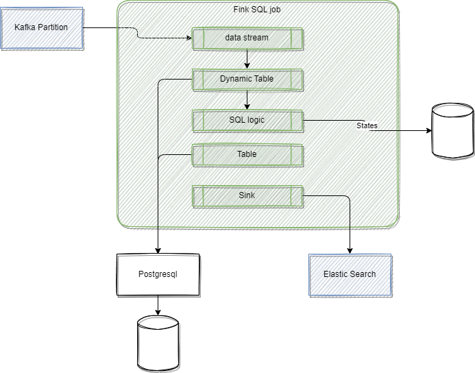

# Table API

???- info "Update"
    Created 10/2024 - Updated 11/03/24. Reorganize in improve documentation 10/2025

## Concepts

The [TableAPI](https://nightlies.apache.org/flink/flink-docs-master/docs/dev/table/overview/) serves as the lower-level API for executing Flink SQL, allowing for stream processing implementations in Java and Python. The Table API encapsulates a stream or a physical table, enabling developers to implement streaming processing by programming against these tables.

[See the main concepts](https://nightlies.apache.org/flink/flink-docs-master/docs/dev/table/common/) and APIs. The structure of a program looks mostly the same:

1. Create a TableEnvironment for batch or streaming execution
    ```java
    import org.apache.flink.table.api.EnvironmentSettings;
    import org.apache.flink.table.api.TableEnvironment;

    EnvironmentSettings settings = EnvironmentSettings
        .newInstance()
        .inStreamingMode()
        //.inBatchMode()
        .build();

    TableEnvironment tEnv = TableEnvironment.create(settings);
    ```
1. Create one or more source table(s)
1. Create one or more sink Tables(s) or use the print sink
1. Create processing logic using SQL string or Table API functions

Summary of important concepts:

* The main function is a Flink client, that will compiles the code into a dataflow graph and submots to the JobManager.
* A TableEnvironment maintains a map of catalogs of tables 
* Tables can be either virtual (VIEWS) or regular TABLES which describe external data.
* Tables may be temporary (tied to the lifecycle of a single Flink session), or permanent ( visible across multiple Flink sessions and clusters).
* Temportary table may shadow a permanent table.
* Tables are always registered with a 3-part identifier consisting of catalog, database, and table name.
* TableSink is a [generic interface to to write](https://nightlies.apache.org/flink/flink-docs-master/docs/dev/table/common/#emit-a-table) results to. A batch Table can only be written to a `BatchTableSink`, while a streaming Table requires either an `AppendStreamTableSink`, a `RetractStreamTableSink`, or an `UpsertStreamTableSink`.
* A pipeline can be explained with `TablePipeline.explain()` and executed invoking `TablePipeline.execute()`.
* Recall that High-Availability in Application Mode is only supported for single-execute() applications.

It is important to note that Table API and SQL queries can be easily integrated with and embedded into DataStream programs.


### Packaging

### Confluent Specifics

In Confluent Manager for Flink deployment, only Flink Application mode is supported. A **Flink Application** is any user's program that spawns one or multiple Flink jobs from its `main()` method. The execution of these jobs can happen in a local JVM (LocalEnvironment) or on a remote setup of clusters with multiple machines ([kubernetes](./k8s-deploy.md)).

In the context of **Confluent Cloud**, the Table API program acts as a client-side library for interacting with the Flink engine hosted in the cloud. It enables the submission of  `Statements` and retrieval of `StatementResults`. The provided Confluent plugin integrates specific components for configuring the TableEnvironment, eliminating the need for a local Flink cluster. By including the `confluent-flink-table-api-java-plugin` dependency, Flink's internal components—such as CatalogStore, Catalog, Planner, Executor, and configuration, are managed by the plugin and fully integrated with Confluent Cloud.

## Getting Started

The development approach includes at least the following steps:

1. Create a maven project and add the flink table api, and Kafka client dependencies (see an example of [pom.xml](https://github.com/jbcodeforce/flink-studies/tree/master/e2e-demos/e-com-sale/flink-app/pom.xml)) as it is important to do not repackage existing product jars, so use `provided` dependencies. For ^^Confluent Cloud for Flink deployment^^ see the [pom.xml in flink-java/table-api](https://github.com/jbcodeforce/flink-studies/tree/master/code/table-api/pom.xml) folder.
1. Implement and unit test the flow. See best practices for [code structure](#code-structure).
1. Depending of the target Flink runtime, there will be different steps: 

    For **Confluent Platform for Flink**:

    1. Define a FlinkApplication CR
    1. Package the jar, and build a docker image using Confluent Platform for Flink base image with a copy of the app jar. (See example of [Dockerfile](https://github.com/jbcodeforce/flink-studies/tree/master/e2e-demos/e-com-sale/flink-app/Dockerfile))
    1. Deploy to Kubernetes using the Flink kubernetes operator
    1. Monitor with the web ui.

    For **Confluent Cloud for Flink**:

    1. Add the  `io.confluent.flink.confluent-flink-table-api-java-plugin` into the maven dependencies and use the following Environment settings: 

        ```java title="Confluent Cloud access via environment variables"
        import io.confluent.flink.plugin.ConfluentSettings;
        import org.apache.flink.table.api.EnvironmentSettings;
        EnvironmentSettings settings = ConfluentSettings.fromGlobalVariables();
        TableEnvironment env = TableEnvironment.create(settings);
        ```

        ```java title="Confluent Cloud access via properties file"
        import io.confluent.flink.plugin.ConfluentSettings;
        import org.apache.flink.table.api.EnvironmentSettings;
        EnvironmentSettings settings = ConfluentSettings.fromResource("/cloud.properties");
        TableEnvironment env = TableEnvironment.create(settings);
        ```

        When using private endpoint, there is a need to be at the 1.20.50 version of the plugin (`confluent_flink_table_api_python_plugin=">=1.20.50" `) and use code (python example) like:

        ```python
        settings = ConfluentSettings.new_builder_from_file(CLOUD_PROPERTIES_PATH) 
        .set_context_name("my-context") 
        .set_rest_endpoint("private.confluent.cloud") 
        .build()
        ```

    1. Set environment variables to specify API key and secrets, Confluent Cloud environment, compute pool... 

        ```sh title="Confluent Cloud related  environment variables "
        export CLOUD_PROVIDER="aws"
        export CLOUD_REGION="us-west-2"
        export FLINK_API_KEY="<your-flink-api-key>"
        export FLINK_API_SECRET="<your-flink-api-secret>"
        export ORG_ID="<your-organization-id>"
        export ENV_ID="<your-environment-id>"
        export COMPUTE_POOL_ID="<your-compute-pool-id>"
        ```

    1. Execute the java program


See [the Confluent Flink cookbook](https://github.com/confluentinc/flink-cookbook) for more Table API and DataStream examples.


### Java

Any main function needs to connect to the Flink environment. Confluent API offers a way to read cloud client properties so the running Flink application can access the Job and Task managers running in the Confluent Cloud compute pools as a service (see code example above).

A [table environment](https://nightlies.apache.org/flink/flink-docs-stable/api/java/org/apache/flink/table/api/TableEnvironment.html) is the base class, entry point, and central context for creating Table and SQL API programs. 

TableEnvironment uses an `EnvironmentSettings` that define the execution mode. The following is a template code to run Table API program submitted to a Job Manager deployed locally or on Kubernetes (OSS Flink or CP for Flink):

```java  title="Deployment for Kubernetes or local"
settings= EnvironmentSettings.newInstance()
   .inStreamingMode()
   .withBuiltInCatalogName("default_catalog")
   .withBuiltInDatabaseName("default_database")
   .build();

TableEnvironment tableEnv = TableEnvironment.create(settings);
        tableEnv.get_config().set("parallelism.default", "4");

```

Once packaged with maven as a uber-jar the application may be executed locally to send the dataflow to the Confluent Cloud for Flink JobManager or can be deployed as a `FlinkApplication` within a k8s cluster. 

#### Confluent Cloud for Flink execution

When using remote Confluent Cloud for Flink, it is possible to directly execute the java jar and it will send the DAG to the remote job manager:

```sh
# set all environment variable or use /cloud.properties in resource folder
java -jar target/flink-app-ecom-0.1.0.jar 
```

See [code sample: Main_00_JoinOrderCustomer.java](https://github.com/jbcodeforce/flink-studies/blob/master/code/table-api/java-table-api/src/main/java/flink/examples/table/Main_00_JoinOrderCustomer.java)

Get the catalog and databases, and use the environment to get the list of tables. In Confluent Cloud, there is a predefined catalog with some table samples: `examples.marketplace`.

```java
# using a sql string
env.executeSql("SHOW TABLES IN `examples`.`marketplace`").print();
# or using the api
env.useCatalog("examples");
env.useDatabase("marketplace");
Arrays.stream(env.listTables()).forEach(System.out::println);
# work on one table
env.from("`customers`").printSchema();
```

### Python

## Code Samples

The important classes are:

* [TableEnvironment](https://nightlies.apache.org/flink/flink-docs-release-1.20/api/java/org/apache/flink/table/api/TableEnvironment.html)
* [Table](https://nightlies.apache.org/flink/flink-docs-release-1.20/api/java/org/apache/flink/table/api/Table.html)
* [Row](https://nightlies.apache.org/flink/flink-docs-release-1.20/api/java/org/apache/flink/types/Row.html)
* [Expressions](https://nightlies.apache.org/flink/flink-docs-release-1.20/api/java/org/apache/flink/table/api/Expressions.html) contains static methods for referencing table columns, creating literals, and building more complex Expression chains. See below.

### Code structure

Clearly separate the creation of source, and workflow in different methods and outside of the main.

### Create some test data

Use one of the TableEnvironment fromValues() methods, below is an example on a collection.

```java
 env.fromValues("Paul", "Jerome", "Peter", "Robert")
                .as("name")
                .filter($("name").like("%e%"))
                .execute()
                .print();
```

```java
import org.apache.flink.table.api.DataTypes;
Table customers = env.fromValues(
                        DataTypes.ROW(
                                DataTypes.FIELD("customer_id", DataTypes.INT()),
                                DataTypes.FIELD("name", DataTypes.STRING()),
                                DataTypes.FIELD("email", DataTypes.STRING())),
                        row(3160, "Bob", "bob@corp.com"),
                        row(3107, "Alice", "alice.smith@example.org"),
                        row(3248, "Robert", "robert@someinc.com"));
```

### Joining two tables

See the example in [00_join_order_customer.java](https://github.com/jbcodeforce/flink-studies/tree/master/flink-java/table-api-java/src/main/java/flink/examples/table/00_join_order_customer.java). The statements may run forever. 

### A deduplication example

The deduplication of record over a time window is a classical pattern. See this SQL query with the following Table API implementation

```java
Table source;
```


### Confluent tools for printing and stop statement

[See this git repository](https://github.com/confluentinc/flink-table-api-java-examples/blob/master/README.md#documentation-for-confluent-utilities)

--- 

### Define data flows

A TablePipeline describes a flow of data from source(s) to sink. We can also use 


The pipeline flow can use different services, defined in separate Java classes. Those classes may be reusable. The environment needs to be passed to each service, as this is the environment which includes all the Table API functions.

Some code is in [this folder](https://github.com/jbcodeforce/flink-studies/tree/master/flink-java/table-api).


## How to

???- question "Create a data generator"
    There is the [FlinkFaker tool](https://github.com/knaufk/flink-faker) that seems to be very efficient to send different types of data. It is using [Datafaker](https://www.datafaker.net/documentation/getting-started/) Java library, which can be extended to add our own data provider. FlinkFaker jar is added to the custom flink image in the Dockerfile. The challenges will be to remote connect to the compute-pool as defined in Confluent Cloud.

???- question "Connect to Confluent Cloud remotely"
    Define the cloud.properties and then use the Confluent API

    ```java
        import io.confluent.flink.plugin.ConfluentSettings;
        import org.apache.flink.table.api.EnvironmentSettings;
        import org.apache.flink.table.api.TableEnvironment;

        public static void main(String[] args) {
            EnvironmentSettings settings = ConfluentSettings.fromResource("/cloud.properties");
            TableEnvironment env = TableEnvironment.create(settings);
    ```

???- question "Create a table with Kafka topic as persistence in Confluent Cloud?"
    ```java
    import io.confluent.flink.plugin.ConfluentSettings;
    import io.confluent.flink.plugin.ConfluentTableDescriptor;
    //...
    env.createTable(
            TARGET_TABLE1,
            ConfluentTableDescriptor.forManaged()
                .schema(
                        Schema.newBuilder()
                                .column("user_id", DataTypes.STRING())
                                .column("name", DataTypes.STRING())
                                .column("email", DataTypes.STRING())
                                .build())
                .distributedBy(4, "user_id")
                .option("kafka.retention.time", "0")
                .option("key.format", "json-registry")
                .option("value.format", "json-registry")
                .build());
    ```

???- question "Access to the schema of an existing topic / table?"
    ```java
    import org.apache.flink.table.api.DataTypes;
    //...
    DataType productsRow = env.from("examples.marketplace.products")
                    .getResolvedSchema()
                    .toPhysicalRowDataType();
    List<String> columnNames = DataType.getFieldNames(productsRow);
    List<DataType> columnTypes = DataType.getFieldDataTypes(productsRow);
    // use in the schema function to create a new topic ...
            Schema.newBuilder()
                    .fromFields(columnNames, columnTypes)
                    .column("additionalColumn", DataTypes.STRING())
                    .build()
    ```

???- question "How to split records to two topic, using StatementSet?"
    ```java
    StatementSet statementSet = env.createStatementSet()
                        .add(
                            env.from("`examples`.`marketplace`.`orders`")
                               .select($("product_id"), $("price"))
                               .insertInto("PricePerProduct"))
                        .add(
                            env.from("`examples`.`marketplace`.`orders`")
                               .select($("customer_id"), $("price"))
                               .insertInto("PricePerCustomer"));
    ```

## Deeper dive

* [See this git repo: Learn-apache-flink-table-api-for-java-exercises](https://github.com/confluentinc/learn-apache-flink-table-api-for-java-exercises). 
* See the [Table API in Java documentation](https://docs.confluent.io/cloud/current/flink/reference/table-api.html).
* [Connecting the Apache Flink Table API to Confluent Cloud](https://developer.confluent.io/courses/flink-table-api-java/exercise-connecting-to-confluent-cloud/) with matching [github](https://github.com/confluentinc/learn-apache-flink-table-api-for-java-exercises) which part of this code was ported into [flink-sql-demos/02-table-api-java](https://github.com/jbcodeforce/flink-studies/tree/master/flink-sql-demos/02-table-api-java)


---

TO WORK ON

## Lower level Java based programming model

* Start Flink server using docker ([start with docker compose](../coding/getting-started.md/#docker-compose-with-kafka) or on [Kubernetes](../coding/k8s-deploy.md)). 
* Start by creating a java application (quarkus create app for example or using maven) and a Main class. See code in [flink-sql-quarkus](https://github.com/jbcodeforce/flink-studies/blob/master/flink-sql/flink-sql-quarkus/) folder.
* Add dependencies in the pom

```xml
      <dependency>
        <groupId>org.apache.flink</groupId>
        <artifactId>flink-table-api-java-bridge</artifactId>
        <version>${flink-version}</version>
      </dependency>
        <dependency>
        <groupId>org.apache.flink</groupId>
        <artifactId>flink-table-runtime</artifactId>
        <version>${flink-version}</version>
        <scope>provided</scope>
      </dependency>
      <dependency>
        <groupId>org.apache.flink</groupId>
        <artifactId>flink-table-planner-loader</artifactId>
        <version>${flink-version}</version>
        <scope>provided</scope>
      </dependency>
```


```java

public class FirstSQLApp {
 public static void main(String[] args) {
        StreamExecutionEnvironment env = StreamExecutionEnvironment.getExecutionEnvironment();
        StreamTableEnvironment tableEnv = StreamTableEnvironment.create(env);
```

The `TableEnvironment` is the entrypoint for Table API and SQL integration. See [Create Table environment](https://nightlies.apache.org/flink/flink-docs-release-1.19/docs/dev/table/common/#create-a-tableenvironment)

A TableEnvironment maintains a map of catalogs of tables which are created with an identifier. Each identifier consists of 3 parts: catalog name, database name and object name.


```java
    // build a dynamic view from a stream and specifies the fields. here one field only
    Table inputTable = tableEnv.fromDataStream(dataStream).as("name");

    // register the Table object in default catalog and database, as a view and query it
    tableEnv.createTemporaryView("clickStreamsView", inputTable);
```




Tables can be either temporary, tied to the lifecycle of a single Flink session, or permanent, making them visible across multiple Flink sessions and clusters.

Queries such as SELECT ... FROM ... WHERE which only consist of field projections or filters are usually stateless pipelines. However, operations such as joins, aggregations, or deduplications require keeping intermediate results in a fault-tolerant storage for which Flink’s state abstractions are used.


### ETL with Table API

See code: [TableToJson](https://github.com/jbcodeforce/flink-studies/blob/master/flink-sql-quarkus/src/test/java/org/acme/TableToJson.java)

```java
public static void main(String[] args) throws Exception {
        StreamExecutionEnvironment streamEnv = StreamExecutionEnvironment.getExecutionEnvironment();
        StreamTableEnvironment tableEnv = StreamTableEnvironment.create(streamEnv);

        final Table t = tableEnv.fromValues(
                
            row(12L, "Alice", LocalDate.of(1984, 3, 12)),
            row(32L, "Bob", LocalDate.of(1990, 10, 14)),
            row(7L, "Kyle", LocalDate.of(1979, 2, 23)))
        .as("c_id", "c_name", "c_birthday")
        .select(
                jsonObject(
                JsonOnNull.NULL,
                    "name",
                    $("c_name"),
                    "age",
                    timestampDiff(TimePointUnit.YEAR, $("c_birthday"), currentDate())
                )
        );

        tableEnv.toChangelogStream(t).print();
        streamEnv.execute();
    }
```

### Join with a kafka streams

Join transactions coming from Kafka topic with customer information.

```java
    // customers is reference data loaded from file or DB connector
    tableEnv.createTemporaryView("Customers", customerStream);
    // transactions come from kafka
    DataStream<Transaction> transactionStream =
        env.fromSource(transactionSource, WatermarkStrategy.noWatermarks(), "Transactions");
    tableEnv.createTemporaryView("Transactions", transactionStream
    tableEnv
        .executeSql(
            "SELECT c_name, CAST(t_amount AS DECIMAL(5, 2))\n"
                + "FROM Customers\n"
                + "JOIN (SELECT DISTINCT * FROM Transactions) ON c_id = t_customer_id")
        .print();
```