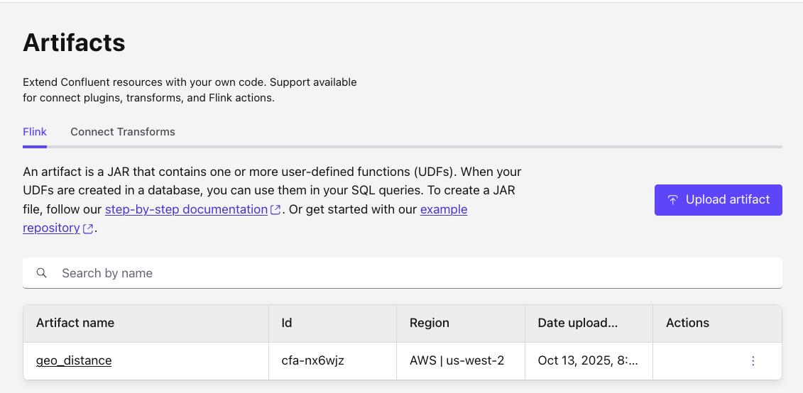
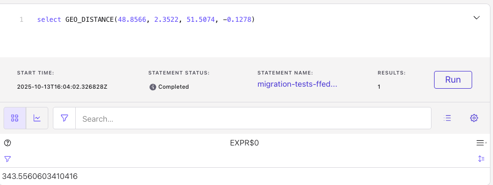

# User Defined Functions

[User-defined functions (UDFs)](https://nightlies.apache.org/flink/flink-docs-master/docs/dev/table/functions/udfs/) are extension to SQL for frequently used logic and custom program and integration. It can be done in Java or PyFlink.

[Confluent documentation on UDF](https://docs.confluent.io/cloud/current/flink/how-to-guides/create-udf.html#flink-sql-create-udf) and a [git repo](https://github.com/confluentinc/flink-udf-java-examples) with a sample UDF.

## UDF Catalog

This repository includes the following UDFs:

* [Geo Distance](https://github.com/jbcodeforce/flink-studies/tree/master/code/UDFs/geo_distance) using the Haversine formula to compute distance between two points on earth. It requires the latitude and longitude of the two points.

## Deploying to Confluent Cloud

### Prerequisites

* Provisioned Flink compute pool in Confluent Cloud.
* Use the CLI. Example
    ```sh
    confluent flink artifact create geo_distance --artifact-file target/geo-distance-udf-1.0-0.jar --cloud aws --region us-west-2 --environment env-nk...
    ```

    ```sh
    +--------------------+--------------+
    | ID                 | cfa-nx6wjz   |
    | Name               | geo_distance |
    | Version            | ver-nxnnnd   |
    | Cloud              | aws          |
    | Region             | us-west-2    |
    | Environment        | env-nknqp3   |
    | Content Format     | JAR          |
    | Description        |              |
    | Documentation Link |              |
    +--------------------+--------------+
    ```

    Also visible in the Artifacts menu
    

* UDFs are registered inside a Flink database
    ```sql
    CREATE FUNCTION GEO_DISTANCE
    AS
    'io.confluent.udf.GeoDistanceFunction'
    USING JAR 'confluent-artifact://cfa-...';
    ```
* Use the function to compute distance between Paris and London:
    