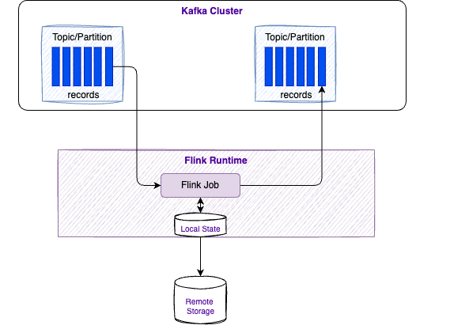
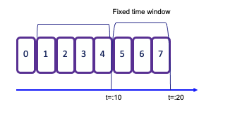
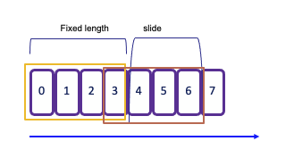
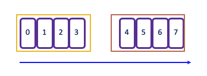
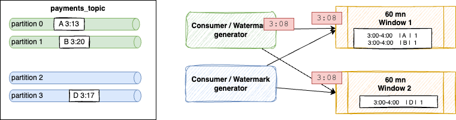

windowing# Apache Flink - Core Concepts

???- "Version"
    Update 07/2025 - Review done with simplification and avoid redundancies.
    Update - revision 11/23/25

## Quick Reference

- [Core Concepts](#overview-of-apache-flink)
- [Stream Processing](#stream-processing-concepts)
- [State Management](#state-management)
- [Time Handling](#event-time)

## Why Flink?

Traditional data processing faces key challenges:

- **Transactional Systems**: Monolithic applications with shared databases create scaling challenges
- **Analytics Systems**: ETL pipelines create stale data and require massive storage and often duplicate data across systems.  ETLs extract data from a transactional database, transform it into a common representation (including validation, normalization, encoding, deduplication, and schema transformation), and then load the new records into the target analytical database. These processes are run periodically in batches.

Flink enables **real-time stream processing** with three application patterns:

1. **Event-Driven Applications**: Reactive systems using messaging
2. **Data Pipelines**: Low-latency transformation and enrichment  
3. **Real-Time Analytics**: Immediate computation and action on streaming data


Flink Apps bring stateful processing to serverless. Developers write event handlers in Java (similar to serverless functions) but with annotations for state, timers, and multi-stream correlation. State is automatically partitioned, persisted, and restored. Event-time processing handles late-arriving data correctly. Exactly-once guarantees ensure critical business logic executes reliably. 

## Overview of Apache Flink

[Apache Flink](https://flink.apache.org) is a distributed stream processing engine for stateful computations over bounded and unbounded data streams. It's 
become an industry standard due to its performance and comprehensive feature set.

**Key Features:**

* **Low Latency Processing:** Offers event time semantics for consistent and accurate results, even with out-of-order events.
* **Exactly-Once Consistency:** Ensures reliable state management to avoid duplicates and not loosing message.
* **High Throughput:** Achieves millisecond latencies while processing millions of events per second.
* **Powerful APIs:** Provides APIs for operations such as map, reduce, join, window, split, and connect.
* **Fault Tolerance and High Availability:** Supports failover for task manager nodes, eliminating single points of failure.
* **Multilingual Support:** Enables streaming logic implementation in Java, Scala, Python, and SQL.
* **Extensive Connectors:** Integrates seamlessly with various systems, including Kafka, Cassandra, Pulsar, Elasticsearch, File system, JDBC complain 
Database, HDFS and S3.
* **Kubernetes Native:** Supports containerization and deployment on Kubernetes with dedicated k8s operator to manage session job or application as 
well as job and task managers.
* **Dynamic Code Updates:** Allows for application code updates and job migrations across different Flink clusters without losing application state.
* **Batch Processing:** Also transparently support traditional batch processing workloads as reading at rest table becomes a stream in Flink

## Stream Processing Concepts

A Flink application runs as a **job** - a processing pipeline structured as a directed acyclic graph (DAG) with:

- **Sources**: Read from streams (Kafka, Kinesis, Queue, CDC etc.)
- **Operators**: Transform, filter, enrich data
- **Sinks**: Write results to external systems

<figure markdown="span">
{ width=600 }
<figcaption>Data flow as directed acyclic graph</figcaption>
</figure>

Operations can run in parallel across partitions. Some operators (like **Group By**) require data reshuffling or repartitioning.

### Bounded and unbounded data

A Stream is a sequence of events, bounded or unbounded:

<figure markdown="span">
{ width=600 }
<figcaption>Bounded and unbounded event sequence</figcaption>
</figure>


### Dataflow


In [Flink 2.1.x](https://nightlies.apache.org/flink/flink-docs-release-2.1/learn-flink/overview/#stream-processing), applications are composed of streaming dataflows. Dataflow can consume from Kafka, Kinesis, Queue, and any data sources. A typical high level view of Flink app is presented in figure below:

<figure markdown="span">

<figcaption>A Flink application -  src: apache Flink product doc</figcaption>
</figure>


Stream processing includes a set of functions to transform data, and to produce a new output stream. An operator in Flink is a component that performs a specific operation on the data stream. Operations can be transformations (e.g., map, filter, reduce); an action (e.g., print, save); or, a source or sink.  Intermediate steps compute rolling aggregations like min, max, mean, or collect 
and buffer records in time window to compute metrics on a finite set of events. 

<figure markdown="span">
{ width=600 }
<figcaption>Streaming Dataflow  src: apache Flink product doc</figcaption>
</figure>

Data is partitioned for parallel processing.Flink performs computations using tasks, subtasks and operators. Each stream has multiple partitions, and each operator has multiple tasks for scalability. Tasks are the basic unit of execution in Flink. A task represents a piece of work that gets scheduled and executed by the Flink runtime. 

Each task is responsible for executing a specific part of the data processing logic defined by Flink. Tasks are parallelizable, meaning you can have multiple instances of a task running in parallel to process data streams more efficiently.  A subtask in Flink is a parallel instance of a task. A task can be divided into multiple subtasks that can all be running at the same time. Each subtask processes a portion of the data leading to more efficient data processing. 


<figure markdown="span">
{ width=600 }
<figcaption>Distributed processing  src: apache Flink product doc</figcaption>
</figure>


Operations like **GROUP BY** require data reshuffling across network, which can be costly but enables distributed aggregation.

```sql
INSERT INTO results
SELECT key, COUNT(*) FROM events
WHERE color <> blue
GROUP BY key;
```


## State Management

Flink keep state of its processing for Fault tolerance. State can grow over time. Local state persistence improves latency while remote checkpointing ensures fault tolerance.

<figure markdown="span">
{ width=600 }
<figcaption>Flink and Kafka integration with state management</figcaption>
</figure>

We can dissociate different type of operations:

* **Stateless Operations** process each event independently without retaining information:
    - Basic operations: `INSERT`, `SELECT`, `WHERE`, `FROM` 
    - Scalar/table functions, projections, filters

* **Stateful Operations** maintain state across events for complex processing:
    - `JOIN` operations (except `CROSS JOIN UNNEST`)
    - `GROUP BY` aggregations (windowed/non-windowed)
    - `OVER` aggregations and `MATCH_RECOGNIZE` patterns

Flink ensures fault tolerance through [checkpoints and savepoints](../architecture/index.md#checkpointing) that persistently store application state.

## Windowing

[Windows](https://ci.apache.org/projects/flink/flink-docs-release-1.20/dev/stream/operators/windows.html) group stream events into finite buckets for processing. Flink provides window table-valued functions (TVF): Tumbling, Hop, Cumulate, Session.

### Tumbling windows
* **Tumbling** window assigns events to non-overlapping buckets of fixed size. Records are assigned to the window based on an event-time attribute field, specified by the DESCRIPTOR() function. Once the window boundary is crossed, all events within that window are sent to an evaluation function for processing. 

* **Count-based tumbling** windows define how many events are collected before triggering evaluation. 
* **Time-based tumbling** windows define time interval (e.g., n seconds) during which events are collected. The amount of data within a window can vary depending on the incoming event rate. 
    ```java
    .keyBy(...).window(TumblingProcessingTimeWindows.of(Time.seconds(2)))
    ```

    in SQL:

    ```sql
    -- computes the sum of the price in the orders table within 10-minute tumbling windows
    SELECT window_start, window_end, SUM(price) as `sum`
    FROM TABLE(
        TUMBLE(TABLE `examples`.`marketplace`.`orders`, DESCRIPTOR($rowtime), INTERVAL '10' MINUTES))
    GROUP BY window_start, window_end;
    ```

<figure markdown="span">
{ width=500 }
<figcaption>Tumbling window concept</figcaption>
</figure>


* See example [TumblingWindowOnSale.java](https://github.com/jbcodeforce/flink-studies/blob/master/flink-java/my-flink/src/main/java/jbcodeforce/windows/TumblingWindowOnSale.java) in my-fink folder and to test it, do the following:

```shell
# Start the SaleDataServer that starts a server on socket 9181 and will read the avg.txt file and send each line to the socket
java -cp target/my-flink-1.0.0-SNAPSHOT.jar jbcodeforce.sale.SaleDataServer
# inside the job manager container started with 
`flink run -d -c jbcodeforce.windows.TumblingWindowOnSale /home/my-flink/target/my-flink-1.0.0-SNAPSHOT.jar`.
# The job creates the data/profitPerMonthWindowed.txt file with accumulated sale and number of record in a 2 seconds tumbling window
(June,Bat,Category5,154,6)
(August,PC,Category5,74,2)
(July,Television,Category1,50,1)
(June,Tablet,Category2,142,5)
(July,Steamer,Category5,123,6)
...
```

### Sliding windows
* **Sliding** windows allows for overlapping periods, meaning an event can belong to multiple buckets. This is particularly useful for capturing trends over time. The window sliding time parameter defines the duration of the window and the interval at which new windows are created. For example, in the following code snippet defines a new 2-second window is created every 1 second:

    ```java
    .keyBy(...).window(SlidingProcessingTimeWindows.of(Time.seconds(2), Time.seconds(1)))
    ```

    As a result, each event that arrives during this period will be included in multiple overlapping windows, enabling more granular analysis of the data stream.

<figure markdown="span">
{ width=500 }
<figcaption>Sliding window concept</figcaption>
</figure>

### Session window

**Session** window begins when the data stream processes records and ends when there is a defined period of inactivity. The inactivity threshold is set using a timer, which determines how long to wait before closing the window.

```java
.keyBy(...).window(ProcessingTimeSessionWindows.withGap(Time.seconds(5)))
```

The operator creates one window for each data element received.  If there is a gap of 5 seconds without new events, the window will close. This makes session windows particularly useful for scenarios where you want to group events based on user activity or sessions of interaction, capturing the dynamics of intermittent data streams effectively.

<figure markdown="span">
{ width=500 }
<figcaption>Session window concept</figcaption>
</figure>

### Global 
* **Global**: One window per key, requires explicit triggers

[See Windowing TVF documentation](https://docs.confluent.io/cloud/current/flink/reference/queries/window-tvf.html).

```java
.keyBy(0)
.window(GlobalWindows.create())
.trigger(CountTrigger.of(5))
```

[See Windowing Table-Valued Functions details in Confluent documentation](https://docs.confluent.io/cloud/current/flink/reference/queries/window-tvf.html).


### Trigger

A [Trigger](https://ci.apache.org/projects/flink/flink-docs-release-1.20/dev/stream/operators/windows.html#triggers) in Flink, determines when a window is ready to be processed. 

Each window has a default trigger associated with it. For example, a tumbling window might have a default trigger set to 2 seconds, while a global window requires an explicit trigger definition.

You can implement custom triggers by creating a class that implements the Trigger interface, which includes methods such as onElement(..), onEventTime(..), and onProcessingTime(..).


Flink provides several default triggers::

* **EventTimeTrigger** fires based upon progress of event time
* **ProcessingTimeTrigger** fires based upon progress of processing time
* **CountTrigger** fires when # of elements in a window exceeds a specified parameter.
* **PurgingTrigger** is used for purging the window, allowing for more flexible management of state.

### Eviction

**Evictor** is used to remove elements from a window either after the trigger fires or before/after the window function is applied. The specific logic for removing elements is application-specific and can be tailored to meet the needs of your use case.

The predefined evictors: 

* **CountEvictor** removes elements based on a specified count, allowing for fine control over how many elements remain in the window.
* **DeltaEvictor** evicts elements based on the difference between the current and previous counts, useful for scenarios where you want to maintain a specific change threshold.
* **TimeEvictor** removes elements based on time, allowing you to keep only the most recent elements within a given time frame.

## Event time

**Time** is a central concept in stream processing and can have different interpretations based on the context of the flow or environment:

* **Processing Time** refers to the system time of the machine executing the task. It offers the best performance and lowest latency since it relies on the local clock. But it may lead to no deterministic results due to factors like ingestion delays, parallel execution, clock synch, backpressure...
* **Event Time** is the timestamp embedded in the record at the event source level. Using event-time ensures consistent and deterministic results, regardless of the order in which events are processed. This is crucial for accurately reflecting the actual timing of events.
* **Ingestion Time** denotes the time when an event enters the Flink system. It captures the latency introduced during the event's journey into the processing framework.

In any time window, the order of arrival may not be guarantee, and some events with an older timestamp may fall outside of the time window boundaries. To address this challenge, particularly when computing aggregates, it's essential to ensure that all relevant events have arrived within the intended time frame.

The watermark serves as a heuristic for this purpose.

## Watermarks

[Watermarks](https://ci.apache.org/projects/flink/flink-docs-release-1.20/dev/event_timestamps_watermarks.html) are special markers indicating event-time progress in streams to keep track of how time progress and to handle out-of-order records. This is the core mechanims to trigger computation at `event-time`.  
They determine when windows can safely close by estimating when all events for a time period have arrived.

### Key Concepts

- Generated in the data stream at regular intervals, they are part of the source operator processing or immediately after it. Each parallel subtask of the source typically generates its watermarks independently, based on the events it processes. This is especially important for partitioned sources like Kafka, where each source subtask might read from one or more partitions. 
- Watermark generation logic is defined using a WatermarkStrategy. This strategy is typically applied directly when you define the data source. It tells Flink how to extract the event time timestamp from each incoming data record. And it determines how to generate the actual watermark based on those timestamps.
    ```java
    StreamExecutionEnvironment env = StreamExecutionEnvironment.getExecutionEnvironment();

        // 1. Define the Watermark Strategy
        WatermarkStrategy<MyEvent> watermarkStrategy = 
            WatermarkStrategy
                // This strategy is ideal for out-of-order data streams.
                // It allows events up to 5 seconds late (out-of-order) to be processed.
                .<MyEvent>forBoundedOutOfOrderness(Duration.ofSeconds(5))
                
                // 2. Define how to extract the event timestamp from the record
                .withTimestampAssigner((event, timestamp) -> event.getEventTime());

        // 3. Apply the Strategy directly to the Source Connector
        DataStream<MyEvent> stream = env
            .fromSource(
                // In a real application, this would be a KafkaSource, FileSource, etc.
                // Here, we use a simple collection source for demonstration.
                new DummyEventSource(), // Assuming a custom Flink Source implementation
                watermarkStrategy, 
                "My Event Source"
            );
    ```
- Watermarks flow downstream alongside the data records
- Watermark timestamp = largest seen timestamp - estimated out-of-orderness. This timestamp are always increasing. 
- Events arriving after watermarks are considered late and typically discarded
- The default strategy is designed for large-scale production workloads, requiring a significant volume of data (around 250 events per partition) before advancing the watermark and emitting results.
- Essential for triggering window computations in event-time processing

<figure markdown="span">

<figcaption>Watermark concept</figcaption>
</figure>

Within a window, states are saved on disk and need to be cleaned once the window is closed. The watermark is the limit from where the Java garbage collection may occur. 

The out-of-orderness estimation serves as an educated guess and is defined for each individual stream. Watermarks are essential for comparing timestamps of events, allowing the 
system to assert that no earlier events will arrive after the watermark's timestamp.

Watermarks are crucial when dealing with multiple sources. In scenarios involving IoT devices and network latency, it's possible to receive an event with an earlier timestamp even 
after the operator has already processed events with that timestamp from other sources. Importantly, watermarks are applicable to any timestamps and are not limited to window 
semantics.

When working with Kafka topic partitions, the absence of watermarks may represent some challenges. Watermarks are generated independently for each stream and partition. When two 
partitions are combined, the resulting watermark will be the oldest of the two (min value), reflecting the point at which the system has complete information. If one partition stops receiving 
new events, the watermark for that partition will not progress. To ensure that processing continues over time, an idle timeout configuration can be implemented.

Each task has its own watermark, and at the arrival of a new watermark, it checks if it needs to advance its own watermark. When it is advanced, the task performs all triggered computations and emits all result records. The watermark is broadcasted to all output of the task.

The watermark of a task is the mininum of all per-connection watermarks. Task with multiple input, like JOINs or UNIONs maintains a single watermark, which is the minimum between the input watermarks.

Additionally, it is possible to configure the system to accept late events by specifying an `allowed lateness` period. This defines how late an element can arrive before it is discarded. Flink maintains the state of the window until the allowed lateness time has expired, allowing for flexible handling of late-arriving data while ensuring that the processing remains efficient and accurate.

When using processing time, the watermark advances at regular intervals, typically every second. Events within the window are emitted for processing, once the watermark surpasses 
the end of that window.

Parallel watermarking is an example of getting data from 4 partitions with 2 kafka consumers and 2 windows:

<figure markdown="span">

<figcaption>Parallel watermarking</figcaption>
</figure>


Shuffling is done as windows are computing some COUNT or GROUP BY operations. Event A arriving at 3:13, and B[3:20] on green partitions, and are processed by Window 1 which considers 60 minutes time between 3:00 and 4:00. 

The source connector sends a Watermark for each partition independently. If the out-of-orderness is set to be 5 minutes, a watermark is created with a timestamp 3:08 = 3:13 - 5 (partition 0) and at 3:15 (3:20 - 5) for partition 1. The generator sends the minimum of both. The timestamp reflects how complete the stream is so far: it could not be no more completed than the further behind which was event at 3:13, 

In the case of a partition does not get any events, as there is no watermark generated for this partition, it may mean the watermark does no advance, and as a side effect it prevents windows from producing events. To avoid this problem, we need to balance kafka partitions so none are empty or idle, or configure the watermarking to use idleness detection.

### Source of information

* [Confluent documentation]()
* [Interesting enablement from Confluent, David Anderson](https://docs.confluent.io/cloud/current/flink/concepts/timely-stream-processing.html)
* [An animated webapp to explain the Watermark concepts](https://flink-watermarks.wtf/?utm_source=cd_newsletter).

### Classical issue due to watermark

* **Records may not being seen in output table or topic**. When testing with only a few events, this fails to meet the initial "safety margin" of 250 events per partition. This causes the system to apply a massive 7-day default margin, which stalls the watermark indefinitely and prevents time windows from ever closing and producing a result.

* **Stalled Joins with Idle Sources**: When joining two streams, if one stream is idle or has very old data, its watermark remains far in the past. The join operator's watermark becomes the minimum of the two, effectively stalling the entire query and preventing any new join results from being produced, even when one stream is active.
* **Losing the Last Message:** In a sparse stream of events, the very last event is correctly placed in its time window but remains buffered. Because no new event ever arrives to advance the watermark past the end of that final window, the window never closes, and the result for the last message is never produced, making it seem like Flink lost data.

### Monitoring watermark

The following metrics are used at the operator and task level


* `currentInputWatermark`: the last watermark received by the operator in its n inputs.
* `currentOutputWatermark`: last emitted watermark by the operator
* `watermarkAlignmentDrift`: current drift from the minimal watermakr emitted by all sources beloging to the same watermark group.

Watermarks can be seen in Apache flink Console. 

???+ info "Confluent Cloud for Flink"
    * The default watermark strategy is set to 180ms.
    * There is a support for configurable late data handling to DLQ to avoid data drop. Developers choose between three options: "pass," "drop," or "send to a dead letter queue (DLQ)

### Identify which watermark is calculated

The approach is to add a virtual column to keep the Kafka partition number:

```sql
ALTER TABLE <table_name> ADD _part INT METADATA FROM 'partition' VIRTUAL;
```

then assess if there is a value on the "Operator Watermark" column with

```sql
SELECT
  *,
  _part AS `Row Partition`,
  $rowtime AS `Row Timestamp`,
  CURRENT_WATERMARK($rowtime) AS `Operator Watermark`
FROM  <table_name>;
```

If not all partitions are included in the result, it may indicate a watermark issue with those partitions. We need to ensure that events are sent across all partitions. To test a statement, we can configure it to avoid being an unbounded query by consuming until the latest offset. This can be done by setting: `SET 'sql.tables.scan.bounded.mode' = 'latest-offset';`

Flink statement consumes data up to the most recent available offset at the job submission moment. Upon reaching this time, Flink ensures that a final watermark is propagated, indicating that all results are complete and ready for reporting. The statement then transitions into a 'COMPLETED' state."

The table alteration can be undone with:

```sql
ALTER TABLE <table_name> DROP _part;
```

## Data Skew

*This section assumes a lot of knowledge on sql, joins, stateful state. It is in the concept chapter because I am not sure where to put it otherwise*.

When dealing with large scale dataset and state, keys used for upsert operation, joins or aggregrations may be subject to data skew. 
Hot keys are sent to the same Flink subtask. Those operator workers receive most of the records while others are idle. Scaling the number of task manager will not help, as the majority of records go to the same task. 

It is important to compute the number of keys found in left and right tables. NULL key may be found, and may be also very common. 

The following query is a standard approach to assess the percent allocation of all the data groups:

```sql
SELECT 
    column_name, 
    COUNT(*) AS rows_count,
FROM 
    your_table_name
GROUP BY 
    column_name;
```

If for example one value accounts for more than 30% of the rows then we face data skew.

For join, Flink distributes rows based on key used in the on condition.

It is then necessary to use a 'salting' key technique, by spreading the hot key to multiple processing tasks. The original join looks like:

```sql
select 
    u.*,
    g.group_name
from src_users u
join src_groups g on u.group_id = g.id
```

For that we need to add a column (the salt) to the skewed table and the smaller tllbe, and append a sequence number between 0 to N-1, where N is the number of buckets to use to repartition the data. See [SEQUENCE UDTF](https://github.com/jbcodeforce/flink-udfs-catalog/tree/main/sequence)

Below is an example to create 3 buckets for each key of the slow table:

```sql
-- using the SEQUENCE UDF
create view groups_salted as select
   g.*,
  S.salt_id as salt_id
from `src_groups` as g
cross join lateral table(SEQUENCE(1,3)) as S(salt_id)
-- using the UNNEST
CROSS JOIN UNNEST(ARRAY[0, 1, 2, 3, 4, 5, 6, 7, 8, 9]) as S(salt_id)
```


Same approach applies to the big table, if we can do it with a view
```sql
create view users_salted as select
  u.*,
  S.salt_id as salt_id
from `src_users` as u
cross join lateral table(SEQUENCE(1,3)) as S(salt_id)
```

The joins now taking into account the combined key:
```sql
select 
    u.*,
    g.group_name
from users_salted u
join groups_salted g on u.group_id = g.id and u.salt_id = g.salt_id
```

When the join needs to be temporal, we may need tables and not a view.

```
```

To demonstrate the partitioning, use a sink topic with 3 partitions, and a partition key based on group_id with the first approach a lot of records are going one partition, while with the salty key, the sink  partition key will be group_id and salt_id and so will be spread against the 3 partitions.

[See matching demo scripts in flink-sql/04-joins/data_skew.](https://github.com/jbcodeforce/flink-studies/tree/master/code/flink-sql/04-joins/data_skew)

## From batch to real-time
In business analytics there is a need to differentiate data tables according to their usage and reusability. There are two important concepts of this practice:

* The **Dimensions**, which provide the “who, what, where, when, why, and how” context surrounding a business process event. Dimension tables contain the descriptive attributes used by BI applications for filtering and grouping the facts. 
* The **Facts**, which are the measurements that result from a business process event and are almost always numeric. The design of a fact table is entirely based on a physical activity, and not by the reports to produce from those facts. A fact table always contains foreign keys for each of its associated dimensions, as well as optional degenerate dimension keys and date/time stamps.

### The star schema

The star schema, was defined at the end of the 80s, as a multi-dimensional data model to organize data in Date warehouse, to maintain history and by reducing the data duplication. A star schema is used to denormalize business data into dimensions and facts. The fact table connects to multiple other dimension tables along "dimensions" like time, or product.


The following project illustrates how to implement the star schema using Flink:

* [Customer 360](https://jbcodeforce.github.io/flink_project_demos/c360/flink_project/#define-the-shift_left-utils-configuration)
* [Transaction analytics](https://github.com/jbcodeforce/flink_project_demos/tree/main/tx_processing)

In Flink a dimension may created via a SQL statement, and persisted as table with Kafka topic, JDBC table or files. When less reusable a Dimension can be a CTE within a bigger flink statement.

???+ info "How to support Type 2 slowly changing dimension (SCD) table?"
    Type 2 SCDs are designed to maintain a complete history of all changes to dimension data. When a change occurs, a new row is inserted into the table, representing the updated record, while the original record remains untouched. Each record in the table is typically assigned a unique identifier (often a surrogate key) to distinguish between different versions of the same dimension member. 

## Source of knowledge

* [x] [Apache Flink Product documentation](https://flink.apache.org/flink-architecture.html). 
* [x] [Official Apache Flink training](https://ci.apache.org/projects/flink/flink-docs-release-1.20/learn-flink/).
* [x] [Confluent "Fundamentals of Apache Flink" training- David Anderson](https://developer.confluent.io/courses/apache-flink/intro/).
* [x] [Anatomy of a Flink Cluster - product documentation.](https://nightlies.apache.org/flink/flink-docs-master/docs/concepts/flink-architecture/#anatomy-of-a-flink-cluster)
* [x] [Jobs and Scheduling - Flink product documentation.](https://nightlies.apache.org/flink/flink-docs-master/docs/internals/job_scheduling/)
* [x] [Confluent Cloud Flink product documentation](https://docs.confluent.io/cloud/current/flink/overview.html)
* [x] [Confluent Plaform for Flink product documentation](https://docs.confluent.io/platform/current/flink/overview.html)
* Base docker image is: [https://hub.docker.com/_/flink](https://hub.docker.com/_/flink)
* [Flink docker setup](https://ci.apache.org/projects/flink/flink-docs-master/ops/deployment/docker.html) and the docker-compose files in this repo.
* [FAQ](https://wints.github.io/flink-web/faq.html)
* [x] [Cloudera flink stateful tutorial](https://github.com/cloudera/flink-tutorials/tree/master/flink-stateful-tutorial): very good example for inventory transaction and queries on item considered as stream
* [Building real-time dashboard applications with Apache Flink, Elasticsearch, and Kibana](https://www.elastic.co/blog/building-real-time-dashboard-applications-with-apache-flink-elasticsearch-and-kibana)
 