# Apache Flink - Core Concepts

???- "Version"
    * Update 07/2025 - Review done with simplification and reduced redundancy.
    * Update - revision 11/23/25
     * 2/2026: Refactor content as part of the new cookbook chapter

## Why Flink?

Traditional data processing faces key challenges:

- **Transactional Systems**: Monolithic applications with shared databases create scaling challenges
- **Analytics Systems**: ETL pipelines create stale data and require massive storage and often duplicate data across systems.  ETLs extract data from a transactional database, transform it into a common representation (including validation, normalization, encoding, deduplication, and schema transformation), and then load the new records into the target analytical database. These processes are run periodically in batches.

Flink enables **real-time stream processing** with three application patterns:

1. **Event-Driven Applications**: Reactive systems using messaging
2. **Data Pipelines**: Low-latency transformation and enrichment  
3. **Real-Time Analytics**: Immediate computation and action on streaming data


Flink Apps bring stateful processing to serverless. Developers write event handlers in Java (similar to serverless functions) but with annotations for state, timers, and multi-stream correlation. State is automatically partitioned, persisted, and restored. Event-time processing handles late-arriving data correctly. Exactly-once guarantees ensure critical business logic executes reliably. 

## Overview of Apache Flink

[Apache Flink](https://flink.apache.org) is a distributed stream processing engine for stateful computations over bounded and unbounded data streams. It has become an industry standard due to its performance and comprehensive feature set.

**Key Features:**

* **Low Latency Processing:** Offers event time semantics for consistent and accurate results, even with out-of-order events.
* **Exactly-Once Consistency:** Ensures reliable state management to prevent duplicates and message loss.
* **High Throughput:** Achieves millisecond latencies while processing millions of events per second.
* **Powerful APIs:** Provides APIs for operations such as map, reduce, join, window, split, and connect.
* **Fault Tolerance and High Availability:** Supports failover for TaskManager nodes, eliminating single points of failure.
* **Multilingual Support:** Enables streaming logic implementation in Java, Scala, Python, and SQL.
* **Extensive Connectors:** Integrates seamlessly with various systems, including Kafka, Cassandra, Pulsar, Elasticsearch, file systems, JDBC-compliant databases, HDFS, and S3.
* **Kubernetes Native:** Supports containerization and deployment on Kubernetes with a dedicated Kubernetes operator to manage session, job, or application clusters as well as Job and Task Managers.
* **Dynamic Code Updates:** Allows for application code updates and job migrations across different Flink clusters without losing application state.
* **Batch Processing:** Also transparently supports traditional batch processing workloads, as reading a table at rest becomes a stream in Flink.

## Stream Processing Concepts

A Flink application runs as a **job** - a processing pipeline structured as a directed acyclic graph (DAG) with:

- **Sources**: Read from streams (Kafka, Kinesis, Queue, CDC etc.)
- **Operators**: Transform, filter, enrich data
- **Sinks**: Write results to external systems

<figure markdown="span">
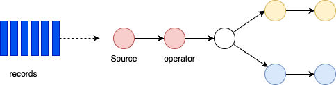{ width=600 }
<figcaption>Data flow as directed acyclic graph</figcaption>
</figure>

Operations can run in parallel across partitions. Some operators (like **Group By**) require data reshuffling or repartitioning.

### Bounded and unbounded data

A stream is a sequence of events, bounded or unbounded:

<figure markdown="span">
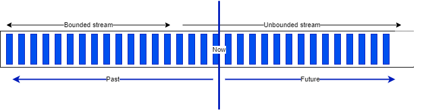{ width=600 }
<figcaption>Bounded and unbounded event sequence</figcaption>
</figure>


Apache Flink supports batch processing by processing all the data in one job with a bounded dataset. It is used when we need all the data to assess trends, develop AI models, and when throughput matters more than latency. Jobs are run when needed, on input that can be pre-sorted by time or by any other key.

The results are reported at the end of the job execution. Any failure requires a full restart of the job.

Hadoop was designed to do batch processing. Flink has the capability to replace Hadoop MapReduce processing.

When latency is a major requirement—for example monitoring and alerting or fraud detection—streaming is the natural choice.


### Dataflow


In [Flink 2.1.x](https://nightlies.apache.org/flink/flink-docs-release-2.1/learn-flink/overview/#stream-processing), applications are composed of streaming dataflows. A dataflow can consume from Kafka, Kinesis, queues, and other sources. A typical high-level view of a Flink application is presented in the figure below:

<figure markdown="span">

<figcaption>A Flink application (source: Apache Flink product documentation)</figcaption>
</figure>


Stream processing includes a set of functions to transform data, and to produce a new output stream. An operator in Flink is a component that performs a specific operation on the data stream. Operations can be transformations (e.g., map, filter, reduce); an action (e.g., print, save); or, a source or sink.  Intermediate steps compute rolling aggregations like min, max, mean, or collect 
and buffer records in a time window to compute metrics on a finite set of events. 

<figure markdown="span">
{ width=600 }
<figcaption>Streaming dataflow (source: Apache Flink product documentation)</figcaption>
</figure>

Data is partitioned for parallel processing. Flink performs computations using tasks, subtasks, and operators. Each stream has multiple partitions, and each operator has multiple tasks for scalability. Tasks are the basic unit of execution in Flink. A task represents a piece of work that gets scheduled and executed by the Flink runtime. 

Each task is responsible for executing a specific part of the data processing logic defined by Flink. Tasks are parallelizable, meaning you can have multiple instances of a task running in parallel to process data streams more efficiently.  A subtask in Flink is a parallel instance of a task. A task can be divided into multiple subtasks that can all be running at the same time. Each subtask processes a portion of the data leading to more efficient data processing. 


<figure markdown="span">
{ width=600 }
<figcaption>Distributed processing (source: Apache Flink product documentation)</figcaption>
</figure>


Operations like **GROUP BY** require data reshuffling across the network, which can be costly but enables distributed aggregation.

```sql
INSERT INTO results
SELECT key, COUNT(*) FROM events
WHERE color <> 'blue'
GROUP BY key;
```


## Runtime architecture

Flink consists of a **Job Manager** and `n` **Task Managers** deployed on `k` hosts. 

<figure markdown="span">
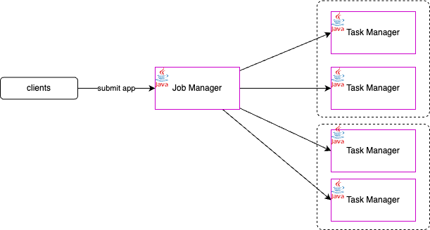
<figcaption>Main Flink Components</figcaption>
</figure>

Client applications compile batch or streaming applications into a dataflow graph. The client submits the DAG to the JobManager. The **JobManager** controls the execution of one or more applications. Developers submit their application (JAR file or SQL statements) via CLI, REST, or a Kubernetes manifest. The Job Manager receives the Flink application for execution and builds a task execution graph from the defined **JobGraph**. It parallelizes the job and distributes slices of the [DataStream](https://ci.apache.org/projects/flink/flink-docs-stable/dev/datastream_api.html) processing logic the developers defined. Each parallel slice of the job is a task that runs in a **task slot**.  

Once the job is submitted, the **Job Manager** schedules the job to different task slots within the **Task Manager**. The Job Manager may create resources from a compute pool, or when deployed on Kubernetes, it creates pods. 

The **Resource Manager** manages task slots and uses an underlying orchestrator such as Kubernetes or YARN (deprecated).

A **Task slot** is the unit of work executed on CPU.
The **Task Managers** execute the actual stream processing logic. There are multiple task managers running in a cluster. The number of slots limits the number of tasks a TaskManager can execute. After it has been started, a TaskManager registers its slots to the ResourceManager:

<figure markdown="span">
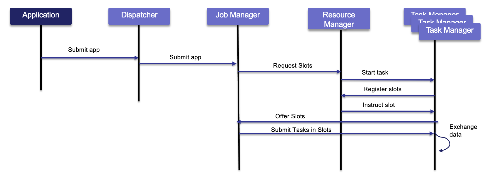
<figcaption>Sequence flow from job submission</figcaption>
</figure>

The **Dispatcher** exposes an API to submit applications for execution. It also hosts the web user interface.

Once the job is running, the Job Manager coordinates the activities of the Flink cluster, such as checkpointing and restarting TaskManagers that may have failed.

Tasks load data from sources, perform processing, then send data among themselves for repartitioning and rebalancing, and finally push results to the sinks.

When Flink is not able to process a real-time event, it may have to buffer it, until other necessary data has arrived. This buffer has to be persisted in durable storage so data is not lost if a TaskManager fails and has to be restarted. In batch mode, the job can reload the data from the beginning. In batch, the results are computed once the job is done (for example, `select count(*) AS `count` from bounded_pageviews;` returns one result), while in streaming mode each event may be the last one received, so results are produced incrementally after every event or after a period of time based on timers.


???- "Parameters"
    *  taskmanager.numberOfTaskSlots: 2

Only one Job Manager is active at a given point in time, and there may be `n` Task Managers. It is a single point of failure, but it starts quickly and can leverage checkpoint data to restart its processing.

There are different [deployment models](https://ci.apache.org/projects/flink/flink-docs-release-1.20/ops/deployment/): 

* **Session mode**: Deploy on a long-running cluster where multiple jobs share the same Flink cluster (one JobManager coordinates several jobs). 
* **Per-job** mode: spin up a cluster per job submission. This provides better resource isolation.
* **Application mode**: creates a cluster per application with the `main()` method executed on the JobManager. It can include multiple jobs, but they run inside the app. This saves CPU cycles and reduces the bandwidth needed to ship dependencies to workers.

Flink can run on common resource managers such as Hadoop YARN, Mesos, or Kubernetes. For development, you can use Docker images to deploy a **session** or **job** cluster.

See also the [deployment to Kubernetes](../coding/k8s-deploy.md) chapter for how to use the Flink Kubernetes operator to deploy and monitor Flink applications.


## State Management

In Flink, [state](https://nightlies.apache.org/flink/flink-docs-release-2.2/docs/concepts/stateful-stream-processing/) consists of information that an operator remembers about past events, which is used to influence the processing of future events.

### Core Concept of State
* Stateful operations are required for many common use cases, such as:
    * **Windowing:** Aggregating events over time (e.g., sum of sales per minute).
    * **Pattern Detection:** Tracking a sequence of events to find specific patterns.
    * **Machine Learning:** Updating model parameters based on a stream of data.
    * **Analytics:** Maintaining counters or profiles for unique users.

* We can distinguish different types of operations:
    * **Stateless Operations** process each event independently without retaining information:
        - Basic operations: `INSERT`, `SELECT`, `WHERE`, `FROM` 
        - Scalar/table functions, projections, filters
    * **Stateful Operations** maintain state across events for complex processing:
        - `JOIN` operations (except `CROSS JOIN UNNEST`)
        - `GROUP BY` aggregations (windowed/non-windowed)
        - `OVER` aggregations and `MATCH_RECOGNIZE` patterns

### Types of State

Flink distinguishes between two main categories of state:

* **Managed State:** Handled by the Flink runtime. Flink manages the storage, rescaling, and fault tolerance of this state.
* **Raw State:** Handled by the user in their own data structures. It is generally not recommended as Flink cannot automatically manage it during rescaling.


Within Managed State, there are several sub-types:

* **Keyed State:** Tied to a specific key (e.g., a user ID). It is partitioned across the cluster so that each key's state is handled by exactly one parallel task. Flink maintains one state instance per key value and Flink partitions all records with the same key to the operator task that maintains the state for this key. The key-value map is sharded across all parallel tasks:

    <figure markdown="span">
    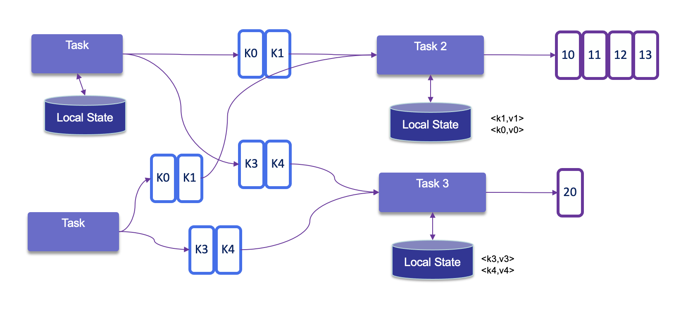{ width=600 }
    <figcaption>Keyed state</figcaption>
    </figure>

    Each task maintains its state locally to improve latency. For small state, the state backends will use JVM heap, but for larger state RocksDB is used. A [**state backend**](https://nightlies.apache.org/flink/flink-docs-master/docs/ops/state/state_backends/) takes care of checkpointing the state of a task to a remote and persistent storage.

* **Operator State:** Tied to a parallel operator instance rather than a key. It is often used for source/sink connectors (e.g., tracking Kafka offsets).
* **Broadcast State**: A special type of operator state where the state is duplicated across all parallel tasks of an operator.

Flink keeps state for fault tolerance. In fact, Flink uses stream replay and checkpointing.

All data maintained by a task and used to compute the results of a function belongs to the state of the task. Functions may use `<K, V>` pairs to store values and may implement `CheckpointedFunction` to make local state fault tolerant.

While processing the data, the task can read and update its state and computes its results based on its input data and state.

State management may address very large states, and no state is lost in case of failures.

Within a DAG, each operator needs to register its state. **Operator state** is scoped to an operator task: all records processed by the same parallel task have access to the same state.

State can grow over time. Local state persistence improves latency while remote checkpointing ensures fault tolerance.

<figure markdown="span">
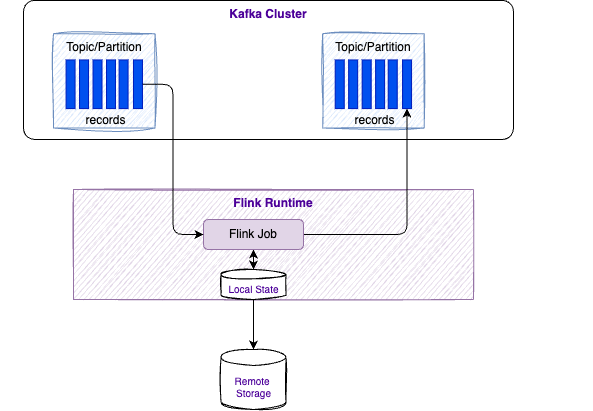{ width=600 }
<figcaption>Flink and Kafka integration with state management</figcaption>
</figure>


Flink ensures fault tolerance through checkpoints and savepoints that persistently store application state.

### Fault Tolerance and Consistency

* **Checkpoints:** Flink periodically takes distributed snapshots of the state and stores them in durable storage.

* **Exactly-once Semantics:** By combining checkpoints with replayable data sources, Flink guarantees that each event affects the state exactly once, even in the event of a failure.

* **Savepoints:** These are manually triggered snapshots used for operational tasks like application upgrades, A/B testing, or migrating to a different cluster.

[See deeper explanations in the cookbook chapter](../cookbook/considerations.md#high-availability)

### State Backends
State backends determine how the state is physically stored. Options typically include:

* **HashMap State Backend:** Stores state as objects on the JVM heap (very fast, but limited by memory).
* **Embedded RocksDB:** Stores state in an embedded database on local disk. [RocksDB](https://rocksdb.org/) is a key-value store based on Log-Structured Merge-Trees (LSM Trees). Flink organizes state into "Key Groups." Each RocksDB instance on a TaskManager handles a specific set of these groups. It saves asynchronously and serializes using bytes. There is a limit of 2^31 bytes per key and value. It supports incremental checkpoints, which is important for maintaining performance as state grows into the terabytes.
    * The process: When an operator updates state, it writes to the RocksDB MemTable and a Write-Ahead Log (WAL). Once the MemTable is full, it is flushed to disk as a static SST file.
    * **ForSt** uses a tree-structured key-value store and can use object storage on remote file systems, allowing Flink to scale state beyond the local disk capacity of a TaskManager.
    * `HashMapStateBackend` uses the Java heap to keep state as Java objects; reusing heap-backed state across incompatible changes is unsafe.
* **ForSt (Disaggregated):** The 2.x preference for cloud-native scaling and fast recovery, by using Distributed File Systems (DFS).

### Sources of knowledge

* [Stateful processing - Apache Flink documentation](https://nightlies.apache.org/flink/flink-docs-release-2.2/docs/concepts/stateful-stream-processing/).
* [Confluent state management documentation.](https://docs.confluent.io/cloud/current/flink/concepts/overview.html#id2)
* [See 'working with state' from Flink documentation](https://nightlies.apache.org/flink/flink-docs-master/docs/dev/datastream/fault-tolerance/state/).
## Windowing

[Windows](https://ci.apache.org/projects/flink/flink-docs-release-1.20/dev/stream/operators/windows.html) group stream events into finite buckets for processing. Flink provides window table-valued functions (TVFs): Tumbling, Hop, Cumulate, and Session.

### Tumbling windows
* A **tumbling** window assigns events to non-overlapping buckets of fixed size. Records are assigned to the window based on an event-time attribute field, specified by the `DESCRIPTOR()` function. Once the window boundary is crossed, all events within that window are sent to an evaluation function for processing.

* **Count-based tumbling** windows define how many events are collected before triggering evaluation.
* **Time-based tumbling** windows define a time interval (for example, *n* seconds) during which events are collected. The amount of data within a window can vary depending on the incoming event rate. 
    ```java
    .keyBy(...).window(TumblingProcessingTimeWindows.of(Time.seconds(2)))
    ```

    in SQL:

    ```sql
    -- computes the sum of the price in the orders table within 10-minute tumbling windows
    SELECT window_start, window_end, SUM(price) as `sum`
    FROM TABLE(
        TUMBLE(TABLE `examples`.`marketplace`.`orders`, DESCRIPTOR($rowtime), INTERVAL '10' MINUTES))
    GROUP BY window_start, window_end;
    ```

<figure markdown="span">
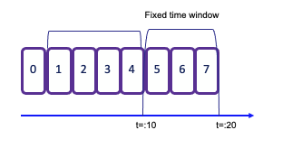{ width=500 }
<figcaption>Tumbling window concept</figcaption>
</figure>


* See example [TumblingWindowOnSale.java](https://github.com/jbcodeforce/flink-studies/blob/master/flink-java/my-flink/src/main/java/jbcodeforce/windows/TumblingWindowOnSale.java) in the `my-flink` folder. To test it, do the following:

```shell
# Start SaleDataServer: it listens on socket 9181, reads avg.txt, and sends each line to the socket
java -cp target/my-flink-1.0.0-SNAPSHOT.jar jbcodeforce.sale.SaleDataServer
# Inside the JobManager container, start the job with:
`flink run -d -c jbcodeforce.windows.TumblingWindowOnSale /home/my-flink/target/my-flink-1.0.0-SNAPSHOT.jar`.
# The job creates the data/profitPerMonthWindowed.txt file with accumulated sales and number of records in a 2-second tumbling window
(June,Bat,Category5,154,6)
(August,PC,Category5,74,2)
(July,Television,Category1,50,1)
(June,Tablet,Category2,142,5)
(July,Steamer,Category5,123,6)
...
```

### Sliding windows
* **Sliding** windows allow overlapping periods, meaning an event can belong to multiple buckets. This is particularly useful for capturing trends over time. The slide interval defines how often a new window starts and the window size defines its duration. For example, the following snippet defines a 2-second window that starts every 1 second:

    ```java
    .keyBy(...).window(SlidingProcessingTimeWindows.of(Time.seconds(2), Time.seconds(1)))
    ```

    As a result, each event that arrives during this period will be included in multiple overlapping windows, enabling more granular analysis of the data stream.

<figure markdown="span">
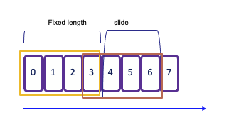{ width=500 }
<figcaption>Sliding window concept</figcaption>
</figure>

### Session window

A **session** window begins when the data stream processes records and ends after a defined period of inactivity. The inactivity threshold is set using a timer, which determines how long to wait before closing the window.

```java
.keyBy(...).window(ProcessingTimeSessionWindows.withGap(Time.seconds(5)))
```

The operator creates one window for each data element received.  If there is a gap of 5 seconds without new events, the window will close. This makes session windows particularly useful for scenarios where you want to group events based on user activity or sessions of interaction, capturing the dynamics of intermittent data streams effectively.

<figure markdown="span">
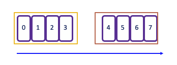{ width=500 }
<figcaption>Session window concept</figcaption>
</figure>

### Global
* **Global:** One window per key; requires explicit triggers.

[See Windowing TVF documentation](https://docs.confluent.io/cloud/current/flink/reference/queries/window-tvf.html).

```java
.keyBy(0)
.window(GlobalWindows.create())
.trigger(CountTrigger.of(5))
```

[See Windowing Table-Valued Functions details in Confluent documentation](https://docs.confluent.io/cloud/current/flink/reference/queries/window-tvf.html).


### Trigger

A [Trigger](https://ci.apache.org/projects/flink/flink-docs-release-1.20/dev/stream/operators/windows.html#triggers) in Flink determines when a window is ready to be processed. 

Each window has a default trigger associated with it. For example, a tumbling window might have a default trigger set to 2 seconds, while a global window requires an explicit trigger definition.

You can implement custom triggers by creating a class that implements the Trigger interface, which includes methods such as onElement(..), onEventTime(..), and onProcessingTime(..).


Flink provides several default triggers:

* **EventTimeTrigger** fires based upon progress of event time
* **ProcessingTimeTrigger** fires based upon progress of processing time
* **CountTrigger** fires when # of elements in a window exceeds a specified parameter.
* **PurgingTrigger** is used for purging the window, allowing for more flexible management of state.

### Eviction

**Evictor** is used to remove elements from a window either after the trigger fires or before/after the window function is applied. The specific logic for removing elements is application-specific and can be tailored to meet the needs of your use case.

The predefined evictors: 

* **CountEvictor** removes elements based on a specified count, allowing for fine control over how many elements remain in the window.
* **DeltaEvictor** evicts elements based on the difference between the current and previous counts, useful for scenarios where you want to maintain a specific change threshold.
* **TimeEvictor** removes elements based on time, allowing you to keep only the most recent elements within a given time frame.

## Event time

**Time** is a central concept in stream processing and can have different interpretations based on the context of the flow or environment:

* **Processing Time** refers to the system time of the machine executing the task. It offers the best performance and lowest latency since it relies on the local clock. But it may lead to non-deterministic results due to factors like ingestion delays, parallel execution, clock skew, and backpressure.
* **Event Time** is the timestamp embedded in the record at the event source level. Using event-time ensures consistent and deterministic results, regardless of the order in which events are processed. This is crucial for accurately reflecting the actual timing of events.
* **Ingestion Time** denotes the time when an event enters the Flink system. It captures the latency introduced during the event's journey into the processing framework.

In any time window, the order of arrival may not match event time, and some events with an older timestamp may fall outside the time window boundaries. To address this challenge, particularly when computing aggregates, it's essential to ensure that all relevant events have arrived within the intended time frame.

The watermark serves as a heuristic for this purpose.

## Watermarks

[Watermarks](https://ci.apache.org/projects/flink/flink-docs-release-1.20/dev/event_timestamps_watermarks.html) are special markers periodically injected by Flink source operator, to indicate event-time progress in each stream. They track how time advances and help handle out-of-order records. Each Watermark is associated to a timestamp, expressed in milliseconds after epoch. This is the core mechanism for triggering computation at `event-time` and not at processing time.  

Watermarks are used by time-based operators, such as time windows, temporal joins or pattern matching, for example they determine when windows can safely close by estimating when all events for a time period have arrived.

Operations which are NOT based on time (e.g. simple JOIN, UNION ALL, filtering by WHERE conditions) do not use Watermarks. Watermarks are also not used in batch mode/snapshot queries.

### Key Concepts

- Generated in the data stream at regular intervals, they are part of the source operator processing or immediately after it. Each parallel subtask of the source typically generates its watermarks independently, based on the events it processes. This is especially important for partitioned sources like Kafka, where each source subtask might read from one or more partitions and emit watermark for each partition.
- Watermark generation logic is defined using a WatermarkStrategy. This strategy is typically applied directly when you define the data source. It tells Flink how to extract the event time timestamp from each incoming data record. And it determines how to generate the actual watermark based on those timestamps.
    ```java
    StreamExecutionEnvironment env = StreamExecutionEnvironment.getExecutionEnvironment();

        // 1. Define the Watermark Strategy
        WatermarkStrategy<MyEvent> watermarkStrategy = 
            WatermarkStrategy
                // This strategy is ideal for out-of-order data streams.
                // It allows events up to 5 seconds late (out-of-order) to be processed.
                .<MyEvent>forBoundedOutOfOrderness(Duration.ofSeconds(5))
                
                // 2. Define how to extract the event timestamp from the record
                .withTimestampAssigner((event, timestamp) -> event.getEventTime());

        // 3. Apply the Strategy directly to the Source Connector
        DataStream<MyEvent> stream = env
            .fromSource(
                // In a real application, this would be a KafkaSource, FileSource, etc.
                // Here, we use a simple collection source for demonstration.
                new DummyEventSource(), // Assuming a custom Flink Source implementation
                watermarkStrategy, 
                "My Event Source"
            );
    ```

- Another example of setting watermark strategy in SQL
    ```sql
    CREATE TABLE events (
        event_id STRING,
        ....
        event_time TIMESTAMP_LTZ(3),
       WATERMARK FOR event_time AS event_time - INTERVAL '5' SECONDS
    ) WITH ...
    ```

- Watermarks flow downstream alongside the data records. Downstream Subtasks use the Watermarks received from upstream to generate and emit their own Watermarks.
- Watermark timestamp = the largest seen timestamp - estimated out-of-orderness. This timestamp is always non-decreasing (monotonic) under normal operation. 
- Events arriving after watermarks are considered late and are typically discarded.
- The default strategy is designed for large-scale production workloads, requiring a significant volume of data (around 250 events per partition) before advancing the watermark and emitting results.
- The following diagram set the max-timestamp (INTERVAL '5' SECONDS) is the time window to access record within the 'watermark delay' time. Everything before the watermark is considered completed, while everything between the watermark and the max timestamp represent partial information that could modify existing aggregates within the window.
<figure markdown="span">
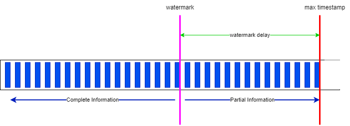
<figcaption>Watermark concept</figcaption>
</figure>

* Within a window, states are saved on disk and need to be cleaned once the window is closed. The watermark is the limit from where the Java garbage collection may occur. 

* The out-of-orderness estimation serves as an educated guess and is defined for each individual stream. Watermarks are also crucial when dealing with multiple sources. In scenarios involving IoT devices and network latency, it's possible to receive an event with an earlier timestamp even after the operator has already processed events with that timestamp from other sources. Importantly, watermarks are applicable to any timestamps and are not limited to window semantics.

* When working with Kafka topic partitions, the absence of watermarks may represent some challenges. Watermarks are generated independently for each stream and partition. When two 
partitions are combined, the resulting watermark will be the oldest of the two (min value), reflecting the point at which the system has complete information. If one partition stops receiving new events, the watermark for that partition will not progress. To ensure that processing continues over time, an idle timeout configuration can be implemented. [See the 'flink-watermak' demonstration in this repository](https://github.com/jbcodeforce/flink-studies/tree/master/e2e-demos/flink-watermark)

=== "Apache Flink"
    The following parameter prevents idle input partitions/shards from holding back the overall watermark progress of a Flink job. If a partition receives no new data within the specified timeout duration, Flink marks it as idle and ignores it for the purpose of calculating the minimum watermark. It can be set in the WITH clause of a table creation (DDL)
    ```
    scan.watermark.idle-timeout = '5 s'
    ```

    A global idle timeout can also be set via the `table.exec.source.idle-timeout` configuration.

=== "Confluent Cloud for Flink"
    In Confluent Cloud, a progressive idleness detection feature is used by default, which sets the idle timeout to 15 seconds, increasing up to 5 minutes. The rational is to avoid waiting too long to see watermarks progressing, and do not set partition idle too quickly neither. The default watermark applies to $rowtime. The following setting disables the progressive timeout.
    ```
    SET 'sql.tables.scan.idle-timeout' = '1s';
    ```

    Idle Partition Timeout must always be less than or equal to Max Allowed Drift used for Watermark Alignment.
    
    
* Each task has its own watermark, and at the arrival of a new watermark, it checks if it needs to advance its own watermark. When it is advanced, the task performs all triggered computations and emits all result records. The watermark is broadcasted to all output of the task. The watermark of a task is the minimum of all per-connection watermarks. Tasks with multiple inputs, such as `JOIN` or `UNION`, maintain a single watermark, which is the minimum of the input watermarks.
* Flink maintains the state of the window until the allowed lateness time has expired, allowing for flexible handling of late-arriving data while ensuring that the processing remains efficient and accurate. However, the classification of events as "late" is not deterministic, and two consecutive jobs on the same data does not guarantee the same results, specially when using processing time. 

* Parallel watermarking is an example of reading from four partitions with two Kafka source consumers and two windows:
    <figure markdown="span">
    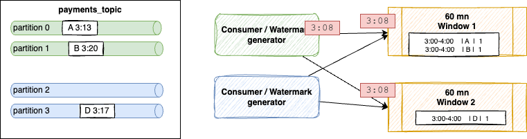
    <figcaption>Parallel watermarking</figcaption>
    </figure>


    Shuffling is done as windows are computing some COUNT or GROUP BY operations. Event `A` arriving at `3:13`, and `B[3:20]` on green partitions, are processed by a 60 minutes Window 1 with current open window between 3:00 and 4:00. 

    The source connector sends a watermark for each partition independently. If the out-of-orderness is set to 5 minutes, a watermark is created with timestamp 3:08 (= 3:13 - 5) for partition 0 and 3:15 (= 3:20 - 5) for partition 1. The generator emits the minimum of both. The timestamp reflects how complete the stream is so far: the stream cannot be more complete than the slowest partition, here bounded by the event at 3:13.

* If a partition receives no events, no watermark may be generated for it; the combined watermark may not advance, and windows may fail to produce results. To avoid this, balance Kafka partitions so none stay empty or idle for long, or configure watermarking with idleness detection (see above).
* The advantage of using the kafka record timestamp ($rowtime in Confluent Cloud), is that it is always monotonically increasing per Kafka partition, so Flink will not get out-of-order events. Also, if the job partitions data (e.g. with GROUP BY or PARTITION BY) by the same keys used for partitioning in the source Kafka topic, records remain perfectly in-order.
* When using a custom timestamp attribute for watermark strategy, instead of the `$rowtime` of the kafka records, events may be heavilty out-of-order within a partition.
* When a job restarts from a Checkpoint, Watermark Sources restart generating Watermarks and propagating them downstream the same way as when the job was started the first time

### Watermark Alignment

When a source is progressing more slowly than another, because of lower throughput, Flink may read it faster than other partitions with more messages (this is true when reprossing Lags). Because Watermarks progress with the slowest input partition (MIN timestamp), newer messages from the dense topic may end up being read later. Watermarks progress slower. Flink may have to buffer more records in state for time-based operations while waiting for the Watermarks.

Flink has a mechanism to keep track of the max oberved timestamps and how far they diverge. When one partition is ahead of others by more than the `maximum allowed deviation` the source operator is slowed down. 

The deviation can be set with the following parameter, and ensure it it >= Idle partition time out.
```sql
SET 'sql.tables.scan.watermark-alignment.max-allowed-drift' = '10m';
```

* The reasons to decrease Max Allowed Drift is when there is very high throughput and very short time-window operations (shorter than Max Allowed Drift), Watermark Alignment may cause more data to be buffered. In these cases you may want to reduce it, to match the window size. 
* It is possible to disable it (set to 0) when the Flink statement has no time-based logic, to avoid slowing down reading big backlogs of kafka records.

### Source of information

* [Confluent Cloud Flink overview](https://docs.confluent.io/cloud/current/flink/overview.html)
* [Interesting enablement from Confluent, David Anderson](https://docs.confluent.io/cloud/current/flink/concepts/timely-stream-processing.html)
* [An animated webapp to explain the Watermark concepts](https://flink-watermarks.wtf/?utm_source=cd_newsletter).
* [Progressive Idleness Detection.](https://docs.confluent.io/cloud/current/flink/reference/statements/create-table.html#progressive-idleness-detection)
* [A 'flink-watermak' demonstration in this repository](https://github.com/jbcodeforce/flink-studies/tree/master/e2e-demos/flink-watermark)

### Common issues due to watermarks

* **Records may not appear in the output table or topic**. When testing with only a few events, this fails to meet the initial "safety margin" of 250 events per partition. This causes the system to apply a massive 7-day default margin, which stalls the watermark indefinitely and prevents time windows from ever closing and producing a result.
* **Stalled Joins with Idle Sources**: When joining two streams, if one stream is idle or has very old data, its watermark remains far in the past. The join operator's watermark becomes the minimum of the two, effectively stalling the entire query and preventing any new join results from being produced, even when one stream is active.  if all their input partitions are marked Idle, the Subtask becomes Idle and emits an Idle signal downstream.
* **Operators Not Propagating Watermarks**: Some operators remove the metadata marker identifying the event-time attribute, making Watermarks unusable downstream. The operators dropping the event-time attribute marker (not a complete list):
    * Regular JOINs - both INNER and OUTER equi-JOIN
    * Window Time Value Function aggregations not including window_time in the GROUP BY - window_time is propagated as time attribute, but window_start and window_end are not.
    * Top-N Queries (Ranking) - Queries using ROW_NUMBER() and filtering by the top-N results
    * Global Distinct -  DISTINCT across the entire history 
    * Set operations  - UNION, INTERSECT, EXCEPT. Except UNION ALL which does not remove duplicates and does propagate the event-time attribute.

    **If you need a time-based operation downstream of operators that drop Watermarks, emit the result to Kafka and read it back with a different statement.**

* **Operators Delaying Watermarks:** Certain operators (Interval Joins, MATCH_RECOGNIZE) may add significant delay to Watermarks. The following interval join will deplay the watermark by 60 minutes, because it will match transactions that may be 6 hours older than matching stock
    ```sql
    SELECT t.amount, t.order_type, s.name, s.opening_value 
    FROM transactions t, stocks s
    WHERE t.stockid = s.id AND t.ts BETWEEN s.ts - INTERVAL '6' HOURS AND s.ts
    ```

    Similarly, a MATCH_RECOGNIZE with a clause WITHIN INTERVAL '15’ MINUTE will delay watermarks by 15 minutes.

* **Losing the Last Message:** In a sparse stream of events, the very last event is correctly placed in its time window but remains buffered. Because no new event ever arrives to advance the watermark past the end of that final window, the window never closes, and the result for the last message is never produced, making it seem like Flink lost data. One way to avoid that is to send heartbeat message to the input topic.

???- warning "JOIN not emitting watermark?"
    At the high level, an operator drops the event-time attribute marker if its logic cannot guarantee that emitted records respect advancing Watermarks. This occurs when it may emit records older than emitted Watermarks, even if they were not late when received by the operator. For example, a regular JOIN can hold a record in state until the TTL expires and emit the result only when a matching record arrives, which may be much later than current watermark.

???- info "Confluent Cloud for Flink Idle detection"


### Monitoring watermark

The following metrics are used at the operator and task level


* `currentInputWatermark`: the last watermark received by the operator in its n inputs.
* `currentOutputWatermark`: last emitted watermark by the operator
* `watermarkAlignmentDrift`: current drift from the minimal watermark emitted by all sources belonging to the same watermark group.

Watermarks can be viewed in the Apache Flink web UI. 

???+ info "Confluent Cloud for Flink"
    * The default watermark strategy is set to 180ms.
    * There is support for configurable late-data handling to a DLQ to avoid dropping data. Developers choose among three options: "pass," "drop," or "send to a dead letter queue (DLQ)."

### Identify which watermark is calculated

The approach is to add a virtual column to keep the Kafka partition number:

```sql
ALTER TABLE <table_name> ADD _part INT METADATA FROM 'partition' VIRTUAL;
```

and use the CURRENT_WATERMARK function to see the watermarks being generated by Flink SQL. 

```sql
SELECT
  *,
  _part AS `Row Partition`,
  $rowtime AS `Row Timestamp`,
  CURRENT_WATERMARK($rowtime) AS `Operator Watermark`
FROM  <table_name>;
```

If not all partitions are included in the result, it may indicate a watermark issue with those partitions. We need to ensure that events are sent across all partitions. To test a statement, we can configure it to avoid being an unbounded query by consuming until the latest offset. This can be done by setting: `SET 'sql.tables.scan.bounded.mode' = 'latest-offset';`

The Flink statement consumes data up to the most recent available offset at job submission. Upon reaching that point, Flink propagates a final watermark so results are complete and ready for reporting. The statement then transitions to a `COMPLETED` state. When the watermarks are null, Flink SQL’s temporal operations, such as windows, temporal joins, and MATCH_RECOGNIZE, will not produce results. 

The table alteration can be undone with:

```sql
ALTER TABLE <table_name> DROP _part;
```

## Data Skew

*This section assumes familiarity with SQL, joins, and stateful processing. It lives in the concepts chapter because it does not fit neatly elsewhere.*

When dealing with large-scale datasets and state, keys used for upserts, joins, or aggregations may be subject to data skew.
Hot keys are routed to the same Flink subtask. Those operator instances receive most of the records while others stay idle. Scaling the number of TaskManagers does not help if most records still go to the same task. 

It is important to compute the number of keys found in left and right tables. NULL key may be found, and may be also very common. 

The following query is a standard approach to assess the percent allocation of all the data groups:

```sql
SELECT 
    column_name, 
    COUNT(*) AS rows_count
FROM 
    your_table_name
GROUP BY 
    column_name;
```

If for example one value accounts for more than 30% of the rows then we face data skew.

For joins, Flink distributes rows based on the join key.

It is then necessary to use a 'salting' key technique, by spreading the hot key to multiple processing tasks. The original join looks like:

```sql
select 
    u.*,
    g.group_name
from src_users u
join src_groups g on u.group_id = g.id
```

For that you add a column (the salt) to the skewed table and the smaller table, and append a sequence number from 0 to N-1, where N is the number of buckets used to repartition the data. See [SEQUENCE UDTF](https://github.com/jbcodeforce/flink-udfs-catalog/tree/main/sequence).

Below is an example to create 3 buckets for each key of the slow table:

```sql
-- using the SEQUENCE UDF
create view groups_salted as select
   g.*,
  S.salt_id as salt_id
from `src_groups` as g
cross join lateral table(SEQUENCE(1,3)) as S(salt_id)
-- using the UNNEST
CROSS JOIN UNNEST(ARRAY[0, 1, 2, 3, 4, 5, 6, 7, 8, 9]) as S(salt_id)
```


Same approach applies to the big table, if we can do it with a view
```sql
create view users_salted as select
  u.*,
  S.salt_id as salt_id
from `src_users` as u
cross join lateral table(SEQUENCE(1,3)) as S(salt_id)
```

The join now uses the combined key:
```sql
select 
    u.*,
    g.group_name
from users_salted u
join groups_salted g on u.group_id = g.id and u.salt_id = g.salt_id
```

When the join needs to be temporal, we may need tables and not a view.

```
```

To demonstrate partitioning, use a sink topic with three partitions. With a partition key based only on `group_id`, many records may land on one partition; with a salted key, using `group_id` and `salt_id` spreads records across the three partitions.

[See matching demo scripts in flink-sql/04-joins/data_skew.](https://github.com/jbcodeforce/flink-studies/tree/master/code/flink-sql/04-joins/data_skew)

## From batch to real-time
In business analytics there is a need to differentiate data tables according to their usage and reusability. There are two important concepts of this practice:

* The **Dimensions**, which provide the “who, what, where, when, why, and how” context surrounding a business process event. Dimension tables contain the descriptive attributes used by BI applications for filtering and grouping the facts. 
* The **Facts**, which are the measurements that result from a business process event and are almost always numeric. The design of a fact table is entirely based on a physical activity, and not by the reports to produce from those facts. A fact table always contains foreign keys for each of its associated dimensions, as well as optional degenerate dimension keys and date/time stamps.

### The star schema

The star schema was defined in the late 1980s as a multidimensional data model to organize data in a data warehouse, preserve history, and reduce duplication. A star schema is used to denormalize business data into dimensions and facts. The fact table connects to multiple other dimension tables along "dimensions" like time, or product.


The following project illustrates how to implement the star schema using Flink:

* [Customer 360](https://jbcodeforce.github.io/flink_project_demos/c360/flink_project/#define-the-shift_left-utils-configuration)
* [Transaction analytics](https://github.com/jbcodeforce/flink_project_demos/tree/main/tx_processing)

In Flink, a dimension may be created via a SQL statement and persisted as a table backed by a Kafka topic, JDBC, or files. When it is less reusable, a dimension can be a CTE within a larger Flink SQL statement.

???+ info "How to support Type 2 slowly changing dimension (SCD) table?"
    Type 2 SCDs are designed to maintain a complete history of all changes to dimension data. When a change occurs, a new row is inserted into the table, representing the updated record, while the original record remains untouched. Each record in the table is typically assigned a unique identifier (often a surrogate key) to distinguish between different versions of the same dimension member. 

## Source of knowledge

* [x] [Apache Flink Product documentation](https://flink.apache.org/flink-architecture.html). 
* [x] [Official Apache Flink training](https://ci.apache.org/projects/flink/flink-docs-release-1.20/learn-flink/).
* [x] [Confluent "Fundamentals of Apache Flink" training- David Anderson](https://developer.confluent.io/courses/apache-flink/intro/).
* [x] [Anatomy of a Flink Cluster - product documentation.](https://nightlies.apache.org/flink/flink-docs-master/docs/concepts/flink-architecture/#anatomy-of-a-flink-cluster)
* [x] [Jobs and Scheduling - Flink product documentation.](https://nightlies.apache.org/flink/flink-docs-master/docs/internals/job_scheduling/)
* [x] [Confluent Cloud Flink product documentation](https://docs.confluent.io/cloud/current/flink/overview.html)
* [x] [Confluent Platform for Flink product documentation](https://docs.confluent.io/platform/current/flink/overview.html)
* Base docker image is: [https://hub.docker.com/_/flink](https://hub.docker.com/_/flink)
* [Flink docker setup](https://ci.apache.org/projects/flink/flink-docs-master/ops/deployment/docker.html) and the docker-compose files in this repo.
* [FAQ](https://wints.github.io/flink-web/faq.html)
* [x] [Cloudera Flink stateful tutorial](https://github.com/cloudera/flink-tutorials/tree/master/flink-stateful-tutorial): strong example for inventory transactions and queries treating items as a stream
* [Building real-time dashboard applications with Apache Flink, Elasticsearch, and Kibana](https://www.elastic.co/blog/building-real-time-dashboard-applications-with-apache-flink-elasticsearch-and-kibana)
 